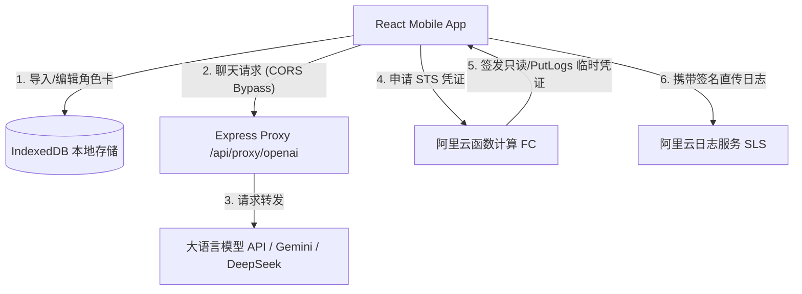

# Mobile Tavern Lite - 移动端轻量级 AI 角色扮演客户端

Mobile Tavern Lite 是一款专为移动端（特别是 Android）打造的轻量级、高性能 AI 角色扮演客户端。它完美兼容传统的 Tavern 角色卡协议（PNG/JSON），并针对触控设备进行交互重构，提供极致流畅的离线级沉浸体验。

---

## 📖 项目愿景与设计定位

### 1. 为什么开发这个应用？(Why Mobile Tavern Lite?)
*   **极致的移动触控优化**：摒弃了桌面端 Silly Tavern 复杂的侧边栏、多级嵌套菜单和繁复的快捷键，改用专为手机屏幕优化的单手操作标签页（Tabs）布局，搭配平滑的手势过渡与圆角微动微缩放。
*   **出色的原生体验**：基于 **Tauri v2** 构建，我们将应用编译为原生的 Android APK 安装包。应用在后台运行时，拥有比移动浏览器更好的系统生命周期维持，且系统 WebView 效率更高。
*   **绝对的隐私安全**：所有的角色卡、聊天会话和全局配置完全保存在本地的 IndexedDB 数据库中。没有任何中心化服务器保存您的数据，数据完全受用户个人掌控。
*   **轻量化与高可用**：去除繁杂且在移动端低效的插件，保留对话、世界书（Worldbook）、故事年表（Timeline）等核心引擎，实现冷启动秒级开屏。

### 2. 与桌面端 SillyTavern 的差异化互补
*   SillyTavern 偏向桌面级，适合复杂的提示词调试、插件集成和桌面端大屏操纵。
*   Mobile Tavern Lite 偏向便携与轻量，专门用于手机端的对话、本地备份/还原和无缝的角色交互。

---

## 🛠 技术栈全景

| 维度 | 技术/库 | 作用与特点 |
| :--- | :--- | :--- |
| **前端核心** | React 19 + TypeScript | 强类型、声明式的前端业务逻辑，保证组件状态的高度一致性。 |
| **构建开发** | Vite 6 | 极速的热更新 (HMR) 速度与更小体积的静态资源构建打包。 |
| **跨端支持** | Tauri v2 (Android) | 用 Rust 替代 Electron，仅生成原生 WebView 容器，支持编译原生 Android APK (`arm64-v8a` 架构)。 |
| **样式/美学** | Tailwind CSS v4 + Vanilla CSS | 引入 OKLCH 与 HSL 调色体系，多主题滑块切换，提供拟物与极简共存的视觉体验。 |
| **本地存储** | 原生 IndexedDB | 完全本地的非关系型大文件持久化，确保几十MB的备份和万条聊天记录秒级读写。 |
| **遥测与埋点** | 阿里云 SLS SDK + 阿里云 FC | STS 安全直传架构，在无 AK/SK 泄露风险的前提下，零丢包收集客户端健康指标。 |

---

## 📐 系统架构与目录结构

### 1. 目录物理结构解析
```text
Mobile-Tavern/
├── app/                  # Tauri 核心原生应用定义文件
├── components/           # UI 共享组件库
│   └── ui/               # shadcn/ui 风格的轻量原生组件（按钮、滑块、对话框等）
├── lib/                  # 工具类库定义
│   └── utils.ts          # clsx + tailwind-merge 样式适配器
├── serverless/           # 遥测 STS 授权云函数代码
│   └── aliyun-fc-sts/    # 部署在阿里云函数计算的 STS 临时凭证签发器
├── src-tauri/            # Tauri 原生 Rust 部分及编译配置文件
│   ├── src/              # Rust 核心逻辑入口
│   └── tauri.conf.json   # Tauri 主配置文件，定义 Android 容器特性与权限
├── src/                  # 前端 React 核心代码
│   ├── components/       # 业务共享组件（如闪屏 SplashScreen, Modal 容器等）
│   ├── contexts/         # 全局 React Context 状态提供者
│   │   └── AppContext.tsx # 主题、当前角色、当前会话、全局状态的发布中心
│   ├── hooks/            # 自定义 React 业务逻辑 Hook（核心）
│   │   ├── useChat.tsx      # 对话流、新建会话、会话分支切换、SSE 流解析与故事年表维护
│   │   ├── useCharacters.ts # 角色卡的 CRUD、PNG EXIF 解码导入与 PNG/JSON 格式化导出
│   │   └── useSettings.ts   # 用户偏好、API 密钥、本地备份导入导出逻辑
│   ├── tabs/             # 核心导航标签页（业务主阵地）
│   │   ├── CharactersTab.tsx    # 角色卡管理（卡片展示、快速检索、导入）
│   │   ├── ChatHistoryTab.tsx   # 当前角色下的会话历史列表与分支树切换
│   │   ├── ChatTab.tsx          # 聊天主页面（气泡、流式输出、剧情总结标记）
│   │   ├── GlobalWorldbookTab.tsx # 世界书设定与关联触发词配置
│   │   └── SettingsTab.tsx      # API 密钥配置、模型选择、微调参数、动态主题切换
│   ├── utils/            # 功能辅助模块
│   │   ├── apiClient.ts      # 跨平台 Fetch 代理器（Tauri 原生直连 vs 浏览器 Server 代理）
│   │   ├── cardParser.ts     # PNG 角色卡元数据 (tEXt Chunk - chara 字段) 解码/编码器
│   │   ├── localDB.ts        # IndexedDB CRUD 操作层
│   │   ├── promptBuilder.ts  # 系统提示词与上下文组装引擎
│   │   ├── telemetry.ts      # 遥测发送底层逻辑（STS安全直传）
│   │   └── useUsageTracking.tsx # 埋点事件捕获 Hook
│   ├── App.tsx           # 单页面控制中心，初始化数据库与管理全局 Tab 切换
│   ├── index.css         # 样式主文件，定义 @theme 与 OKLCH 动态主题
│   ├── types.ts          # 全局 TypeScript 接口定义文件
│   └── main.tsx          # React DOM 渲染入口
├── server.ts             # 本地 Express 开发代理服务器（解决浏览器跨域，生产可选）
└── package.json          # 项目依赖与启动脚本定义
```

### 2. 核心数据流逻辑


---

## ⚡ LLM 提示词组装与上下文缓存 (Context Caching) 优化

### 1. 缓存命中的核心痛点
在大模型角色扮演（Roleplay）中，**提示词非常庞大**，往往包含：
*   数百字的系统 Prompt 和越狱 Prompt
*   数千字的角色描述（Description）和性格设定（Personality）
*   大量由关键词触发的世界书设定（Lorebook）
*   冗长的历史聊天会话（History）
如果每次发送新消息，都将所有的内容乱序拼接发送，会导致大语言模型（如 DeepSeek, Gemini）的上下文缓存（Context Cache）频繁失效，导致**高昂的 API Token 消耗**与**响应首包延迟（TTFT）大增**。

### 2. Mobile Tavern Lite 的优化策略 (Message Ordering)
我们通过精细排列发送给 API 的消息数组结构，实现了针对 **DeepSeek (自动前缀缓存)** 和 **Gemini (前缀/显式缓存)** 的极致优化：

在 [useChat.tsx](file:///e:/modules/projects/Mobile-Tavern/src/hooks/useChat.tsx) 中，发送的 `messages` 数组结构设计如下：
```typescript
messages: [
  // 1. 静态系统指示 (System Instruction)
  { role: "system", content: promptPayload.systemInstruction },
  
  // 2. 历史对话上下文 (Stable History Prefix)
  ...promptPayload.history.slice(0, -1).map((h) => ({
    role: h.role === "model" ? "assistant" : h.role,
    content: h.content,
  })),
  
  // 3. 动态扩展指令 (Dynamic Instruction)
  ...(promptPayload.dynamicInstruction
    ? [{ role: "system", content: promptPayload.dynamicInstruction }]
    : []),
  
  // 4. 最新一轮交互 (Last Turn)
  ...promptPayload.history.slice(-1).map((h) => ({
    role: h.role === "model" ? "assistant" : h.role,
    content: h.content,
  })),
]
```

#### 🛡️ 对 DeepSeek V3/R1 的自动前缀缓存优化 (Cache Hit Mechanism)
*   **自动前缀匹配**：DeepSeek 会自动在后台将请求的 `messages` 数组从前往后转换为 Token 进行哈希，并自动缓存完全相同的最长前缀（最少 1024 个 Token，最高保留数天，缓存 Token 价格便宜 90%）。
*   **前缀保护**：我们将最稳定、体积最大的 `systemInstruction`（含角色设定、性格描写、开场白、背景等）放在首位，紧接着放入除了上一条之外的完整对话历史 `history.slice(0, -1)`。
*   **动态隔离**：因为用户的最新输入 `history.slice(-1)` 以及可能改变的世界书触发词 `dynamicInstruction` 被推到了**消息数组的尾部**，所以在新的一轮对话中，前面的 **[静态系统指示 + 大部分历史消息]** 保持 character-for-character 的完全一致。这确保了 DeepSeek 能 100% 命中该段超大前缀的缓存，极大降低了持续聊天的 Token 费用并大幅提升响应速度。

#### 💎 对 Gemini 的上下文缓存适配
*   Gemini 1.5 Pro / Flash 支持将系统指令和历史前缀进行缓存（通常要求 32k tokens 以上起效）。
*   通过将系统指令与稳定历史连续存放在消息数组开头，一旦上下文长度满足阈值，即可对该前缀建立稳定的缓存块，后续追加的聊天仅需评估尾部差异部分，避免全文本重复计算。

---

## 🔒 遥测直传与数据隐私安全

> [!IMPORTANT]
> 本项目的遥测埋点直传逻辑，严格贯彻了**零敏感密钥暴露**的安全隔离原则。

```text
                               【安全隔离架构】
┌─────────────────────────────────┐           ┌─────────────────────────────────┐
│     客户端 App (Mobile Tavern)   │           │     阿里云函数计算 (FC 网关)     │
│                                 │           │                                 │
│  1. 仅持有公共公共 SLS Endpoint  │           │  1. 在控制台持有高特权子账户 AK  │
│  2. 无任何 Aliyun AccessKey     │           │  2. 不暴露给客户端，仅内网可见    │
└────────────────┬────────────────┘           └────────────────┬────────────────┘
                 │                                             │
                 │ 1. GET 请求获取临时 STS                      │ 2. 扮演角色 (AssumeRole)
                 └────────────────────────────────────────────►│ 并签发 1 小时限权 STS Token
                                                               │
                                                               ◄───────────────────────────
                                                               │
                 │ 3. 得到临时 Token ({AccessKeyId, AccessKeySecret, SecurityToken})
                 │
                 │ 4. 携带签名直传日志 (HTTPS POST)
                 ▼
     ┌────────────────────────┐
     │ 阿里云日志服务 SLS Log   │
     └────────────────────────┘
```

1.  **环境隔离**：前端代码和 `.env.example` 中**不包含任何敏感的 AK/SK 密钥**。只有基础配置：
    *   `VITE_ALIYUN_SLS_PROJECT`
    *   `VITE_ALIYUN_SLS_ENDPOINT`
    *   `VITE_ALIYUN_SLS_LOGSTORE`
    *   `VITE_ALIYUN_FC_STS_URL`
2.  **FC 网关拦截与签发**：客户端投递日志前，如果没有未过期的本地 STS 凭证，会发起 HTTP `GET` 请求到 `VITE_ALIYUN_FC_STS_URL`（阿里云函数计算）。FC 验证请求后，使用其安全环境变量里配置的高权限 AK/SK 向阿里云 STS 请求一个**只拥有 `PutLogs` 权限、且仅 1 小时有效期**的临时凭证，返回给客户端。
3.  **STS 官方直传**：客户端获取凭证后，将其喂给 `@aliyun-sls/web-track-browser` 和 `@aliyun-sls/web-sts-plugin` 官方 SDK，直接通过**带签名的 HTTPS POST** 直连 SLS 公网端点写入日志，不经过 FC，更不需要在 SLS 控制台开启 CORS 跨域放行或 WebTracking 匿名写入功能。
4.  **警告**：网络断开或 visibilitychange 导致的 `status 0` 为浏览器发送中断的常态现象，禁止误判为服务端缺少 CORS 或 WebTracking 配置。

---

## 📁 本地数据库设计 (IndexedDB Schema)

应用基于原生 IndexedDB 创建了名为 `MobileTavernLiteDB` 的本地非关系型数据库。包含三个核心的对象仓库 (Object Stores)：

### 1. `characters` (角色卡仓库)
*   **KeyPath**: `id` (UUID string)
*   **数据结构**：
```typescript
interface CharacterCard {
  id: string;
  name: string;
  avatar?: string;                  // 角色卡头像的 base64 字符串
  description: string;              // {{char}} 的详细描述/背景 (Description)
  personality: string;              // {{char}} 的性格设定 (Personality)
  scenario: string;                 // 当前的设定场景 (Scenario)
  first_mes: string;                // 第一句问候语 (First Message)
  mes_example: string;              // 对话例句 (Message Examples)
  system_prompt?: string;           // 针对当前角色绑定的独立 System Prompt 约束
  lorebookEntries?: LorebookEntry[]; // 当前角色绑定的局部世界书设定集
  isWorldbookGlobal?: boolean;      // 该世界书是否对其他所有角色卡也全局生效
}
```

### 2. `sessions` (聊天会话与历史分支)
*   **KeyPath**: `id` (UUID string)
*   **索引**: `characterId` (用于快速检索某一角色下的全部历史会话)
*   **数据结构**：
```typescript
interface ChatSession {
  id: string;
  characterId: string;              // 绑定的角色 ID
  title: string;                    // 会话自定义标题
  createdAt: number;                // 创建时间戳
  messages: Message[];              // 对话消息数组
  summaries: SummaryCard[];         // 该会话下绑定的“故事年表/故事大纲”数组
  lastSummarizedMessageId?: string; // 已处理剧情摘要的最后一条消息 ID
}

interface Message {
  id: string;
  sender: "user" | "assistant" | "system";
  content: string;
  timestamp: number;
  isSummaryLine?: boolean;          // 该行消息是否为剧情年表摘要插入的定位线
  generationTime?: number;          // 消息生成所消耗的时间 (秒)
  tokenCount?: number;              // 本次生成消耗的 Completion Tokens
  promptTokenCount?: number;        // 本次发送消耗的 Prompt Tokens
}

interface SummaryCard {
  id: string;
  timeTag: string;                  // 时间标签（例如："第二天清晨"）
  location: string;                 // 地点（例如："小木屋"）
  content: string;                  // 剧情提炼总结文本
}
```

### 3. `settings` (全局系统配置与偏好)
*   **KeyPath**: `key` (常驻 key: `"user_settings"`)
*   **数据结构**：
```typescript
interface UserSettings {
  api: {
    type: "openai-compat";
    baseUrl: string;                // 大模型 API 端点 Base URL
    apiKey: string;                 // 大模型 API 密钥 (完全本地存储加密)
    modelName: string;              // 激活的模型名称
  };
  preset: {
    temperature: number;
    topP: number;
    repetitionPenalty: number;
    maxTokens: number;
  };
  memory: {
    recentTurns: number;            // 实际发送给大模型的历史对话轮数上限
    summaryTriggerTurns: number;    // 自动总结触发阈值
    summaryLength: number;          // 总结文本期望的长度
  };
  promptConfig: {
    roleplayMode?: boolean;         // 是否启用酒馆 RP 人设模板和 Jailbreak 越狱指令
    mainPrompt: string;             // 主系统指令 (mainPrompt)
    jailbreakPrompt: string;        // 越狱提示词
    useJailbreak: boolean;
    postHistoryPrompt: string;      // 消息历史后置的纪律约束提示词
    usePostHistory: boolean;
    instructTemplate: "default" | "alpaca" | "chatml" | "llama3" | "custom";
    storyString?: string;           // 故事描述的物理拼接顺序模板
  };
  userName: string;                 // 用户代称（{{user}} 宏替换内容）
  userInfo?: string;                // 用户人设/Persona
  enableHtmlRendering?: boolean;    // 是否渲染 AI 输出中的 HTML/CSS 标记
}
```

---

## 🔌 API 接口与代理服务文档

### 1. 本地 Express 代理路由设计 (`server.ts`)
当应用以**网页/浏览器模式**运行时，浏览器由于安全同源策略（CORS）会拦截直接向第三方 API 发送的非跨域友好请求。为此，本地提供了一个反向代理服务：

#### 📡 测试 API 连接是否可用
*   **接口地址**：`POST /api/test-connection`
*   **请求体参数 (JSON)**：
    ```json
    {
      "baseUrl": "https://api.deepseek.com",
      "apiKey": "sk-xxxxxx",
      "modelName": "deepseek-chat"
    }
    ```
*   **响应体数据 (JSON)**：
    *   **成功 (HTTP 200)**:
        ```json
        {
          "success": true,
          "message": "Connected successfully!",
          "data": { ...openaiResponse... }
        }
        ```
    *   **失败 (HTTP 200)**:
        ```json
        {
          "success": false,
          "error": "HTTP 401: Unauthorized"
        }
        ```

#### 📡 LLM 聊天 completions 代理 (支持 SSE 流式返回)
*   **接口地址**：`POST /api/proxy/openai`
*   **请求体参数 (JSON)**：
    ```json
    {
      "baseUrl": "https://api.deepseek.com",
      "apiKey": "sk-xxxxxx",
      "reqBody": {
        "model": "deepseek-chat",
        "messages": [ ... ],
        "stream": true,
        "temperature": 0.7
      }
    }
    ```
*   **响应体数据**：
    *   若 `stream: true`，响应头设置为 `text/event-stream`，并建立长连接实时推送 chunk：
        ```text
        data: {"choices": [{"delta": {"content": "你好"}}]}
        
        data: [DONE]
        ```
    *   若非流式，返回完整 JSON 响应体。

#### 📡 获取服务商模型列表
*   **接口地址**：`POST /api/proxy/models`
*   **请求体参数 (JSON)**：
    ```json
    {
      "baseUrl": "https://api.deepseek.com",
      "apiKey": "sk-xxxxxx"
    }
    ```
*   **响应体数据 (JSON)**：
    ```json
    {
      "success": true,
      "models": [
        { "id": "deepseek-chat" },
        { "id": "deepseek-coder" }
      ]
    }
    ```

### 2. 跨平台 API 调用选择器 (`apiClient.ts`)
在客户端底层，系统会通过调用 `isClientMode()` 来智能决定请求链路：
*   **Client Mode (Tauri Android/Desktop)**:
    由于 Tauri 容器的客户端底层为原生 WebView，发起 fetch 不受浏览器 CORS 跨域安全策略约束。因此，系统会**绕过本地 Server，直接直连目标 API URL**（例如直接向 `https://api.deepseek.com/v1/chat/completions` 发起 fetch）。
*   **Browser Mode (标准网页)**:
    直接通过 Axios/Fetch 请求本地同源的反向代理端口（例如 `http://localhost:3000/api/proxy/openai`），由 Express 后端转发请求给服务商，以彻底规避 CORS。

---

## 🎨 视觉与交互美学设计 (Aesthetics & Status Bar Sync)

为了给用户提供最顶尖的视觉品质，应用采用了高度响应式的多维美学方案：
1.  **OKLCH 动态调色体系**：采用最新的 OKLCH 色彩模式，相比传统的 HEX 和 HSL，在色彩亮度和色相的渐变过渡上更加平滑且符合人眼视觉感官。
2.  **三大沉浸式主题**：
    *   `极简纯白 (Snow)`：干净利落的纯白性冷淡风，采用轻微的 OKLCH 浅灰。
    *   `浅沙暮色 (Sand)`：经典的泛黄古旧羊皮纸底色与暖橙红配字，营造最舒适的角色扮演沉浸感。
    *   `荧光深海 (Ocean)`：深邃的科技蓝黑调，搭配高对比度的荧光青色，打造极客气息。
3.  **安卓系统状态栏/虚拟键适配**：
    *   **安全区域自适应**：在 [MainLayout.tsx](file:///e:/modules/projects/Mobile-Tavern/src/components/MainLayout.tsx) 中，底栏的 Padding 与 Height 统一使用 `max(env(safe-area-inset-bottom), 16px)` 进行自适应。这有效解决了手机虚拟导航键遮挡或挤压底部 UI 按钮和输入框的物理缺陷。
    *   **状态栏主题同步**：在全局 [AppContext.tsx](file:///e:/modules/projects/Mobile-Tavern/src/contexts/AppContext.tsx) 的主题变更副作用（useEffect）中，程序会动态提取当前激活主题的 CSS 变量，并在 HTML `<head>` 中动态插入并更新 `<meta name="theme-color" content="...">`。当用户切换深色或浅沙主题时，手机系统顶部的状态栏背景和文字颜色会自动实时同步适配，杜绝了白底白字无法看清系统通知的情况。

---

## 🚀 本地开发与打包指南

### 1. 环境准备
确保您的计算机上已安装以下工具：
*   **Node.js** (v18+)
*   **Rust** 与 **Cargo** (Tauri 编译后端所需)
*   **Android SDK & NDK** (若需要编译 Android APK)

### 2. 本地调试 (Web + Dev Server)
1.  复制环境变量配置文件并修改（可不配置 SLS 遥测）：
    ```bash
    cp .env.example .env
    ```
2.  安装依赖：
    ```bash
    npm install
    ```
3.  启动开发服务器：
    ```bash
    npm run dev
    ```
    此命令会同时启动 Vite 前端服务与 Express 后端反向代理。可在浏览器访问 `http://localhost:3000`。

### 3. Tauri 原生客户端运行
*   **桌面端预览**（若 Tauri 配置中包含桌面对齐）：
    ```bash
    npx tauri dev
    ```
*   **安卓模拟器/真机联调运行**：
    ```bash
    npx tauri android dev
    ```

### 4. 安卓打包 (Build Android APK)
确保 Android 编译链就绪后，执行以下命令：
```bash
npm run build:android
```
生成的 APK 文件将保存在 `src-tauri/gen/android/app/build/outputs/apk/release/` 路径下。

---

## 📝 备份与数据互通性 (Compatibility)
*   **酒馆数据导入/导出**：支持导出包含 character json 的 `.png` 格式卡片，也支持直接导出 `.json` 角色文件。
*   **SillyTavern 兼容度**：
    *   导入：支持解析 SillyTavern 导出的标准角色 PNG 图片（tEXt Chunk 中的 `chara` 字段）。
    *   导出：导出的 PNG 图像格式 100% 遵守酒馆协议规范，能在 SillyTavern 官方网页端被直接拖拽识别导入，保证了数据无缝互通。
