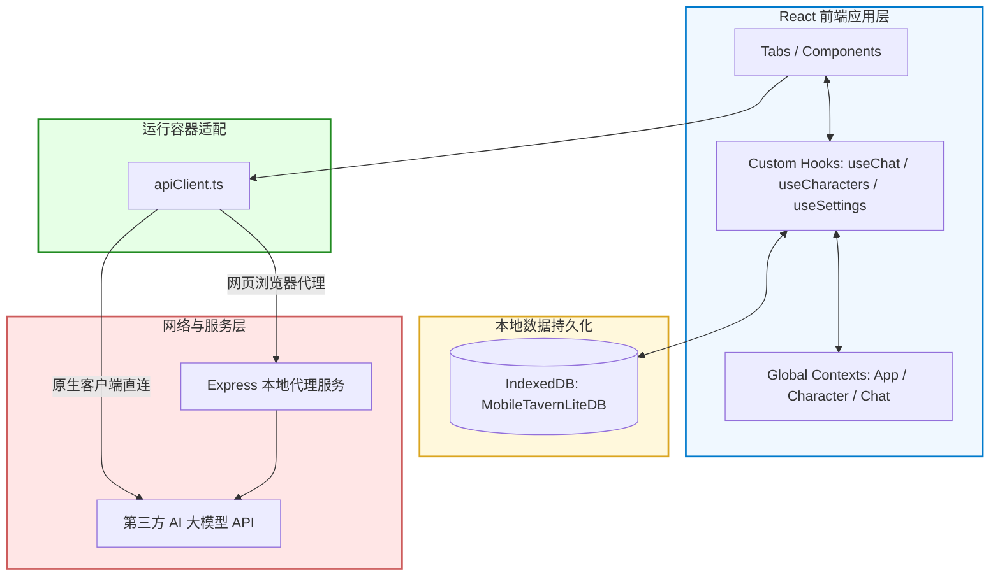
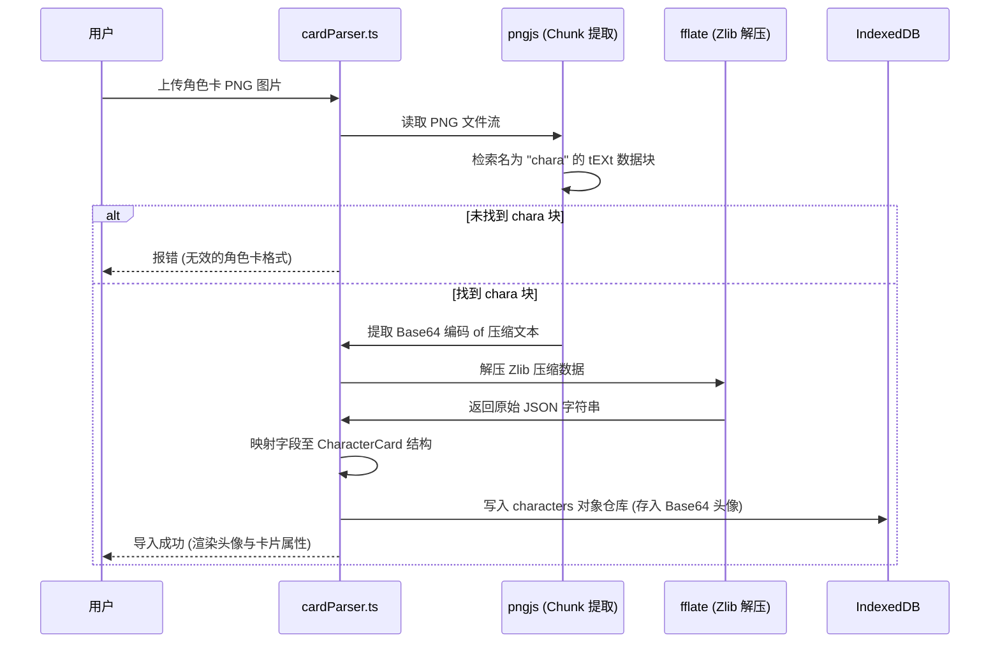
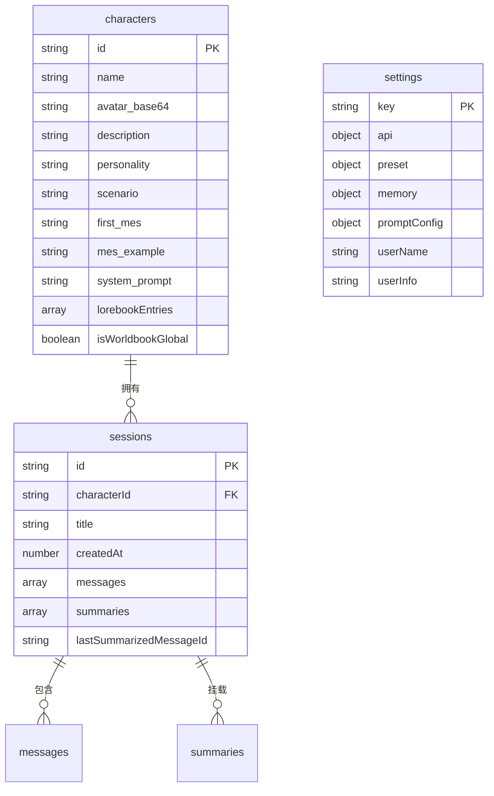

# 🛠️ Mobile Tavern 技术实现细节与架构设计 (Technical Specifications)

本文档归档了 Mobile Tavern 的核心技术实现细节、底层算法架构设计以及非侵入式的模块拓扑原理，专为开发者及技术研究人员提供深度参考。

---

## 📂 项目源码架构树与核心模块职责 (Project Architecture Tree)

本项目的核心前端组件（React + TypeScript）以及后台服务（Tauri/Rust 与 Node.js）的职责文件树明细如下，供开发审计：

```text
Mobile-Tavern
├── src-tauri/                                # Tauri 原生容器构建模块 (Rust 侧)
│   ├── src/
│   │   ├── lib.rs                            # 原生入口绑定、Rust 插件桥接挂载点
│   │   └── telemetry.rs                      # Rust 本地落盘与 STS 遥测异步同步引擎
│   ├── Cargo.toml                            # Rust 容器依赖包配置
│   └── tauri.conf.json                       # 包名、系统权限及 Android 构建声明
│
├── server.ts                                 # 本地开发 Express CORS 中转与代理服务端
├── serverless/                               # 云端 Serverless 服务函数部署
│   └── aliyun-fc-sts/
│       ├── index.js                          # Aliyun FC 3.0 Node.js 临时 STS 凭证签发函数
│       └── package.json
│
├── src/                                      # 前端核心业务逻辑目录 (TypeScript)
│   ├── components/                           # 核心 React 可复用 UI 视图组件
│   │   ├── FloatingCat.tsx                   # 挂件客服助理小猫雪团 (包含状态机与吐槽气泡)
│   │   ├── FormattedText.tsx                 # 前台 Markdown 及星号斜体柔和排版分色组件
│   │   ├── TimelineModal.tsx                 # 剧情归档概要卡片垂直时间轴渲染器
│   │   └── SessionManagerModal.tsx           # 对话分支平行宇宙克隆、删除操作模态框
│   │
│   ├── hooks/                                # 高级自定义 React 状态钩子
│   │   ├── useChat.tsx                       # SSE 字节切分、故事摘要与 APM 耗时监听
│   │   ├── useCatbot.ts                      # 客服助理雪团事件总线与大模型请求钩子
│   │   └── useSettings.ts                    # 用户配置参数防抖落库、多预设套件管理
│   │
│   ├── tabs/                                 # 主界面导航四大板块对应的核心面板
│   │   ├── CharactersTab.tsx                 # 模糊搜索、角色分类过滤器与图片拖拽监听
│   │   ├── ChatTab.tsx                       # 对话气泡、多分支 Swipe 手势切换底栏
│   │   ├── GlobalWorldbookTab.tsx            # 全局知识库条目创建、编辑与原子写库面板
│   │   └── SettingsTab.tsx                   # 备份管理、采样参数调节及大模型接入设置
│   │
│   ├── kernel/                               # 微内核切面底座 (包含 IOC 容器、双轨 Pipeline 及 7 大官方核心服务)
│   │   ├── Kernel.ts                         # 核心 Kernel 容器类实现 (包含 globalKernel 单例)
│   │   ├── types.ts                          # 全局微内核契约接口规范 (IKernel, IKernelService 等)
│   │   ├── index.ts                          # 统一对外导出入口与内核冷启动装配函数 (initializeKernel)
│   │   └── services/                         # 下沉的官方核心微服务实现
│   │       ├── DatabaseService.ts            # 数据库物理 CRUD 服务 [isCritical: 致命]
│   │       ├── LLMService.ts                 # 大模型数据通信与 SSE 流式读取服务
│   │       ├── PromptService.ts              # Prompt 组装与宏替换服务
│   │       ├── TelemetryService.ts           # 使用率上报与崩溃日志本地落盘遥测服务
│   │       ├── TableMemoryService.ts         # TRPG 表格数据游戏化记忆切面服务
│   │       ├── ScriptService.ts              # 角色卡扩展字段变量沙盒 MVU 服务
│   │       └── AutoSummaryService.ts         # 故事大纲自动提炼与年表总结服务
│   │
│   └── utils/                                # 底层核心计算工具包
│       ├── apiClient.ts                      # 跨环境 Fetch 直连/代理自适应包装器
│       ├── cardParser.ts                     # 二进制 PNG 酒馆卡解码、备份 AES 加密
│       ├── promptBuilder.ts                  # 前缀缓存 Prompt 重排、世界书 3 阶级联检索
│       ├── security.ts                       # SSRF 私网 IP 过滤、DNS 防重绑定安全网闸
│       ├── localDB.ts                        # IndexedDB 对象仓声明与并发写 Promise 管道
│       └── telemetry.ts                      # 前端遥测桥接，自适应降级 console 并调用 Rust 命令
```

---

## ⚡ 核心技术特征与性能优化 (Performance Highlights)

### 1. 极致的上下文缓存优化 (Prefix Cache & Message Ordering)
为了极大降低用户的 API 费用，并大幅度提升大模型流式响应的首包时间（TTFT, Time-to-First-Token），
Mobile Tavern 设计了精细的 `messages` 发送序列重排机制，专门针对 **DeepSeek V3/R1** 
自动前缀缓存（Prefix Caching）及 **Gemini** 的上下文缓存进行深度适配。

在系统底层（参见 [promptBuilder.ts](src/utils/promptBuilder.ts)），
发送给 API 的消息数组结构被重排为四个部分：
1. 静态系统人设前缀（System Instruction）
2. 稳定的历史对话序列（Stable Dialogue History Prefix）
3. 动态扩展指令（Dynamic Instruction）
4. 本轮用户即时输入（Last Turn）

#### 🛡️ 优化原理解析 (The Caching Mechanism)
*   **前缀保护 (Stable Prefix)**：
    我们将最大、最稳定的角色人设（`systemInstruction`）与除最后一条外的所有历史对话置于消息数组的前端。
    在连续聊天时，由于历史前缀的字符级一致性，服务端的哈希能够实现 100% 缓存命中，
    缓存 Token 计费比常规状态低 90%。
*   **动态隔离 (Trailing Variance)**：
    高频变动的最新输入及动态触发的世界书、纪律约束被推到了消息序列的最末端，
    从而避免了它们的频繁变动导致大面积历史前缀缓存失效。

---

### 2. SSE 流式传输与零丢包切分缓冲区 (SSE Zero-Loss Stream Buffer)
大模型流式生成时常因网络波动或在流传输终点（Connection EOF）处导致尾部字节丢失。
Mobile Tavern 在底层的流式连接读取循环（参见 [useChat.tsx](src/hooks/useChat.tsx)）中，
引入了 `done` 信号检测与尾部未以双换行结尾的零散数据（Remaining Bytes）兜底冲刷逻辑。

通过提取网络包字节块，将其推进字符累加缓冲区 `pbuf`，并按 SSE 协议标准的双换行 `\n\n` 进行安全边界切分，
最后对字面量转义（例如反斜杠字符 `\n`）实施解码后投递给 React 状态进行 DOM 异步渲染，
彻底根治了流传输不完整导致文本截断的隐性 Bug。

---

### 3. OKLCH 色彩体系设计 (OKLCH Perceptual Colors)
传统的 HSL 和 RGB 颜色模型在计算不同色相的渐变时会产生显著的视觉明度漂移，
这会导致对比度不一致并容易产生视觉疲劳。Mobile Tavern 采用 OKLCH（Lightness, Chroma, Hue）
色彩空间作为整个应用的设计基础。
*   **明度一致性**: 
    OKLCH 保证了相同的 Lightness（L）在不同色相（H）下具有近乎完全相同的 perceived brightness。
*   **平滑护眼**: 
    针对长时间的角色阅读场景，背景明度控制在 0.94 以下，色度 Chroma 压缩在 0.05 以内，
    确保低饱和度、柔和的色彩表现。

---

### 4. React 19 并发状态渲染优化
在大模型极速生成文本流时，每秒可能会有数十次状态更新，这会引起 UI 线程的阻塞。
Mobile Tavern 利用 React 19 的 Concurrent Mode，通过分片更新机制，
允许高优先级交互事件（如滚动视图、退出操作）中断低优先级的文本流拼接渲染，
保证移动端低性能 CPU 上的流畅操控。

---

### 5. 智能剧情故事年表与多维 RPG 状态追踪 (Story Timeline & RPG State Tracking)
为了在移动端提供沉浸式的长期记忆与跑团卡片管理，Mobile Tavern 实现了**智能剧情故事年表与多维 RPG 状态追踪系统**。该系统遵循轻量化与零侵入原则，将复杂的角色卡属性变动从硬编码逻辑中剥离，完全依靠大模型语义边界以及前端双语正则匹配进行智能解析提取。
*   **双层金字塔设计**：
    1.  **通用核心（必选）**：**时间** (TimeTag)、**地点** (Location)、**事件总结** (Event Content)。这是任何故事线与历史年表的基石，用于在上下文窗口满载时压缩剧情，写入长期记忆中。
    2.  **游戏化拓展（可选）**：**心境状态** (Condition)、**道具变动** (Inventory)、**双方情感** (Bonding)。用于辅助记录角色的好感度、装备包、生理/心理状态。
*   **零 Token 消耗的本地正则提取**：
    系统通过在默认总结提示词末尾规定结构化输出界限，AI 总结出正文后，输出 `---` 分割线并列出各项中英文 brackets 标签。前端加载时直接利用正则表达式进行分流切割（把标签剥离正文，使总结本身保持干净），并将其持久化于 IndexedDB。如果标签缺失或为空，系统会智能降级隐藏相应徽章，完美实现对非 RPG 角色卡的向下兼容。

---

## 🏗️ 模块架构与状态管理 (System Architecture)

Mobile Tavern 的底层由前端 React 视图层、Tauri 原生桥接层、Express 代理服务以及本地高性能 IndexedDB 存储四部分构成：



### 1. 核心状态流与生命周期控制
应用使用 React 19 框架作为底层渲染基石。核心逻辑完全依托于 React 自定义 hooks 以及 Provider 架构进行解耦管理：
*   **AppContext**: 
    负责应用全局交互，如全局 Tab 的路由切换、数据库加载指示、连通性状态监测以及全局主题的管理。
*   **CharactersTab**: 
    维护本地导入的角色卡列表。在用户对卡片进行增删改查时，直接通过自定义 Hook [useCharacters.ts](src/hooks/useCharacters.ts) 进行 IndexedDB 存储库的原子操作，并同步分发至 UI 进行反应式视图更新。
*   **ChatTab**: 
    承载当前激活对话。采用 [useChat.tsx](src/hooks/useChat.tsx) Hook 管理 SSE 接收状态、流缓冲分词器以及消息历史树。

### 2. 请求路由感知与环境自适应
系统通过前端封装的 API 客户端对当前运行载体进行智能感知：
*   在安卓真机环境（由原生包封装运行）下，请求直接透传至原生 WebView 容器，利用原生底层直连目标大模型 API。
*   在常规桌面浏览器运行下，为防止发生跨域资源共享（CORS）报错阻断，请求将自动投递至本地 Express 后端代理服务，由其代为转接。

---

## 🧬 Tavern 角色卡解码机制 (Tavern PNG Card Binary Decoder)

Mobile Tavern 能够完美兼容标准的酒馆角色卡 PNG 图像格式。其核心解析工作流如下：



### 1. PNG 二进制结构规范
PNG (Portable Network Graphics) 二进制文件具有严格的结构布局。理解该布局是正确实现免服务器本地解码的基础：
*   **PNG Signature**: 
    前 8 个字节为固定签名 `89 50 4E 47 0D 0A 1A 0A`。
*   **IHDR Chunk**: 
    PNG 文件头块，包含宽度、高度、位深、颜色类型、压缩方法、滤波器方法和隔行扫描方法。
*   **tEXt Chunks**: 
    非关键数据块，用于存储文本元数据。每个 `tEXt` 块包含：
    1. **Length**: 4 字节无符号整数，表示 Data 字段的长度。
    2. **Chunk Type**: 4 字节的字符标记 `tEXt` (对应十六进制 `74 45 58 74`)。
    3. **Data**: 包含一个以 null 字符 (`00`) 结尾的关键字，随后是原始文本。酒馆角色卡规定关键字必须为 `chara`。
    4. **CRC**: 4 字节循环冗余校验码，计算整个 Chunk Type 和 Data 字节的数据完整性。

### 2. Zlib Decompression & Data Mapping
在提取出 `chara` 数据块的原始 Payload 后，数据解压与转换步骤如下：
1.  **Base64 解析**: 
    块内容首先以 Base64 进行传输级转码。解码器将其还原为二进制字节数组。
2.  **Zlib 解压**: 
    解压引擎采用 `fflate` 库提供的轻量级、无阻塞解压模块，提取出角色卡的原始 JSON 文本流。
3.  **JSON 实体反序列化**: 
    检验 JSON 内部是否符合标准的 Tavern Card V1 / V2 字段规范。
    提取必要人设字段，并转换为本客户端在 IndexedDB 中持久化的标准 [CharacterCard](src/types.ts) 格式。

---

## 📁 本地数据库设计 (IndexedDB Persistence Engine)

应用使用浏览器原生的 IndexedDB 进行超大容量本地离线存储，数据库名称为 `MobileTavernLiteDB`。

### 1. 数据库关系图 (ER Diagram)



### 2. 数据库迁移与升级历程 (Schema Migrations v1 to v5)
随版本迭代，Mobile Tavern 实现了数据库结构的平滑无损迁移。以下是各版本升级定义（参见 `db.ts`）：
*   **Version 1**: 
    建立基础 `characters`、`sessions` 及 `settings` 对象存储库。
*   **Version 2**: 
    在 `sessions` 仓库上为 `characterId` 创建非唯一检索索引，加速获取指定角色下的聊天历史列表。
*   **Version 3**: 
    升级 `settings`，将原先扁平的全局预设拆解封装为结构化的 `ApiConfig`、`SamplerPreset` 及 `PromptConfig`。
*   **Version 4**: 
    在 `characters` 存储库中新增 `lorebookEntries`（局部绑定的世界书条目列表）及 `isWorldbookGlobal` 字段。
*   **Version 5**: 
    在 `sessions` 存储库中引入 `lastSummarizedMessageId`，防止对历史剧情进行重复冗余提取，有效遏制内存溢出和重复计费。

### 3. 高性能非阻塞事务设计
为了保证在手机高频打字发送时界面响应不产生延迟顿挫，IndexedDB 读写采用如下原则：
*   **Scope Minimization**: 
    启动事务时，严禁作用于全局，只向事务声明具体的 object store 范围（例如单一 of `sessions`）。
*   **Readwrite Segregation**: 
    仅在进行物理保存时开启 `readwrite` 权限。所有的只读查询（如聊天界面滚动加载历史）使用 `readonly` 模式，确保浏览器能同时并行执行多个查询。

---

## 🚀 开发者架构调试沙盒设计与原理 (Interactive Developer Sandbox Architecture)

在 `v1.3.5` 中，我们为开发者深度定制并内置了一个全交互式的**架构调试沙盒**（PlaygroundTab，参见 [PlaygroundTab.tsx](src/tabs/PlaygroundTab.tsx)）。该沙盒是理解 Mobile Tavern 数据流运转及调试核心功能的控制台。

### 1. SVG 动态拓扑节点与坐标映射 (SVG Coordinates Mapping)
数据流向拓扑图使用高精度矢量 SVG 结构构建。画布中心坐标范围设定为 `0 0 500 570`，以在主流移动端屏幕上获得最佳的长宽自适应比例。
*   **主管道轴线**: 
    用户输入、世界书匹配、Prompt 组装、缓存切分、网络流接收以及界面气泡渲染等核心模块排列于 `X = 250` 的垂直几何对称轴上，方便形成单线管道视觉认知。
*   **双侧侧链分支**: 
    角色卡基础静态数据（位于 `X = 20, Y = 160`）和全局预设配置（位于 `X = 350, Y = 160`）以曲线汇入位于 `Y = 230` 的 Prompt 组装中心，用以表征静态上下文的合流拼装流程。
*   **流动动画技术**: 
    使用 CSS 控制 `stroke-dasharray`，通过 GPU 硬件加速的 keyframes 对 `stroke-dashoffset` 进行偏移，模拟数据沿管道平滑传输的效果。

### 2. 模拟器状态机流转机制 (Simulator State Machine)
沙盒中的“全链路仿真模拟器”通过 React Effect 构建流转状态机：
1. **连接就绪 (Node 0)**: 模拟器重置控制台，进入数据准备状态。
2. **输入分析 (Node 1)**: 捕捉当前测试词，进入 token 消耗计算状态。
3. **匹配检索 (Node 2)**: 扫描输入字符串是否符合特定关键词判定。
4. **组装合并 (Node 3-5)**: 从两侧读取静态人设和用户预设，执行宏替换编译，并划分前缀缓存。
5. **建立流连接 (Node 6-8)**: 建立 mock 终点，模拟网络分包，对字节进行反转义解压，最终触发虚拟手机状态栏底色变化并渲染气泡。

### 3. 互动测试台 (Interactive Testbeds)
每一个拓扑节点均提供交互体验版块，允许开发者实时输入不同参数调试底层算法：
*   **宏安全编译测试**: 
    调试包含特殊占位符（如 `{{char}}`）和特殊字符（如带有 `$` 符号的价格）的文本在编译时是否能够安全防坍塌处理。
*   **缓存段切分计算器**: 
    滑动对话历史轮数，直观呈现前置 100% 缓存命中 Token 的比例关系。
*   **转义还原验证板**: 
    手动输入包含 `\\n` 的文本流，观察 JSON 反解算法如何无损转换并在 UI 容器中产生换行排版。

---

## 🧭 核心源码实现深度剖析 (Core Code Deep-Dive)

### 1. `promptBuilder.ts` (Prompt 编译组装)
*   **实现位置**: [promptBuilder.ts](src/utils/promptBuilder.ts)
*   **核心逻辑**: 
    负责在内存中拼接角色卡各项静态设定、当前全局设置与对话上下文历史。该模块不依赖任何硬编码的内置指令作为缺省值，以绝对无偏向的兼容方式组装数据。
*   **宏替换防坍塌算法**:
    大模型使用的模版字符在拼接时极其容易在正则匹配端遭遇转义符坍塌漏洞。我们摒弃了普通的 `str.replace(regexp, val)` 表达式（会解析 `val` 中含有的 `$1`, `$&` 等特殊符号），采用 lambda 回调执行返回的方式完成安全的物理级内容替换。

### 2. `useChat.tsx` (流式长连接管理)
*   **实现位置**: [useChat.tsx](src/hooks/useChat.tsx)
*   **核心逻辑**: 
    实现了基于流式连接（EventSource / ReadableStream）的会话更新器。它负责发起请求、抓取网络分块，并同步刷新 IndexedDB 对应分叉内的 `messages` 数组。
*   **分阶段缓冲算法**:
    网络层读取的字符首先被保存在局部流缓冲器中，当检测到符合 SSE 终止标记（如 `[DONE]` 信号）或长连接在物理层宣告 EOF 时，引擎将自动唤醒缓冲段解析器，执行终点冲刷操作，提取尾部所有剩余半字符，彻底防止了流截断所导致的结尾文字丢失。

### 3. `cardParser.ts` (酒馆卡 PNG 二进制还原)
*   **实现位置**: [cardParser.ts](src/utils/cardParser.ts)
*   **核心逻辑**: 
    这是一个纯前端运行的二进制图像块解构器，能够在本地沙盒中无损提取和重构卡片信息。
*   **块迭代策略**:
    算法将传入的文件以 `ArrayBuffer` 的形式读入内存，将指针移向 PNG 特征头签名之后。通过循环计算每一个块的物理位移跨度（Length + Type），计算 CRC32 并校验包完整性。若探测到 `tEXt` 标识，便在此空间中匹配 ASCII `chara` 标记，进而以同步方式完成数据解压与实例化。

### 4. `PlaygroundTab.tsx` (交互调试沙盒)
*   **实现位置**: [PlaygroundTab.tsx](src/tabs/PlaygroundTab.tsx)
*   **核心逻辑**: 
    构建了一个可以隔离进行算法测试的互动游戏场。它为上面所有的核心逻辑（如宏替换、前缀分流、网络包解压等）提供了单独的仿真验证面板。
*   **状态隔离**:
    沙盒内使用完全隔离的 `mockChar` 与 `mockHistory` 变量，确保开发人员在调节和探索算法特性时，绝不会对真实的本地 IndexedDB 角色与会话库产生状态污染。

### 5. `db.ts` (高性能存储层)
*   **实现位置**: [db.ts](src/utils/db.ts)
*   **核心逻辑**: 
    提供了一个坚固的本地关系化存储底座。数据库实例通过单例模式暴露，避免频繁握手。
*   **事务管道**:
    在写操作被并发触发时（例如高频发送），`db.ts` 会严格在底层通过队列来控制写事务的顺序，防止两个写事务同时获取锁而造成 IndexedDB 独占死锁或引发白屏崩溃。

### 6. `App.tsx` (应用初始化配置)
*   **实现位置**: [App.tsx](src/App.tsx)
*   **核心逻辑**:
    负责系统冷启动的流程管理。加载内置的三套预设模版包，并检查本地数据库 settings 是否存在旧记录。如果首次安装，自动写入缺省的用户参数。它还负责捕获顶级的未捕获异常。
*   **流自适应高度机制**:
    检测视口物理像素尺寸，尤其是移动端的输入键盘拉起事件，利用动态 `viewport-height` 刷新 DOM 元素的高度，避免聊天输入框被键盘推移挤出屏幕范围。

### 7. `MainLayout.tsx` (物理主导航控制)
*   **实现位置**: [MainLayout.tsx](src/components/MainLayout.tsx)
*   **核心逻辑**:
    作为前端视图层的承载骨架。它响应 AppContext 广播的 Tab 变化，渲染不同的 Tab 面板。
*   **拇指交互实现**:
    将高频次使用的角色管理、历史分支列表、世界书配置以及控制面板按钮以 2.5 字符高度的形式均匀放置于屏幕最底端，使得单手握持状态下大拇指能轻松覆盖所有跳转范围。

### 8. `GlobalWorldbookTab.tsx` (设定集检索管理)
*   **实现位置**: [GlobalWorldbookTab.tsx](src/tabs/GlobalWorldbookTab.tsx)
*   **核心逻辑**:
    提供对于全局知识库条目的反应式配置。允许用户动态创建、使能或禁用指定的 key 组。
*   **原子化写入**:
    当对词条内容执行变更后，模块并不直接执行全局存储刷新，而是将当前被编辑的条目通过特定事务单独投递至 IndexedDB，限制了数据库锁定所引起的性能损耗。

### 9. `CharacterDetailDrawer.tsx` (人设与立绘表情解析器)
*   **实现位置**: [CharacterDetailDrawer.tsx](src/components/CharacterDetailDrawer.tsx)
*   **核心逻辑**:
    渲染角色卡元信息。包括人设展示、局部世界书挂载，以及立绘表情差分图谱检查。
*   **对话例句断行分块**:
    它能够对角色卡中的 `mes_example` 对话范本执行特殊词组切分（例如以 `<START>` 划分），将一长串原始例句分割成不同的气泡流展示在面板抽屉中，让用户极其直观地看到角色的扮演风格。

### 10. `AppContext.tsx` (全局交互事件分发器)
*   **实现位置**: [AppContext.tsx](src/contexts/AppContext.tsx)
*   **核心逻辑**:
    提供了跨组件的多点弹窗调用（Alert, Confirm, Prompt）异步桥接包装。
*   **Promise 状态机序列化**:
    为解决在高频异步更新下 React Modal 状态错乱导致的事件丢失，`AppContext` 底层将弹窗动作转化为标准的 `Promise<void>` / `Promise<boolean>` / `Promise<string | null>`，通过状态机的解耦分发使得开发者可以在异步 hook 中像同步调用浏览器 `window.confirm` 一样书写业务逻辑。

### 11. `useSettings.ts` (参数自动同步及持久化)
*   **实现位置**: [useSettings.ts](src/hooks/useSettings.ts)
*   **核心逻辑**:
    统一同步并托管用户的全局设置参数设定。
*   **防抖自动写入**:
    当用户拖拽设置页的 temperature、top_p 或是重复惩罚参数时，数据会反应式在内存中更新。防抖机制会将写入 IndexedDB 的底层调用聚合，降低系统频繁落库引起的并发 IO 压力。

### 12. `CharactersTab.tsx` (角色列表交互模块)
*   **实现位置**: [CharactersTab.tsx](src/tabs/CharactersTab.tsx)
*   **核心逻辑**:
    管理卡片的交互陈列。支持多属性过滤、全文模糊搜索和 PNG 卡片解析。
*   **拖拽事件监听器**:
    在前台部署了针对标准 HTML5 拖拽事件（`dragover`, `drop`）的事件监听器，可以直接在浏览器窗口内捕获图片文件对象，自动触发 `cardParser` 提取数据。

### 13. 遥测系统的 Native 化下沉设计 (Tauri Rust Telemetry)
*   **实现位置**: 前端 [telemetry.ts](src/utils/telemetry.ts) 与 Rust 后端 [telemetry.rs](src-tauri/src/telemetry.rs)
*   **核心逻辑**:
    负责崩溃、使用率及 LLM APM 指标收集的原生化下沉模块。
*   **物理隔离与环境上报行为**:
    *   **前端降级与自适应 Mock 逻辑**: 前端不再直连阿里云 SLS 接口。所有遥测事件在整合设备上下文后，均通过 Tauri `invoke("report_telemetry")` 发送到 Rust 后端。**开发期或非 Tauri 浏览器调试下，会自动降级为 `Console` 模拟打印（输出 `[Telemetry] [Mock Dev Send]: ...` 到控制台），此时完全断开网络通道，不向云端发送任何遥测数据。**
    *   **Rust 本地持久化队列**: Rust 后端收到事件后，立即以 JSON Lines (JSONL) 格式写入手机沙盒中的 `telemetry_queue.jsonl` 文件。保证在 App 大退或被系统强杀时，数据已原子级落盘。
    *   **后台异步同步线程**: Rust 后端在 `setup` 阶段启动常驻轮询线程，每 15 秒检测一次本地日志队列。若队列不为空，则后台请求 STS 凭证服务（`https://mobile-xmkoxkjshe.cn-hangzhou.fcapp.run`）获取临时密钥，计算包含 `x-log-bodyrawsize` 的 HMAC-SHA1 签名并批量发送给阿里云 SLS 的 `app-logs` 日志库。发送成功后截断/清除已成功上报的日志。
*   **遥测无数据排查指南**:
    1. **检查是否为真机/模拟器测试**：本地电脑浏览器调试不产生任何网络遥测数据，必须使用 Tauri 原生包测试。
    2. **检查本地缓存**：必须执行相关敏感操作（测试连接、载入对话）往本地写入几条日志以触发增量同步定时器，为空时不启动网络请求。
    3. **STS 授权验证**：检查阿里云临时角色的 STS Policy，必须明确包含对遥测日志库 `app-logs` 的写入（`log:PostLogStoreLogs`）权限。
    4. **ADB 实战定位命令**：通过 adb 工具过滤 Rust 底层遥测日志输出，确认是 `Successfully sent` 还是报 HTTP 错误（如 403 / 404）：
       ```powershell
       adb logcat | findstr "Telemetry"
       ```

### 14. `TimelineModal.tsx` (前情剧情提炼时间线展示)
*   **实现位置**: [TimelineModal.tsx](src/components/TimelineModal.tsx)
*   **核心逻辑**:
    提取会话中已归档的 `summaries` 时间片数据，并渲染为优雅的垂直卡片轴。
*   **故事线渲染设计**:
    在手机端渲染折叠的前情概要大纲（故事年表），帮助用户在超长对话中回忆历史场景。点击事件可以展开完整的剧情概要，为用户提供沉浸式小说阅读视角。

### 15. `SessionManagerModal.tsx` (多会话剧情分支分叉管理)
*   **实现位置**: [SessionManagerModal.tsx](src/components/SessionManagerModal.tsx)
*   **核心逻辑**:
    负责对指定的角色卡开启多条独立的聊天剧情分支（类似于世界分支的切换）。
*   **多维度并发操作**:
    在前端执行分支克隆、重命名及物理删除。当克隆时，开启 IndexedDB 关联事务，复制原分支的所有消息历史和剧情提炼大纲，并迅速建立具有新 UUID 的平行会话分支实体。

### 16. `CustomConfirmDialog.tsx` (移动端风格交互对话框)
*   **实现位置**: [CustomConfirmDialog.tsx](src/components/CustomConfirmDialog.tsx)
*   **核心逻辑**:
    针对 APK 及手机端网页环境，完全重写了传统的浏览器 `window.alert` 和 `confirm`。
*   **微动画交互反馈**:
    采用毛玻璃特效和渐变，支持弹出输入框（Prompt）并正确适配大拇指易点击的间距宽度。

---

## 🧭 微内核与 Pipeline 管道中间件底座架构 (Modular Kernel & Pipeline Architecture)

为了支持未来 50+ 高阶插件并发加载、音频/视频/WebRTC 独立扩展以及多用户实时渲染需求，Mobile Tavern 彻底解耦了旧有的单体大对象结构。系统底层设计并实现了一套具备高健壮性、可自愈的微内核（Kernel）运行底座与洋葱管道模型（Pipeline）中间件机制。

```mermaid
graph TD
    Kernel[IKernel 核心容器]
    
    subgraph MessageBus [MessageBus 消息总线]
        Sub1[订阅者 1: priority 100]
        Sub2[订阅者 2: priority 10]
        Kernel -->|publish / publishParallel| MessageBus
        MessageBus --> Sub1
        MessageBus --> Sub2
    end
    
    subgraph Pipelines [Pipelines 洋葱管道轴]
        P_Input[input 管道]
        P_Output[output 管道]
        Kernel -->|getPipeline| Pipelines
        P_Input -->|Middleware 1| P_Input_2[Middleware 2]
    end
    
    subgraph Services [IOC 容器与微服务]
        S_DB[DatabaseService]
        S_LLM[LLMService]
        Kernel -->|getService| Services
    end
```

### 1. 核心契约与容器设计 (`IKernel`)
系统核心容器 `Kernel` 遵循依赖注入（DI）和控制反转（IOC）原则，通过 `globalKernel` 单例向应用暴露全局服务治理能力。其定义位于 [types.ts](src/kernel/types.ts)，核心接口定义如下：
*   **服务注册与获取**：通过 `registerService` 和 `getService` 提供解耦访问。
*   **消息发布与订阅**：提供基于优先级排序的发布-订阅模式消息总线。
*   **管道注册**：基于洋葱模型（Onion Model）的切面拦截管道治理。

### 2. 洋葱模型拦截管道 (`IPipeline`)
管道机制采用经典的洋葱圈执行流，允许插件或微服务以非侵入的方式拦截、篡改及熔断核心数据流。
*   **中间件执行模型**：每个中间件接收三个参数 `(context, next, interrupt)`。
*   **受控拦截阻断 (`interrupt()`)**：如果中间件希望安全熔断（例如发现输入违规），可直接调用第三个参数 `interrupt()`，系统会自动将其 `isInterrupted` 状态置为 `true` 并中断后续中间件的执行。
*   **开发态严格模式 (`strictMode`)**：为了防范开发者漏调 `next()` 或 `interrupt()` 导致管道挂死，内核在开发模式下如果发现管道既未调用 `next()` 延续、又未调用 `interrupt()` 声明拦截，会直接抛出致命 `Error`，生产环境下则优雅中断并记录错误日志。

### 3. 高能消息总线 (`MessageBus`)
消息总线负责不同切面服务之间的异步解耦通信，具备出色的抗灾设计：
*   **优先级排序订阅**：订阅者可以通过优先级（`priority`）声明消息消费的顺序，数值越高越先执行。
*   **并行分发与故障隔离 (`publishParallel`)**：支持使用 `Promise.all` 并行触发多个订阅者。如果其中一个订阅者崩溃，消息总线能物理隔离该异常，确保其他订阅者依然能收到通知并正常工作。
*   **超时熔断保障**：当单个订阅者在执行异步任务时发生严重挂死，总线拥有超时强熔断逻辑，限制单次消费任务无休止锁死线程。

### 4. 架构健壮性与自愈防护设计
为了在移动端 WebView 进程资源极其受限的环境下达到 100% 运行健壮性，内核集成了如下防灾手段：
*   **依赖拓扑排序 (Kahn 算法)**：通过 `registerServiceBatch` 批量装配服务时，内核自动解析服务依赖项（`dependencies`），并利用 Kahn 拓扑排序算法计算出无冲突的安全加载序列进行装载。如果检测到环形依赖（如 A 依赖 B，B 依赖 A），会在初始化阶段抛出致命异常强行阻断加载。
*   **致命服务熔断与非致命服务自愈**：
    *   服务声明 `isCritical: true` 时，初始化失败会向上抛出 `FATAL` 核心崩溃异常，迫使内核熔断白屏，防范核心逻辑失效。
    *   非关键服务发生崩溃或获取未注册服务时，内核会返回一个高性能的 **SafeProxy** 代理。
    *   **SafeProxy 双轨行为**：在开发环境下，任何试图读取未就绪/未注册 Proxy 属性的操作都会触发致命开发期断言报错；而在生产环境下，SafeProxy 能安全提供 No-op 降级空操作，支持无限链式调用及 Promise `await` 链式兼容，实现自动故障隔离。
*   **异步任务超时熔断与一键销毁 (`destroy`)**：当内核被卸载或重置时，执行 `destroy()` 会自动中止底层的活跃任务控制器（`activeControllers`）并触发 `AbortController.abort()`。同时，内核将依照拓扑排序的**逆序**（Top-down Reverse，即先销毁外层服务，后销毁底层服务）依次触发各个服务的销毁钩子，彻底释放资源，防范内存泄漏。

### 5. 官方七大下沉核心微服务职能
*   `DatabaseService` (database)：承载 IndexedDB 物理层读写和并发写 Promise 串行事务管道。
*   `LLMService` (llm)：承载大模型请求、SSE 字符缓冲读取与思维链提取。
*   `PromptService` (prompt)：负责人设模版编译、宏安全替换及世界书三阶级联检索。
*   `TelemetryService` (telemetry)：收集 App APM 耗时及崩溃事件并写入落盘队列，计算 STS 后台同步上报。
*   `TableMemoryService` (tableMemory)：自动匹配解析 TRPG 表格游戏数据。
*   `ScriptService` (script)：在独立沙盒内执行角色卡内嵌的扩展变量计算脚本。
*   `AutoSummaryService` (autoSummary)：检测未总结轮数并异步触发大模型年表大纲生成。

---

## 🧪 自动化测试套件与覆盖验证 (Comprehensive Test Suite)

为了在快速迭代中防范逻辑回归，项目内置了全覆盖的自动化测试套件，由项目根目录的 [tests/run_all_tests.ts](tests/run_all_tests.ts) 主入口统一调度，包含了 **16 项核心功能验证用例**。

### 1. 自动化功能测试一览 (The 16 Test Cases)
1.  **`testSsrfGuard` (SSRF 防御校验)**：验证 `validateBaseUrlSecurity` 能否成功阻断 IPv4/IPv6 回环地址、内网网段、八进制/十六进制伪造 IP 等越界穿透，同时放行正常的公网 API 域名。
2.  **`testDbQueue` (并发写冲突与事务序列化)**：并发触发多个数据库写事务，校验 Promise 队列是否能够完美按顺序串行写入，并且在其中一个事务崩溃时，后续写入能否自愈恢复并继续安全保存。
3.  **`testPromptBuilder` (宏替换防坍塌与世界书触发)**：验证 `replaceMacros` 处理带 `$` 符号特型字符和 `{{char}}` / `{{user}}` 占位符时是否会引起模板坍塌；验证根据历史消息关键词检索世界书词条的逻辑。
4.  **`testPngCardParser` (PNG 酒馆角色卡物理级解压还原)**：提取假想 PNG 文件流，解析 `tEXt` 结构块并对 Zlib 数据解压还原成标准 CharacterCard 实体，进行字段双向匹配测试。
5.  **`testApiCleanRequestPayload` (各模型厂商参数差异化清洗)**：模拟全厂商参数（OpenRouter、OpenAI 官方、DeepSeek 官方、Gemini 等），校验 apiClient 中 `cleanRequestPayload` 的提取行为（剔除会导致 400 Bad Request 的非标参数，保留专有参数）。
6.  **`testSSEStreamWithReasoning` (SSE 思维链提取)**：模拟包含 `reasoning_content` 的大模型 SSE 流式输出包，校验 `readSSEStream` 缓冲区切分器是否能够精准拦截思维链数据并正常拼装主文本。
7.  **`testPromptBuilderSystemMerging` (System 旁白消息智能归并)**：验证当会话消息历史中存在中途插入的 System 指令时，算法能将其封装为“系统旁白”格式并与相邻的 User 消息合并，以确保满足绝大多数大模型 API 严格的 User/Assistant 交替契约。
8.  **`testKernelFaultIsolation` (微内核故障隔离与 SafeProxy)**：验证正常初始化、致命核心服务引发的内核级熔断、非关键服务异常时 SafeProxy 自动接管、SafeProxy 链式属性/方法调用以及 `await` Promise 的兼容性。
9.  **`testKernelPipeline` (洋葱中间件洋葱排序与阻断拦截)**：验证管道中挂载的多个中间件能够依照 `priority` 升序/降序形成正确的执行环，并且在 blocker 遗漏 next 时能终止执行。
10. **`testKernelPipelineHardening` (洋葱管道健壮性防灾)**：验证 SafeProxy 诊断环境下的 console 警告，中间件动态注销，以及异常崩溃时管道的物理阻断防护（防静默绕过安全防线）。
11. **`testKernelHardeningP0ToP3` (严格开发期断言检测)**：临时拉起 `strictMode`，验证 P0 级消息订阅注销、P1 级未完全就绪时 getService 的 FATAL 报错、P1 级中间件漏调 next() 时强抛致命异常、P2 级 SafeProxy 属性读取断言拦截以及 P3 级一键一键 destroy() 内存清理。
12. **`testKernelKernelV2Fixes` (内核 V2 回归防范)**：校验 Kahn 拓扑排序在 registerServiceBatch 中的顺序分配、循环依赖检测、B-2 关键缺失致命强抛、B-4 消息总线订阅优先级、publishParallel Concurrency 并行流速及事件隔离。
13. **`testKernelV3Fixes` (内核 V3 健壮性修复)**：验证 destroy() 触发时的逆序释放（防悬挂资源未解绑）、SafeProxy 对 JS 内置 Symbol 属性读取拦截（防止控制台日志产生无限递归循环死锁）、注销后清空 Map 中空 key 的机制。
14. **`testKernelV4AbortAndInterrupt` (内核 V4 超时取消与熔断)**：验证中间件使用第三个参数 `interrupt()` 阻断管道、服务异步初始化在 50ms 超时熔断后触发 `AbortSignal` 退出、内核 destroy 时一键 Abort 正在挂起的活跃分发事件。
15. **`testKernelExtensionRegistry` (SPI 扩展插件注册表机制)**：验证内核扩展插槽机制，校验优先级节点插拔、节点动态替换更新、以及内核销毁时整体插槽重置。
16. **`runCatbotErrorTests` (Catbot 异常流降级)**：模拟客服助理小猫遇到阿里云 FC 接口 429 频次受限、欠费、网关超时等情况时的本地正则关键词降级处理器，确保交互不卡死。

### 2. 测试运行指引 (Testing Guide)
在本地开发环境下，你可以通过运行以下指令一键执行所有的单元测试：
```powershell
npm run test
```
测试框架会在终端输出每个模块的初始化和测试断言结果，并提示 `🎉 ALL TESTS COMPLETED SUCCESSFULLY!` 宣告通过。

---

## 🧭 常见问题排查与技术约束 (Troubleshooting & Technical Constraints)

*   **API 跨域错误 (CORS Blocked)**: 
    *   在桌面浏览器环境中，若直连第三方 API 提示跨域受阻，请确保启动了本地代理服务器（`npm run dev`），并将 API 控制台的 Base URL 切换为同源路径 `/api/proxy/openai`。
    *   在 Android 客户端中，所有网络请求将自动交由原生底层发信，直接绕过浏览器 CORS 同源策略限制。
*   **PNG 角色卡解析失败**: 
    *   请确保拖入或导入的图片为标准的酒馆 PNG 卡格式，并且未被第三方聊天工具二次压缩抹除了 `tEXt` 区块中的 `chara` 元数据。可以使用本系统“架构调试沙盒 -> PNG卡分析器”上传卡片以查阅元数据树。
*   **内存总结提取不生效**: 
    *   检查会话消息历史是否满足“控制面板 -> 存储 -> 剧情总结触发轮数”的预设阈值。如果未到达触发线，故事年表提炼模块将保持 IDLE 挂起状态。
*   **IndexedDB 版本冲突或升级失败**: 
    *   当在同一浏览器标签页上频繁切换不同分支的编译程序，或在本地数据库进行跨版本模式修改时，偶尔可能会遇到对象存储库锁定报错。遇到此类问题，重启开发服务或清理浏览器缓存即可自动恢复。
*   **Tauri 窗口加载状态丢失**: 
    *   若遇开发中由于 hot-reload 导致 state 树在内存中失焦重置的情形，由于 IndexedDB 中数据均具有原子事务安全锁，所有消息流和卡片信息并不会丢失，直接在界面点击刷新拉取即可。
*   **TailwindCSS 静态选择器冲突**: 
    *   本软件全面弃用了旧有的原子内联样式拼写，如果在扩展组件时发现新添加的颜色或阴影不能在移动端正常生效，请确认是否在 CSS 根样式表中注册了相应的 OKLCH 设计令牌，同时检查 Vite 打包管道中对动态选择器的提取范围限制。
*   **世界书扫描算法技术限制**: 
    *   为了防止大模型发生逻辑过载及生成延迟，目前的关键词提取采用基于 KMP 的单次快速定位方案。
    *   对于包含复杂同义词替换或自然语言多维关联判定的词条，推荐使用在角色卡设定中进行前置拆分定义。


