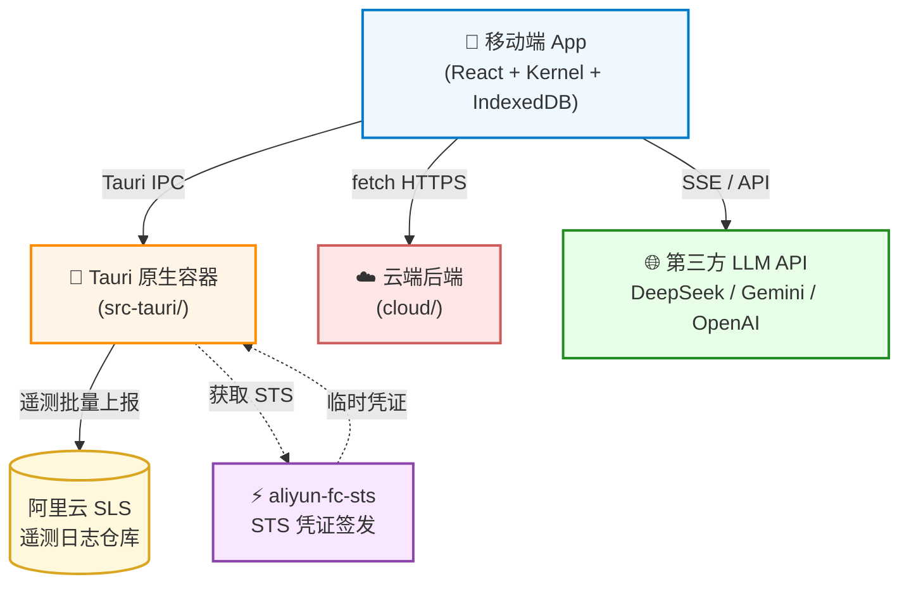
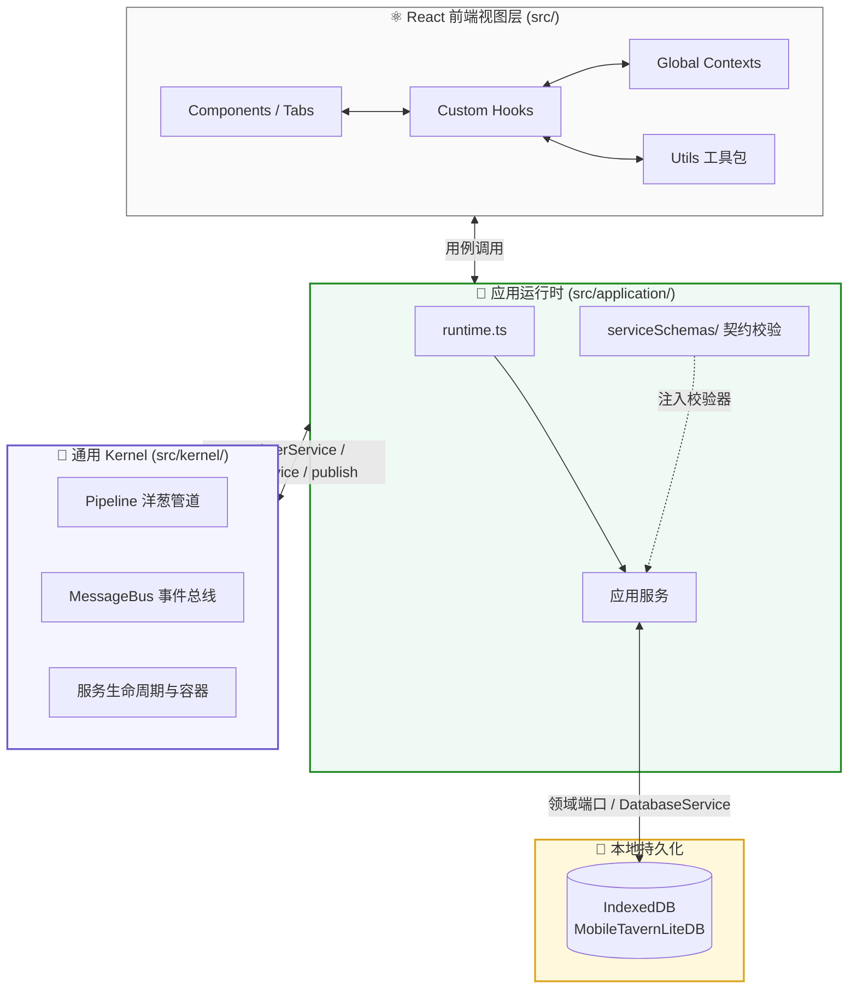
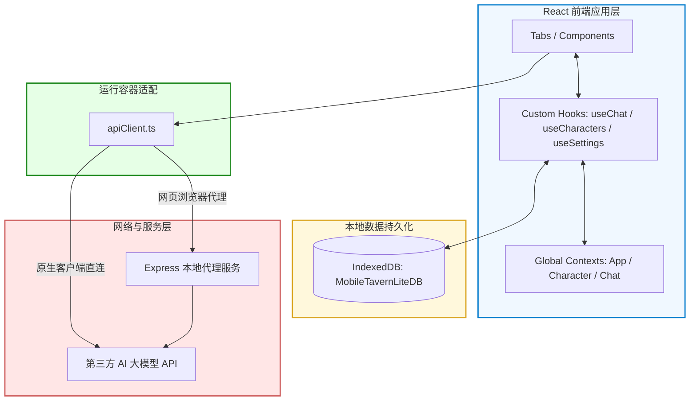
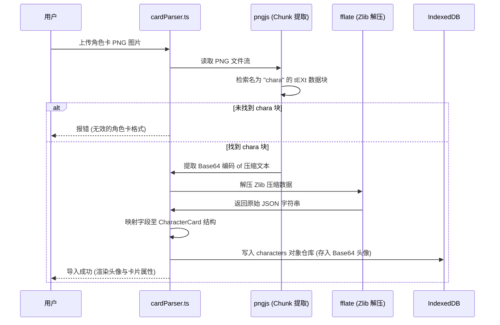
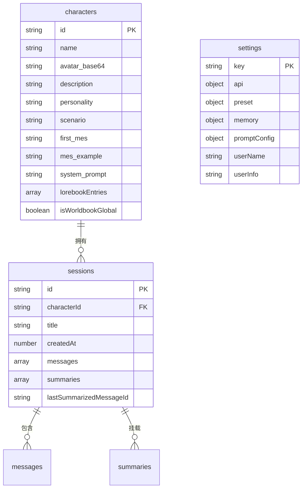
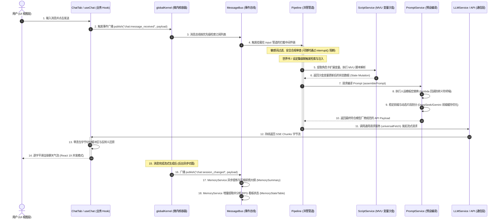

# 🛠️ Mobile Tavern 技术实现细节与架构设计 (Technical Specifications)

> 📌 **项目行为指导规范**：在理解或重构架构职责与数据流之前，必须首先阅读 [AGENTS.md](AGENTS.md) 中的核心行为准则（大单体防御、生态兼容与纯移动端适配）。
> *当前版本：v1.7.2*

本文档归档了 Mobile Tavern 的核心技术实现细节、底层算法架构设计以及非侵入式的模块拓扑原理，专为开发者及技术研究人员提供深度参考。

---

## 📂 项目源码架构树与核心模块职责 (Project Architecture Tree)

本项目的核心前端组件（React + TypeScript）以及后台服务（Tauri/Rust 与 Node.js）的职责文件树明细如下，供开发审计：

```text
Mobile-Tavern
├── src-tauri/                                # Tauri 原生容器构建模块 (Rust 侧)
│   ├── src/
│   │   ├── lib.rs                            # 原生入口绑定、Rust 插件桥接挂载点
│   │   └── telemetry.rs                      # Rust 本地落盘与 STS 遥测异步同步引擎
│   ├── Cargo.toml                            # Rust 容器依赖包配置
│   └── tauri.conf.json                       # 包名、系统权限及 Android 构建声明
│
├── server.ts                                 # 本地开发 Express CORS 中转与代理服务端
├── serverless/                               # 云端 Serverless 服务函数部署
│   └── aliyun-fc-sts/
│       ├── index.js                          # Aliyun FC 3.0 Node.js 临时 STS 凭证签发函数
│       └── package.json
│
├── src/                                      # 前端核心业务逻辑目录 (TypeScript)
│   ├── components/                           # 核心 React 可复用 UI 视图组件
│   │   ├── FloatingCat.tsx                   # 挂件客服助理小猫雪团 (包含状态机与吐槽气泡)
│   │   ├── FormattedText.tsx                 # 前台 Markdown 及星号斜体柔和排版分色组件
│   │   ├── TimelineModal.tsx                 # 剧情归档概要卡片垂直时间轴渲染器
│   │   └── SessionManagerModal.tsx           # 对话分支平行宇宙克隆、删除操作模态框
│   │
│   ├── hooks/                                # 高级自定义 React 状态钩子
│   │   ├── useChat.tsx                       # SSE 字节切分、故事摘要与 APM 耗时监听
│   │   ├── useChat/useRerollMessage.ts       # 重发事务锁、召回与原子分支替换编排
│   │   ├── useCatbot.ts                      # 客服助理雪团事件总线与大模型请求钩子
│   │   └── useSettings.ts                    # 用户配置参数防抖落库、多预设套件管理
│   │
│   ├── domain/                               # 不依赖 React 与物理存储的纯业务规则
│   │   └── chat/bisonProbability.ts          # 野牛模式概率计算领域函数
│   │
│   ├── infrastructure/storage/               # IndexedDB 物理基础设施适配器
│   │   ├── IndexedDbMemoryPersistenceService.ts # 长期记忆持久化端口实现
│   │   ├── indexedDbMemoryStore.ts           # 记忆 Store 与会话分支原子事务
│   │   ├── indexedDbSessionQueries.ts        # 会话只读查询与分页
│   │   └── sessionRecord.ts                  # 会话元数据纯净记录映射
│   │
│   ├── contexts/                              # React 界面状态提供者，不承载业务事务
│   │   ├── LanguageContext.tsx               # 多语言 i18n Provider 与 useTranslation 钩子
│   │   ├── AppContext.tsx                    # 页签、主题、弹窗与安全区界面状态
│   │   ├── CharacterContext.tsx              # 角色目录选择与加载状态投影
│   │   └── ChatContext.tsx                   # 会话选择、发送态与分页加载态投影
│   │
│   ├── locales/                               # 多语言翻译资源（按语言独立文件）
│   │   ├── index.ts                          # 聚合导出 TRANSLATIONS 对象
│   │   ├── zh-CN.ts                          # 简体中文 (708 keys)
│   │   ├── zh-TW.ts                          # 繁体中文
│   │   ├── en.ts                             # 英语
│   │   ├── ja.ts                             # 日语
│   │   ├── ru.ts                             # 俄语
│   │   ├── es.ts                             # 西班牙语
│   │   ├── ko.ts                             # 韩语
│   │   └── pt-BR.ts                          # 葡萄牙语（巴西）
│   │
│   ├── tabs/                                 # 主界面导航四大板块对应的核心面板
│   │   ├── CharactersTab.tsx                 # 模糊搜索、角色分类过滤器与图片拖拽监听
│   │   ├── ChatTab.tsx                       # 对话气泡、多分支 Swipe 手势切换底栏
│   │   ├── chat/                             # 聊天面板子模块
│   │   │   ├── DialogueHistoryView.tsx       # 消息流渲染、已归档消息折叠与加载更多指示器
│   │   │   ├── useChatScroll.ts             # 滚动引擎（MutationObserver/ResizeObserver 归底 + 顶部触发分页加载）
│   │   │   └── MessageBubble.tsx            # 单条消息气泡（思维链 + 主对白 + 时间戳）
│   │   ├── GlobalWorldbookTab.tsx            # 全局知识库条目创建、编辑与原子写库面板
│   │   └── SettingsTab.tsx                   # 备份管理、采样参数调节及大模型接入设置
│   │
│   ├── application/                          # Mobile Tavern 应用服务与运行时组合层
│   │   ├── runtime.ts                        # 应用启动、销毁与 Kernel 装配入口
│   │   ├── serviceContracts.ts               # 数据库、Prompt、记忆等应用服务契约
│   │   ├── serviceSchemas/                   # 具体服务和消息主题的 zod 契约校验
│   │   ├── bootstrap/                        # 声明式服务目录与默认 Pipeline 装配
│   │   ├── useCases/                         # 业务初始化、分页、事务与跨 Service 协调
│   │   └── services/                         # LLM、数据库、Prompt、记忆、设置等应用服务实现
│   │       ├── DatabaseService.ts            # 通用数据库 CRUD 与跨 Store 事务
│   │       ├── PromptService.ts              # Prompt 组装与宏替换
│   │       ├── LLMService.ts                 # 大模型通信与请求清洗
│   │       ├── prompt/                       # Prompt 编译、渲染与世界书解析
│   │       └── memory/                       # 长期记忆抽取、召回、状态表与摘要
│   │
│   ├── kernel/                               # 与业务无关的通用运行时机制
│   │   ├── Kernel.ts                         # IoC、生命周期、消息总线与扩展注册
│   │   ├── KernelLifecycle.ts                # 幂等启动与串行销毁
│   │   ├── Pipeline.ts                       # 通用洋葱管道
│   │   ├── validation.ts                     # 可注入的通用校验扩展点
│   │   ├── types.ts                          # IKernel、IKernelService、IPipeline 等纯契约
│   │   └── index.ts                          # 仅导出 Kernel 通用能力
│   │
│   ├── compatibility/sillytavern/            # SillyTavern Compatibility Runtime 权威入口
│   │
│   └── utils/                                # 底层核心计算与历史兼容工具包
│       ├── apiClient.ts                      # 跨环境 Fetch 直连/代理自适应包装器（支持 kernel 注入解耦）
│       ├── cardParser.ts                     # 二进制 PNG 酒馆卡解码、备份 AES 加密
│       ├── promptBuilder.ts                  # 前缀缓存 Prompt 重排、世界书 3 阶级联检索
│       ├── security.ts                       # SSRF 私网 IP 过滤、DNS 防重绑定安全网闸
│       ├── localDB.ts                        # 已冻结；仅外部兼容与测试重置，后续删除
│       ├── telemetry.ts                      # 前端遥测桥接，自适应降级 console 并调用 Rust 命令（支持 kernel 注入解耦）
│       ├── catbotEventBus.ts                 # 客服助理雪团事件总线（支持 kernel 注入解耦与工厂函数）
│       └── tavernHelper/                     # Compatibility Runtime 暂存实现与旧路径兼容
│           ├── bridgeCore.ts                 # Bridge 核心状态与事件发射器（支持 kernel 注入解耦与工厂函数）
│           ├── mvuParser.ts                  # MVU 角色卡扩展字段与正则脚本解析
│           └── scriptIframe.ts               # MVU 沙盒脚本执行器
```

---

## 🗺️ 项目全景架构图 (Project Architecture Overview)

Mobile Tavern 采用物理隔离架构，移动端 App、Tauri 原生容器、云端后端、第三方 LLM API 四层独立部署，通过明确的边界契约通信。由于单张 mermaid 图节点过多会被压缩到无法阅读（mermaid 固有限制），以下拆分为两张聚焦小图：

### 图 A：端到端物理隔离总览

下图展示四大物理隔离层之间的数据通道，每层内部细节见图 B 与下方各专章：


```mermaid
graph TB
    MobileApp["📱 移动端 App<br/>(React + Kernel + IndexedDB)"]
    Tauri["🦀 Tauri 原生容器<br/>(src-tauri/)"]
    Cloud["☁️ 云端后端<br/>(cloud/)"]
    STS["⚡ aliyun-fc-sts<br/>STS 凭证签发"]
    External["🌐 第三方 LLM API<br/>DeepSeek / Gemini / OpenAI"]
    SLS[("阿里云 SLS<br/>遥测日志仓库")]

    MobileApp -->|"Tauri IPC"| Tauri
    MobileApp -->|"fetch HTTPS"| Cloud
    MobileApp -->|"SSE / API"| External
    Tauri -->|"遥测批量上报"| SLS
    Tauri -.->|"获取 STS"| STS
    STS -.->|"临时凭证"| Tauri

    style MobileApp fill:#f0f8ff,stroke:#007acc,stroke-width:2px
    style Tauri fill:#fff4e6,stroke:#ff8c00,stroke-width:2px
    style Cloud fill:#ffe6e6,stroke:#cd5c5c,stroke-width:2px
    style External fill:#e6ffe6,stroke:#228b22,stroke-width:2px
    style STS fill:#f9e6ff,stroke:#8e44ad,stroke-width:2px
    style SLS fill:#fff8dc,stroke:#daa520,stroke-width:2px
```

### 图 B：移动端 App 内部架构

下图聚焦移动端 App 内部的四层结构：React 视图层、应用服务与组合层、纯 Kernel 运行时、IndexedDB 本地存储：


```mermaid
graph TB
    subgraph ReactLayer["⚛️ React 前端视图层 (src/)"]
        UI["Components / Tabs"]
        Hooks["Custom Hooks"]
        Contexts["Global Contexts"]
        Utils["Utils 工具包"]
        UI <--> Hooks
        Hooks <--> Contexts
        Hooks <--> Utils
    end

    subgraph ApplicationLayer["🧭 应用运行时 (src/application/)"]
        Entry["runtime.ts"]
        Schemas["serviceSchemas/ 契约校验"]
        Services["应用服务"]
        Entry --> Services
        Schemas -.->|"注入校验器"| Services
    end

    subgraph KernelLayer["🧩 通用 Kernel (src/kernel/)"]
        Pipeline["Pipeline 洋葱管道"]
        Bus["MessageBus 事件总线"]
        Lifecycle["服务生命周期与容器"]
    end

    subgraph StorageLayer["💾 本地持久化"]
        DB[("IndexedDB<br/>MobileTavernLiteDB")]
    end

    ReactLayer <-->|"用例调用"| ApplicationLayer
    ApplicationLayer <-->|"registerService / getService / publish"| KernelLayer
    Services <-->|"领域端口 / DatabaseService"| DB

    style ReactLayer fill:#fafafa,stroke:#666,stroke-width:1px
    style ApplicationLayer fill:#eefaf3,stroke:#228b22,stroke-width:2px
    style KernelLayer fill:#f5f5ff,stroke:#6a5acd,stroke-width:2px
    style StorageLayer fill:#fff8dc,stroke:#daa520,stroke-width:2px
```

### 关键物理隔离边界（遵循 AGENTS.md 准则）

| 边界 | 隔离方式 | 数据通道 |
|------|----------|----------|
| React 前端 ↔ Kernel 微内核 | kernel 实例注入 / `getService` / `publish` | 同进程函数调用 |
| 记忆领域 ↔ IndexedDB | `MemoryPersistencePort` / `IndexedDbMemoryPersistenceService` | 端口—适配器调用，领域层不导入基础设施 |
| 业务用例 ↔ IndexedDB | 应用 Service / 领域端口 → `infrastructure/storage` | 页面、Hook、Context 和领域规则不得直接访问存储 |
| 外部角色卡 ↔ 应用 | `compatibility/sillytavern` | MVU、正则脚本与动态字段在 Compatibility Runtime 解析并降级 |
| 强沙箱插件 ↔ 宿主 | `domain/plugins/pluginHostRpc` | 权限化 RPC 与上下文脱敏，不复用 Compatibility Runtime |
| Web 前端 ↔ Android AR | `services/ar/NativeArAdapter` | Tauri IPC 原生适配，不暴露给第三方插件 |
| 移动端 ↔ Tauri Rust 后端 | Tauri IPC `invoke` | 序列化消息 + Blob 文件路径 |
| 移动端 ↔ 云端后端 | HTTPS REST API | `cloud/` 目录代码物理隔离，不打入 APK |
| 移动端 ↔ 第三方 LLM | `apiClient` 自适应（原生直连 / Express 代理） | SSE 流式 HTTP |
| Tauri Rust ↔ 阿里云 SLS | STS 临时凭证 + HMAC-SHA1 签名 | HTTPS 批量上报 |
| Tauri Rust ↔ Serverless STS | HTTPS 调用 aliyun-fc-sts | 长期 AK 签发短期 STS |

### 核心数据流摘要

1. **聊天主链路**：UI → `useChat` → `kernel.publish("chat:message_received")` → Pipeline 洋葱管道（敏感词 / 世界书 / MVU 脚本）→ `PromptService.assemblePrompt` → `LLMService.universalFetch` → SSE 字节流 → `ChatStreamService` 零丢包切分 → React 19 并发渲染。
2. **持久化链路**：Services → `DatabaseService` / `MemoryPersistencePort` → IndexedDB 分轨 Store（sessions / messages / memory_dict / memory_fragments）+ 业务对象仓库（characters / dictionaries 等）；重启回载以最新优先读取分页，再由 `chatMessageHydration` 转换成界面时间正序。
3. **重发链路**：UI 同步事务锁 → 截断内存工作副本 → Prompt 与流式生成 → `replaceSessionBranch` 按分支起点 `turnIndex` 清理旧尾部，并在 sessions/messages 两个 Store 内一次提交新尾部；纯失败或 Abort 恢复原会话，不产生中间态。
4. **遥测链路**：前端事件 → Tauri IPC → `telemetry_queue.jsonl` 本地落盘 → Rust 后台线程批量取 STS + HMAC 签名 → SLS 仓库。
5. **云端账号链路**：移动端 fetch HTTPS → `cloud/` 后端 axum 路由 → PostgreSQL（users / identities / refresh_tokens）+ Redis 会话。
6. **热更新链路**：`UpdateCheckService` 周期校验 → `cloud/` 后端 `update_channels` / `update_assets` → 增量包下载与版本回滚。

### 自由 Prompt 编排边界

自由编排采用“中立领域模型—运行时数据投影—外部格式防腐”三层结构：

1. `src/domain/prompt-composition/` 只定义消息角色、数据源区块、顺序、历史选择、历史深度、条件和纯编译规则，不理解角色卡、世界书或任何第三方格式。每个历史区块独立声明全部或最近若干条、是否保留首条助手消息；深度注入可指定目标历史区块。编译结果保持多条 `system` 消息原始边界，不合并相邻同角色消息。
2. `PromptCompositionRuntimeAdapter.ts` 只把角色卡、人格、世界书、记忆、历史与当前输入投影为命名字符串数据源；它无权决定角色、顺序、包装文本或是否启用。
3. `PromptService` 仅在 `usePromptComposition` 显式开启时走新路径。开关开启但编排缺失时按空编排处理，不回退并注入旧 Prompt；关闭时才保留旧路径作为迁移兼容。
4. `infrastructure/compat/sillytavern/` 独占 SillyTavern identifier、`prompt_order` 与注入位置的转换。未知字段作为不透明元数据隔离保留，无法移植的条件和 Token 策略进入兼容报告。
5. 编排只随用户设置独立持久化，大体积正文物理分轨至 `user_settings_large_prompts.promptComposition`，避免主设置记录膨胀；预设包不保存 `composition` 或 `usePromptComposition`，加载旧预设时也会忽略这两个遗留字段。自由编排可通过 `prompt.main`、`prompt.jailbreak`、`prompt.postHistory` 数据源显式调用当前预设内容，但预设导入、切换、删除和导出均无权改变编排状态。基础示例由 `createBasicPromptComposition()` 显式创建，可修改、可删除，空编排合法。
6. 移动端视图只编辑领域字段，不自行拼接 Prompt。`PromptCompositionEditor.tsx` 负责模式选择、顺序和入口，`PromptBlockEditorDialog.tsx` 负责窄屏完整编辑与宏选择，`PromptBlockQuickEditor.tsx` 提供宽屏同步快速配置；`PromptCompositionWorkbench.tsx` 在 700px 以上常驻双栏右侧，在窄屏降级为底部面板。`PromptCompositionGraph.tsx` 是同一份 `PromptComposition` 的只读投影，节点点击只改变 UI 选择；最终预览仍由 `PromptService.assemblePrompt` 返回，图形层无权自行编译。`usePromptCompositionHistory.ts` 为同一领域对象提供 30 步内存历史，外部切换编排时清空历史，连续输入在 800ms 内合并；导入通过同一提交入口，因此可撤销。`promptCompositionTransfer.ts` 使用 `mobile-tavern.prompt-composition` 版本化信封导出，并兼容旧的裸 `PromptComposition`；所有导入仍经 `parsePromptComposition` 防腐校验，兼容元数据不会丢失。Android 原生环境通过能力检测显示横屏、文件保存和文本分享入口，不使用 User-Agent 判断且不向浏览器提供伪实现。
7. `validator.ts` 在编辑期与运行期共同检查空模板、重复区块 ID、无效历史深度目标和不可用数据源。组合级 Token 预算默认取“模型上下文窗口减预留回复 Token”，也可自定义或关闭；编译器仅按优先级整块移除显式声明 `overflow: "drop"` 的区块，`keep` 内容不可隐式截断，仍超限时返回错误诊断。编译结果同时返回区块、数据键、最终消息索引和裁剪状态追踪，调试面板只消费该追踪，不自行推断注入链路。基础示例、用户模板与外部兼容模板分组管理，持久化至 `user_settings_large_prompts.promptCompositionTemplates`。设置编辑采用防抖写入状态机，页面隐藏时冲刷写入，确有未落盘内容时才注册离开确认。

> 📌 各子系统的详细内部架构与时序图见下方对应章节：[🏗️ 模块架构与状态管理](#️-模块架构与状态管理-system-architecture)、[🧬 Tavern 角色卡解码机制](#-tavern-角色卡解码机制-tavern-png-card-binary-decoder)、[🛡️ 应用契约 zod 运行时校验层](#️-应用契约-zod-运行时校验层-l2-schema-validation)。

---

## 🌐 多语言国际化 (i18n Internationalization)

### 架构概述

Mobile Tavern 采用轻量级自定义 i18n 方案，不依赖第三方库。核心由两部分组成：

- **`LanguageContext.tsx`**：React Context Provider，提供 `useTranslation()` 钩子，返回 `{ t, language, changeLanguage }`。内置三级回退链：当前语言 → 英文 → 简体中文 → 原始 key。
- **`locales/*.ts`**：每种语言一个独立文件，以 `export default { ... } as const` 导出翻译词典。`index.ts` 聚合为 `TRANSLATIONS` 对象。

### 支持语言

| 语言 | 代码 | 完整度 |
|------|------|--------|
| 简体中文 | zh-CN | 100% (~710 keys) |
| 繁体中文 | zh-TW | 100% |
| 英语 | en | 100% |
| 日语 | ja | 100% |
| 俄语 | ru | 100% |
| 西班牙语 | es | 100% |
| 韩语 | ko | 100% |
| 葡萄牙语（巴西） | pt-BR | 100% |
| **总计** | **8 语言** | **~708 keys × 8** |

### 使用方式

```tsx
import { useTranslation } from "../../contexts/LanguageContext";

function MyComponent() {
  const { t, language } = useTranslation();
  return <span>{t("key.path")}</span>;
}
```

支持变量插值：`t("telemetrics.times", { count: 5 })` → `"5 次"` / `"5 times"`。

语言选择持久化至 `localStorage`（key: `mobile_tavern_language`）。首次启动时根据 `navigator.language` 自动检测。

---

## ⚡ 核心技术特征与性能优化 (Performance Highlights)

### 1. 极致的上下文缓存优化 (Prefix Cache & Message Ordering)
为了极大降低用户的 API 费用，并大幅度提升大模型流式响应的首包时间（TTFT, Time-to-First-Token），
Mobile Tavern 设计了精细的 `messages` 发送序列重排机制，专门针对 **DeepSeek V3/R1** 
自动前缀缓存（Prefix Caching）及 **Gemini** 的上下文缓存进行深度适配。

在系统底层（参见 [promptBuilder.ts](src/utils/promptBuilder.ts)），
发送给 API 的消息数组结构被重排为四个部分：
1. 静态系统人设前缀（System Instruction）
2. 稳定的历史对话序列（Stable Dialogue History Prefix）
3. 动态扩展指令（Dynamic Instruction）
4. 本轮用户即时输入（Last Turn）

#### 🛡️ 优化原理解析 (The Caching Mechanism)
*   **前缀保护 (Stable Prefix)**：
    我们将最大、最稳定的角色人设（`systemInstruction`）与除最后一条外的所有历史对话置于消息数组的前端。
    在连续聊天时，由于历史前缀的字符级一致性，服务端的哈希能够实现 100% 缓存命中，
    缓存 Token 计费比常规状态低 90%。
*   **动态隔离 (Trailing Variance)**：
    高频变动的最新输入及动态触发的世界书、纪律约束被推到了消息序列的最末端，
    从而避免了它们的频繁变动导致大面积历史前缀缓存失效。

---

### 2. SSE 流式传输与零丢包切分缓冲区 (SSE Zero-Loss Stream Buffer)
大模型流式生成时常因网络波动或在流传输终点（Connection EOF）处导致尾部字节丢失。
Mobile Tavern 在底层的流式连接读取循环（参见 [useChat.tsx](src/hooks/useChat.tsx)）中，
引入了 `done` 信号检测与尾部未以双换行结尾的零散数据（Remaining Bytes）兜底冲刷逻辑。

通过提取网络包字节块，将其推进字符累加缓冲区 `pbuf`，并按 SSE 协议标准的双换行 `\n\n` 进行安全边界切分，
最后对字面量转义（例如反斜杠字符 `\n`）实施解码后投递给 React 状态进行 DOM 异步渲染，
彻底根治了流传输不完整导致文本截断的隐性 Bug。

---

### 3. OKLCH 色彩体系设计 (OKLCH Perceptual Colors)
传统的 HSL 和 RGB 颜色模型在计算不同色相的渐变时会产生显著的视觉明度漂移，
这会导致对比度不一致并容易产生视觉疲劳。Mobile Tavern 采用 OKLCH（Lightness, Chroma, Hue）
色彩空间作为整个应用的设计基础。
*   **明度一致性**: 
    OKLCH 保证了相同的 Lightness（L）在不同色相（H）下具有近乎完全相同的 perceived brightness。
*   **平滑护眼**: 
    针对长时间的角色阅读场景，背景明度控制在 0.94 以下，色度 Chroma 压缩在 0.05 以内，
    确保低饱和度、柔和的色彩表现。

---

### 4. React 19 并发状态渲染优化
在大模型极速生成文本流时，每秒可能会有数十次状态更新，这会引起 UI 线程的阻塞。
Mobile Tavern 利用 React 19 的 Concurrent Mode，通过分片更新机制，
允许高优先级交互事件（如滚动视图、退出操作）中断低优先级的文本流拼接渲染，
保证移动端低性能 CPU 上的流畅操控。

---

### 5. 智能剧情故事年表与多维 RPG 状态追踪 (Story Timeline & RPG State Tracking)
为了在移动端提供沉浸式的长期记忆与跑团卡片管理，Mobile Tavern 实现了**智能剧情故事年表与多维 RPG 状态追踪系统**。该系统遵循轻量化与零侵入原则，将复杂的角色卡属性变动从硬编码逻辑中剥离，完全依靠大模型语义边界以及前端双语正则匹配进行智能解析提取。
*   **双层金字塔设计**：
    1.  **通用核心（必选）**：**时间** (TimeTag)、**地点** (Location)、**事件总结** (Event Content)。这是任何故事线与历史年表的基石，用于在上下文窗口满载时压缩剧情，写入长期记忆中。
    2.  **游戏化拓展（可选）**：**心境状态** (Condition)、**道具变动** (Inventory)、**双方情感** (Bonding)。用于辅助记录角色的好感度、装备包、生理/心理状态。
*   **零 Token 消耗的本地正则提取**：
    系统通过在默认总结提示词末尾规定结构化输出界限，AI 总结出正文后，输出 `---` 分割线并列出各项中英文 brackets 标签。前端加载时直接利用正则表达式进行分流切割（把标签剥离正文，使总结本身保持干净），并将其持久化于 IndexedDB。如果标签缺失或为空，系统会智能降级隐藏相应徽章，完美实现对非 RPG 角色卡的向下兼容。

---

### 6. 长会话消息分页懒加载与总结归档 (Paginated Lazy Loading & Summary Archival)
为解决长会话（几千条消息）场景下 IndexedDB 全量读取延迟与 DOM 节点过载问题，Mobile Tavern 实现了**三层递进式消息流瘦身机制**：

#### 第一层：前端分页懒加载
* **实现位置**: [ChatContext.tsx](src/contexts/ChatContext.tsx)、[chatMessageHydration.ts](src/contexts/chatMessageHydration.ts)、[indexedDbMemoryStore.ts](src/infrastructure/storage/indexedDbMemoryStore.ts) 与 [useChatScroll.ts](src/tabs/chat/useChatScroll.ts)
* **核心机制**: 利用消息存储适配器的 `limit` / `offset` / `descending` 参数，首次进入聊天室仅加载最新 `MESSAGES_PAGE_SIZE = 50` 条消息。`descending: true` 只承担 IndexedDB 从尾部高效定位分页的职责，返回的最新优先批次必须经 `hydrateNewestFirstMessagePage` 转换为界面时间正序；更早分页也先转换后 prepend，禁止存储查询方向泄漏为展示顺序。用户滚动到顶部时，`useChatScroll` 的 `handleScroll` 检测 `scrollTop < 80px` 且 `hasMoreMessages` 为真时自动触发 `loadMoreMessages()`，加 500ms 防抖。
* **滚动位置锚点保持**: 加载前通过 `pendingScrollPreserveRef` 记录 `scrollHeight`，加载完成后补偿 `scrollTop += delta`（新增历史高度），使用户视觉锚点不动。期间 MutationObserver / ResizeObserver 跳过自动归底，避免跳动。
* **分页状态隔离**: `messagePagingRef` 按 `sessionId` 维度缓存已加载 offset 与 hasMore 标志，切换会话时不重置，切回时恢复分页进度。

#### 第二层：历史消息截断与总结归档
* **实现位置**: [useChat.tsx](src/hooks/useChat.tsx) 与 [DialogueHistoryView.tsx](src/tabs/chat/DialogueHistoryView.tsx)
* **自动触发**: 当活跃会话内存消息数超过 `ARCHIVE_THRESHOLD = 200` 且开启自动总结时，自动调用 `handleAutoSummaryCheck` 将旧消息归纳为 `SummaryCard` 归档至故事年表。使用 `lastAutoSummarySessionIdRef` 防止对同一会话重复触发。
* **渲染折叠**: `DialogueHistoryView` 基于 `session.lastSummarizedMessageId` 计算已归档消息数，将其之前的消息从渲染流中折叠，显示"已归档 N 条至故事年表，点击展开"提示。若未设置则退回原 20 条折叠逻辑。

#### 第三层：纯 TS 工具类的 globalKernel 解耦
* **实现位置**: [telemetry.ts](src/utils/telemetry.ts)、[apiClient.ts](src/utils/apiClient.ts)、[catbotEventBus.ts](src/utils/catbotEventBus.ts)、[bridgeCore.ts](src/utils/tavernHelper/bridgeCore.ts)
* **核心机制**: 四个纯 TS 工具类继续支持显式 `IKernel` 注入；默认兼容入口通过 `runtimeKernel.ts` 延迟读取由组合根绑定的容器，不再直接导入 `globalKernel`。测试可传入隔离实例，业务模块不会反向依赖应用单例。

#### 第四层：声明式服务目录与后台 Worker 宿主
* **实现位置**: [serviceCatalog.ts](src/application/bootstrap/serviceCatalog.ts)、[WorkerPluginService.ts](src/application/services/WorkerPluginService.ts)
* **核心机制**: 官方服务使用声明式目录和 `dynamic import()` 并行装载，`registerServiceModules` 再交给 `registerServiceBatch` 做依赖拓扑注册；运行时卸载统一调用 `destroyService`。后台 Worker 必须由受信模块显式提供工厂与入站主题白名单；宿主只转发消息，不向 Worker 暴露 Kernel，并在注销、内核销毁或中止时终止 Worker。

---

## 🏗️ 模块架构与状态管理 (System Architecture)

Mobile Tavern 的底层由前端 React 视图层、Tauri 原生桥接层、Express 代理服务以及本地高性能 IndexedDB 存储四部分构成：

生产构建采用物理分轨：`build:web` 只生成 Tauri/WebView 所需前端资源，`build:server` 仅用于独立的 Node/Express 调试或 Web 服务部署。Tauri 与 Android 构建入口固定调用 `build:mobile`，在 `build:web` 后扫描并拒绝 `server.cjs`、源码映射或其他服务端产物进入移动端 `frontendDist`。


```mermaid
graph TB
    subgraph Frontend ["React 前端应用层"]
        UI["Tabs / Components"] <--> Hooks["Custom Hooks: useChat / useCharacters / useSettings"]
        Hooks <--> Contexts["Global Contexts: App / Character / Chat"]
    end

    subgraph Storage ["本地数据持久化"]
        Hooks <--> DB[("IndexedDB: MobileTavernLiteDB")]
    end

    subgraph Client ["运行容器适配"]
        UI --> API_Client["apiClient.ts"]
    end

    subgraph Network ["网络与服务层"]
        API_Client -->|"原生客户端直连"| Remote_LLM["第三方 AI 大模型 API"]
        API_Client -->|"网页浏览器代理"| Express_Proxy["Express 本地代理服务"]
        Express_Proxy --> Remote_LLM
    end

    style Frontend fill:#f0f8ff,stroke:#007acc,stroke-width:2px
    style Storage fill:#fff8dc,stroke:#daa520,stroke-width:2px
    style Client fill:#e6ffe6,stroke:#228b22,stroke-width:2px
    style Network fill:#ffe6e6,stroke:#cd5c5c,stroke-width:2px
```

### 1. 核心状态流与生命周期控制
应用使用 React 19 框架作为底层渲染基石。核心逻辑完全依托于 React 自定义 hooks 以及 Provider 架构进行解耦管理：
*   **AppContext**: 
    负责应用全局交互，如全局 Tab 的路由切换、数据库加载指示、连通性状态监测以及全局主题的管理。
    视图组件必须通过 `useUnifiedApp(selector)` 只订阅实际使用的字段；无参数全量订阅已清除并由架构测试阻止回归。
*   **KernelContext**:
    仅接受启动层显式传入的 `IKernel`，缺少 `KernelProvider` 时立即抛错，不再静默回退到 `globalKernel` 单例。
*   **CharactersTab**: 
    维护本地导入的角色卡列表。在用户对卡片进行增删改查时，直接通过自定义 Hook [useCharacters.ts](src/hooks/useCharacters.ts) 进行 IndexedDB 存储库的原子操作，并同步分发至 UI 进行反应式视图更新。
    首页只读取独立的 `character_catalog` 轻量 Store（名称、摘要、作者、标签），不反序列化头像、世界书、正则脚本和完整问候语；开始对话、查看、编辑、世界书与导出操作再通过角色主键从 `characters` Store 水合完整卡片。两个 Store 的保存、删除和批量导入必须处于同一事务，统一备份则直接读取完整主 Store。内置全屏游戏同样只预载 manifest，点击启动后才读取 HTML、CSS 与游戏脚本。
*   **ChatTab**: 
    承载当前激活对话。采用 [useChat.tsx](src/hooks/useChat.tsx) Hook 管理 SSE 接收状态、流缓冲分词器以及消息历史树。

### 2. 请求路由感知与环境自适应
系统通过前端封装的 API 客户端对当前运行载体进行智能感知：
*   在安卓真机环境（由原生包封装运行）下，请求直接透传至原生 WebView 容器，利用原生底层直连目标大模型 API。
*   在常规桌面浏览器运行下，为防止发生跨域资源共享（CORS）报错阻断，请求将自动投递至本地 Express 后端代理服务，由其代为转接。

---

## 🧬 Tavern 角色卡解码机制 (Tavern PNG Card Binary Decoder)

Mobile Tavern 能够完美兼容标准的酒馆角色卡 PNG 图像格式。其核心解析工作流如下：


```mermaid
sequenceDiagram
    participant User as 用户
    participant Parser as cardParser.ts
    participant Pngjs as pngjs (Chunk 提取)
    participant Fflate as fflate (Zlib 解压)
    participant DB as IndexedDB

    User ->> Parser: 上传角色卡 PNG 图片
    Parser ->> Pngjs: 读取 PNG 文件流
    Pngjs ->> Pngjs: 检索名为 "chara" 的 tEXt 数据块
    alt 未找到 chara 块
        Parser -->> User: 报错 (无效的角色卡格式)
    else 找到 chara 块
        Pngjs ->> Parser: 提取 Base64 编码 of 压缩文本
        Parser ->> Fflate: 解压 Zlib 压缩数据
        Fflate ->> Parser: 返回原始 JSON 字符串
        Parser ->> Parser: 映射字段至 CharacterCard 结构
        Parser ->> DB: 写入 characters 对象仓库 (存入 Base64 头像)
        Parser -->> User: 导入成功 (渲染头像与卡片属性)
    end
```

### 1. PNG 二进制结构规范
PNG (Portable Network Graphics) 二进制文件具有严格的结构布局。理解该布局是正确实现免服务器本地解码的基础：
*   **PNG Signature**: 
    前 8 个字节为固定签名 `89 50 4E 47 0D 0A 1A 0A`。
*   **IHDR Chunk**: 
    PNG 文件头块，包含宽度、高度、位深、颜色类型、压缩方法、滤波器方法和隔行扫描方法。
*   **tEXt Chunks**: 
    非关键数据块，用于存储文本元数据。每个 `tEXt` 块包含：
    1. **Length**: 4 字节无符号整数，表示 Data 字段的长度。
    2. **Chunk Type**: 4 字节的字符标记 `tEXt` (对应十六进制 `74 45 58 74`)。
    3. **Data**: 包含一个以 null 字符 (`00`) 结尾的关键字，随后是原始文本。酒馆角色卡规定关键字必须为 `chara`。
    4. **CRC**: 4 字节循环冗余校验码，计算整个 Chunk Type 和 Data 字节的数据完整性。

### 2. Zlib Decompression & Data Mapping
在提取出 `chara` 数据块的原始 Payload 后，数据解压与转换步骤如下：
1.  **Base64 解析**: 
    块内容首先以 Base64 进行传输级转码。解码器将其还原为二进制字节数组。
2.  **Zlib 解压**: 
    解压引擎采用 `fflate` 库提供的轻量级、无阻塞解压模块，提取出角色卡的原始 JSON 文本流。
3.  **JSON 实体反序列化**: 
    检验 JSON 内部是否符合标准的 Tavern Card V1 / V2 字段规范。
    提取必要人设字段，并转换为本客户端在 IndexedDB 中持久化的标准 [CharacterCard](src/types.ts) 格式。

---

## 📁 本地数据库设计 (IndexedDB Persistence Engine)

应用使用浏览器原生的 IndexedDB 进行超大容量本地离线存储，数据库名称为 `MobileTavernLiteDB`。

### 1. 数据库关系图 (ER Diagram)


```mermaid
erDiagram
    characters ||--o{ sessions : "拥有"
    sessions ||--o{ messages : "包含"
    sessions ||--o{ summaries : "挂载"
    settings {
        string key PK
        object api
        object preset
        object memory
        object promptConfig
        string userName
        string userInfo
    }
    characters {
        string id PK
        string name
        string avatar_base64
        string description
        string personality
        string scenario
        string first_mes
        string mes_example
        string system_prompt
        array lorebookEntries
        boolean isWorldbookGlobal
    }
    sessions {
        string id PK
        string characterId FK
        string title
        number createdAt
        array messages
        array summaries
        string lastSummarizedMessageId
    }
```

### 2. 数据库迁移与升级历程 (Schema Migrations v1 to v5)
随版本迭代，Mobile Tavern 实现了数据库结构的平滑无损迁移。以下是各版本升级定义（参见 `db.ts`）：
*   **Version 1**: 
    建立基础 `characters`、`sessions` 及 `settings` 对象存储库。
*   **Version 2**: 
    在 `sessions` 仓库上为 `characterId` 创建非唯一检索索引，加速获取指定角色下的聊天历史列表。
*   **Version 3**: 
    升级 `settings`，将原先扁平的全局预设拆解封装为结构化的 `ApiConfig`、`SamplerPreset` 及 `PromptConfig`。
*   **Version 4**: 
    在 `characters` 存储库中新增 `lorebookEntries`（局部绑定的世界书条目列表）及 `isWorldbookGlobal` 字段。
*   **Version 5**: 
    在 `sessions` 存储库中引入 `lastSummarizedMessageId`，防止对历史剧情进行重复冗余提取，有效遏制内存溢出和重复计费。

### 3. 高性能非阻塞事务设计
为了保证在手机高频打字发送时界面响应不产生延迟顿挫，IndexedDB 读写采用如下原则：
*   **Scope Minimization**: 
    启动事务时，严禁作用于全局，只向事务声明具体的 object store 范围（例如单一 of `sessions`）。
*   **Readwrite Segregation**: 
    仅在进行物理保存时开启 `readwrite` 权限。所有的只读查询（如聊天界面滚动加载历史）使用 `readonly` 模式，确保浏览器能同时并行执行多个查询。
*   **Atomic Branch Replacement**:
    重发完成后由 `replaceSessionBranch` 在同一个 `readwrite` 事务中更新会话元数据、删除旧分支消息并写入新消息。事务错误或 `AbortSignal` 中止会整体回滚，避免 sessions/messages 跨 Store 半提交。
*   **Abort-aware Write Queue**:
    `localDB.enqueueWrite` 同时监听调用方信号与 15 秒队列超时，进入事务后把中止映射为 `IDBTransaction.abort()`。若信号在 `getDB()` 尚未返回时先触发，事务句柄注册阶段会依据已记录的中止状态立即补做 `abort()`，防止 Promise 已拒绝后仍有无主事务继续提交。发送与重投链路还会把同一个请求信号传入 Prompt 编排、角色卡正则、MVU 脚本解析、LLM `fetch` 与 SSE reader，取消错误保持向上传导。
*   **Clean Session Record**:
    `sessionRecord.ts` 统一把运行时 `ChatSession` 映射为不含 `messages` 的持久化元数据，防止消息正文重复写入 sessions Store。

---

## 🚀 开发者架构调试沙盒设计与原理 (Interactive Developer Sandbox Architecture)

在 `v1.3.5` 中，我们为开发者深度定制并内置了一个全交互式的**架构调试沙盒**（PlaygroundTab，参见 [PlaygroundTab.tsx](src/tabs/PlaygroundTab.tsx)）。该沙盒是理解 Mobile Tavern 数据流运转及调试核心功能的控制台。

### 1. SVG 动态拓扑节点与坐标映射 (SVG Coordinates Mapping)
数据流向拓扑图使用高精度矢量 SVG 结构构建。画布中心坐标范围设定为 `0 0 500 570`，以在主流移动端屏幕上获得最佳的长宽自适应比例。
*   **主管道轴线**: 
    用户输入、世界书匹配、Prompt 组装、缓存切分、网络流接收以及界面气泡渲染等核心模块排列于 `X = 250` 的垂直几何对称轴上，方便形成单线管道视觉认知。
*   **双侧侧链分支**: 
    角色卡基础静态数据（位于 `X = 20, Y = 160`）和全局预设配置（位于 `X = 350, Y = 160`）以曲线汇入位于 `Y = 230` 的 Prompt 组装中心，用以表征静态上下文的合流拼装流程。
*   **流动动画技术**: 
    使用 CSS 控制 `stroke-dasharray`，通过 GPU 硬件加速的 keyframes 对 `stroke-dashoffset` 进行偏移，模拟数据沿管道平滑传输的效果。

### 2. 模拟器状态机流转机制 (Simulator State Machine)
沙盒中的“全链路仿真模拟器”通过 React Effect 构建流转状态机：
1. **连接就绪 (Node 0)**: 模拟器重置控制台，进入数据准备状态。
2. **输入分析 (Node 1)**: 捕捉当前测试词，进入 token 消耗计算状态。
3. **匹配检索 (Node 2)**: 扫描输入字符串是否符合特定关键词判定。
4. **组装合并 (Node 3-5)**: 从两侧读取静态人设和用户预设，执行宏替换编译，并划分前缀缓存。
5. **建立流连接 (Node 6-8)**: 建立 mock 终点，模拟网络分包，对字节进行反转义解压，最终触发虚拟手机状态栏底色变化并渲染气泡。

### 3. 互动测试台 (Interactive Testbeds)
每一个拓扑节点均提供交互体验版块，允许开发者实时输入不同参数调试底层算法：
*   **宏安全编译测试**: 
    调试包含特殊占位符（如 `{{char}}`）和特殊字符（如带有 `$` 符号的价格）的文本在编译时是否能够安全防坍塌处理。
*   **缓存段切分计算器**: 
    滑动对话历史轮数，直观呈现前置 100% 缓存命中 Token 的比例关系。
*   **转义还原验证板**: 
    手动输入包含 `\\n` 的文本流，观察 JSON 反解算法如何无损转换并在 UI 容器中产生换行排版。

---

## 🧭 核心源码实现深度剖析 (Core Code Deep-Dive)

### 1. `promptBuilder.ts` (Prompt 编译组装)
*   **实现位置**: [promptBuilder.ts](src/utils/promptBuilder.ts)
*   **核心### 1. 自动化功能测试一览 (The 79 Test Suites)

这些测试用例按职责域被高度聚合并物理隔离到 `tests/suites/` 下的各个测试模块中：

#### 🔒 网络安全与防网闸 (Security & SSRF Guard)
*   **`testSsrfGuard`** (`security.test.ts`)：验证安全网闸对私网 IP（如 `127.0.0.1`、内网段、`169.254.169.254` 等）、DNS Rebinding 伪造 IP、八/十六进制伪装 IP 的拦截，并确认放行正常的公网 API 域名。

#### 💾 数据库并发与物理分轨 (Database & Storage)
*   **`testDbQueue`**, **`testDatabaseServiceCrud`**, **`testLocalDBSplitTrack`**, **`testWriteQueueTimeout`**, **`testWriteQueueKeyCoalescing`** (`database.test.ts`)：验证 IndexedDB 并发写 Promise 队列的串行化写入与异常自愈、Database 服务底座的对象仓 CRUD 基本物理契约、Settings 配置与大字段（Preset/Worldbook）分轨存储逻辑、以及高频对同一 Key 写入时的防抖合并（Coalescing）机制与事务超时释放。

#### 📝 Prompt 编译与上下文缓存 (Prompt Builder & Runtime)
*   **`testPromptBuilder`**, **`testPromptBuilderSystemMerging`** (`promptBuilder.test.ts`)：验证模板宏安全替换（lambda 回调防转义符坍塌）及世界书三阶级联检索逻辑，会话历史中多条 System 旁白消息与相邻 User 消息的安全交替归并。
*   **`testPromptRuntime`**, **`testPromptServiceIntegration`** (`promptRuntime.test.ts`)：测试编译期与运行期合并后 Prompt 的最终形态与规范性，以及 PromptService 注册与微内核冷启动后的状态连通性。

#### 🎴 角色卡解析与还原 (PNG Card Decoder)
*   **`testPngCardParser`** (`cardParser.test.ts`)：从物理级还原 PNG 图像文件，读取并检索 `tEXt` 中的 `chara` 标记，对其 Zlib 压缩字节块解压反序列化还原成标准的 `CharacterCard` 结构。

#### 📞 API 厂商流式与请求清洗 (API Request & SSE Stream)
*   **`testApiCleanRequestPayload`**, **`testSSEStreamWithReasoning`**, **`testCleanLLMResponse`** (`apiRequest.test.ts`)：模拟多厂商大模型 API 参数差异化，校验 `cleanRequestPayload` 过滤非标参数以防 400 报错的能力；校验 SSE 流式输出缓冲区切分，测试能精准拦截 DeepSeek R1 等思维链 `reasoning_content` 数据并安全拼接主文本，以及清除模型返回正文尾部的代码块标记等杂质。

#### ⚙️ 微内核底座与 Pipeline 拦截 (Modular Kernel & Pipeline)
*   **`testKernelFaultIsolation`**, **`testKernelPipeline`**, **`testKernelPipelineHardening`**, **`testKernelHardeningP0ToP3`** (`kernelPipeline.test.ts`)：验证核心服务引发的内核级熔断、非关键服务异常时 SafeProxy 自动接管与链式 No-op 调用、拦截中间件依照优先级链式流转以及超时/熔断控制、开发与生产模式下管道防灾校验、可选服务注销与卸载等。

#### 🌀 版本修复、生命周期与插件机制 (Lifecycle & SPI)
*   **`testKernelKernelV2Fixes`**, **`testKernelV3Fixes`**, **`testKernelV4AbortAndInterrupt`**, **`testKernelExtensionRegistry`**, **`testKernelDestroyIdempotency`**, **`testKernelInspect`** (`kernelVersionFixes.test.ts`)：验证 Kahn 拓扑依赖排序分配、环形依赖拦截、事件发布并发控制、内核卸载时注销空 Key 以及防 Symbol 探测死锁、SPI 扩展插件的动态插拔、一键 destroy() 销毁时的幂等性与逆序解绑等。
*   **`testKernelLifecycleAndDependencies`**, **`testBootstrapRollbackOnCriticalFailure`** (`kernelLifecycle.test.ts`)：验证内核生命周期装配顺序与 P0/P1 服务依赖加载，以及在关键 P0 服务启动失败时触发的引导回滚保护机制。
*   **第三方全屏插件与受限宿主桥接**：非 React 组件树插件 v1 装载与沙盒隔离规约，基于随机通道/请求 ID 的 `postMessage` 受限 RPC 桥接契约，以及游戏引擎 tree-shaking 后经典 IIFE 的依赖边界机制。

#### 🎲 交互性、概率与辅助算法 (Algorithms & Interactions)
*   **`testBisonModeProbability`** (`bisonMode.test.ts`)：测试野牛判定（Bison Mode）在百分比概率触发下的数理概率分布。
*   **`testPresetAndWorldbookIntegration`** (`presetWorldbook.test.ts`)：验证采样参数预设与世界书级联检索合并后的效果。
*   **`testSuggestionsRobustness`** (`suggestions.test.ts`)：验证对话后续引导句（Reply Suggestions）推荐算法的极端情况健壮性。

#### 📻 业务微服务底座 (Kernel Services Core)
*   **`testMultiMessageService`**, **`testScriptServiceDecoupling`**, **`testOutputPipeline`**, **`testChatStreamService`**, **`testKeyManagerDynamicFetch`**, **`testUpdateCheckService`** (`services.test.ts`)：测试会话分支树（平行宇宙会话复制）及分支删除、角色卡内嵌 JS 变量计算沙盒隔离防污染、文本输出后处理中间件链条（状态表、沙盒、年表、野牛判定）的正确拼接顺序、SSE 字符接收管理器状态重置与 Abort 释放、多设备标识下临时 STS 签发与 AES 密钥动态读取，以及热更新版本的语义化版本号比对与安全防刷。

#### 🎨 视图渲染与日志脱敏 (Rendering & Desensitization)
*   **`testCssSanitization`**, **`testServerLogDesensitization`**, **`testApiKeyEncryption`** (`rendering.test.ts`)：测试对 Markdown 样式及 HTML 标签的注入防护与安全清理，Express 控制台及落盘日志中大模型 API Key（sk-...）的安全脱敏抹除，以及客户端敏感 API Key 在本地 IndexedDB 存储时的 AES-GCM 加密存储。

#### 🏎️ 极速直连旁路测试 (Fast Path Bypass)
*   **`testFastPathL3AutoSummaryIndex`**, **`testFastPathL2ContentPrescan`**, **`testFastPathL1PipelineBypass`** (`fastPath.test.ts`)：验证 L1-L3 级极速发送通道，在纯文本无变量、无世界书命中、无需年表更新时，智能绕过繁冗的 Pipeline 和中间件栈，直连 API 的零延迟发信。

#### 🧠 长期记忆金字塔系统 (Memory System)
*   **`testModelCapabilityRegistry`**, **`testMemoryStreamParser`**, **`testMemoryStorageCrud`**, **`testMemoryServiceLifecycle`**, **`testMemoryExtractor`**, **`testMemoryRecall`** (`memoryService.test.ts`)：验证长期记忆的模型适配性校验、大模型情感与 RPG 属性块的反序列化分段解析、记忆碎片与总结卡在分轨 Store 中的 CRUD，记忆提取器及标签倒排检索打分、时间衰减计算等。
*   **`testMemoryStateTable`**, **`testMemorySummary`** (`memoryStageC.test.ts`)：测试 RPG 状态看板数据的更新与增量物理落库，会话剧情总结大纲压缩机制及首创的零侵入 brackets 标签提取降级。
*   **`testMemoryE2E`** (`memoryE2E.test.ts`)：运行真实 IndexedDB 物理层，进行端到端的长期记忆全链路存取与重构仿真。
*   **`testTableMemorySchema`** (`tableMemorySchema.test.ts`)：验证旧会话降级、稳定列 ID 迁移、字段类型与默认值、模板包防腐、LLM 类型化写入及非法值拒绝。

#### 🏢 业务管理服务组件 (Business Services)
*   **`testCharacterService`**, **`testWorldbookService`**, **`testSettingsService`**, **`testPresetService`** (`businessServices.test.ts`)：验证角色卡管理服务、全局/局部世界设定集的读写，测试服务级的生命周期资源回收（AbortController），全局 Settings 的合并逻辑与防抖存入，以及大模型预设自适应版本升级。

#### 📈 对话轮次与一致性 (Turn Index Consistency)
*   **`testTurnIndexBasicAppend`**, **`testTurnIndexDeleteMiddleThenAppend`**, **`testTurnIndexDeleteAllThenAppend`**, **`testTurnIndexMultipleAppends`**, **`testRerollBranchAtomicReplace`** (`turnIndexConsistency.test.ts`)：验证正常发送消息时消息索引的顺序递增、多分支中途删除或清空后追加消息时的 turnIndex 顺序稳定性，以及模拟重发分支原子替换与事务中止回滚。

#### 📻 分页懒加载与总结归档 (Pagination & Archival) - [新]
*   **`testMessageRoleMapping`**, **`testPaginationBoundaries`**, **`testAutoSummaryTriggerConditions`**, **`testAppendSessionMessageFieldMapping`** (`paginationAndArchival.test.ts`)：测试消息角色映射机制、消息分页懒加载边界、自动总结的触发条件与多宇宙分支元数据安全同步。

#### ⚡ Abort 信号传导与并发控制 (Abort & Concurrency) - [新]
*   **`testAbortSignalPreAbortedLocalDB`**, **`testAbortSignalMidOperationLocalDB`**, **`testAbortSignalBeforeTransactionRegistration`**, **`testAbortSignalWriteQueueRecovery`**, **`testMvuParserAbortedCheckpoints`**, **`testMemoryStreamParserAbort`** (`abortSignalConduction.test.ts`)：全面测试并发写入管道中的事务超时挂载释放、异步流程终止后底层事务的回滚、以及在 `getDB()` 返回前先触发中止时的句柄自愈防御。
*   **`testPublishSnapshotDuringConcurrentSubscribe`**, **`testDestroyWithMultipleActiveControllers`** (`kernelConcurrency.test.ts`)：验证在并发订阅时发布事件快照的机制，以及多活动 AbortController 下内核一键销毁时的防死锁和幂等清理。

#### 🛡️ Zod 运行时与自由编排测试 (Kernel validation & Prompt Composition) - [新]
*   **`testKernelSchemaValidation`** (`kernelSchemaValidation.test.ts`)：对 P0/P1 服务分级 Schema、静态消息 Payload 格式、动态 topic `tavern_helper:*` 与 Proxy 契约标记进行全面运行时类型校验测试。
*   **`testArchitectureBoundaries`** (`architectureBoundaries.test.ts`)：静态扫描依赖方向、Context 最小订阅 selector、瞬态召回隔离，保障微内核架构物理隔离。
*   **`testPromptComposition`** (`promptComposition.test.ts`)：验证 Prompt 自由编排的 Token 预算计算、裁剪策略和多 System 块编译输出。模块)
*   **实现位置**: [CharactersTab.tsx](src/tabs/CharactersTab.tsx)
*   **核心逻辑**:
    管理卡片的交互陈列。支持多属性过滤、全文模糊搜索和 PNG 卡片解析。
*   **拖拽事件监听器**:
    在前台部署了针对标准 HTML5 拖拽事件（`dragover`, `drop`）的事件监听器，可以直接在浏览器窗口内捕获图片文件对象，自动触发 `cardParser` 提取数据。

### 13. 遥测系统的 Native 化下沉设计 (Tauri Rust Telemetry)
*   **实现位置**: 前端 [telemetry.ts](src/utils/telemetry.ts) 与 Rust 后端 [telemetry.rs](src-tauri/src/telemetry.rs)
*   **核心逻辑**:
    负责崩溃、使用率及 LLM APM 指标收集的原生化下沉模块。
*   **物理隔离与环境上报行为**:
    *   **前端降级与自适应 Mock 逻辑**: 前端不再直连阿里云 SLS 接口。所有遥测事件在整合设备上下文后，均通过 Tauri `invoke("report_telemetry")` 发送到 Rust 后端。**开发期或非 Tauri 浏览器调试下，会自动降级为 `Console` 模拟打印（输出 `[Telemetry] [Mock Dev Send]: ...` 到控制台），此时完全断开网络通道，不向云端发送任何遥测数据。**
    *   **Rust 本地持久化队列**: Rust 后端收到事件后，立即以 JSON Lines (JSONL) 格式写入手机沙盒中的 `telemetry_queue.jsonl` 文件。保证在 App 大退或被系统强杀时，数据已原子级落盘。
    *   **后台异步同步线程**: Rust 后端在 `setup` 阶段启动常驻轮询线程，每 15 秒检测一次本地日志队列。若队列不为空，则后台请求 STS 凭证服务（`https://mobile-xmkoxkjshe.cn-hangzhou.fcapp.run`）获取临时密钥，计算包含 `x-log-bodyrawsize` 的 HMAC-SHA1 签名并批量发送给阿里云 SLS 的 `app-logs` 日志库。发送成功后截断/清除已成功上报的日志。
    *   **生命周期中止**: `lib.rs` 在 Tauri `ExitRequested` / `Exit` 事件中发送 `watch` 关闭信号；遥测循环用 `tokio::select!` 同时等待退避计时、STS/SLS 上传和关闭事件。退出会直接丢弃进行中的网络 Future 并结束线程，未确认发送成功的日志不会从本地队列移除。
*   **遥测无数据排查指南**:
    1. **检查是否为真机/模拟器测试**：本地电脑浏览器调试不产生任何网络遥测数据，必须使用 Tauri 原生包测试。
    2. **检查本地缓存**：必须执行相关敏感操作（测试连接、载入对话）往本地写入几条日志以触发增量同步定时器，为空时不启动网络请求。
    3. **STS 授权验证**：检查阿里云临时角色的 STS Policy，必须明确包含对遥测日志库 `app-logs` 的写入（`log:PostLogStoreLogs`）权限。
    4. **ADB 实战定位命令**：通过 adb 工具过滤 Rust 底层遥测日志输出，确认是 `Successfully sent` 还是报 HTTP 错误（如 403 / 404）：
       ```powershell
       adb logcat | findstr "Telemetry"
       ```

### 14. `TimelineModal.tsx` (前情剧情提炼时间线展示)
*   **实现位置**: [TimelineModal.tsx](src/components/TimelineModal.tsx)
*   **核心逻辑**:
    提取会话中已归档的 `summaries` 时间片数据，并渲染为优雅的垂直卡片轴。
*   **故事线渲染设计**:
    在手机端渲染折叠的前情概要大纲（故事年表），帮助用户在超长对话中回忆历史场景。点击事件可以展开完整的剧情概要，为用户提供沉浸式小说阅读视角。

### 15. `SessionManagerModal.tsx` (多会话剧情分支分叉管理)
*   **实现位置**: [SessionManagerModal.tsx](src/components/SessionManagerModal.tsx)、[BranchUniverseDiagram.tsx](src/components/BranchUniverseDiagram.tsx)、[MemoryFragmentEditor.tsx](src/components/MemoryFragmentEditor.tsx)
*   **核心逻辑**:
    负责对指定角色卡开启多条独立剧情分支，并根据 `parentSessionId`、`parentMessageId` 和消息轮次生成 SVG 树状拓扑。画布支持拖拽、滚轮、按钮和移动端双指缩放。
*   **多维度并发操作**:
    分支克隆和回溯继续由 `DatabaseService` 持久化；图中每个轮次节点挂载对应 `memory_fragments`。界面只通过 `MemoryPersistencePort` 读取和写入，新增使用 `upsertFragment`，编辑使用 `supersedeFragment` 保留修订链，删除使用 `invalid` 逻辑失效，禁止直接绕过端口操作 IndexedDB。

### 16. `CustomConfirmDialog.tsx` (移动端风格交互对话框)
*   **实现位置**: [CustomConfirmDialog.tsx](src/components/CustomConfirmDialog.tsx)
*   **核心逻辑**:
    针对 APK 及手机端网页环境，完全重写了传统的浏览器 `window.alert` 和 `confirm`。
*   **微动画交互反馈**:
    采用毛玻璃特效和渐变，支持弹出输入框（Prompt）并正确适配大拇指易点击的间距宽度。

---

## 🧭 微内核与 Pipeline 管道中间件底座架构 (Modular Kernel & Pipeline Architecture)

为了支持未来 50+ 高阶插件并发加载、音频/视频/WebRTC 独立扩展以及多用户实时渲染需求，Mobile Tavern 彻底解耦了旧有的单体大对象结构。系统底层设计并实现了一套具备高健壮性、可自愈的微内核（Kernel）运行底座与洋葱管道模型（Pipeline）中间件机制。

```mermaid
graph TD
    Kernel["IKernel 核心容器"]

    subgraph MessageBus ["MessageBus 消息总线"]
        Sub1["订阅者 1 (priority 100)"]
        Sub2["订阅者 2 (priority 10)"]
        Kernel -->|"publish / publishParallel"| MessageBus
        MessageBus --> Sub1
        MessageBus --> Sub2
    end

    subgraph Pipelines ["Pipelines 洋葱管道轴"]
        P_Input["input 管道"]
        P_Output["output 管道"]
        Kernel -->|"getPipeline"| Pipelines
        P_Input -->|"Middleware 1"| P_Input_2["Middleware 2"]
    end

    subgraph Services ["IOC 容器与微服务"]
        S_DB["DatabaseService"]
        S_LLM["LLMService"]
        Kernel -->|"getService"| Services
    end
```

### 1. 核心契约与容器设计 (`IKernel`)
系统核心容器 `Kernel` 遵循依赖注入（DI）和控制反转（IOC）原则。启动层持有 `globalKernel` 并通过 `KernelProvider` 显式注入应用树，业务 Hook 和管道辅助函数继续接收当前 `IKernel`，不再从模块内部回流读取全局单例。其定义位于 [types.ts](src/kernel/types.ts)，核心接口定义如下：
*   **服务注册与获取**：通过 `registerService` 和 `getService` 提供解耦访问。
*   **消息发布与订阅**：提供基于优先级排序的发布-订阅模式消息总线。
*   **管道注册**：基于洋葱模型（Onion Model）的切面拦截管道治理。

### 2. 洋葱模型拦截管道 (`IPipeline`)
管道机制采用经典的洋葱圈执行流，允许插件或微服务以非侵入的方式拦截、篡改及熔断核心数据流。
*   **中间件执行模型**：每个中间件接收三个参数 `(context, next, interrupt)`。
*   **受控拦截阻断 (`interrupt()`)**：如果中间件希望安全熔断（例如发现输入违规），可直接调用第三个参数 `interrupt()`，系统会自动将其 `isInterrupted` 状态置为 `true` 并中断后续中间件的执行。
*   **开发态严格模式 (`strictMode`)**：为了防范开发者漏调 `next()` 或 `interrupt()` 导致管道挂死，内核在开发模式下如果发现管道既未调用 `next()` 延续、又未调用 `interrupt()` 声明拦截，会直接抛出致命 `Error`，生产环境下则优雅中断并记录错误日志。
*   **显式注册**：`getPipeline(name)` 只读取已注册管道；未知名称立即抛错。自定义管道必须在 bootstrap 或扩展激活阶段调用 `registerPipeline(name)`，避免拼写错误静默生成孤立管道。

### 3. 高能消息总线 (`MessageBus`)
消息总线负责不同切面服务之间的异步解耦通信，具备出色的抗灾设计：
*   **优先级排序订阅**：订阅者可以通过优先级（`priority`）声明消息消费的顺序，数值越高越先执行。
*   **并行分发与故障隔离 (`publishParallel`)**：支持使用 `Promise.all` 并行触发多个订阅者。如果其中一个订阅者崩溃，消息总线能物理隔离该异常，确保其他订阅者依然能收到通知并正常工作。
*   **超时熔断保障**：当单个订阅者在执行异步任务时发生严重挂死，总线拥有超时强熔断逻辑，限制单次消费任务无休止锁死线程。
*   **消息入口校验**：`publish` 与 `publishParallel` 先执行 zod 顶层契约校验；严格模式抛错，非严格模式记录并丢弃非法消息，防止脏 payload 进入订阅者链。

### 4. 架构健壮性与自愈防护设计
为了在移动端 WebView 进程资源极其受限的环境下达到 100% 运行健壮性，内核集成了如下防灾手段：
*   **依赖拓扑排序 (Kahn 算法)**：通过 `registerServiceBatch` 批量装配服务时，内核自动解析服务依赖项（`dependencies`），并利用 Kahn 拓扑排序算法计算出无冲突的安全加载序列进行装载。如果检测到环形依赖（如 A 依赖 B，B 依赖 A），会在初始化阶段抛出致命异常强行阻断加载。
*   **致命服务熔断与非致命服务自愈**：
    *   服务声明 `isCritical: true` 时，初始化失败会向上抛出 `FATAL` 核心崩溃异常，迫使内核熔断白屏，防范核心逻辑失效。
    *   非关键服务发生崩溃或获取未注册服务时，内核会返回一个高性能的 **SafeProxy** 代理。
    *   **SafeProxy 双轨行为**：在开发环境下，任何试图读取未就绪/未注册 Proxy 属性的操作都会触发致命开发期断言报错；而在生产环境下，SafeProxy 能安全提供 No-op 降级空操作，支持无限链式调用及 Promise `await` 链式兼容，实现自动故障隔离。
*   **异步任务超时熔断与一键销毁 (`destroy`)**：当内核被卸载或重置时，执行 `destroy()` 会自动中止底层的活跃任务控制器（`activeControllers`）并触发 `AbortController.abort()`。同时，内核将依照拓扑排序的**逆序**（Top-down Reverse，即先销毁外层服务，后销毁底层服务）依次触发各个服务的销毁钩子，彻底释放资源，防范内存泄漏。

### 5. P0/P1 服务分级与 zod 运行时 schema 校验层

为了在运行时为容器三大入口（`registerService` / `publish` / `getService`）提供契约级防御，应用层在 `src/application/serviceSchemas/` 下提供了基于 [zod v3](https://github.com/colinhacks/zod) 的业务契约校验器（L2 Phase B 已落地），并由 `src/application/runtime.ts` 注入 Kernel 的通用校验插槽。Kernel 不认识具体服务名、消息主题或业务 schema。应用校验器采用 **P0/P1 分级策略**，在保障关键数据流入边界的同时避免对全部 17 个服务做冗余校验：

*   **P0 服务（数据流入边界，5 个）**：`ChatStreamService` / `ScriptService` / `DatabaseService` / `MemoryService` / `LLMService`。这些服务直接接触 SSE 字节流、用户脚本执行结果、IndexedDB 物理持久化与大模型通信，是契约违例后果最严重的边界。P0 服务在 `p0Services.ts` 中各拥有一份完整 schema，校验其声明的所有方法存在且类型为 `function`（如 `DatabaseService` 的 15 个方法 / `MemoryService` 的 5 个方法）。
*   **P1 服务（其余 12 个）**：仅校验 `IKernelService` 基础结构（`name` 字段非空字符串 + `init` / `destroy` 为 function），降低运行时开销。
*   **未知服务名**：保守默认按 P1 基础结构校验，避免自定义服务名漏校验。

校验入口在 [schemas/index.ts](src/application/serviceSchemas/index.ts) 中以 **三个纯函数** 形式提供，不耦合 Kernel 内部状态、不抛错，返回 `{ success: true } | { success: false, error, summary }` result 对象，由调用方按 `validationMode` 决定 throw / warn / skip：

*   `validateService(name, service)` — `registerService` 入口用，P0 走完整 schema / P1 走基础结构。
*   `validateMessage(message)` — `publish` 入口用，先校验顶层 `IMessage` 结构，再按 topic 分流：动态 topic（`tavern_helper:*` 前缀，由用户脚本决定 payload 形状，符合 SillyTavern 兼容契约）跳过 payload 校验；静态 topic（`script:destroyed` / `catbot:event`）额外用 payload schema 校验；未登记 topic 仅做顶层校验。
*   `validateServiceRetrieval(name, service)` — `getService` 入口用，识别 `SAFE_PROXY_SYMBOL` 契约标记后直接通过（已知是 `Kernel.createSafeProxy` 产出的降级对象，假装有方法但缺真实实现，P0 schema 必然失败，必须显式 skip）；真实服务走与 `validateService` 相同的分级校验。

> **当前进度**：schema 定义与单元断言已完成，消息边界已接入 `publish` / `publishParallel`。服务注册与获取边界仍维持现有容器校验方式，尚未升级为三态 `validationMode`；因此不能把这一阶段表述为完整 Phase C。完整设计详见下方 [🛡️ Kernel zod 运行时校验层 (L2 Schema Validation)](#️-kernel-zod-运行时校验层-l2-schema-validation) 章节。

### 6. 官方核心微服务职能
*   `DatabaseService` (database)：承载通用 IndexedDB 物理层读写、并发写 Promise 串行事务管道及跨 Store 会话分支原子替换，不包含召回、摘要等业务规则。
*   `LLMService` (llm)：承载大模型请求、SSE 字符缓冲读取与思维链提取。
*   `PromptService` (prompt)：负责人设模版编译与流程编排；宏/MVU 格式化由 `PromptMacroFormatter` 承担，世界书三阶级联检索由 `LorebookResolver` 承担。
*   `TelemetryService` (telemetry)：收集 App APM 耗时及崩溃事件并写入落盘队列，计算 STS 后台同步上报。
*   `ScriptService` (script)：在独立沙盒内执行角色卡内嵌的扩展变量计算脚本。
*   `AsrService` (asr)：处理用户麦克风语音录制与识别。兼容原生 Web Speech API 以及远程 OpenAI Whisper 接口，集成完整的 Web/Tauri 双层直连与 Abort 控制器资源释放机制。
*   `WorldbookService` (worldbook)：世界书与设定集管理，封装全局和自定义世界书读写，提供独立的服务级生命周期资源回收（AbortController）。
*   `PresetService` (preset)：采样与大模型预设参数管理，维护不同模型的预设模板包。
*   `SettingsService` (settings)：用户全局配置参数自动同步及持久化，采用防抖策略降低 IndexedDB 并发 IO 压力。
*   `CharacterService` (character)：角色卡数据库 CRUD 操作，统一封装角色属性解析与卡片元信息提取。
*   `BgmService` (bgm)：背景音乐控制与音频调度服务。
*   `TtsService` (tts)：文本转语音 (TTS) 服务，支持多通道语音合成。
*   `ChatStreamService` (chatStream)：管理 SSE 字节切分、流式输出传输事务，保障流式接收健壮性。
*   `MultiMessageService` (multiMessage)：消息并发/多宇宙分支会话分发机制，支持多分支对话平行克隆与管理。
*   `UpdateCheckService` (updateCheck)：提供客户端热更新与版本状态校验服务，基于 IP 限流和时间戳防重放校验。
*   `ImageGenerationService` (imageGen)：AI 绘图代理与生成接口管理，集成前端自适应跨域代理与 SSRF 防御机制。
*   `MemoryService` (memory)：统一的长期记忆系统，负责分轨持久化（storage）、大模型异步实体/事件提取（extractor）、消息与事件混合召回（recall）、RPG 看板（stateTable）及前情摘要（summary）。事件写入独立 `memory_fragments` Store，支持有效、被修订、失效三态并保留原始消息来源；领域层只依赖 `MemoryPersistencePort`。最终 Prompt 的记忆包审计快照保存在 `useChat` 组合层并按 `sessionId` 隔离，不写入 `ChatSession`。

### 7. 数据流向全景图 (Core Message Data Flow)

为了降低未来维护和社区贡献的心智门槛，以下时序图完整展示了一个用户发送的消息，是如何一步步穿过事件总线、Pipeline 管道中间件、MVU 脚本沙盒，最终编译组装为优化后的 Prompt 并被大模型流式响应的：


```mermaid
sequenceDiagram
    autonumber
    actor User as 用户 (UI 视图层)
    participant ChatTab as ChatTab / useChat (业务 Hook)
    participant Kernel as globalKernel (微内核容器)
    participant Bus as MessageBus (事件总线)
    participant Pipe as Pipeline (洋葱管道)
    participant Script as ScriptService (MVU 变量沙盒)
    participant Prompt as PromptService (预设编译)
    participant LLM as LLMService / API (通信层)

    User->>ChatTab: 1. 输入消息并点击发送
    ChatTab->>Kernel: 2. 触发事件广播 publish("chat:message_received", payload)
    Kernel->>Bus: 3. 消息总线按优先级检索订阅列表
    Bus->>Pipe: 4. 触发挂载在 input 管道的拦截中间件链
    activate Pipe
    note over Pipe: 敏感词过滤、安全合规审查 (可随时通过 interrupt() 阻断)
    note over Pipe: 世界书 / 设定集级联触发检索与注入
    Pipe->>Script: 5. 提取角色卡扩展变量，执行 MVU 脚本解析
    Script-->>Pipe: 6. 返回沙盒变量更新后的状态数据 (State Mutation)
    Pipe->>Prompt: 7. 请求编译 Prompt (assemblePrompt)
    Prompt->>Prompt: 8. 执行人设模板宏替换 (lambda 回调防转义符坍塌)
    Prompt->>Prompt: 9. 稳定前缀与动态片段划分 (DeepSeek/Gemini 前缀缓存优化)
    Prompt-->>Pipe: 10. 返回最终符合模型厂商规范的 API Payload
    Pipe->>LLM: 11. 调用通用请求服务 (universalFetch) 发起流式请求
    deactivate Pipe
    LLM->>ChatTab: 12. 持续返回 SSE Chunks 字节流
    activate ChatTab
    ChatTab->>ChatTab: 13. 零丢包字节切分缓冲区与反转义还原
    ChatTab-->>User: 14. 逐字平滑渲染聊天气泡 (React 19 并发模式)
    deactivate ChatTab
    
    note over Kernel: 15. 消息完成流式生成后 (后台异步切面)
    Kernel->>Bus: 16. 广播 publish("chat:session_changed", payload)
    Bus->>Bus: 17. MemoryService 异步提炼与压缩前情大纲 (MemorySummary)
    Bus->>Bus: 18. MemoryService 增量提取并分析 RPG 看板状态 (MemoryStateTable)
```

---

## 🧩 状态记忆 Schema 高阶层

状态表继续使用 `TableMemorySheet.columns: string[]` 作为 SillyTavern 兼容字段，同时通过可选的 `columnDefinitions` 保存稳定列 ID、`text` / `number` / `date` / `enum` 类型、默认值与枚举选项。旧会话没有定义元数据时，由 `src/domain/memory/tableMemorySchema.ts` 按列位置生成稳定 ID 并降级为 `text`，无需数据库版本迁移。

Schema 变更由领域纯函数统一处理：列重命名按稳定 ID 保留数据；新增列使用默认值；现有值无法转换为新类型时原样保留，避免升级静默丢失。后续由用户编辑或大模型执行 `insertRow` / `updateRow` 时采用严格类型校验，非法值不会污染状态表。`PromptService` 会把字段类型、枚举范围和默认值连同表格内容注入上下文。

`.tavern-schema.json` 只包含表名、用途、启用状态和列定义，不包含任何会话行数据。导入入口限制文件大小并经纯函数防腐层校验格式版本、数量上限、重复表列名、字段类型、枚举选项和默认值；同名表采用安全后缀导入为空表。Android 导出优先调用 `AndroidThemeBridge.saveFile` 写入公共下载目录，浏览器环境才使用 Blob 下载兜底。

---

## 📂 Android 本地角色卡扫描

`LocalCardScanner.tsx` 通过 `AndroidThemeBridge` 请求 Android 的“所有文件访问权限”。原生层打开 `ACTION_MANAGE_APP_ALL_FILES_ACCESS_PERMISSION` 对应的应用专属设置页，`MainActivity.onResume` 在用户返回后把最终授权状态作为 `androidStoragePermissionResult` 事件回传；拒绝或直接返回时前端停止等待且不执行扫描。

该能力仅用于不经应用商店分发的 Android 安装包。原生扫描覆盖主共享存储、系统报告的外置存储卷及可访问的 `Android/media`，同时限制递归深度、目录数和结果数，并跳过隐藏目录、`LOST.DIR`、`Android/data` 与 `Android/obb`；读取阶段再次校验文件仍位于已登记存储卷、未进入 Android 私有区、扩展名为 PNG/JSON 且不超过 64 MB。

---


## 🧪 自动化测试套件与覆盖验证 (Comprehensive Test Suite)

为了在快速迭代中防范逻辑回归，项目内置了全覆盖的自动化测试套件，由项目根目录的 [tests/run_all_tests.ts](tests/run_all_tests.ts) 主入口统一调度，当前包含 **79 组核心功能验证套件**（含 Vitest 子进程桥接的 331 项 i18n / 组件渲染 / 服务集成断言）。

此外，`tsconfig.json` 的 `include` 已扩展至 `tests/` 目录（排除 `.cjs` / `.js`），使 `npm run lint` (`tsc --noEmit`) 能够同时捕获源码与测试代码的类型错误，确保 CI/CD 拦截时自动发现测试用例的类型失效。

### 1. 自动化功能测试一览 (The 79 Test Suites)

这些测试用例按职责域被高度聚合并物理隔离到 `tests/suites/` 下的各个测试模块中：

#### 🔒 网络安全与防网闸 (Security & SSRF Guard)
*   **`testSsrfGuard`**：验证安全网闸对私网 IP（如 `127.0.0.1`、内网段、`169.254.169.254` 等）、DNS Rebinding 伪造 IP、八/十六进制伪装 IP 的拦截，并确认放行正常的公网 API 域名。

#### 💾 数据库并发与物理分轨 (Database & Storage)
*   **`testDbQueue`**：验证 IndexedDB 并发写 Promise 队列的串行化写入与异常自愈。
*   **`testDatabaseServiceCrud`**：验证 Database 服务底座的对象仓增删改查基本物理契约。
*   **`testLocalDBSplitTrack`**：验证 Settings 个人配置与大字段（Preset/Worldbook）分轨存储逻辑。
*   **`testWriteQueueTimeout`**：测试并发写入管道中的事务超时挂载释放。
*   **`testWriteQueueKeyCoalescing`**：校验高频对同一 Key 写入时的防抖合并（Coalescing）机制。
*   **`testRerollBranchAtomicReplace`**：在真实 IndexedDB 仿真中验证重发分支跨 Store 原子替换，确认按 `turnIndex` 分支起点清除未列入删除 ID 的孤儿旧回复，并确认预中止事务不提交任何变化。

#### 📝 Prompt 编译与上下文缓存 (Prompt Builder & Runtime)
*   **`testPromptBuilder`**：验证模板宏安全替换（lambda 回调防转义符坍塌）及世界书三阶级联检索逻辑。
*   **`testPromptBuilderSystemMerging`**：验证会话历史中多条 System 旁白消息与相邻 User 消息的安全交替归并。
*   **`testPromptRuntime`**：测试编译期与运行期合并后 Prompt 的最终形态与规范性。
*   **`testPromptServiceIntegration`**：验证 PromptService 注册与微内核冷启动后的状态连通性。

#### 🎴 角色卡解析与还原 (PNG Card Decoder)
*   **`testPngCardParser`**：从物理级还原 PNG 图像文件，读取并检索 `tEXt` 中的 `chara` 标记，对其 Zlib 压缩字节块解压反序列化还原成标准的 `CharacterCard` 结构。

#### 📞 API 厂商清洗与流解析 (API request & SSE Stream)
*   **`testApiCleanRequestPayload`**：模拟多厂商大模型 API 参数差异化，校验 `cleanRequestPayload` 强制过滤非标参数以防 400 报错的能力。
*   **`testSSEStreamWithReasoning`**：校验 SSE 流式输出缓冲区切分，测试能精准拦截 DeepSeek R1 等思维链 `reasoning_content` 数据并安全拼接主文本。
*   **`testCleanLLMResponse`**：验证对模型返回正文尾部杂质（如残留未闭合的代码块标记、空白行）的清洗过滤。

#### ⚙️ 微内核底座与 Pipeline 拦截 (Modular Kernel & Pipeline)
*   **`testKernelFaultIsolation`**：验证致命核心服务引发的内核级熔断、非关键服务异常时 SafeProxy 自动接管与链式 No-op 调用。
*   **`testKernelPipeline`**：验证 input/output 管道中中间件依照优先级 `priority` 链式流转以及被中间件漏调 `next` 时的内核强熔断报错。
*   **`testKernelPipelineHardening`**：测试开发严格模式（strictMode）与生产容错模式下管道防灾校验。
*   **`testKernelHardeningP0ToP3`**：全面测试注销订阅、可选服务降级、JS 内置 Symbol 属性读取拦截、内存清理。
*   **`testArchitectureBoundaries`**：静态扫描 Kernel 白名单、`localDB` 生产调用、Context 用例边界、三类适配器依赖方向、selector、瞬态召回隔离与核心文件行数，阻止业务代码污染底座。

#### 🌀 版本修复、生命周期与插件机制 (Lifecycle & SPI)
*   **第三方全屏插件 v1**：第三方 UI 不进入 React 组件树，也不复用 TavernHelper/MVU 的同源 iframe。`.mtplugin` 经 ZIP 中央目录、清单、路径、大小和压缩方式校验后写入独立 `MobileTavernPluginDB`；运行时将包内 CSS/经典 JavaScript 安全内联、媒体与字体映射为 `data:` URL，仅为入口创建临时 Blob URL，避免无 `allow-same-origin` 时 Android WebView 拒绝父来源 Blob 子资源；入口加载于仅含 `allow-scripts` 的全屏 sandbox iframe，并注入禁止网络、子框架、对象和表单的 CSP。
*   **受限宿主桥接**：插件通过带随机通道和请求 ID 的 `postMessage` RPC 使用存档、退出与方向控制；宿主同时校验 `event.source`、插件 ID、通道和方法白名单。插件无法获得 Kernel、Tauri、主 DOM、API 凭证及主数据库引用，关闭时回收入口 Blob URL、监听器并恢复自动旋转。
*   **游戏引擎依赖边界**：插件 v1 不注入共享 PixiJS；示例将 PixiJS 8 以 tree-shaking 后的经典 IIFE 自包含于安装包，明确选择 WebGL。该策略优先保证离线、版本隔离与移植性；待多个真实插件证明重复引擎体积构成问题后，再评估“可选版本化共享运行时 + 插件自带回退”，不把共享引擎作为硬依赖。
*   **`testKernelKernelV2Fixes`**：验证 Kahn 拓扑依赖排序分配、环形依赖拦截、事件发布 Concurrency 控制。
*   **`testKernelV3Fixes`**：测试内核卸载时注销空 Key 以及防 Symbol 探测死锁。
*   **`testKernelV4AbortAndInterrupt`**：测试可选中间件 `interrupt()` 彻底熔断管道以及超时 Abort 取消挂起操作。
*   **`testKernelExtensionRegistry`**：测试主界面 Tab 等 SPI 扩展插件的动态插拔、优先级排布与卸载重置。
*   **`testKernelDestroyIdempotency`**：验证 Kernel 一键 destroy() 销毁时的幂等性与逆序资源安全解绑。

#### 🎲 交互性、概率与辅助算法 (Algorithms & Interactions)
*   **`testBisonModeProbability`**：测试野牛判定（Bison Mode）在百分比概率触发下的数理概率分布。
*   **`testPresetAndWorldbookIntegration`**：验证采样参数预设与世界书级联检索合并后的效果。
*   **`testSuggestionsRobustness`**：验证对话后续引导句（Reply Suggestions）推荐算法的极端情况健壮性。

#### 📻 业务微服务底座 (Kernel Services Core)
*   **`testMultiMessageService`**：测试会话分支树（平行宇宙会话复制）以及分支物理删除后状态更新。
*   **`testScriptServiceDecoupling`**：验证角色卡内嵌 JS 沙盒计算脚本 of the physical sandbox and prevention of variable pollution.
*   **`testOutputPipeline`**：验证文本输出后处理中间件链条（状态表、沙盒、年表、野牛判定）的正确拼接顺序。
*   **`testChatStreamService`**：测试 SSE 字符接收管理器的状态重置与 Abort 释放。
*   **`testKeyManagerDynamicFetch`**：验证多设备标识下临时 STS Token 签发与 AES 密钥动态读取校验。
*   **`testUpdateCheckService`**：校验热更新版本的语义化版本号比对以及 Aliyun OSS 签名链接的有效期防刷。

#### 🎨 视图渲染与日志脱敏 (Rendering & Desensitization)
*   **`testCssSanitization`**：测试对 Markdown 样式及 HTML 标签的注入防护与安全清理。
*   **`testServerLogDesensitization`**：验证 Express 控制台及落盘日志中大模型 API Key（sk-...）的安全脱敏抹除。
*   **`testApiKeyEncryption`**：校验客户端敏感 API Key 在本地 IndexedDB 存储时的 AES-GCM 高强度加密。

#### 🏎️ 极速直连旁路测试 (Fast Path Bypass)
*   **`testFastPathL3AutoSummaryIndex`** / **`testFastPathL2ContentPrescan`** / **`testFastPathL1PipelineBypass`**：验证 L1-L3 级极速发送通道，在纯文本无变量、无世界书命中、无需年表更新时，智能绕过繁冗的 Pipeline 和中间件栈，直连 API 的零延迟发信。

#### 🧠 长期记忆金字塔系统 (Memory System v9)
*   **`testModelCapabilityRegistry`**：验证长期记忆的模型适配性校验。
*   **`testMemoryStreamParser`**：验证大模型情感与 RPG 属性块的反序列化分段解析。
*   **`testMemoryStorageCrud`**：验证记忆碎片与总结卡在分轨 Store 中的增删改查。
*   **`testMemoryServiceLifecycle`**：测试长期记忆服务在内核启动/销毁时的资源装配与销毁。
*   **`testMemoryExtractor`**：测试大模型提取情感标签、年表大纲与 RPG 变量变动。
*   **`testMemoryRecall` / `MemoryFragments.test.ts`**：测试标签倒排、事件优先召回、无命中默认空结果、来源审计、时间衰减及 Prompt 预算裁剪状态。
*   **`testMemoryStateTable`**：测试 RPG 状态看板数据的更新与增量物理落库。
*   **`testTableMemorySchema`**：验证旧会话降级、稳定列 ID 迁移、字段类型与默认值、模板包防腐、LLM 类型化写入及非法值拒绝。
*   **`testMemorySummary`**：验证会话剧情总结大纲压缩机制及首创的零侵入 brackets 标签提取降级。
*   **`testMemoryE2E`**：运行真实 IndexedDB 物理层，进行端到端的长期记忆全链路存取与重构仿真。

#### 🏢 业务管理服务组件 (Business Services)
*   **`testCharacterService`**：验证角色卡管理服务的独立封装与 IDB CRUD 操作。
*   **`testWorldbookService`**：验证全局/局部世界设定集的读写，测试服务级的生命周期资源回收（AbortController）。
*   **`testSettingsService`**：测试全局 Settings 的合并逻辑与防抖存入。
*   **`testPresetService`**：验证大模型预设预装配与自适应版本升级。

#### 📈 对话轮次一致性 (Turn Index Consistency)
*   **`testTurnIndexBasicAppend`**：验证正常发送消息时消息索引的顺序递增与索引完整性。
*   **`testTurnIndexDeleteMiddleThenAppend`**：测试在多宇宙分支中途删除某条消息后，后续追加新消息能基于剩余历史建立正确的 turnIndex 序列，防范时序混乱。
*   **`testTurnIndexDeleteAllThenAppend`**：测试清空历史后追加首条消息的时序就绪。
*   **`testTurnIndexMultipleAppends`**：并发多次追加消息时的时序序列物理安全检查。
*   **`useRerollMessage` Vitest 专项**：模拟“欢迎词＋十轮对话”的 21 条折叠边界，既验证快速连续触发只有一个事务进入召回与提示词准备阶段，也验证完整成功重发后旧回复被覆盖且只保留一条新回复。

#### 🐱 小猫客服异常异常与补强测试 (Catbot & Hardening)
*   **`runCatbotErrorTests`**：模拟小猫客服连上云端 FC 遭遇 429 限流或欠费时的本地正则关键词降级处理器，确保不崩溃。
*   **`testTableMemoryService`**：验证旧 TableMemoryService 功能兼容测试。
*   **`testPromptServiceRedosProtection`**：测试 Prompt 模板正则引擎对恶意超长字符攻击的 ReDoS 防护（非递归超时降级）。
*   **`testLLMServiceUrlValidation`**：校验非合法 HTTP/HTTPS API 协议地址的自愈与纠偏行为。
*   **`testAutoSummaryMetadataParsing`**：测试元数据提取的防御性兜底。

### 2. 测试运行指引 (Testing Guide)
在本地开发环境下，你可以通过运行以下指令一键执行所有的单元测试：
```powershell
npm run test
```
测试框架会在终端输出每个模块的初始化和测试断言结果，并提示 `🎉 ALL TESTS COMPLETED SUCCESSFULLY!` 宣告通过。

---

## 🛡️ 应用契约 zod 运行时校验层 (L2 Schema Validation)

TypeScript 编译期类型检查无法拦截运行时形状漂移。为补齐运行时类型安全，应用层引入 zod v3 并设计了 **L2 三边界校验层**：业务 schema 保留在 `src/application/serviceSchemas/`，组合根将三个纯校验函数注入 `src/kernel/validation.ts` 暴露的通用插槽。Kernel 只执行校验结果，不依赖 zod，也不认识任何具体服务或消息主题。

### 1. P0 / P1 服务分级标准

按"数据流入边界"将 17 个核心服务分为两级：

| 级别 | 标准 | 服务清单 | 校验强度 |
|---|---|---|---|
| **P0** | LLM 不可信数据第一道关 / 持久化边界 / 外部 API 边界 | ChatStream、Script、Database、Memory、LLM | 完整 schema 校验所有声明方法存在且为 function |
| **P1** | 内部协调型服务 / 配置管理型服务 | Prompt、Settings、Preset、Character、Worldbook、Telemetry、UpdateCheck、ImageGen、Tts、Asr、Bgm、MultiMessage | 仅校验 `IKernelService` 基础结构（name/init/destroy） |

设计原则：**schema 仅校验"接口声明的方法在实现中存在且是 function"，不校验"实现不能有额外方法"**。容忍 `LLMService.buildHeaders` / `PromptService.escapeRegExp` 等内部辅助方法，避免 schema 与实现细节强耦合。

### 2. 三大纯函数校验工具

[schemas/index.ts](src/application/serviceSchemas/index.ts) 导出三个不耦合 Kernel 内部状态、不抛错的纯函数，返回 `{success, error?, summary?}` result 对象。当前消息校验与服务检索校验（validateServiceRetrieval）已完全落地；服务注册校验（validateService）仍作为后续增强入口：

| 函数 | 入口 | 分级策略 |
|---|---|---|
| `validateService(name, service)` | registerService | P0 走完整 schema，P1 及未知名走基础结构 |
| `validateMessage(message)` | publish | 顶层结构校验 → 动态 topic 跳过 payload → 静态 topic 额外 payload schema → 未登记静态 topic 仅顶层校验 |
| `validateServiceRetrieval(name, service)` | getService | 检测 `SAFE_PROXY_SYMBOL` 标记 → 跳过 P0；否则走与 registerService 相同的分级校验 |

### 3. SAFE_PROXY_SYMBOL 契约标记

非关键服务缺失时 Kernel.createSafeProxy 返回的 SafeProxy 假装有方法（每个方法返回 no-op），但缺真实方法实现，P0 schema 会失败。为此定义 `SAFE_PROXY_SYMBOL = Symbol("kernel.safeProxy")` 作为契约标记：

- `validateServiceRetrieval` 检测 `SAFE_PROXY_SYMBOL in obj` 直接返回 success
- `Kernel.createSafeProxy` 已在产出 Proxy 时写入此标记

用 Symbol 而非字符串 key，避免与业务字段冲突；Symbol 属性不会被 Proxy `get` trap 拦截到不存在路径，兼容现有的 SafeProxy 实现。

### 4. 动态 topic 黑名单

SillyTavern 兼容契约（AGENTS.md 准则二）要求 `tavern_helper:${event}` 这类由用户脚本决定的动态 topic 不能被强加 schema。`DYNAMIC_TOPIC_PREFIXES = ["tavern_helper:"]` 显式 skip payload 校验，仅保留顶层结构校验。当前登记的静态 topic 只有 2 个：

| Topic | Payload Schema | 来源 |
|---|---|---|
| `script:destroyed` | `{ reason: string }` | ScriptService 销毁通知 |
| `catbot:event` | `z.unknown()`（兜底） | catbotEventBus 事件总线 |

### 5. 设计原则与边界

* **纯函数 + result 对象**：不抛错、不耦合 Kernel 内部状态，由各入口决定如何处理失败
* **不替换 `zodMock.ts`**：[zodMock.ts](src/utils/tavernHelper/zodMock.ts)（511 行）是 SillyTavern 沙箱内用的伪 zod，真 zod 仅用于应用层服务契约校验，两者物理隔离
* **渐进接入**：消息发布边界已经启用；服务注册/获取边界及三态 `validationMode` 仍未落地
* **兼容优先**：动态 SillyTavern topic 只校验顶层结构，不约束业务 payload

### 6. 实施进度

| 阶段 | 状态 | 产出 |
|---|---|---|
| **Phase A** 探测 | ✅ 已完成 | [docs/agents/zod-l2-probe-report.md](docs/agents/zod-l2-probe-report.md) — 17 服务接口 vs 实现方法差异表、2 静态 topic 确认、动态 topic 黑名单确认 |
| **Phase B** schema 定义 | ✅ 已完成 | P0/P1 服务 schema、消息 schema、动态 topic 降级规则及单元测试 |
| **Phase C-1** 消息边界 | ✅ 已完成 | `publish` / `publishParallel` 运行时校验，SafeProxy 契约标记 |
| **Phase C-2** 服务边界 | ✅ 已完成 | 落地 `validateServiceRetrieval` 运行时校验，实现 `SAFE_PROXY_SYMBOL` 契约标记 |

---

## 🛡️ 类型安全治理与 `as any` 精确化 (Type Safety & `as any` Minimization)

为消除 `as any` 类型逃逸导致的重构盲区、运行时 `null`/`undefined` 崩溃与 IDE 智能提示失效，项目全面采用精确类型替代 `as any`，当前残留 69 处（87.1% 已清除），其中 65 处位于 SillyTavern 兼容 Mock（无类型定义，保留合理）。

### 1. 类型安全策略

* **`as unknown as T` 双重断言**：用于 mock 对象需绕过多余属性检查的场景（如 `{} as unknown as IKernel`），强制经过 `unknown` 中转，比 `as any` 更安全。
* **本地 `Window` 扩展接口**：各文件按需定义 `TauriWindow extends Window`、`WindowWithAndroidBridge extends Window` 等接口，仅声明本文件实际访问的原生桥接字段，不污染全局 `Window` 类型。
* **`PersistedMessage` 交叉类型**：`Message & { turnIndex?, tags?, extractSource?, metadata? }`，收口记忆系统持久化字段，`localDB.ts` 与 `DatabaseService.ts` 共享一致定义。
* **Web Crypto API 精确类型**：`keyManager.ts` 中 `importKey` / `decrypt` 参数使用 `as ArrayBuffer` / `as AesGcmParams` / `KeyUsage` 精确类型，非 `as any`。

### 2. 保留 `as any` 的场景

* **SillyTavern 兼容 Mock**（[tavernHelperMocks.ts](src/utils/tavernHelper/tavernHelperMocks.ts)，65 处）：jQuery / YAML / toastr / showdown / SillyTavern 插件 API 无 TypeScript 类型定义，精确化需为整个插件系统建模，保留合理。
* **JSDoc 注释中的文字提及**（4 处）：描述替代 `as any` 的目的，非实际类型断言。

---

## 🧭 常见问题排查与技术约束 (Troubleshooting & Technical Constraints)

*   **API 跨域错误 (CORS Blocked)**: 
    *   在桌面浏览器环境中，若直连第三方 API 提示跨域受阻，请确保启动了本地代理服务器（`npm run dev`），并将 API 控制台的 Base URL 切换为同源路径 `/api/proxy/openai`。
    *   在 Android 客户端中，所有网络请求将自动交由原生底层发信，直接绕过浏览器 CORS 同源策略限制。
*   **PNG 角色卡解析失败**: 
    *   请确保拖入或导入的图片为标准的酒馆 PNG 卡格式，并且未被第三方聊天工具二次压缩抹除了 `tEXt` 区块中的 `chara` 元数据。可以使用本系统“架构调试沙盒 -> PNG卡分析器”上传卡片以查阅元数据树。
*   **内存总结提取不生效**: 
    *   检查会话消息历史是否满足“控制面板 -> 存储 -> 剧情总结触发轮数”的预设阈值。如果未到达触发线，故事年表提炼模块将保持 IDLE 挂起状态。
*   **IndexedDB 版本冲突或升级失败**: 
    *   当在同一浏览器标签页上频繁切换不同分支的编译程序，或在本地数据库进行跨版本模式修改时，偶尔可能会遇到对象存储库锁定报错。遇到此类问题，重启开发服务或清理浏览器缓存即可自动恢复。
*   **Tauri 窗口加载状态丢失**: 
    *   若遇开发中由于 hot-reload 导致 state 树在内存中失焦重置的情形，由于 IndexedDB 中数据均具有原子事务安全锁，所有消息流和卡片信息并不会丢失，直接在界面点击刷新拉取即可。
*   **TailwindCSS 静态选择器冲突**: 
    *   本软件全面弃用了旧有的原子内联样式拼写，如果在扩展组件时发现新添加的颜色或阴影不能在移动端正常生效，请确认是否在 CSS 根样式表中注册了相应的 OKLCH 设计令牌，同时检查 Vite 打包管道中对动态选择器的提取范围限制。
*   **世界书扫描算法技术限制**: 
    *   为了防止大模型发生逻辑过载及生成延迟，目前的关键词提取采用基于 KMP 的单次快速定位方案。
    *   对于包含复杂同义词替换或自然语言多维关联判定的词条，推荐使用在角色卡设定中进行前置拆分定义。

---

## 🧪 测试链总体架构与实施 (Test Chain Specifications)

为了保证快速迭代时的代码稳定性并防范逻辑回归，Mobile Tavern 构建了三层测试链保障体系：

```
┌─────────────────────────────────────────────────────────────┐
│                    端到端测试层（E2E）                        │
│  框架：Tauri WebDriver + WebdriverIO                         │
│  覆盖：完整用户流程、Tauri 原生交互、iframe 沙盒             │
│  触发：每日定时 / 发版前                                    │
│  预期耗时：< 5min                                           │
└─────────────────────────────────────────────────────────────┘
                          ▲
                          │
┌─────────────────────────────────────────────────────────────┐
│                    集成测试层（Integration）                 │
│  框架：Vitest + React Testing Library + fake-indexeddb      │
│  覆盖：多模块协作、React 组件渲染、Context 层级             │
│  触发：每次 PR                                              │
│  预期耗时：< 30s                                            │
└─────────────────────────────────────────────────────────────┘
                          ▲
                          │
┌─────────────────────────────────────────────────────────────┐
│                    单元测试层（Unit）                       │
│  框架：自定义运行器（tsx tests/run_all_tests.ts）           │
│  覆盖：纯函数、无副作用服务、内核逻辑                       │
│  触发：每次 commit                                         │
│  预期耗时：< 10s                                           │
│  现状：✅ 已建设，78 个测试函数全部通过                     │
└─────────────────────────────────────────────────────────────┘
```

### 1. 单元测试层（已建设）
主入口文件为 [run_all_tests.ts](tests/run_all_tests.ts)，包含 79 个核心功能验证用例，并联动 331 项 Vitest 断言，主要覆盖：
* **网络安全与防网闸**：`testSsrfGuard`（防私网 IP、回环及 DNS 重绑定穿透拦截）。
* **数据库分轨与事务防抖**：`testDbQueue`、`testDatabaseServiceCrud`、`testLocalDBSplitTrack`（并发写 Promise 管道与配置大字段拆分合并）。
* **Prompt 编译及前缀缓存**：`testPromptBuilder`、`testPromptBuilderSystemMerging`、`testPromptRuntime`（宏安全替换、多 System 消息智能交替合并）。
* **角色卡 PNG 二进制解码**：`testPngCardParser`（本地沙盒 tEXt 结构块解析与 Zlib 解密还原）。
* **API 请求参数清洗与思维链**：`testApiCleanRequestPayload`、`testSSEStreamWithReasoning`（去除模型非标参数、流式接收中提取 DeepSeek R1 思维链与主正文）。
* **微内核生命周期与容错机制**：`testKernelFaultIsolation`、`testKernelPipeline`、`testKernelHardeningP0ToP3`（服务拓扑加载、SafeProxy 降级、洋葱管道拦截、开发模式严格断言）。
* **故障隔离、插件与一键注销**：`testKernelKernelV2Fixes`、`testKernelV3Fixes`、`testKernelV4AbortAndInterrupt`、`testKernelDestroyIdempotency`、`testKernelExtensionRegistry`（Kahn 算法解耦、SPI 插件插拔、一键 destroy 逆序销毁与超时熔断）。
* **概率判定与策略引导**：`testBisonModeProbability`、`testSuggestionsRobustness`（野牛概率数理分布与对话引导句健壮性验证）。
* **核心业务服务物理隔离**：`testMultiMessageService`、`testScriptServiceDecoupling`、`testUpdateCheckService`（分支剧情平行宇宙克隆、MVU 独立沙盒变量计算、版本更新包基于 IP 的限流防刷）。
* **日志脱敏与敏感防护**：`testCssSanitization`、`testServerLogDesensitization`、`testApiKeyEncryption`（XSS 防护、日志中 API 密钥脱敏、本地 IndexedDB 加密防窃取）。
* **极速直连旁路拦截**：`testFastPathL1-L3`（文本无变化时智能绕过洋葱管道直接投递大模型，降为零额外开销）。
* **长期记忆金字塔系统**：`testMemoryExtractor`、`testMemoryRecall`、`testMemoryStateTable`、`testMemorySummary`、`testMemoryE2E`（大模型增量情感年表提取、标签倒排召回算法、时间衰减打分计算、看板状态持久化、零侵入 brackets 总结兜底、真实 IndexedDB 全链路端到端重构）。
* **高阶业务服务生命周期**：`testCharacterService`、`testWorldbookService`、`testSettingsService`、`testPresetService`（解耦后的独立微服务 CRUD 契约与 Abort 释放）。
* **turnIndex 时序一致性**：`testTurnIndexConsistency`（分支对话中途删除并追加消息时的 turnIndex 顺序稳定性测试）。
* **客服小猫异常降级**：`runCatbotErrorTests`（云端 FC 限流、欠费等异常网络下的本地正则规则器健壮处理）。
* **应用契约 zod L2 schema 校验**：`testKernelSchemaValidation`（10 项主断言 + 2 项边界：P0 服务完整 schema 通过/失败、P1 基础结构通过/失败、静态 topic payload 通过/失败、动态 topic `tavern_helper:*` 跳过 payload 校验、缺顶层字段失败、SafeProxy 标记跳过 P0 校验含交叉验证、真实 P0 服务通过、null/undefined 输入不抛错）。

### 2. 集成测试层（规划中）
* **建设目标**：验证多模块协作与 React 视图渲染正确性。
* **技术选型**：Vitest + React Testing Library + fake-indexeddb。
* **核心用例**：
  * *INT-CTX-01*：全局 AppProvider 主题切换与状态栏变色桥接的连通。
  * *INT-CHAT-01*：发送消息、大模型流式响应、管道拦截及 UI 气泡渲染全流程。
  * *INT-DB-01*：localDB 历史数据迁移与分轨物理存储校验。

### 3. 端到端测试层（E2E，规划中）
* **建设目标**：验证真机环境下的完整用户业务路径与 Tauri 原生交互。
* **技术选型**：Tauri WebDriver + WebdriverIO。
* **核心用例**：
  * *E2E-01*：角色卡导入（从文件读取二进制 PNG）到对话房消息互通。
  * *E2E-02*：大拇指交互触控与软键盘遮挡自适应。
  * *E2E-03*：数据加密导出并安全写入手机公共 `/Download` 目录验证。

### 4. 自动化 CI/CD 流程
推荐的自动化测试流水线设计如下：
```yaml
name: Test Pipeline
on: [push, pull_request]
jobs:
  lint-and-unit:
    runs-on: ubuntu-latest
    steps:
      - uses: actions/checkout@v4
      - uses: actions/setup-node@v4
        with:
          node-version: '20'
      - run: npm ci
      - run: npm run lint
      - run: npm test
```
通过 `c8` 进行测试覆盖率统计，目标保证 `src/kernel/` 内置服务覆盖率 $\ge 85\%$。

## 分层配置体系

配置按运行产物分为五个权威入口：`src/config/publicEnvironment.ts` 校验会进入移动端包的公开环境，`src/config/featurePolicies.ts` 保存社区开放等产品发布策略，`build/viteEnvironment.ts` 解析构建工具开关，`server/config.ts` 管理本地 Node 服务变量，`cloud/minimal-community/src/config.rs` 管理社区容器配置。消费者只读取解析后的类型化对象，不继续传播环境变量原始字符串。

移动端 `VITE_*` 始终视为公开数据。Node 服务在生产模式下缺失 HMAC、AES 或试用 API Key 时启动失败，不允许使用开发默认密钥。模块内部超时、缓存 TTL 和容量阈值继续靠近实现；用户可修改设置继续由 `SettingsService` 管理，不进入环境配置。详细规则见 `docs/agents/configuration_strategy.md`。

## 世界书高级条件变量表达式

世界书条目的可选 `condition` 在关键词匹配后、Prompt 注入前由 `src/domain/conditions/VariableExpressionEngine.ts` 求值。语法仅包含 `{var::路径}`、`{session::路径}`、字符串/数字/布尔值、`!`、`&&`、`||`、比较运算和括号；不使用 `eval`，限制表达式长度与 Token 数，非法表达式安全返回不命中。会话作用域只提供 `id`、`title`、`characterId`、`messageCount` 和 `parentSessionId`，引擎只读且不承担变量派生或更新。

## 插件消息总线 Bridge V2

全屏插件桥接仍通过带随机 `channel` 和插件 ID 的 `postMessage` 请求响应协议运行。V2 在原有存档、方向与 LLM 能力外增加 `context.get`、`chat.injectAction` 和 `chat.send`；三项能力分别要求 `context.read`、`chat.action`、`chat.send` 清单权限。上下文由宿主生成脱敏快照，不包含消息正文、变量、头像、凭证或数据库引用；动作注入复用聊天发送事务的 `skipAI` 模式，AI 发送复用正常聊天事务，文本在边界执行长度与控制字符校验。
### 实体关系图谱与时态事实

`memory_dict` 继续作为会话级实体节点目录，新增独立 `memory_facts` Store 保存 `subject — predicate → object` 时态边。每条边记录 `validFromTurn`、可选 `validToTurn`、来源消息、置信度和替代链；同一会话内相同主语与关系出现新宾语时，单个 IndexedDB 事务会把旧边标记为 `superseded` 并写入新边。相同值重复出现只强化置信度和标签，不制造重复当前事实。

LLM 的 `<memory_extraction>` 可选输出 `relations`，旧版仅含 `entities/events` 的结果仍兼容。当前事实按实体参与混合召回，使用比普通事件更缓慢的时间衰减；历史事实不直接注入 Prompt，但保留用于审计。`memory_facts` 与会话主表物理分轨，并纳入重发尾部分支清理、会话级联删除和统一备份 v3。
