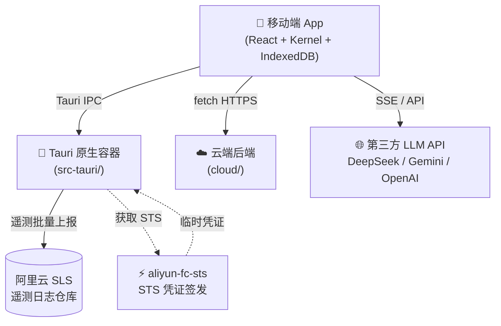
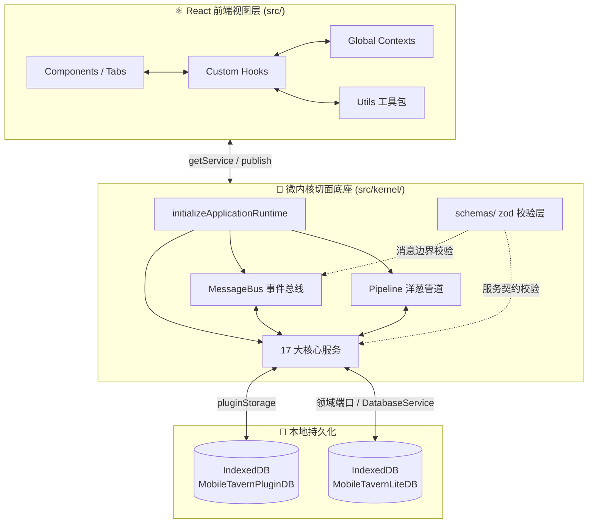
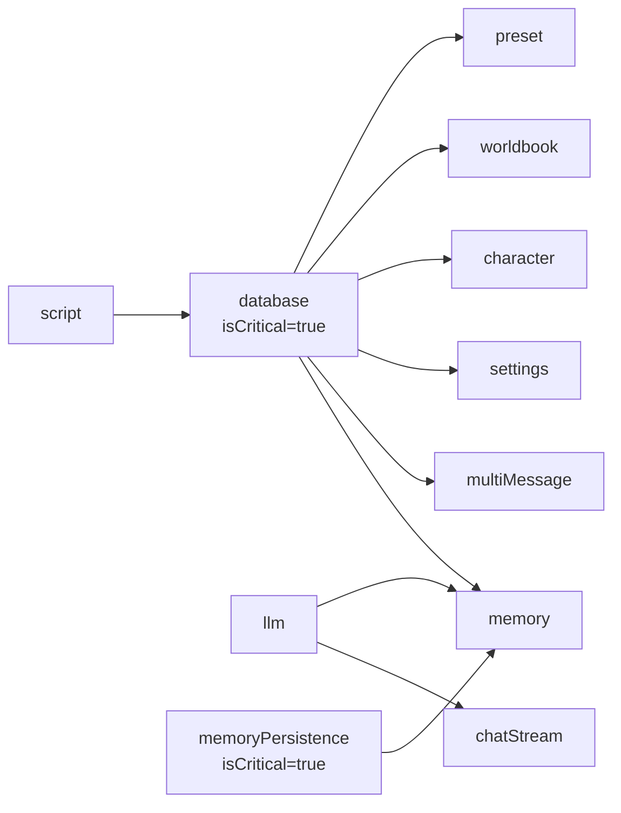

# Mobile Tavern Code Wiki

> **版本**：v1.7.4 | **生成日期**：2026-07-29 | **审查范围**：全仓库代码静态审查 + 隐性 Bug 与漏洞挖掘

> [!WARNING]
> 本文是基于 v1.7.4 的历史代码审查快照，不是当前产品定位、Runtime Plugin/Profile 架构或测试状态的权威说明。当前架构与进度请以 [`AGENTS.md`](../AGENTS.md)、[`docs/agents/architecture_entry.md`](agents/architecture_entry.md)、[`docs/agents/CURRENT_STATE.md`](agents/CURRENT_STATE.md) 和 [`插件式 Agent Runtime 与聊天组合路线`](agents/agent_plugin_runtime_roadmap.md) 为准；本文中的模块图、数量和旧路径不要直接用于新实现。
>
> 本文档基于对 `d:\projects\Mobile-Tavern` 仓库的全量代码审查生成,涵盖项目整体架构、主要模块职责、关键类与函数说明、依赖关系、运行方式,以及审查发现的问题缺陷和整体建议。

---

## 目录

- [1. 项目概览](#1-项目概览)
- [2. 项目整体架构](#2-项目整体架构)
- [3. 主要模块职责](#3-主要模块职责)
- [4. 关键类与函数说明](#4-关键类与函数说明)
- [5. 依赖关系](#5-依赖关系)
- [6. 项目运行方式](#6-项目运行方式)
- [7. 审查问题与缺陷](#7-审查问题与缺陷)
- [8. 大方向整体建议](#8-大方向整体建议)

---

## 1. 项目概览

### 1.1 项目定位

Mobile Tavern 是一款专为移动端深度定制的、高性能且轻量级的 AI 角色扮演(Roleplay)客户端。它并非桌面端 Silly Tavern 的全盘替代品,而是其在移动设备上的轻量化互补方案,聚焦于:

- 移动端手势触控、屏幕安全区自适应
- 底层高性能 IndexedDB 本地存储
- 极致的上下文缓存优化(Prefix Caching)
- 纯本地、零侵入、数据驱动的 SillyTavern 生态兼容

### 1.2 技术栈

| 层级 | 技术选型 |
|------|---------|
| 前端框架 | React 19 + TypeScript 5.8 |
| 构建工具 | Vite 6 |
| 原生容器 | Tauri v2 (Rust 后端) |
| 移动端目标 | Android 12+ (API 31+),iOS 计划中 |
| 本地存储 | IndexedDB (MobileTavernLiteDB v13 / MobileTavernPluginDB v2) |
| 云端后端 | Rust (axum) + PostgreSQL + Redis,独立部署于 `cloud/` |
| 样式 | TailwindCSS v4 + OKLCH 色彩体系 |
| 测试 | Vitest (单元) + Playwright (E2E) + 自定义集成测试套件 |
| 遥测 | 阿里云 SLS + STS 临时凭证 + HMAC-SHA1 签名 |
| 国际化 | 自研轻量方案,8 种语言 |

### 1.3 核心行为准则（摘要）

项目通过 [AGENTS.md](../AGENTS.md) 定义带稳定标识的核心铁律，其中与代码审查最相关的有：

- **`ARCH-KERNEL`**：Kernel 只含通用机制，不接收业务代码。
- **`ARCH-FLOW`**：存储、用例、React 状态和兼容运行时分层。
- **`COMPAT-DATA`**：SillyTavern 兼容保持无侵入、数据驱动。
- **`PLATFORM-MOBILE`**：移动端、云端与 Node 开发服务物理隔离。
- **`CONFIG-TRACKS`**：配置分轨、类型校验与秘密隔离。
- **`CHANGE-SAFE`**：变更先定义边界和测试，再安全接入。

---

## 2. 项目整体架构

### 2.1 物理分层总览

项目采用四层物理隔离架构,各层独立部署,通过明确边界契约通信:



### 2.2 移动端 App 内部三层结构



### 2.3 关键物理隔离边界

| 边界 | 隔离方式 | 数据通道 |
|------|----------|----------|
| React 前端 ↔ Kernel 微内核 | kernel 实例注入 / `getService` / `publish` | 同进程函数调用 |
| 记忆领域 ↔ IndexedDB | `MemoryPersistencePort` / `IndexedDbMemoryPersistenceService` | 端口—适配器调用 |
| 移动端 ↔ Tauri Rust 后端 | Tauri IPC `invoke` | 序列化消息 + Blob 文件路径 |
| 移动端 ↔ 云端后端 | HTTPS REST API | `cloud/` 代码物理隔离,不打入 APK |
| 移动端 ↔ 第三方 LLM | `apiClient` 自适应(原生直连 / Express 代理) | SSE 流式 HTTP |
| Tauri Rust ↔ 阿里云 SLS | STS 临时凭证 + HMAC-SHA1 签名 | HTTPS 批量上报 |
| 主 DB ↔ 插件 DB | 独立 IndexedDB 数据库 | `MobileTavernLiteDB` vs `MobileTavernPluginDB` |

### 2.4 核心数据流

1. **聊天主链路**:UI → `useChat` → `kernel.publish("chat:message_received")` → Pipeline 洋葱管道(敏感词 / 世界书 / MVU 脚本)→ `PromptService.assemblePrompt` → `LLMService.universalFetch` → SSE 字节流 → `ChatStreamService` 零丢包切分 → React 19 并发渲染。
2. **持久化链路**:Services → `DatabaseService` / `MemoryPersistencePort` → IndexedDB 分轨 Store(sessions / messages / memory_dict / memory_fragments);重启回载以最新优先读取分页,再由 `chatMessageHydration` 转换成界面时间正序。
3. **重发链路**:UI 同步事务锁 → 截断内存工作副本 → Prompt 与流式生成 → 附加状态快照 → `replaceSessionBranch` 按分支起点 `turnIndex` 清理旧尾部及派生记忆,在跨 Store 事务内一次提交新尾部;失败或取消恢复原会话,不产生中间态。
4. **遥测链路**:前端事件 → Tauri IPC → `telemetry_queue.jsonl` 本地落盘 → Rust 后台线程批量取 STS + HMAC 签名 → SLS 仓库。
5. **云端账号链路**:移动端 fetch HTTPS → `cloud/` 后端 axum 路由 → PostgreSQL(users / identities / refresh_tokens)+ Redis 会话。

### 2.5 目录结构

```text
Mobile-Tavern
├── src/                                  # 前端核心业务逻辑 (TypeScript)
│   ├── App.tsx                           # 启动流程管理与基础预设包定义
│   ├── UnifiedAppContext.tsx             # 统一状态选择器入口(useSyncExternalStore)
│   ├── components/                       # 共享 UI 容器(MainLayout / FloatingCat / ErrorBoundary)
│   │   ├── plugins/                      # 全屏插件运行器与插件管理
│   │   ├── presetForm/                   # Prompt 编排编辑器组件群
│   │   ├── memory-drawer/                # 记忆抽屉(Dict / Recall / TableMemory)
│   │   └── character-edit/               # 角色卡编辑(LoreEntry / Lorebook)
│   ├── composition/                      # 应用装配与扩展注册
│   ├── contexts/                         # React Context(App / Chat / Character / Kernel / Language)
│   ├── defaults/                         # 默认提示词模板
│   ├── domain/                           # 不依赖 React 与 IndexedDB 的纯业务规则
│   │   ├── chat/                         # 野牛模式概率计算
│   │   ├── conditions/                   # 变量表达式引擎
│   │   ├── memory/                       # 表格记忆 Schema
│   │   ├── plugins/                      # 插件包解析、宿主桥接、运行时文档
│   │   └── prompt-composition/           # Prompt 组装(中立领域模型)
│   ├── hooks/                            # 核心状态钩子
│   │   ├── useChat/                      # 聊天子 hook 群(sendMessage / reroll / sessionManager 等)
│   │   └── settings/                     # 设置子 hook 群(loader / persistence / api 等)
│   ├── infrastructure/                   # IndexedDB 物理基础设施适配器
│   │   ├── compat/sillytavern/           # SillyTavern 防腐层
│   │   ├── plugins/                      # 插件存储与内置插件
│   │   └── storage/                      # IDB 连接、Schema、写队列、Repository
│   ├── kernel/                           # 微内核切面底座
│   │   ├── Kernel.ts                     # Kernel 容器类(单例 globalKernel)
│   │   ├── types.ts                      # 全局微内核契约接口
│   │   ├── bootstrap/                    # 服务目录与批量注册
│   │   ├── schemas/                      # zod 运行时校验层(P0/P1 分级)
│   │   └── services/                     # 17+ 核心服务实现
│   │       ├── memory/                   # 长期记忆子系统(7 个子模块)
│   │       └── prompt/                   # Prompt 构建(Lorebook / Macro / Renderer)
│   ├── locales/                          # 8 种语言翻译资源
│   ├── services/                         # 应用服务(AR / pipeline / characterRender)
│   ├── tabs/                             # 主界面 Tab 板块
│   │   ├── chat/                         # 聊天面板(含 useChatScroll)
│   │   ├── playground/                   # 调试沙盒(Compiler / SseSimulator 等)
│   │   ├── settings/                     # 设置面板
│   │   └── worldbook/                    # 世界书面板
│   └── utils/                            # 底层工具(apiClient / cardParser / localDB / logger)
│
├── src-tauri/                            # Tauri 原生容器 (Rust)
│   ├── src/                              # lib.rs (入口) + telemetry.rs (SLS 上报引擎)
│   └── plugins/
│       ├── android-bridge/               # Android 原生桥接(状态栏 / Safe Area / 文件下载)
│       └── tavern-ar/                    # AR 桥接(已注释,暂缓上线)
│
├── cloud/                                # 云端后端 (Rust axum)
│   ├── src/
│   │   ├── account/                      # 账号(handlers / jwt / password / models)
│   │   ├── config.rs / db.rs / redis.rs  # 配置、PG 连接池、Redis
│   │   ├── health.rs / error.rs          # 健康检查、统一错误脱敏
│   │   └── main.rs                       # axum 路由装配
│   └── migrations/                       # PostgreSQL 迁移 SQL
│
├── shared/                               # 前后端共享类型(ts-rs 自动导出)
├── server.ts                             # 本地 Express CORS 中转代理服务
├── server/security.ts                    # SSRF 防御 + DNS 防重绑定
├── examples/                             # 内置插件示例(星渊终焉 / 夜雨试剑)
├── docs/                                 # 文档(架构、历史、指南)
└── scripts/                              # 构建/版本/i18n 脚本
```

---

## 3. 主要模块职责

### 3.1 微内核层 (src/kernel/)

#### 3.1.1 Kernel 容器 (Kernel.ts)

`Kernel` 类是整个微内核的核心,实现 `IKernel` 接口,提供四类 API:

| 类别 | 方法 | 说明 |
|------|------|------|
| 服务管理 | `registerService` / `registerServiceBatch` / `getService` / `hasService` / `destroyService` | 注册(单/批量拓扑排序)、获取(SafeProxy 降级)、销毁 |
| 管道管理 | `registerPipeline` / `getPipeline` | 洋葱模型中间件管道 |
| 扩展点 SPI | `registerExtension` / `getExtensions` | 插件扩展点 |
| 消息总线 | `subscribe` / `unsubscribe` / `publish` / `publishParallel` | 优先级订阅 + 串行/并行分发 |

**核心机制**:

- **拓扑排序注册** (`registerServiceBatch`):采用 Kahn 算法 BFS 拓扑排序,中途失败逆序销毁已注册项
- **三态 Pipeline 语义**:中间件必须显式调用 `next()` 或 `interrupt()`,生产环境异常终止管道
- **AbortController 全链路贯穿**:init 超时、destroy 超时、publish 超时、streamLlmResponse 取消均用 AbortSignal
- **SafeProxy 降级**:非关键服务缺失返回链式 noop 代理,防止前端崩溃
- **P0/P1 分级 Schema 校验**:P0(chatStream / script / database / memory / llm)走完整 zod schema,P1 仅校验基础结构

#### 3.1.2 服务目录与启动 (bootstrap/)

- `serviceCatalog.ts`:声明式服务目录,20 个服务条目(name + initTimeoutMs + load),`loadServiceModules` 用 `Promise.all` 并行装载
- `registerCoreServices.ts`:注册官方核心服务
- `registerDefaultPipelines.ts`:注册 input / output / settings 三个内置管道的标准中间件

#### 3.1.3 zod Schema 校验层 (schemas/)

- `p0Services.ts`:5 个 P0 服务的完整方法 schema + P1 服务名清单
- `messages.ts`:`IMessage` 顶层 schema + 2 个静态 topic payload schema + 动态 topic 前缀白名单(`tavern_helper:*`)
- `index.ts`:`validateService` / `validateMessage` / `validateServiceRetrieval` 纯函数 + `SAFE_PROXY_SYMBOL`
- **校验模式三态**:`strict`(抛错) / `warn`(去重日志) / `off`(跳过),默认 `warn`

#### 3.1.4 核心服务清单 (services/)

| 服务名 | 文件 | isCritical | dependencies | 职责 |
|--------|------|-----------|--------------|------|
| database | DatabaseService.ts | true | `["script"]` | IndexedDB 持久化门面,sessions/messages Store CRUD |
| llm | LLMService.ts | - | 无 | 大模型 HTTP/SSE 调用,含 Tauri 原生 fetch 与中转代理 |
| prompt | PromptService.ts | - | 无 | 提示词组装、宏替换、Lorebook 触发、Token 估算 |
| chatStream | ChatStreamService.ts | - | `["llm"]` | LLM SSE 流式响应 AsyncGenerator |
| script | ScriptService.ts | - | 无 | MVU 变量沙盒(tavernHelperBridge 防腐) |
| memory | memory/MemoryService.ts | - | `[database, llm, memoryPersistence]` | 记忆系统主入口,聚合 5 个子模块 |
| multiMessage | MultiMessageService.ts | - | `["database"]` | 用户消息入队持久化 |
| telemetry | TelemetryService.ts | - | 无 | 遥测日志构建与 Tauri IPC 上报 |
| settings | SettingsService.ts | false | `["database"]` | 用户设置读写 |
| character | CharacterService.ts | false | `["database"]` | 角色卡 CRUD |
| worldbook | WorldbookService.ts | false | `["database"]` | 世界书 CRUD |
| preset | PresetService.ts | false | `["database"]` | 采样器预设包读写 |
| workerPlugins | WorkerPluginService.ts | - | 无 | 受控 Web Worker 宿主(白名单 topic) |
| characterRender | CharacterRenderService.ts | false | 无 | 角色渲染管线(立绘/AR/悬浮助手) |
| tts / asr / bgm | TtsService.ts 等 | false | 无 | 语音合成 / 识别 / 背景音乐 |
| imageGen | ImageGenerationService.ts | false | 无 | AI 绘图代理 |
| updateCheck | UpdateCheckService.ts | false | 无 | 应用版本更新检查 |

#### 3.1.5 记忆子系统 (services/memory/)

| 子模块 | 职责 |
|--------|------|
| MemoryService | 主服务入口,init 时按顺序装配 storage→extractor→recall→stateTable→summary |
| MemoryStorage | IndexedDB 读写封装(4 个 Store);持有 `MemoryPersistencePort` 端口 |
| MemoryExtractor | 三级抽取:L0 LLM `<memory>` JSON / L1 词典正则 / L2 纯消息原文;队列调度(MAX_QUEUE_SIZE=3) |
| MemoryRecall | 标签倒排索引召回 + 时间衰减打分(半衰期 50 轮)+ Pin/Mute;30s TTL 缓存 |
| MemoryStateTable | 解析 AI `<table_update>` 指令;4 张默认表(关系/物品/位置/任务) |
| MemorySummary | 剧情时间线摘要卡片生成(默认 6 轮触发) |
| MemoryAudit | 只读审计快照构建(不写入 ChatSession) |
| MemoryStreamParser | 流式 `<memory>` 标签状态机解析器 |
| ModelCapabilityRegistry | 模型能力硬编码表 + 运行时自愈缓存 |

### 3.2 存储层 (src/infrastructure/storage/)

#### 3.2.1 数据库 Schema (dbSchema.ts)

**主库 `MobileTavernLiteDB` v13**,10 个 Object Store:

| Store | keyPath | 索引 | 用途 |
|-------|---------|------|------|
| characters | id | 无 | 角色卡完整数据 |
| character_catalog | id | 无 | 首屏轻量目录(v11 引入,v13 补 avatar) |
| sessions | id | characterId, createdAt | 会话元数据 |
| settings | (out-of-line) | 无 | 设置 + 大文本分轨 + crypto key |
| lorebooks | (out-of-line) | 无 | 全局世界书(v6 从 settings 拆出) |
| worldbooks | (out-of-line) | 无 | 自定义世界书集 |
| messages | id | sessionId, createdAt, tags(multiEntry), sessionId_createdAt, sessionId_turnIndex_createdAt | 对话消息物理分轨 |
| memory_dict | id | sessionId, entity | 会话级自动学习词典 |
| memory_fragments | id | sessionId, tags(multiEntry), status, sessionId_sourceTurnEnd | 事件型长期记忆 |
| memory_facts | id | sessionId, subject, object, tags(multiEntry), status, sessionId_subject_predicate | 实体关系图与时态事实 |

#### 3.2.2 连接管理 (idbConnection.ts)

- 模块级缓存 `dbInstance` + `dbOpenPromise`(防并发 open 触发 versionchange 互踢)
- `dbInstanceGeneration` 测试隔离计数器(解决前序测试遗留 pending open 覆盖 dbInstance 的竞态)
- `onversionchange` 主动 close() 响应外部版本升级
- `__resetConnectionForTesting` 显式 close 旧连接(避免幽灵连接阻塞后续升级)

#### 3.2.3 写入队列 (idbQueue.ts)

- **全局串行化 Promise 管道**:`writeQueue.then(queuedOperation)` 链式串行,捕获异常确保后续队列运行
- **同 key 写入合并** (`CoalescedSlot`):同 key pending 时替换 operation 保留 pendingPromise,第二次调用方返回新 Promise 监听 abort
- **AbortSignal 协作式中断**:`bindTransactionAbort` 注册 `transaction.onabort` 无条件 reject;`registerAbort` 提供主动 abort 能力
- **三路 race 超时熔断**:operation / 15s 超时 / signal abort 竞争,超时后主动 `transaction.abort()` 释放资源
- **MAX_WRITE_QUEUE_DEPTH=100** 安全网,超阈值上报遥测但不阻断

#### 3.2.4 Repository 模式 (repositories/)

- `charactersRepository.ts`:双 Store 事务写入 characters + character_catalog,`transaction.oncomplete` 判定成功
- `sessionsWriteRepository.ts`:5 Store 级联删除(sessions / messages / memory_dict / memory_fragments / memory_facts)
- `settingsRepository.ts`:大文本物理分轨(`user_settings_large_prompts`),`settled` 守卫防 resolve-after-reject,解密失败清空 apiKey(DATA-04)
- `settingsCrypto.ts`:AES-GCM 256,密钥持久化到 IndexedDB,`extractable: false`
- `lorebooksRepository.ts` / `worldbooksRepository.ts`:单条聚合记录,避免 N 次 IDB round-trip

#### 3.2.5 记忆持久化 (IndexedDbMemoryPersistenceService.ts + indexedDbMemoryStore.ts)

- `IndexedDbMemoryPersistenceService`:`isCritical = true`,纯委托类型转换 + signal 传导
- `replaceSessionBranch`:跨 5 Store(sessions / messages / memory_dict / memory_fragments / memory_facts)原子事务,先校准 `branchStartTurnIndex` 再 `sweepOldBranch` 游标清理；边界失效时失败关闭，任一步失败整体回滚

#### 3.2.6 完整性检查 (indexedDbIntegrityCheck.ts)

- 仅扫描不修复(单副本存储自动修复风险过高)
- 不阻断启动(返回 issues 供调用方决策)
- 幂等可重复调用

### 3.3 React 视图层

#### 3.3.1 Context 体系

```
App.tsx
  └─ KernelProvider(kernel)
      └─ LanguageProvider
          └─ AppContextAssembler (= LegacyAppContextProvider)
              ├─ AppProvider                       (AppContext: 路由 / 主题 / SafeArea / 对话框)
              │   └─ CharacterProvider              (CharacterContext: 角色卡 CRUD)
              │       └─ ChatProvider               (ChatContext: 会话列表 + 消息分页)
              │           └─ AppContextAssemblerInner
              │               ├─ useApp / useCharactersState / useChatState
              │               ├─ useSettings / useCharacters / useChat
              │               └─ UnifiedAppContext.Provider
```

- **useUnifiedApp selector 模式**:基于 `useSyncExternalStore` 的外部 store,字段级浅比较缓存,消费方应传入字段级 selector
- **chatMessageHydration**:`hydrateNewestFirstMessagePage` 将存储层"最新优先"分页结果翻转为 UI 时间正序

#### 3.3.2 核心 Hooks

| Hook | 文件 | 职责 |
|------|------|------|
| useChat | useChat.tsx | 薄壳聚合器,装配 7 个微服务 + 子 hook |
| useChatUI | useChat/useChatUI.ts | UI 状态、输入草稿、Bison 锁、流控 ref |
| useSessionManager | useChat/useSessionManager.ts | 会话/分支生命周期 |
| useSendMessage | useChat/useSendMessage.ts | 流式发送 + Bison 连续推进 |
| useRerollMessage | useChat/useRerollMessage.ts | 流式重新生成,共享 isSendingRef 锁 |
| useTimelineSummary | useChat/useTimelineSummary.ts | 时间轴摘要编辑 + 自动总结触发 |
| useSettings | settings/useSettings.ts | 组合根,装配 7 个设置子 hook |
| useSettingsPersistence | settings/useSettingsPersistence.ts | 写入队列串行化 + 防抖 + 页面隐藏 flush |
| useCatbot | useCatbot.ts | 雪团桌宠业务 |
| useCharacters | useCharacters.ts | 聚合 useCharacterEditor + useCharacterImportExport |

#### 3.3.3 重发事务流程 (useRerollMessage.ts)

```
1. 同步事务锁检查:if (p.isSendingRef.current) return;
2. 截断内存工作副本:
   - 目标定位基于全量消息列表(空正文但带思维链的已完成消息也可重发)
   - 用户消息重发:nextMsgsIdx = targetIdx + 1(保留该用户消息)
   - AI 消息重发:nextMsgsIdx = targetIdx(从该位置覆盖)
   - removedMessageIds = rawMessages.slice(nextMsgsIdx).map(m => m.id)
   - 重发截断到归档边界之前时,同步维护年表卡片与 lastSummarizedMessageId,避免边界悬空
   - Prompt 历史仍过滤占位符(💭...)与空正文,避免把空内容发送给模型
3. 立即更新 UI 工作副本(旧分支在 DB 中完整保留)
4. 流式生成:
   - 成功:runOutputPipelineAndSave → persistRerollSession → replaceSessionBranch(原子事务)
   - 空内容:恢复原始 session(尚未提交事务,DB 无变更)
   - 取消有内容:附加为完成消息保存
   - 取消无内容:恢复原始 session
   - 异常有内容:附加 CONNECTION_INTERRUPTED_SUFFIX 保存
   - 异常无内容:恢复原始 session + 弹窗报错
5. finally 兜底:清 streamingMessageId / pendingUpdateTimeout / abortController,仅当未调度 Bison 时释放锁
```

**10 轮折叠边界测试**:`tests/vitest/useRerollMessage.test.ts` 模拟 21 条消息(1 欢迎词 + 10 轮 user+assistant),验证重发后仍为 21 条、旧回复被覆盖、仅一次事务提交。

#### 3.3.4 关键组件

- **MainLayout.tsx**:`visualViewport.resize + window.resize` 双监听(覆盖 Android 16 `interactive-widget=resizes-content` 模式),`Math.min(vvp.height, innerHeight)` 高度计算,`useDeferredValue` 让旧 tab 在新 tab 加载期间继续可见
- **FloatingCat.tsx**:键盘检测阈值 `Math.min(innerHeight * 0.15, 100)`,长按 500ms 触发,模块级 `processedImageCache` 缓存 dataURL
- **AppErrorBoundary.tsx**:Class component,内联样式兜底(防 CSS 变量解析失败),`componentDidCatch` 上报遥测失败不阻塞渲染,`handleRetry = window.location.reload()`
- **useChatScroll.ts**:MutationObserver + ResizeObserver 自动归底,初始 600ms 窗口无条件归底,`pendingScrollPreserveRef` 加载更多时保持视觉锚点

### 3.4 插件系统

#### 3.4.1 .mtplugin 包格式 (packageParser.ts)

- 标准 ZIP,扩展名 `.mtplugin`,内含 `manifest.json` + 入口 HTML
- **大小限制**:压缩 ≤25MB / 解压 ≤100MB / 单文件 ≤32MB / 入口 HTML ≤2MB / manifest ≤64KB / 文件数 ≤512
- **ZIP 中央目录自校验**:直接解析 EOCD 签名,拒绝多磁盘/加密条目,仅允许 Store(0)/Deflate(8)
- **路径穿越防御**:拒绝 `\` / `\0` / 绝对路径 / `..` 段 / Windows 盘符
- **Manifest 校验**:id 正则 `^[a-z0-9]+(?:[.-][a-z0-9]+)+$`,version semver,权限白名单(llm.chat / context.read / chat.send 等)

#### 3.4.2 沙盒 iframe (FullscreenPluginRunner.tsx)

- `sandbox="allow-scripts"`(不含 `allow-same-origin`),iframe 加载 Blob URL 产生 opaque origin
- **CSP 注入**:`connect-src 'none'` 完全禁止网络,`default-src 'none'`,`script-src 'unsafe-inline'`
- **导航逃逸防御**:`loadedRef` 二次触发 `onLoad` 即判定为导航逃逸
- **链接与表单拦截**:bridge 注入 `click` / `submit` 事件 preventDefault

#### 3.4.3 Plugin Host RPC (pluginHostRpc.ts + runtimeDocument.ts)

- **协议消息**:`{ mtPlugin: 1, channel: UUID, pluginId, requestId, method, params }`
- **四元组校验**:`mtPlugin === 1` + `channel` + `pluginId` + `event.source !== iframeRef.current?.contentWindow`
- **Plugin API**:`ready / exit / setOrientation / save / load / deleteSave / context.get / chat.injectAction / chat.send / llm.chat / llm.chatStream / llm.listPresets`
- **权限网关**:`requirePermission` 校验 `permissions` 数组
- **上下文脱敏**:仅暴露 character.id/name/description 等,不暴露 messages/API key/settings,`deepFreeze` 递归冻结
- **输入清洗**:文本上限 4000 字符,拒绝控制字符

#### 3.4.4 插件存储 (pluginStorage.ts)

- **独立 DB**:`MobileTavernPluginDB` v2,与主库物理隔离
- **三 Store**:`packages`(元数据,不含字节) / `packageFiles`(字节) / `saves`(存档,key=`${pluginId}:${slot}`)
- **v1→v2 迁移**:将 packages 残留 files 字段拆到 packageFiles,用 `packages.put` 而非 `cursor.update`(避免 InvalidStateError)
- **存档隔离**:slot 正则 `^[a-zA-Z0-9_-]{1,64}$`,JSON ≤1MB
- **内置插件**:`builtinPlugins.ts` 通过 Vite `?url` 后缀独立打包,两段式加载(首页只读 manifest,点击运行才 fetch 完整资源)

#### 3.4.5 Blob URL 生命周期 (runtimeDocument.ts)

- `createPluginRuntimeDocument` 维护 `createdUrls: string[]`,所有 Blob URL 登记
- `revoke()` 统一释放,异常路径也释放
- **FullscreenPluginRunner 双重保护**:`cancelled` 标志处理竞态,cleanup 时立即 revoke
- **流式 AbortController**:`pendingStreamsRef` Map,cleanup 时统一 abort

### 3.5 安全层

#### 3.5.1 SSRF 防御 (server/security.ts)

- `isPrivateIp(ip)`:IPv4 + IPv6 统一处理,检测 Loopback / Private A/B/C / Link-local / Broadcast / IPv6 Unique Local / IPv4-mapped IPv6
- `validateBaseUrlSecurity`:`dns.lookup` 获取所有 A/AAAA 记录,任一私网 IP 即拒绝,通过校验的首个 IP 写入 `dnsCache`
- **DNS 防重绑定**:hijack 全局 `dns.lookup`,后续对同一 hostname 的请求返回缓存 IP
- **IPv4-in-IPv6 检测**:处理 `::ffff:127.0.0.1` / `::127.0.0.1` 形式

#### 3.5.2 Express 代理安全 (server.ts)

- SSRF Guard 中间件应用于 `/api/test-connection` / `/api/proxy/openai` / `/api/proxy/models`
- 敏感数据脱敏:日志中 `sk-*` / `sk-ant-*` / `Authorization: Bearer xxx` 替换为 `[MASKED_KEY]`
- OpenAI 标准参数白名单:剔除 `top_k` / `min_p` / `repetition_penalty` 等非标参数
- 流式响应 AbortController:`res.on("close", () => controller.abort())`
- Token 签发:HMAC-SHA256 + AES-256-GCM,`crypto.timingSafeEqual` 防时序攻击
- 更新检查限流:IP 令牌桶每分钟 10 次 + 5 分钟时间戳防重放

#### 3.5.3 Tauri 全局 CSP (tauri.conf.json)

```
default-src 'self';
script-src 'self' 'unsafe-inline' 'unsafe-eval';
connect-src 'self' https: data: http://127.0.0.1:* http://localhost:* ws://127.0.0.1:* ws://localhost:*;
frame-src 'self' blob: data:;
```

### 3.6 Tauri 原生桥接

#### 3.6.1 入口装配 (src-tauri/src/lib.rs)

- `.plugin(tauri_plugin_http::init())` / `.plugin(tauri_plugin_android_bridge::init())`
- AR 插件已注释(暂缓上线,彻底剥离相机权限)
- panic 钩子落盘 + 遥测后台线程启动
- `ExitRequested` / `Exit` 事件发送 shutdown 信号

#### 3.6.2 Android 桥接 (android-bridge)

- **状态栏变色**:`setStatusBarStyle(isDark, colorHex)` + `MainActivity` 冷启动持久化(避免白闪)
- **Safe Area 实时同步**:`WindowInsets` 监听 → `androidSafeAreasChanged` CustomEvent
- **Blob 下载拦截**:Android 10+ 用 `MediaStore.Downloads`(无需权限),`IS_PENDING` 标志防半成品,`sanitizeFileName` 防路径穿越
- **键盘避让**:配合前端 `interactive-widget=resizes-content`

#### 3.6.3 遥测引擎 (telemetry.rs)

- **本地落盘**:`telemetry_queue.jsonl`,`FILE_MUTEX` 串行化
- **Panic 钩子**:独立 `PANIC_QUEUE_PATH`,`try_lock` 避免死锁
- **STS 凭证**:GET `https://mobile-xmkoxkjshe.cn-hangzhou.fcapp.run`,缓存 50 分钟
- **SLS 签名**:HMAC-SHA1,Canonicalized SLS Headers + Resource,Base64 编码
- **后台循环**:基础 15s,失败指数退避至 300s,每批 20 条,`tokio::select!` 打断退避与网络请求

### 3.7 云端后端 (cloud/)

#### 3.7.1 axum 路由

```rust
Router::new()
    .route("/health", get(health::health_check))
    .route("/health/deep", get(health::deep_health_check))
    .merge(account::router())  // /account/{register,login,refresh,logout}
    .layer(cors_layer)
    .layer(TraceLayer::new_for_http())
```

#### 3.7.2 账号体系

- **users 表**:id / email(UNIQUE) / password_hash / email_verified / display_name / is_active
- **identities 表**:provider CHECK('email', 'google'),UNIQUE(provider, provider_user_id)
- **refresh_tokens 表**:jti PK / user_id / expires_at / revoked_at / user_agent / ip_address,3 个索引(含 `revoked_at WHERE revoked_at IS NULL` 部分索引)

#### 3.7.3 JWT 与密码

- **JWT**:HS256,access(24h) + refresh(30d) 共用密钥,claims 含 `token_type` 严格匹配
- **轮换机制**:校验 → 撤销旧 jti → Redis 黑名单(TTL=剩余有效期) → 签发新 token 对
- **密码哈希**:argon2id(OWASP 推荐),`SaltString::generate(&mut OsRng)` 每次独立盐
- **登录防用户枚举**:邮箱不存在 / 密码错误 / 账号停用统一返回 `InvalidCredentials`
- **登出幂等**:即使 token 无效也返回 200

#### 3.7.4 PostgreSQL + Redis

- PgPool:max_connections=10 / min_connections=1 / acquire_timeout=30s,`sqlx::migrate!` 编译期嵌入
- Redis:`ConnectionManager` 单连接 + 自动重连,JWT 黑名单 key=`revoked:refresh:{jti}`
- 健康检查:`/health` 浅层(仅进程),`/health/deep` 深度(DB SELECT 1 + Redis PING)
- 错误统一脱敏:5xx → "内部错误,请稍后重试",4xx 透传 message

---

## 4. 关键类与函数说明

### 4.1 Kernel 主类 (Kernel.ts)

```typescript
export class Kernel implements IKernel {
  // 服务管理
  async registerService(name: string, service: IKernelService, initTimeoutMs?: number): Promise<void>;
  async registerServiceBatch(entries: Array<{ name; service; initTimeoutMs? }>): Promise<void>;
  getService<T extends IKernelService>(name: string): T;  // 关键服务缺失 throw,非关键返回 SafeProxy
  hasService(name: string): boolean;
  async destroyService(name: string): Promise<void>;  // 5s 超时,失败仅记日志

  // 管道
  registerPipeline<T = any>(name: string): IPipeline<T>;
  getPipeline<T = any>(name: string): IPipeline<T>;

  // 消息总线
  subscribe(topic, handler, priority?): () => void;
  async publish(message: IMessage): Promise<void>;        // 串行,5s 超时熔断
  async publishParallel(message: IMessage): Promise<void>; // Promise.allSettled

  // 生命周期
  inspect(): { services, pipelines, extensions };
  async destroy(): Promise<void>;  // 逆序销毁所有服务
}

export function createKernel(): Kernel;     // 工厂函数(测试隔离)
export const globalKernel: Kernel;          // 全局单例
export function setKernelStrictMode(val: boolean): void;
export function setKernelServiceValidationMode(mode: "strict" | "warn" | "off"): void;
```

### 4.2 核心服务签名(精简)

```typescript
// DatabaseService
class DatabaseService implements IDatabaseService {
  name = "database"; isCritical = true; dependencies = ["script"];
  getAllSessions(): Promise<ChatSession[]>;
  getSessionById(id): Promise<ChatSession | null>;
  getSessionMessageWindow(sessionId, options): Promise<{ messages: Message[]; hasMore: boolean }>;
  getSessionPromptMessages(sessionId, options): Promise<Message[]>;
  updateSessionMetadata(sessionId, patch, signal?, traceId?): Promise<void>;
  appendSessionMessage(sessionId, message, turnIndex?, signal?, traceId?): Promise<void>;
  commitSessionTurn(sessionId, patch, messages, signal?, traceId?): Promise<void>;
  deleteSessionMessage(sessionId, messageId, signal?): Promise<ChatSession>;
  replaceSessionBranch(session, removedMessageIds, newMessages, signal?): Promise<void>;
  createNewSession(character, starterMessage?, initialSuggestions?): Promise<ChatSession>;
  // 其余方法见 IDatabaseService 权威契约
}

// LLMService
class LLMService implements ILLMService {
  name = "llm";
  universalFetch(endpoint, proxyPayload, customSignal?, traceId?): Promise<Response>;
  isClientMode(): boolean;
  sendCatbotRequest(content, history, clientContext?, traceId?): Promise<{ reply, expression }>;
}

// PromptService
class PromptService implements IPromptService {
  name = "prompt";
  assemblePrompt(params): { systemInstruction, history, dynamicInstruction, userInput?, messages?, diagnostics?, traces?, budget? };
  estimateTokens(text): number;  // ASCII 0.25 倍率 + 非 ASCII 2.0 倍率
  getTriggeredLorebookEntries(messages, userInput, entries, maxRecursionDepth?, conditionContext?): LorebookEntry[];
  replaceMacros(text, params): string;
}

// ChatStreamService
class ChatStreamService implements IChatStreamService {
  name = "chatStream"; dependencies = ["llm"];
  async *streamLlmResponse(params: StreamParams): AsyncGenerator<StreamChunk, void, unknown>;
}

// MemoryService
class MemoryService implements IMemoryService {
  name = "memory"; dependencies = [Database, LLM, MEMORY_PERSISTENCE_SERVICE];
  async init(kernel, signal?): Promise<void>;
  getStorage(): MemoryStorage;
  getExtractor(): MemoryExtractor;
  getRecall(): MemoryRecall;
  getStateTable(): MemoryStateTable;
  getSummary(): MemorySummary;
}

// WorkerPluginService
class WorkerPluginService implements IWorkerPluginService {
  name = "workerPlugins";
  register(definition: WorkerPluginDefinition): void;  // allowedIncomingTopics 白名单
  unregister(id: string): void;
  post(id, topic, payload: unknown): void;
}
```

### 4.3 存储层关键函数

```typescript
// idbConnection.ts
function getDB(): Promise<IDBDatabase>;
function __resetConnectionForTesting(): Promise<void>;

// idbQueue.ts
function enqueueWrite<T>(key: string, operation: (ctx: WriteContext) => Promise<T>, signal?: AbortSignal): Promise<T>;
interface WriteContext {
  registerAbort: (fn: () => void) => void;
  aborted: boolean;
}

// indexedDbMemoryStore.ts
function replaceSessionBranch(session, removedMessageIds, newMessages, signal?): Promise<void>;
function getMessagesBySession(sessionId, options: { limit?, offset?, descending? }, signal?): Promise<MessageRecord[]>;

// dbSchema.ts
function applyDbSchema(db: IDBDatabase, oldVersion: number, transaction: IDBTransaction): void;
function toCharacterCatalogRecord(character: CharacterCard): CharacterCatalogRecord;
function toSessionStorageRecord(session: ChatSession): SessionStorageRecord;

// pluginStorage.ts
function installPlugin(plugin: InstalledFullscreenPlugin): Promise<void>;
function listInstalledPlugins(): Promise<InstalledPluginMetadata[]>;
function loadPluginFiles(pluginId: string): Promise<Record<string, Uint8Array> | null>;
function savePluginData(pluginId, slot, data): Promise<void>;
```

### 4.4 React 层关键函数

```typescript
// UnifiedAppContext.tsx
function useUnifiedApp<TSelected>(selector: (state: AppState) => TSelected): TSelected;

// chatMessageHydration.ts
function hydrateNewestFirstMessagePage(records: MessageRecord[]): Message[];

// useChat/useRerollMessage.ts
function useRerollMessage(params: RerollMessageParams): {
  handleRerollLast: () => Promise<void>;
  handleRerollMessage: (targetMsg: Message) => Promise<void>;
};

// useChat/helpers/streamHelpers.ts
function buildThrottledUpdater(...): { update, flush };  // 60ms 节流
function recallWithTimeout(recallFn, timeoutMs = 3000): Promise<MemoryFragment[]>;

// components/plugins/FullscreenPluginRunner.tsx
function createPluginRuntimeDocument(plugin, channel): Promise<PluginRuntimeDocument>;
```

### 4.5 安全与插件关键函数

```typescript
// server/security.ts
function isPrivateIp(ip: string): boolean;
function validateBaseUrlSecurity(baseUrl: string): Promise<void>;

// domain/plugins/packageParser.ts
function parsePluginPackage(data: Uint8Array): Promise<InstalledFullscreenPlugin>;
function validateManifest(manifest: unknown): PluginManifest;

// domain/plugins/pluginHostRpc.ts
function dispatchPluginHostRequest(message, deps): Promise<unknown>;
function requirePermission(permissions: string[], required: string): void;
function createReadonlyPluginContext(character, session): ReadonlyPluginContext;

// domain/prompt-composition/compiler.ts
function compilePromptComposition(composition, runtime, options): CompileResult;
function selectHistory(messages, selection): Message[];
```

---

## 5. 依赖关系

### 5.1 服务依赖图



### 5.2 关键 npm 依赖

| 依赖 | 用途 |
|------|------|
| react@19 / react-dom@19 | 前端框架(Concurrent Mode) |
| @tauri-apps/api@2 / @tauri-apps/plugin-http@2 | Tauri IPC 与原生 HTTP |
| zod@3 | Kernel 运行时 schema 校验 |
| fflate@0.8 | PNG 角色卡 Zlib 解压 + 插件 ZIP 解压 |
| express@4 | 本地 CORS 中转代理 |
| motion@12 | 动画(FloatingCat 等) |
| @tanstack/react-virtual@3 | 虚拟滚动 |
| jsonrepair@3 | JSON 修复(角色卡容错) |
| mathjs@15 | 变量表达式引擎 |
| compare-versions@6 | 版本比较(热更新) |
| pixi.js@8 | 内置插件游戏引擎(devDependency) |
| vitest@2 / @playwright/test@1 | 测试框架 |

### 5.3 Rust 依赖(src-tauri/Cargo.toml)

- `tauri@2` + `tauri-plugin-http`
- `serde` / `serde_json`(序列化)
- `tokio`(异步运行时,遥测后台线程)
- `reqwest`(STS 凭证 + SLS 上报)
- `md-5` / `hmac` / `sha1` / `base64`(SLS 签名)
- `chrono`(RFC 1123 日期)

### 5.4 云端依赖(cloud/Cargo.toml)

- `axum`(Web 框架)
- `sqlx`(PostgreSQL,编译期 SQL 校验)
- `redis`(ConnectionManager)
- `jsonwebtoken`(JWT)
- `argon2`(密码哈希)
- `tower-http`(CORS / Trace)

---

## 6. 项目运行方式

### 6.1 环境要求

- Node.js ≥ 18(推荐 20+)
- Rust toolchain(stable)
- Android Studio(Android 打包)
- JDK 17(Android 构建)

### 6.2 本地开发调试

```powershell
# 安装依赖
npm install

# 启动 Express 中转代理 + Vite dev server
npm run dev
# 浏览器访问控制台提示的本地服务地址(默认 http://localhost:3000)
```

### 6.3 Android 真机调试

```powershell
# 端口反向映射(热重载)
adb reverse tcp:3000 tcp:3000
adb reverse tcp:24678 tcp:24678

# 启动 Android dev(绑定 127.0.0.1 避免 TUN 代理死锁)
npm run dev:android
# 等价于:node scripts/decode_icon.cjs && tauri android dev --host 127.0.0.1
```

### 6.4 类型检查与测试

```powershell
# TypeScript 静态类型校验
npm run lint

# 自定义集成测试套件(80 组功能套件)
npm run test

# Vitest 单元测试(348+ 断言)
npm run test:unit

# Playwright E2E
npm run test:e2e

# 压力测试
npm run test:stress:mock  # mock LLM server
npm run test:stress:http  # HTTP stress
```

### 6.5 生产打包

```powershell
# Android APK 打包(剥离 Node/Express)
npm run build:android

# 前端构建 + Express 服务端打包
npm run build
# 等价于:npm run build:examples && vite build && esbuild server.ts --bundle --platform=node --format=cjs

# 版本号同步修改(自动更新 Vite/Tauri/Rust/文档)
npm run bump-version <new_version>
```

### 6.6 云端后端部署

```powershell
cd cloud
# 配置环境变量(参考 .env.example)
cp .env.example .env

# Docker 容器化部署
docker-compose up -d
# 自动执行 PostgreSQL 迁移,监听 0.0.0.0:8080
```

### 6.7 内置插件构建

```powershell
# PixiJS 竞技场示例
npm run build:example:pixi

# 星渊裂隙示例
npm run build:example:astral

# 一键构建所有示例
npm run build:examples
```

---

## 7. 审查问题与缺陷

### 7.1 高优先级 Bug(P0,建议立即修复)

> **状态**:✅ 全部已修复 (2026-07-29)

#### 7.1.1 IndexedDB 写操作 Promise resolve 时机过早

> **状态**:✅ 已修复 — `indexedDbMemoryStore.ts` 所有 readwrite 事务统一改为 `transaction.oncomplete` resolve;`idbQueue.ts` 提供标准 helper 封装该模式。

**位置**:[indexedDbMemoryStore.ts](file:///d:/projects/Mobile-Tavern/src/infrastructure/storage/indexedDbMemoryStore.ts) L70-107 `appendMessage`、L142-144 `updateMessageExtraction`

**问题**:`appendMessage` 在 `request.onsuccess` 即 resolve Promise,早于 `transaction.oncomplete`。IDB 规范中 `onsuccess` 仅表示请求入队成功,不保证事务 commit。commit 前 `QuotaExceededError` 会 abort 但 Promise 已 resolve,调用方误以为成功。跨事务的后续读操作可能读不到最新数据(这是 `updateMessageExtraction` 中 `if (!existing) { resolve(); return; }` 兜底逻辑存在的根因)。

**影响**:数据丢失风险,跨事务时序竞态。

**修复建议**:统一将所有写操作的 Promise resolve 点改为 `transaction.oncomplete`,`request.onsuccess` 仅用于触发后续逻辑。

#### 7.1.2 useSessionManager.selectCharacter 锁检查不一致

> **状态**:✅ 已修复 — `selectCharacter` 统一使用 `isSendingRef.current` 作为锁检查入口,与 `createNewBranch` 一致。

**位置**:[useSessionManager.ts](file:///d:/projects/Mobile-Tavern/src/hooks/useChat/useSessionManager.ts) L83

**问题**:`selectCharacter` 仅检查 `isSending` state 未检查 `isSendingRef.current`,与 `createNewBranch` 不一致。React state 异步更新,存在"旧 state 显示 false 但 ref 已 true"的窗口,可能绕过锁检查启动并行操作。

**影响**:并发会话切换导致流式请求残留。

**修复建议**:统一使用 `isSendingRef.current` 作为锁检查入口。

#### 7.1.3 getKernelService 引用不稳定导致 BGM 反复重启

> **状态**:✅ 已修复 — `getKernelService` 单独 `useMemo(() => kernel.getService.bind(kernel), [kernel])` 稳定化,不再随 `appContextValue` 重建。

**位置**:[ChatTab.tsx](file:///d:/projects/Mobile-Tavern/src/tabs/chat/ChatTab.tsx) L113-122 + [LegacyAppContextProvider.tsx](file:///d:/projects/Mobile-Tavern/src/contexts/LegacyAppContextProvider.tsx) L218

**问题**:`getKernelService = kernel.getService.bind(kernel)` 作为 `appContextValue` 字段,而 `appContextValue` useMemo deps 包含 `chatHook` 等频繁变化的对象,导致 `getKernelService` 引用变化 → BGM effect 反复触发 → 音乐反复重启。

**影响**:严重用户体验问题,BGM 播放中断。

**修复建议**:将 `getKernelService` 单独 `useMemo(() => kernel.getService.bind(kernel), [kernel])` 稳定化。

#### 7.1.4 getStoredSettings 嵌套 async onsuccess 跨事务潜在死锁

> **状态**:✅ 已修复 — `getOrCreateCryptoKey` 调用移到 readonly 事务外,先获取 key 再开读事务,消除嵌套跨事务死锁风险。

**位置**:[settingsRepository.ts](file:///d:/projects/Mobile-Tavern/src/infrastructure/storage/repositories/settingsRepository.ts) L58-148

**问题**:`request.onsuccess` 是 async 函数,在 `await getOrCreateCryptoKey(db)` 期间原 readonly 事务可能已自动提交。`getOrCreateCryptoKey` 首次时会启动 readwrite 事务写入 `api_crypto_key`,与原 readonly 事务在同一 db 上,理论上可能死锁。readonly 不走 enqueueWrite,无 15s 超时保护。

**影响**:设置加载永久挂起。

**修复建议**:将 `getOrCreateCryptoKey` 调用移到 readonly 事务外,先获取 key 再开读事务。

### 7.2 中优先级 Bug(P1,建议尽快修复)

> **状态**:✅ 全部已修复 (2026-07-29)

#### 7.2.1 v12 数据迁移失败重启后 turnIndex 错乱

> **状态**:✅ 已修复 — 迁移前检查消息是否已有 turnIndex,已存在则跳过,避免覆盖已修复值。

**位置**:[dbSchema.ts](file:///d:/projects/Mobile-Tavern/src/infrastructure/storage/dbSchema.ts) L183-201

**问题**:v12 迁移用内存 `nextTurnBySession` Map 分配 turnIndex,若迁移中途异常,部分消息已修复 turnIndex,重启后重新遍历会**覆盖已修复的 turnIndex**(因为 Map 重置为 0),导致 turnIndex 错乱。

**影响**:历史消息顺序错乱,重发分支边界错误。

**修复建议**:迁移前检查消息是否已有 turnIndex,已存在则跳过;或迁移完成后写入标记记录,重启时检测标记跳过迁移。

#### 7.2.2 useSessionManager 全部 useCallback 依赖 [p] 形同虚设

> **状态**:✅ 已修复 — useCallback 依赖改为解构具体字段(如 `[p.activeCharacter, p.sessions, p.settings]`),函数引用稳定。

**位置**:[useSessionManager.ts](file:///d:/projects/Mobile-Tavern/src/hooks/useChat/useSessionManager.ts) L74, 121, 142, 168, 192, 217

**问题**:`p` 是 `SessionManagerParams` 对象,每次渲染都是新引用,导致所有 useCallback 每次都重建函数引用,下游 useMemo/useEffect 依赖这些函数时全部失效。

**影响**:性能损耗,潜在无限重渲染。

**修复建议**:解构依赖,如 `[p.activeCharacter, p.sessions, p.settings, ...]`。

#### 7.2.3 pluginStorage v1→v2 迁移 cursor 异常未处理

> **状态**:✅ 已修复 — `cursor.update` 改为 `packages.put` 避免 InvalidStateError;各 put 注册 onerror;cursor 注册 onerror。

**位置**:[pluginStorage.ts](file:///d:/projects/Mobile-Tavern/src/infrastructure/plugins/pluginStorage.ts) L118-131

**问题**:`packageFiles.put` 与 `packages.put` 都未注册 onerror。若失败(QuotaExceededError),事务 abort,但 cursor 的 onsuccess 仍会触发,`cursor.continue()` 在已 abort 事务上抛 InvalidStateError,异常逃逸为 unhandled rejection。

**影响**:迁移中途失败时异常未捕获。

**修复建议**:添加 cursor.onerror 与各 put 的 onerror。

#### 7.2.4 AbortSignal.any 兼容性回退丢失超时保护

> **状态**:✅ 已修复 — 不支持 `AbortSignal.any` 时手动组合多个 signal 的 abort 事件,保留 5 分钟超时保护。

**位置**:[LLMService.ts](file:///d:/projects/Mobile-Tavern/src/application/services/LLMService.ts) L166-176

**问题**:若运行环境不支持 `AbortSignal.any`(旧 WebView),外部传入 `customSignal` 时会丢失 5 分钟超时保护,可能导致 LLM 调用永久挂起。

**影响**:LLM 调用挂起。

**修复建议**:polyfill `AbortSignal.any`,或手动组合多个 signal 的 abort 事件。

#### 7.2.5 Kernel destroy 逆序销毁假设依赖 registerServiceBatch 拓扑顺序

> **状态**:✅ 已修复 — 新增 `computeDestroyOrder()` 基于 Kahn BFS 按依赖出度计算拓扑逆序销毁;循环依赖兜底按注册逆序追加;单注册路径同样受保障。测试覆盖见 `kernelDestroyOrder.test.ts`(6 个用例)。

**位置**:[Kernel.ts](file:///d:/projects/Mobile-Tavern/src/kernel/Kernel.ts) L861-L890

**问题**:`Map.keys()` 的顺序是插入顺序,依赖 `registerServiceBatch` 按拓扑排序串行注册。若使用方在 bootstrap 后又通过单个 `registerService` 手动注册新服务,该服务的依赖顺序不再受拓扑保障,逆序销毁可能先销毁底层服务。

**影响**:自定义服务 destroy 时访问已销毁依赖崩溃。

**修复建议**:在 `destroy()` 中显式按 `dependencies` 反向拓扑排序销毁。

#### 7.2.6 getOrCreateCryptoKey put 失败仍 resolve 导致数据丢失链

> **状态**:✅ 已修复 — put 失败时 reject,上层感知并提示用户清理存储空间,不再静默返回内存 key。

**位置**:[settingsCrypto.ts](file:///d:/projects/Mobile-Tavern/src/infrastructure/storage/settingsCrypto.ts) L49-52

**问题**:若 `api_crypto_key` 写入失败(QuotaExceededError),仍 resolve 内存中的 newKey。重启后 cryptoKey 丢失,已加密的 apiKey 无法解密,触发 `getStoredSettings` 的清空逻辑,所有 apiKey 永久丢失。

**影响**:用户需重新输入所有 API key。

**修复建议**:put 失败时 reject,让上层感知并提示用户清理存储空间。

#### 7.2.7 useChat.tsx 异步消息/元数据落盘未保护卸载后状态更新

> **状态**:✅ 已修复 — 新增 `isMountedRef` 守卫，异步落盘的 `.then` 回调在卸载后仅放行数据落盘，不再更新 React state。

**位置**:[useChat.tsx](file:///d:/projects/Mobile-Tavern/src/hooks/useChat.tsx) L196-202, L223-229

**问题**:开场白同步、tableMemory 初始化等 effect 中的消息事务或元数据更新为 fire-and-forget，Promise 完成后组件可能已卸载，界面更新会触发 React 警告。

**影响**:React 警告,潜在内存泄漏。

**修复建议**:使用 `isMountedRef` 保护或 AbortController 取消。

### 7.3 低优先级 Bug(P2,建议择机修复)

> **状态**:7.3.1~7.3.4 ✅ 已修复 (2026-07-29);7.3.5 及之后待处理

#### 7.3.1 SafeProxy 掩盖真实错误

> **状态**:✅ 已修复 — 关键业务路径(`PromptService.assemblePrompt`)改用 `kernel.hasService` 显式判断;SafeProxy 新增访问计数器与阈值遥测(`safe_proxy_threshold_exceeded`);`Kernel.destroy` 调用 `resetSafeProxyState()` 清理模块级状态。

**位置**:[Kernel.ts](file:///d:/projects/Mobile-Tavern/src/kernel/Kernel.ts) L446-474

**问题**:非关键服务缺失或 init 失败时返回 SafeProxy,仅打印一次 warning。前端组件长时间处于"看似工作但功能失效"状态,难以定位。`warnedServices` Set 与 `safeProxyCache` Map 永不清理,HMR 后残留。

**影响**:功能静默失效,排障困难。

**修复建议**:关键业务路径使用 `hasService` 显式判断;增加 SafeProxy 接管次数遥测阈值告警;HMR 时清理模块级容器。

#### 7.3.2 AbortSignal 事件监听器累积

> **状态**:✅ 已修复 — `ChatStreamService` 的 `handleAbortAction` 在 generator `finally` 块中 `removeEventListener`;`init()` 注册的服务级监听器在 `destroy()` 中移除,避免外部 signal 复用时累积。

**位置**:[Kernel.ts](file:///d:/projects/Mobile-Tavern/src/kernel/Kernel.ts) L652-659 `publish`;[ChatStreamService.ts](file:///d:/projects/Mobile-Tavern/src/application/services/ChatStreamService.ts) L67-69

**问题**:`publish` 中 `{ once: true }` 保证监听器在 abort 触发后自动移除,但若 handler 正常完成、signal 从未 abort,监听器会一直挂着。高频发布场景下累积。`ChatStreamService` 的 `handleAbortAction` 未在 finally 中 removeEventListener。

**影响**:内存泄漏(轻微)。

**修复建议**:handler 完成后主动 removeEventListener;或用 `AbortSignal.any` 组合后统一监听。

#### 7.3.3 loadCharacterById 异步操作后未检查 isMountedRef

> **状态**:✅ 已修复 — `loadCharacterById` 在 `setCharacters` 前添加 `if (isMountedRef.current)` 检查,避免卸载后状态更新泄漏。

**位置**:[CharacterContext.tsx](file:///d:/projects/Mobile-Tavern/src/contexts/CharacterContext.tsx) L126-136

**问题**:其他方法(如 `loadCharacters`)都做了 `isMountedRef.current` 检查,唯独 `loadCharacterById` 漏检。

**修复建议**:补充 `if (!isMountedRef.current) return null;` 检查。

#### 7.3.4 triggerScroll setTimeout 未在卸载时清理

> **状态**:✅ 已修复 — 新增 `scrollTimerRef` 跟踪 setTimeout ID,在 `useEffect` cleanup 中 `clearTimeout`,`triggerScroll` 每次调用前清理上一次未完成的 timer。

**位置**:[useChatUI.ts](file:///d:/projects/Mobile-Tavern/src/hooks/useChat/useChatUI.ts) L142

**问题**:setTimeout 100ms 后才执行,组件卸载后仍执行,访问已卸载 DOM。

**修复建议**:持 timer ref 并在卸载时清理。

#### 7.3.5 SSRF 重定向未拦截

**位置**:[server.ts](file:///d:/projects/Mobile-Tavern/server.ts) `fetch(targetUrl, ...)` 默认 `redirect: "follow"`

**问题**:攻击者可让合法公网 URL 返回 302 重定向到 `http://127.0.0.1/...`,Node.js fetch 会跟随,且重定向后的请求不会重新触发 `dnsCache` 校验(因为重定向到 IP 字面量不触发 `dns.lookup`)。

**修复建议**:fetch 调用显式 `redirect: "manual"` 并校验 Location 头,或使用自定义 agent 拦截重定向到私网 IP。

#### 7.3.6 JWT 密钥管理薄弱

**位置**:[cloud/src/config.rs](file:///d:/projects/Mobile-Tavern/cloud/src/config.rs) L81-90

**问题**:
- 密钥长度 < 32 字节仅 warn 不 fail
- HS256 对称密钥,access/refresh 共用
- 无密钥轮换机制(无 kid header)
- JWT 不校验 aud/iss

**修复建议**:生产环境 fail-fast;考虑 RS256/ES256 非对称;支持 kid 多密钥并行验证;设置 audience/issuer。

#### 7.3.7 CORS 允许任意网页跨域调用本地代理

**位置**:[server.ts](file:///d:/projects/Mobile-Tavern/server.ts) L117, 155, 681

**问题**:`Access-Control-Allow-Origin: "*"` 在 `/api/issue-token`、`/api/get-key`、`/api/check-update` 等端点,允许任意网页跨域调用本地代理。

**修复建议**:限制 Origin 为 Tauri WebView origin 或 `http://localhost:*`。

#### 7.3.8 遥测 detail 字段潜在敏感信息

**位置**:[telemetry.rs](file:///d:/projects/Mobile-Tavern/src-tauri/src/telemetry.rs) TelemetryLog 结构

**问题**:`detail` 是自由文本,前端可能写入 LLM 响应片段、错误堆栈、用户输入等;`device_id`、`player_name`、`character_name` 是 PII;`telemetry_queue.jsonl` 明文存储。

**修复建议**:Rust 侧增加内容扫描过滤敏感模式(API key 前缀);PII 字段哈希化;队列文件加密存储。

### 7.4 设计权衡(非 Bug,但值得关注)

#### 7.4.1 Pipeline 异常终止策略

**位置**:[Kernel.ts](file:///d:/projects/Mobile-Tavern/src/kernel/Kernel.ts) L230-242

生产环境下中间件抛错会终止整个管道,后续中间件不执行。例如 `tableMemoryMiddleware` 抛错 → `mvuScriptMiddleware` / `bisonModeMiddleware` 不再执行。自动总结不属于输出中间件：它在本轮消息事务成功提交后独立检查，失败不会回滚已保存对话。

#### 7.4.2 publish 串行超时累加

**位置**:[Kernel.ts](file:///d:/projects/Mobile-Tavern/src/kernel/Kernel.ts) L636-690

每个订阅者最多 5s 超时,串行 N 个订阅者最多 5N 秒。L683-685 对超时做了 break 熔断,但单个慢订阅者仍会阻塞 5s。

#### 7.4.3 optionalDependencies 不参与拓扑

**位置**:[types.ts](file:///d:/projects/Mobile-Tavern/src/kernel/types.ts) L165-167

`optionalDependencies` 显式不参与拓扑排序,需服务自行 `hasService` 判断。若开发者误把必需依赖填到 `optionalDependencies`,Kahn 算法不会检测到。

---

## 8. 大方向整体建议

### 8.1 架构治理

> **状态**:✅ 已完成 (2026-07-29)

#### 8.1.1 统一 IndexedDB 事务完成时序契约

> **状态**:✅ 已完成 — 全仓库 readwrite 事务统一改为 `transaction.oncomplete` resolve;契约文档化于 [module_contracts.md](file:///d:/projects/Mobile-Tavern/docs/agents/module_contracts.md)「IndexedDB 事务时序契约」章节。

**现状**:仓库内 IDB 写操作的 Promise resolve 时机不统一 —— `idbQueue.ts` 用 `transaction.oncomplete`,`charactersRepository.ts` 也用 `oncomplete`,但 `indexedDbMemoryStore.ts` 的 `appendMessage` / `updateMessageExtraction` 在 `request.onsuccess` 即 resolve,`pluginStorage.ts` 的 request helper 同样如此。

**建议**:建立全仓库统一契约 —— **所有写操作的 Promise resolve 点必须是 `transaction.oncomplete`**,`request.onsuccess` 仅用于触发后续逻辑。在 `idbQueue.ts` 提供标准 helper 封装该模式,禁止业务代码直接操作 `request.onsuccess`。这能消除跨事务时序竞态、QuotaExceededError 数据丢失、`updateMessageExtraction` 兜底逻辑等一系列衍生问题。

#### 8.1.2 SafeProxy 可观测性升级

> **状态**:✅ 已完成 — 新增 `trackSafeProxyAccess` 计数器,达 10 次阈值上报 `safe_proxy_threshold_exceeded`,后续每 50 次周期性上报;`resetSafeProxyState()` 在 Kernel 重建时清理 `warnedServices` / `safeProxyCache` / `safeProxyAccessCount`。

**现状**:SafeProxy 在生产环境静默降级,功能静默失效难以排障。

**建议**:
1. 关键业务路径(如 `PromptService.assemblePrompt` 中的 memory 服务)使用 `hasService` 显式判断,不依赖 SafeProxy 降级
2. 增加 SafeProxy 接管次数遥测,单次会话超过阈值(如 10 次)立即上报 `safe_proxy_threshold_exceeded` 告警
3. 模块级 `warnedServices` / `safeProxyCache` 在 Kernel 重建时清理,避免 HMR 残留
4. 考虑为 SafeProxy 增加"失效计数器",超过阈值后从降级转为显式报错

#### 8.1.3 服务销毁顺序保证

> **状态**:✅ 已完成 — `computeDestroyOrder()` 基于 Kahn BFS 按依赖出度计算拓扑逆序销毁,单注册路径同样受保障;循环依赖兜底按注册逆序追加。测试覆盖见 `kernelDestroyOrder.test.ts`(6 个用例:基本逆序、多层链、可选依赖、独立服务、循环兜底、清理校验)。

**现状**:`destroy()` 逆序销毁假设依赖 `registerServiceBatch` 拓扑顺序,单注册路径无保障。

**建议**:
1. 在 `destroy()` 中显式按 `dependencies` 反向拓扑排序销毁
2. `registerService` 单注册路径也维护依赖图
3. `destroyService` 时检查是否有其他服务依赖该项,有则 warn

### 8.2 React 层优化

> **状态**:✅ 已完成 (2026-07-29)

#### 8.2.1 稳定化关键函数引用

> **状态**:✅ 已完成 — `getKernelService` 单独 `useMemo([kernel])` 稳定化;`useSessionManager` useCallback 改为解构依赖;`appContextValue` 拆分稳定子对象。

**现状**:`getKernelService`、`useSessionManager` 的 useCallback 等关键函数引用不稳定,导致下游 effect 反复触发。

**建议**:
1. `getKernelService` 单独 `useMemo([kernel])` 稳定化
2. `useSessionManager` 的 useCallback 改为解构依赖
3. `appContextValue` useMemo 拆分为多个稳定引用的子对象
4. `useChatScroll.handleScroll` 改为 useCallback + ref 镜像 deps

#### 8.2.2 异步操作卸载保护统一

> **状态**:✅ 已完成 — `loadCharacterById` 添加 `isMountedRef` 检查(7.3.3)；`triggerScroll` 的 setTimeout 用 `scrollTimerRef` 跟踪并在卸载时清理(7.3.4)；异步消息/元数据落盘用 `isMountedRef` 守卫(P1-7)。三处卸载保护均已落地。

**现状**:`loadCharacterById`、`triggerScroll` setTimeout、异步消息/元数据落盘等操作曾未统一保护卸载后状态更新。

**建议**:提供 `useSafeAsyncCallback` hook 封装 `isMountedRef` 检查,全仓库异步 setState 统一使用。

### 8.3 安全加固

#### 8.3.1 SSRF 重定向拦截

**现状**:`fetch(targetUrl, ...)` 默认 `redirect: "follow"`,重定向到 IP 字面量不触发 `dns.lookup`,可绕过 SSRF 防御。

**建议**:
1. fetch 调用显式 `redirect: "manual"`,手动校验 Location 头
2. 或实现自定义 agent,在连接阶段拦截目标 IP
3. 对 Location 头同样调用 `isPrivateIp` 校验

#### 8.3.2 JWT 密钥管理升级

**现状**:HS256 对称密钥,access/refresh 共用,无轮换机制,不校验 aud/iss。

**建议**:
1. 生产环境 `JWT_SECRET` 长度 < 32 字节 fail-fast
2. 考虑 RS256/ES256 非对称,私钥仅签发服务持有
3. 支持 `kid` header 多密钥并行验证与平滑轮换
4. 设置 `audience` / `issuer` 校验

#### 8.3.3 遥测敏感信息过滤

**现状**:`detail` 自由文本可能含敏感信息,PII 字段明文存储。

**建议**:
1. Rust 侧增加正则扫描,过滤 `sk-*` / `Bearer *` / 邮箱等模式
2. `device_id` / `player_name` 等可哈希化(保留前 6 位 + 哈希后缀)
3. `telemetry_queue.jsonl` 加密存储(或至少 device_id 等字段加密)

### 8.4 测试与质量

> **状态**:✅ 已完成 (2026-07-29)

#### 8.4.1 时序相关测试覆盖

> **状态**:✅ 已完成 — 新增 `kernelDestroyOrder.test.ts`(6 个用例)覆盖拓扑逆序销毁时序:基本逆序、多层依赖链、可选依赖参与排序、独立服务顺序、循环依赖兜底、destroy 后清理校验。

**现状**:重发事务有 10 轮折叠边界测试,但其他时序场景(如 AbortController abort 后 setState、IndexedDB 事务 abort 后状态恢复、并发请求取消)测试覆盖不足。

**建议**:
1. 增加 `appendMessage` 在 `transaction.oncomplete` 前 abort 的测试
2. 增加 `replaceSessionBranch` 在游标清理中途 abort 的测试
3. 增加 `selectCharacter` 在 `isSending` state 与 ref 不一致窗口的并发测试
4. 增加 `getStoredSettings` 嵌套 async onsuccess 的死锁回归测试

#### 8.4.2 fake-indexeddb 局限性补偿

> **状态**:✅ 已完成 — `pluginStorage.ts` 源码注释文档化 `cursor.update + continue` 的 InvalidStateError 约束及改用 `store.put` 的原因;`pluginStorage.test.ts` 测试注释说明 fake-indexeddb 未复现该异常,本测试验证逻辑正确性;`module_contracts.md` 契约文档收录 IDB 事务时序约束。真实 WebView 集成测试(Playwright + Android 模拟器)作为后续演进方向。

**现状**(来自 project_memory):fake-indexeddb 不准确复现真实浏览器/Android WebView 的 cursor 迭代状态约束,导致 IDB 迁移逻辑测试假通过。

**建议**:
1. 关键 IDB 迁移逻辑增加真实 WebView 集成测试(Playwright + Android 模拟器)
2. 在 CI 中增加"真实浏览器"测试矩阵,弥补 fake-indexeddb 局限
3. 文档化 fake-indexeddb 的已知差异(如 cursor.update + continue 的行为)

### 8.5 文档与可维护性

> **状态**:8.5.1 ✅ 已完成;8.5.2 待处理

#### 8.5.1 模块边界契约文档化

> **状态**:✅ 已完成 — 新建 [module_contracts.md](file:///d:/projects/Mobile-Tavern/docs/agents/module_contracts.md),收录 8 项关键契约:IndexedDB 事务时序、SafeProxy 降级语义、服务生命周期、Pipeline 三态语义、React 卸载保护、AbortSignal 监听器清理、IDB 迁移 cursor 约束、SafeProxy 可观测性阈值。

**现状**:AGENTS.md 与 TECHNICAL.md 已有架构级文档,但模块间契约(如 IDB 事务完成时序、SafeProxy 降级语义、Pipeline 三态语义)散落在代码注释中。

**建议**:将关键契约提取到 `docs/agents/` 下的独立契约文档,便于新贡献者快速理解边界约束。

#### 8.5.2 长文件拆分

**现状**:`PromptService.ts`(986 行)、`useSettings.ts` 等文件较长,虽未超 1000 行阈值但接近。

**建议**:按职责拆分子模块,使用 barrel re-export 保持原导入路径(遵循 project_memory 工程约定)。

### 8.6 性能优化方向

#### 8.6.1 UnifiedAppStore 浅比较优化

**现状**:流式更新时 `setSessions` 每次产生新数组引用,`setState` 浅比较立即触发,所有 selector 都被重新计算(虽然 `shallowEqual` 能挡住下游重渲染)。

**建议**:对高频更新字段(如 sessions)实现"结构化比较",仅当实际内容变化才 notify;或引入 `useSyncExternalStoreWithSelector` 的 `isEqual` 参数。

#### 8.6.2 长会话分页加载优化

**现状**:`getMessagesBySession` 在无复合索引时降级到单值索引 + 内存排序,大消息量时性能下降。

**建议**:确保所有用户都已完成 v12 迁移(复合索引),移除降级路径;或对降级路径增加遥测告警。

---

## 附录:关键文件索引

### 核心架构
- [Kernel.ts](file:///d:/projects/Mobile-Tavern/src/kernel/Kernel.ts) — Kernel 容器类
- [types.ts](file:///d:/projects/Mobile-Tavern/src/kernel/types.ts) — 微内核契约接口
- [serviceCatalog.ts](file:///d:/projects/Mobile-Tavern/src/application/bootstrap/serviceCatalog.ts) — 服务目录
- [p0Services.ts](file:///d:/projects/Mobile-Tavern/src/application/serviceSchemas/p0Services.ts) — P0 服务 schema

### 存储层
- [dbSchema.ts](file:///d:/projects/Mobile-Tavern/src/infrastructure/storage/dbSchema.ts) — 数据库 Schema
- [idbQueue.ts](file:///d:/projects/Mobile-Tavern/src/infrastructure/storage/idbQueue.ts) — 写入队列
- [indexedDbMemoryStore.ts](file:///d:/projects/Mobile-Tavern/src/infrastructure/storage/indexedDbMemoryStore.ts) — 记忆存储
- [pluginStorage.ts](file:///d:/projects/Mobile-Tavern/src/infrastructure/plugins/pluginStorage.ts) — 插件存储

### React 层
- [useRerollMessage.ts](file:///d:/projects/Mobile-Tavern/src/hooks/useChat/useRerollMessage.ts) — 重发事务
- [useSessionManager.ts](file:///d:/projects/Mobile-Tavern/src/hooks/useChat/useSessionManager.ts) — 会话管理
- [MainLayout.tsx](file:///d:/projects/Mobile-Tavern/src/components/MainLayout.tsx) — 主布局
- [UnifiedAppContext.tsx](file:///d:/projects/Mobile-Tavern/src/UnifiedAppContext.tsx) — 统一状态

### 插件与安全
- [packageParser.ts](file:///d:/projects/Mobile-Tavern/src/domain/plugins/packageParser.ts) — 插件包解析
- [pluginHostRpc.ts](file:///d:/projects/Mobile-Tavern/src/domain/plugins/pluginHostRpc.ts) — 宿主桥接
- [FullscreenPluginRunner.tsx](file:///d:/projects/Mobile-Tavern/src/components/plugins/FullscreenPluginRunner.tsx) — 全屏运行器
- [security.ts](file:///d:/projects/Mobile-Tavern/server/security.ts) — SSRF 防御

### Tauri 与云端
- [telemetry.rs](file:///d:/projects/Mobile-Tavern/src-tauri/src/telemetry.rs) — 遥测引擎
- [lib.rs](file:///d:/projects/Mobile-Tavern/src-tauri/src/lib.rs) — Tauri 入口
- [cloud/src/main.rs](file:///d:/projects/Mobile-Tavern/cloud/src/main.rs) — 云端入口
- [cloud/src/account/jwt.rs](file:///d:/projects/Mobile-Tavern/cloud/src/account/jwt.rs) — JWT 实现

---

> **文档维护说明**:本文档基于 v1.7.4 版本全量代码审查生成。后续重大架构变更或缺陷修复后,应同步更新本文档对应章节,并在 `docs/history/CHANGELOG_YYYY-MM.md` 追加变更记录。
