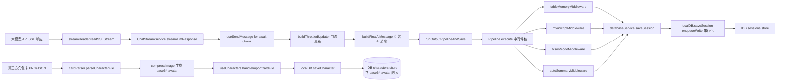

# Mobile Tavern 系统架构审查报告

> **报告版本**：v1.0（综合审查）
> **审查日期**：2026-06-26
> **审查范围**：基于当前代码库静态分析，覆盖内核架构、数据流转、安全防腐、性能容错四个维度
> **审查依据**：AGENTS.md v1.5.7、项目硬约束、工程约定
> **审查方式**：纯静态代码分析，未做运行时验证

---

## 一、执行摘要

本次审查对 Mobile Tavern 项目进行了四维度的深度静态分析。整体结论：

- **架构演进成果显著**：`useChat` 上帝 Hook 已成功退化为 223 行薄壳聚合器；Kernel 微服务装配机制（Kahn 拓扑排序 + AbortController 全回收）完备；IDB 写入路径的事务级超时、`transaction.onabort` 全覆盖、加密失败兜底均已落地；根组件 ErrorBoundary、SSE 60 秒空闲超时、键盘 visualViewport 避让等关键容错机制齐备。
- **存在 4 项 P0 级阻断问题**：集中在「全量反序列化」反模式与接口防腐层缺失，会在中重度用户场景下导致首屏白屏与脏数据渗透。
- **存在 13 项 P1 级必修问题**：覆盖服务生命周期、角色卡大字段未分流、SSE 后台流泄漏、防腐层响应未清洗等。
- **历史 P0-1 / P0-2 / DATA-01 / DATA-03 已确认修复**，但 `destroy()` 未 await 遗留 Tauri 关闭竞态。

**上线就绪度结论**：**当前不建议直接发布生产版本**。需先修复 4 项 P0 阻断问题，并优先处理 P1 中服务生命周期补全、角色卡大字段分流、SSE 后台流清理三类共性问题。修复后预期达到生产可用标准。

---

## 二、审查范围与方法

### 2.1 审查覆盖面

| 维度 | 关键文件/目录 | 子代理审查深度 |
|---|---|---|
| 内核架构与服务拓扑 | `src/kernel/**`（Kernel.ts、types.ts、index.ts、10 个 service、middlewares） | 全文阅读 |
| 数据流转与本地存储 | `src/utils/localDB.ts`、`src/hooks/useChat/**`、`src/contexts/**`、`src/utils/cardParser.ts` | 全文阅读 + Grep 交叉验证 |
| 安全性与防腐层 | `server.ts`、`server/security.ts`、`src-tauri/plugins/android-bridge/**`、`src-tauri/src/telemetry.rs`、`apiClient.ts`、`LLMService.ts` | 全文阅读 |
| 性能优化与容错机制 | `outputMiddlewares.ts`、`AutoSummaryService.ts`、`streamReader.ts`、`App.tsx`、`MainLayout.tsx`、`ChatHistoryTab.tsx` | 全文阅读 |

### 2.2 历史已知问题核对清单

| 历史编号 | 状态 | 证据位置 |
|---|---|---|
| P0-1（kernel.destroy() 未调用） | ✅ 已修复 | [App.tsx#L36](file:///d:/projects/Mobile-Tavern/src/App.tsx#L36)（Tauri onCloseRequested）+ [App.tsx#L57](file:///d:/projects/Mobile-Tavern/src/App.tsx#L57)（useEffect cleanup） |
| P0-2（writeQueue 无事务超时） | ✅ 已修复 | [localDB.ts#L23](file:///d:/projects/Mobile-Tavern/src/utils/localDB.ts#L23)（15s Promise.race）+ L46-66 链式 catch 防阻塞 |
| DATA-01（transaction.onabort 监听） | ✅ 已修复 | localDB.ts 共 14+ 处 onabort 监听器，含关键路径 cryptoKeyPromise（L367-370） |
| DATA-03（cryptoKeyPromise 重置 null） | ✅ 已修复 | localDB.ts L354 / L362 / L368 三处兜底完备 |
| DATA-04（加密错误 skip + log） | ✅ 已修复 | localDB.ts L536-575 加密失败清空 apiKey 防明文落库 |
| PERF-01（根组件 ErrorBoundary） | ✅ 已修复 | [main.tsx#L8-L13](file:///d:/projects/Mobile-Tavern/src/main.tsx#L8-L13) + AppErrorBoundary.tsx 内联样式规避 CSS 变量解析失败 |
| PERF-07（SSE 60s 空闲超时） | ✅ 已修复 | [streamReader.ts#L20-L73](file:///d:/projects/Mobile-Tavern/src/utils/streamReader.ts#L20-L73) idleTimeoutMs 默认 60000ms |
| 上帝 useChat 重构 | ✅ 已修复 | [useChat.tsx](file:///d:/projects/Mobile-Tavern/src/hooks/useChat.tsx) 223 行薄壳 + 6 个职责子 Hook + 5 个纯函数辅助模块 |

### 2.3 已确认合规的关键机制

- Kahn 拓扑排序 + 循环依赖检测 + 关键服务 FATAL 抛错（[Kernel.ts#L260-L325](file:///d:/projects/Mobile-Tavern/src/kernel/Kernel.ts#L260-L325)）
- Pipeline 三态语义（next / interrupt / Neither）+ SafeProxy Symbol 短路（[Kernel.ts#L45](file:///d:/projects/Mobile-Tavern/src/kernel/Kernel.ts#L45)）
- destroy 逆序销毁 + activeControllers 全 abort 兜底（[Kernel.ts#L569-L596](file:///d:/projects/Mobile-Tavern/src/kernel/Kernel.ts#L569-L596)）
- SSRF 中间件全覆盖 + DNS rebinding 防御 + IPv4/IPv6 全网段校验（[security.ts#L7-L173](file:///d:/projects/Mobile-Tavern/server/security.ts#L7-L173)）
- Android 桥接 typeof 检查全覆盖 + Kotlin 侧 sanitizeFileName 路径穿越防御 + MediaStore IS_PENDING 锁
- STS 凭证完全隔离在 Rust 侧，无任何 IPC 通道可被前端读取
- 主 settings 表大文本字段已分流到 `user_settings_large_prompts` 独立键（localDB.ts L577-599）
- `lorebooks` / `worldbooks` 已分轨到独立 IndexedDB store
- `visualViewport` + `interactive-widget=resizes-content` + `100dvh` 键盘避让完备
- `overscroll-behavior: contain` 全局滚动容器
- 单文件行数硬上限：`src/kernel` 下无 .ts/.tsx 超过 1000 行（最大 PromptService.ts 803 行）

---

## 三、架构组件与内核服务拓扑

### 3.1 服务清单与职责边界

| 服务 | 行数 | 依赖声明 | isCritical | 职责评估 | 单一职责 |
|---|---|---|---|---|---|
| DatabaseService | 146 | `["script"]` | true | 会话 CRUD + 分支创建 | ✅ 清晰 |
| LLMService | 335 | 无 | false | 通用 fetch + Catbot + 试用 Key + 多端点路由 | ⚠️ `universalFetch` 多端点分支 |
| PromptService | **803** | 无 | false | 宏替换 + Lorebook + Token 估算 + 提示词组装 | ⚠️ `assemblePrompt` 单方法 578 行 |
| TelemetryService | 150 | 无 | false | 设备指纹 + 日志 + Tauri IPC + 埋点 | ✅ 清晰 |
| ScriptService | 254 | 无 | false | MVU 解析 + 角色卡清洗 + 事件发布 | ✅ 防腐层优秀 |
| ChatStreamService | 79 | `["llm"]` | false | SSE 流式读取 + AsyncGenerator | ✅ 清晰 |
| MultiMessageService | 31 | `["database"]` | false | 用户消息入队 | ✅ 清晰 |
| TableMemoryService | 125 | 无 | false | 表格记忆指令解析 | ✅ 清晰 |
| AutoSummaryService | 235 | `[Database, LLM]` | false | 摘要触发 + LLM 调用 + 元信息正则 | ⚠️ 直接 import apiClient |
| UpdateCheckService | 202 | `[]` | false | 网络校验 + HMAC + 版本检测 | ✅ **唯一完整 init/destroy + AbortSignal 模板** |

### 3.2 中间件机制评估

`src/kernel/middlewares/outputMiddlewares.ts`（167 行）实现了 4 个输出中间件，优先级梯度 100/90/80/70 合理，3/4 中间件用 try/catch 隔离异常，L2 正则预扫描（`TABLE_MEMORY_TRIGGER_PATTERN` / `MVU_SCRIPT_TRIGGER_PATTERN`）门控性能优秀。

**遗留问题**：
- `bisonModeMiddleware`（L100-140）**无 try/catch 包裹** `calculateBisonModeProbability`，可能击穿管道
- 内核中间件**反向 import 业务 hooks 目录**（`../../hooks/useChat/helpers`），方向反了
- `bisonModePrompt` 默认值硬编码在中间件内（违反准则二.1，但准则二例外允许）
- `interrupt()` 三态能力已实现但全 4 个默认中间件均未使用，能力闲置

---

## 四、数据流转与物理分轨存储

### 4.1 数据流转链路



### 4.2 物理分轨存储合规性

| 准则 | 已实现 | 评估 |
|---|---|---|
| settings 与 lorebooks/worldbooks 分离 | localDB.ts L117-130 独立 store + v6 自动迁移 | ✅ |
| settings 长文本字段分流 | localDB.ts L577-599 提取 7 个 prompt 字段到 `user_settings_large_prompts` | ✅ |
| transaction.onabort 全覆盖 | 14+ 处写事务均有监听 | ✅ |
| 事务级 15s 超时 + 链式 catch 防阻塞 | localDB.ts L23-66 | ✅ |
| 加密失败 cryptoKeyPromise 重置 | localDB.ts L354/L362/L368 三路兜底 | ✅ |

### 4.3 遗留的物理分轨违规

- **角色卡 base64 头像直接嵌入 character 记录**：[cardParser.ts#L51-L53](file:///d:/projects/Mobile-Tavern/src/utils/cardParser.ts#L51-L53) `cardData.avatar = base64Avatar`（约 50KB base64）与 name/description 等元数据一并写入 characters store
- **visualSettings 大字段嵌入**：[cardParser.ts#L257-L280](file:///d:/projects/Mobile-Tavern/src/utils/cardParser.ts#L257-L280) `backgroundImageUrl` 与 `expressions[]` 图片数组嵌入 `CharacterCard.visualSettings`
- **per-character lorebookEntries 嵌入**：[useCharacters.ts#L411-L423](file:///d:/projects/Mobile-Tavern/src/hooks/useCharacters.ts#L411-L423) 直接合并到 character 主记录

---

## 五、综合风险评估

### 5.1 P0 级阻断问题（4 项，必修）

| # | 问题 | 文件位置 | 风险描述 |
|---|---|---|---|
| P0-1 | **ChatContext 全量加载所有 sessions 阻塞首屏** | [ChatContext.tsx#L52-L57](file:///d:/projects/Mobile-Tavern/src/contexts/ChatContext.tsx#L52-L57) + [localDB.ts#L203-L213](file:///d:/projects/Mobile-Tavern/src/utils/localDB.ts#L203-L213) | 启动时 `getAllSessions()` 一次性反序列化整个 sessions 表（含完整 messages 数组）。50-100 条会话时首屏反序列化耗时可达秒级，直接违反准则一.2「防止反序列化延时引发的锁死与白屏」。**关键矛盾**：`getSessionsCount` + `getSessionsPaginated` 已在 localDB.ts L219-282 + DatabaseService.ts L19-26 + types.ts L152-154 完整实现，但全代码库**无任何调用方**，分页基础设施建好却未投入使用 |
| P0-2 | **AutoSummaryService 全量 getAllSessions 仅为查找单条** | [AutoSummaryService.ts#L215-L218](file:///d:/projects/Mobile-Tavern/src/kernel/services/AutoSummaryService.ts#L215-L218) | 每次自动总结完成 LLM 调用后调用 `db.getAllSessions()` 反序列化整个 sessions 表，仅为 `allSessions.find(s => s.id === session.id)` 查找当前会话。位于 output pipeline 关键路径，与 P0-1 叠加在长会话场景下可能 OOM 或主线程冻结数秒 |
| P0-3 | **cleanRequestPayload 防腐层名不副实** | [apiClient.ts#L25-L42](file:///d:/projects/Mobile-Tavern/src/utils/apiClient.ts#L25-L42) + [LLMService.ts#L71-L88](file:///d:/projects/Mobile-Tavern/src/kernel/services/LLMService.ts#L71-L88) | 注释自称"防腐隔离层"，实际仅处理 OpenAI 新旧 token 字段互斥（`max_completion_tokens` 与 `max_tokens`）。来自中转代理、第三方 API、用户自定义预设的 `reqBody` 中任何未知字段（如 `tools`、`response_format`、`stream: false`、`n: 100`、原型链方法）都原封不动透传到下游 LLM API。违反准则一.3「严禁允许未经清洗的非标参数...直接渗透、污染到核心逻辑层」 |
| P0-4 | **getAllCharacters 全量反序列化含 base64 大字段** | [localDB.ts#L159-L169](file:///d:/projects/Mobile-Tavern/src/utils/localDB.ts#L159-L169) | `store.getAll()` 一次性反序列化所有 character 记录（含 base64 avatar 与 expressions 图片数组）。用户导入 50+ 角色卡后，启动时反序列化达数 MB 数据，触发首屏白屏 |

### 5.2 P1 级必修问题（13 项）

#### 服务生命周期与拓扑（3 项）

| # | 问题 | 文件位置 | 风险描述 |
|---|---|---|---|
| P1-1 | **9/10 服务 init 未接收 signal 参数** | DatabaseService.ts L11-13、LLMService.ts L37-39、PromptService.ts L15-17、TelemetryService.ts L10-12、ScriptService.ts L128-130、ChatStreamService.ts L11-13、MultiMessageService.ts L9-11、TableMemoryService.ts L8-10、AutoSummaryService.ts L26-28 | 仅 UpdateCheckService 正确绑定 abort 信号。当 registerService 因超时触发 `controller.abort()` 时，这些服务的 init 内挂起的 IndexedDB/fetch 收不到中止信号，导致僵尸任务残留。违反准则十.4「AbortSignal 彻底回收」 |
| P1-2 | **9/10 服务未声明 destroy() 方法** | 同上 9 个服务 | LLMService 的 `tauriFetchPromise` 模块级单例、TelemetryService 的 `sessionStartTime`、ScriptService 的 `this.bridge` 引用、DatabaseService 的 `dbInstance` 连接均无清理路径。HMR 热更新或路由切换时可能触发 onversionchange 回调 |
| P1-3 | **9/10 服务无 initTimeoutMs 配置** | [index.ts#L34-L78](file:///d:/projects/Mobile-Tavern/src/kernel/index.ts#L34-L78) | 仅 DatabaseService 配置 5000ms 超时。任一服务 init 挂起将导致 `initializeKernel()` 整体卡死，启动白屏 |

#### 角色卡大字段未分流（3 项）

| # | 问题 | 文件位置 | 风险描述 |
|---|---|---|---|
| P1-4 | **角色卡 base64 头像直接嵌入 character 记录** | [cardParser.ts#L51-L53](file:///d:/projects/Mobile-Tavern/src/utils/cardParser.ts#L51-L53) + [useCharacters.ts#L283](file:///d:/projects/Mobile-Tavern/src/hooks/useCharacters.ts#L283) | PNG 角色卡导入时压缩后约 50KB base64 头像作为 `CharacterCard.avatar` 字段直接写入 characters store，与元数据一并反序列化。违反准则一.2 |
| P1-5 | **visualSettings 大字段（背景图、表情图组）嵌入 character 记录** | [cardParser.ts#L257-L280](file:///d:/projects/Mobile-Tavern/src/utils/cardParser.ts#L257-L280) | SillyTavern V2/V3 卡片单卡可达数百 KB 至数 MB，`expressions` 数组在角色切换/列表渲染时被全量加载 |
| P1-6 | **handleImportSillyLorebook 直接合并到 character 主记录** | [useCharacters.ts#L411-L423](file:///d:/projects/Mobile-Tavern/src/hooks/useCharacters.ts#L411-L423) | SillyTavern 世界书单卡可达数百条 entry，累计数百 KB，与 character 主记录一并写入 |

#### SSE 与异步资源（2 项）

| # | 问题 | 文件位置 | 风险描述 |
|---|---|---|---|
| P1-7 | **ChatStreamService 提前退出时未取消后台 readSSEStream** | [ChatStreamService.ts#L37-L77](file:///d:/projects/Mobile-Tavern/src/kernel/services/ChatStreamService.ts#L37-L77) | `streamLlmResponse` 是 async generator，但 `readSSEStream` 在外部独立运行。当消费方 `for await` 提前 `break` 而 signal 未 abort 时，后台流会泄漏最多 60 秒。`readSSEStream` 也未显式接收 AbortSignal |
| P1-8 | **Bison 连续推进的 setTimeout 无清理机制** | [useSendMessage.ts#L276-L280](file:///d:/projects/Mobile-Tavern/src/hooks/useChat/useSendMessage.ts#L276-L280) | 野牛模式触发后 500ms setTimeout 递归调用 `handleSendMessage`，未保存 timer id，未在组件卸载或会话切换时清理。组件卸载后仍会触发，对已卸载组件 state 进行更新；快速切换多角色可能堆积多个 setTimeout 同时触发竞态 |

#### 防腐层与脏数据（3 项）

| # | 问题 | 文件位置 | 风险描述 |
|---|---|---|---|
| P1-9 | **`/api/proxy/openai` 响应未做清洗直接返回客户端** | [LLMService.ts#L274-L282](file:///d:/projects/Mobile-Tavern/src/kernel/services/LLMService.ts#L274-L282) | 第三方中转站可在响应中注入非标字段（如 `extra_data`、`debug_info`、`prompt_hash`），会被 useChat 透传进 sessions 表与消息渲染管线 |
| P1-10 | **角色卡 extensions 字段直接透传到数据库** | [cardParser.ts#L256](file:///d:/projects/Mobile-Tavern/src/utils/cardParser.ts#L256) | `extensions: data.extensions || {}` 任意字段透传，可能含深度嵌套对象、超长字符串、原型污染键名 `__proto__` / `constructor` |
| P1-11 | **写队列背压仅上报遥测，无降级/拒绝机制** | [localDB.ts#L25-L67](file:///d:/projects/Mobile-Tavern/src/utils/localDB.ts#L25-L67) | 队列延迟超 3 秒时仅 `reportDbQueueTimeout`，但写操作仍会继续排队。批量保存数百条记录时新写入请求持续等待，UI 呈现"未响应"状态 |

#### 性能与体验（2 项）

| # | 问题 | 文件位置 | 风险描述 |
|---|---|---|---|
| P1-12 | **ChatHistoryTab 长列表无虚拟化 + 三次重复 reduce** | [ChatHistoryTab.tsx#L28-L119](file:///d:/projects/Mobile-Tavern/src/tabs/ChatHistoryTab.tsx#L28-L119) | 100 会话 × 50 条消息 × 3 次 reduce = 15000 次字符长度累加，单次渲染约 5-15ms；同时 100 个 DOM 节点在低端 Android 上滚动卡顿明显。全代码库无 `react-window` / `react-virtual` 依赖 |
| P1-13 | **useCharacters 故意 500ms 延迟阻塞用户操作** | [useCharacters.ts#L64](file:///d:/projects/Mobile-Tavern/src/hooks/useCharacters.ts#L64) + [useCharacters.ts#L104](file:///d:/projects/Mobile-Tavern/src/hooks/useCharacters.ts#L104) | `handleDeleteCharacter` 与 `handleSaveCharacter` 在调用 IDB 写操作前故意 `await setTimeout(500)` 仅为让 `DbWritingOverlay` UI 显示足够时间。批量保存场景下累计 N×500ms 卡顿 |

### 5.3 P2 级加固建议（22 项，按类别归并）

#### 内核拓扑与生命周期（6 项）

| # | 问题 | 文件位置 |
|---|---|---|
| P2-1 | `kernel.destroy()` 未 await，Tauri 关闭事件竞态 | [App.tsx#L36](file:///d:/projects/Mobile-Tavern/src/App.tsx#L36) + [App.tsx#L57](file:///d:/projects/Mobile-Tavern/src/App.tsx#L57) |
| P2-2 | `registerServiceBatch` 任一服务失败不回滚已注册服务 | [Kernel.ts#L322](file:///d:/projects/Mobile-Tavern/src/kernel/Kernel.ts#L322) |
| P2-3 | DatabaseService 声明 `dependencies = ["script"]` 但 init 阶段未使用，拓扑序与注册序不一致 | [DatabaseService.ts#L8](file:///d:/projects/Mobile-Tavern/src/kernel/services/DatabaseService.ts#L8) |
| P2-4 | `useChat.tsx` 顶层直接 `globalKernel.getService` 6 次，违反状态边界 | [useChat.tsx#L53-L58](file:///d:/projects/Mobile-Tavern/src/hooks/useChat.tsx#L53-L58) |
| P2-5 | `saveSessionWithMvu` 闭包中 scriptService 未列入 useMemo 依赖 | [useChat.tsx#L194-L222](file:///d:/projects/Mobile-Tavern/src/hooks/useChat.tsx#L194-L222) |
| P2-6 | `LLMService.universalFetch` 多端点分支过载，应拆分 | [LLMService.ts#L90-L291](file:///d:/projects/Mobile-Tavern/src/kernel/services/LLMService.ts#L90-L291) |

#### 中间件与代码组织（5 项）

| # | 问题 | 文件位置 |
|---|---|---|
| P2-7 | `bisonModeMiddleware` 无 try/catch 包裹，可能击穿管道 | [outputMiddlewares.ts#L100-L140](file:///d:/projects/Mobile-Tavern/src/kernel/middlewares/outputMiddlewares.ts#L100-L140) |
| P2-8 | 内核中间件反向 import 业务 hooks 目录（`../../hooks/useChat/helpers`） | [outputMiddlewares.ts#L3](file:///d:/projects/Mobile-Tavern/src/kernel/middlewares/outputMiddlewares.ts#L3) |
| P2-9 | `bisonModePrompt` 默认值硬编码在中间件内（准则二例外允许，但建议外部化） | [outputMiddlewares.ts#L125](file:///d:/projects/Mobile-Tavern/src/kernel/middlewares/outputMiddlewares.ts#L125) |
| P2-10 | `interrupt()` 三态能力闲置，全 4 个默认中间件均未使用 | [Kernel.ts#L121-L123](file:///d:/projects/Mobile-Tavern/src/kernel/Kernel.ts#L121-L123) |
| P2-11 | `outputPipeline.use(...)` 返回的注销闭包未保存，运行期无法动态卸载 | [index.ts#L82-L85](file:///d:/projects/Mobile-Tavern/src/kernel/index.ts#L82-L85) |

#### 性能优化（4 项）

| # | 问题 | 文件位置 |
|---|---|---|
| P2-12 | L1 Pipeline Bypass 缺失（最简任务仍穿 4 个中间件） | [outputMiddlewares.ts](file:///d:/projects/Mobile-Tavern/src/kernel/middlewares/outputMiddlewares.ts) 全文 |
| P2-13 | `TableMemoryService.matchesToClean` O(M*N) 重复扫描 | [TableMemoryService.ts#L118-L120](file:///d:/projects/Mobile-Tavern/src/kernel/services/TableMemoryService.ts#L118-L120) |
| P2-14 | `LegacyAppContextProvider.sortedCharacters` O(N·log N·M)，sessions 引用变化触发重算 | [LegacyAppContextProvider.tsx#L112-L131](file:///d:/projects/Mobile-Tavern/src/contexts/LegacyAppContextProvider.tsx#L112-L131) |
| P2-15 | `ChatTab` 消息列表仅基础折叠（slice 20 条）非真正虚拟化 | [ChatTab.tsx#L1219-L1225](file:///d:/projects/Mobile-Tavern/src/tabs/ChatTab.tsx#L1219-L1225) |

#### 安全加固（5 项）

| # | 问题 | 文件位置 |
|---|---|---|
| P2-16 | saveFile / saveFileBase64 调用普遍缺少 JS 侧 try/catch 兜底 | useSettings.ts L1205/L1446、useCharacters.ts L440/L551、GlobalWorldbookTab.tsx L599 |
| P2-17 | Blob + a.click() Web 降级残留，WebView 中静默失败风险 | useSettings.ts L1458/L1215、GlobalWorldbookTab.tsx L609、useCharacters.ts L450/L570 |
| P2-18 | `sanitizeFileName` 未过滤控制字符与超长名 | [AndroidThemeBridge.kt#L437-L441](file:///d:/projects/Mobile-Tavern/src-tauri/plugins/android-bridge/android/src/main/kotlin/com/aitavern/plugin/androidbridge/AndroidThemeBridge.kt#L437-L441) |
| P2-19 | `mimeType` 未做字符过滤 | [AndroidThemeBridge.kt#L300-L317](file:///d:/projects/Mobile-Tavern/src-tauri/plugins/android-bridge/android/src/main/kotlin/com/aitavern/plugin/androidbridge/AndroidThemeBridge.kt#L300-L317) |
| P2-20 | `/api/check-update` 中 Host Header 注入到客户端下载链接 | [server.ts#L616](file:///d:/projects/Mobile-Tavern/server.ts#L616) |
| P2-21 | `keyManager` AES Key 拼接混淆无效，静态扫描防护虚假 | [keyManager.ts#L3-L7](file:///d:/projects/Mobile-Tavern/src/utils/keyManager.ts#L3-L7) |
| P2-22 | 遥测数据包含 PII（device_id / player_name / character_name） | [telemetry.rs#L17-L36](file:///d:/projects/Mobile-Tavern/src-tauri/src/telemetry.rs#L17-L36) |

---

## 六、优先级建议与修复路径

### 6.1 第一优先级：P0 阻断问题修复（建议本周内完成）

**修复路径一：引入 `getSessionById(id)` 并切换到分页加载**

```typescript
// IDatabaseService 接口新增
interface IDatabaseService {
  // ... 既有方法
  getSessionById(id: string): Promise<ChatSession | null>;
  getCharacterById(id: string): Promise<CharacterCard | null>;
  getCharacterMetadataList(): Promise<Array<{id: string; name: string; avatar: string}>>;
}
```

- `localDB.ts` 实现：使用 `store.get(id)` 单条直查（IDB 主键索引，毫秒级）
- `ChatContext.loadSessions()` 改为：仅加载 session 元数据列表（id/title/characterId/lastMessageTimestamp），消息内容通过 `getSessionById` 在打开 session 时按需检索
- `AutoSummaryService.ts` L215-217 替换为 `const latestSession = await db.getSessionById(session.id)`
- `getAllCharacters()` 在 UI 列表场景改为 `getCharacterMetadataList()` 轻量列表

**修复路径二：建立请求/响应字段白名单**

```typescript
// 新建 src/kernel/utils/requestSchema.ts
const REQUEST_FIELD_WHITELIST = new Set([
  "model", "messages", "stream", "temperature", "top_p",
  "max_tokens", "max_completion_tokens", "stop", "presence_penalty",
  "frequency_penalty", "tools", "tool_choice", "response_format",
  "stream_options", "seed", "user"
]);

export function cleanRequestPayload(baseUrl: string, reqBody: any): any {
  if (!reqBody) return reqBody;
  const cleaned: any = {};
  for (const key of Object.keys(reqBody)) {
    if (REQUEST_FIELD_WHITELIST.has(key)) cleaned[key] = reqBody[key];
  }
  // max_tokens 互斥
  if (cleaned.max_completion_tokens !== undefined) delete cleaned.max_tokens;
  return cleaned;
}

const RESPONSE_FIELD_WHITELIST = new Set([
  "id", "object", "model", "choices", "usage", "system_fingerprint", "created"
]);
export function cleanLLMResponse(resp: any): any { /* 同上 */ }
```

- 删除 `apiClient.ts` L25-42 的死代码纯函数版本，统一由 `LLMService` 调用 `kernel/utils/requestSchema.ts`
- `LLMService.universalFetch` 返回前插入 `cleanLLMResponse(resp)` 清洗

### 6.2 第二优先级：P1 服务生命周期补全（建议两周内完成）

参照 `UpdateCheckService` 的实现模板，为其余 9 个服务补全：

```typescript
class XxxService implements IXxxService {
  readonly dependencies = [] as const;
  private kernel: IKernel | null = null;
  private abortController: AbortController | null = null;

  async init(kernel: IKernel, signal?: AbortSignal): Promise<void> {
    this.kernel = kernel;
    this.abortController = new AbortController();
    signal?.addEventListener("abort", () => this.abortController?.abort());
    // 将 this.abortController.signal 绑定到所有内部 fetch/IDB/timer
  }

  async destroy(kernel: IKernel, signal?: AbortSignal): Promise<void> {
    this.abortController?.abort();
    this.kernel = null;
    // 清理模块级单例（如 tauriFetchPromise、dbInstance、cryptoKeyPromise）
  }
}
```

- `index.ts` `registerServiceBatch` 入参为每个服务添加 `initTimeoutMs`：Database=5000（已有）、LLM=8000、AutoSummary=8000、ChatStream=5000、其余=3000
- `DatabaseService.destroy` 关闭 `dbInstance` 连接、清空 `cachedCryptoKey` / `cryptoKeyPromise`
- `LLMService.destroy` 清理 `tauriFetchPromise`、`tauriFetch` 引用
- `TelemetryService.destroy` flush 待发遥测队列、重置 `sessionStartTime`

### 6.3 第三优先级：角色卡大字段分流（建议两周内完成）

在 IDB 新增 `character_assets` store（keyPath: `characterId`）：

```typescript
// localDB.ts 新增 store 定义
const DB_STORES = {
  // ... 既有
  character_assets: { keyPath: "characterId" }
};

// character 主记录仅保留引用
interface CharacterCard {
  // ... 既有
  avatarAssetId?: string;        // 替代 avatar 字段
  visualSettings?: {
    backgroundAssetId?: string;  // 替代 backgroundImageUrl
    expressionsAssetIds?: string[]; // 替代 expressions[]
  };
}
```

- `cardParser.ts` 导入时将 base64 数据写入 `character_assets` store，character 主记录仅保留 assetId
- `getAllCharacters()` 改为 `getCharacterMetadataList()` 仅返回轻量字段
- UI 渲染头像时通过 `getAsset(characterId)` 异步检索

### 6.4 第四优先级：SSE 与异步资源清理（建议一周内完成）

- `ChatStreamService.streamLlmResponse` 在 generator 中注册 `finally` 块主动调用 `reader.cancel()` 或 `controller.abort()`
- `readSSEStream` 增加可选 `signal` 参数，在 signal.aborted 时立即 `reader.cancel()` + `clearIdleTimer()`
- `useSendMessage.ts` L276-280 将 setTimeout 返回 id 存入 ref（`bisonChainTimerRef`），在 `useChat.tsx` L75-83 abort effect 与 `handleStopGeneration` 中 `clearTimeout`

### 6.5 第五优先级：剩余 P1 + 关键 P2（按需排期）

- 防腐层响应清洗（P1-9）+ 角色卡 extensions 白名单过滤（P1-10）
- 写队列背压上限 + 优先级插队（P1-11）
- ChatHistoryTab 虚拟化 + 三次 reduce 提取到 useMemo（P1-12）
- useCharacters 移除 500ms 故意延迟（P1-13）
- `bisonModeMiddleware` 补 try/catch（P2-7）+ 内核中间件解耦 hooks 依赖（P2-8）
- `kernel.destroy()` await 修复（P2-1）+ 批量注册失败回滚（P2-2）

---

## 七、上线就绪度结论

### 7.1 就绪度评估矩阵

| 维度 | 当前状态 | 阻断项 |
|---|---|---|
| 架构组件交互 | 🟡 基本健全，存在生命周期补全缺口 | P1-1 / P1-2 / P1-3 |
| 数据流转路径 | 🔴 存在 P0 级全量反序列化反模式 | P0-1 / P0-2 / P0-4 |
| 系统扩展性设计 | 🟢 微服务解耦已成型，单文件无超限 | 无阻断 |
| 安全性措施 | 🟡 SSRF 防御完备，但接口防腐层缺失 | P0-3 / P1-9 / P1-10 |
| 性能优化策略 | 🔴 启动加载与长列表渲染存在 P0/P1 阻断 | P0-1 / P0-4 / P1-12 |
| 容错机制 | 🟢 ErrorBoundary / SSE 超时 / 加密兜底齐备 | 无阻断 |

### 7.2 最终结论

**当前不建议直接发布生产版本。**

需先完成以下最小必修集：

1. **4 项 P0**（建议本周内）：全量加载改造 + 防腐层字段白名单
2. **3 类 P1 共性问题**（建议两周内）：
   - 服务生命周期补全（P1-1 / P1-2 / P1-3）
   - SSE 与异步资源清理（P1-7 / P1-8）
   - 角色卡大字段分流（P1-4 / P1-5 / P1-6）

完成上述必修集后，预期达到生产可用标准。其余 P1 与 P2 项可按 6.5 节排期渐进推进。

### 7.3 已确认无需修复项

- 野牛模式硬编码（AGENTS.md 准则二例外允许，且 UI 提供开关与编辑入口）
- `TRIAL_OPENROUTER_KEY` 占位符（AGENTS.md L198 例外说明）
- HMAC-SHA1 算法选择（阿里云 SLS 官方签名规范要求）
- viewport `user-scalable=no`（移动端原生 App 标准做法，与原生体验预期一致）

---

## 附录 A：审查未覆盖范围

本次审查为纯静态代码分析，以下场景未覆盖：

- **运行时性能验证**：未在真实 Android 设备上测量首屏加载耗时、内存占用、长会话滚动 FPS
- **E2E 集成测试**：未执行 `npm run test:e2e` 验证修复后行为契约
- **Tauri Rust 侧深度审计**：仅审查了 `telemetry.rs` 与 `AndroidThemeBridge.kt`，未覆盖 `lib.rs`、其他 Rust 模块与 Tauri IPC 命令边界
- **第三方依赖供应链**：未审计 `package.json` 与 `Cargo.toml` 中依赖的已知 CVE

建议在修复 P0/P1 后追加运行时验证与 E2E 测试，再行发布。

---

**报告生成完毕。本报告为静态分析结论，未修改任何代码文件。如需对 P0/P1 项进行修复实施，请明确授权。**
