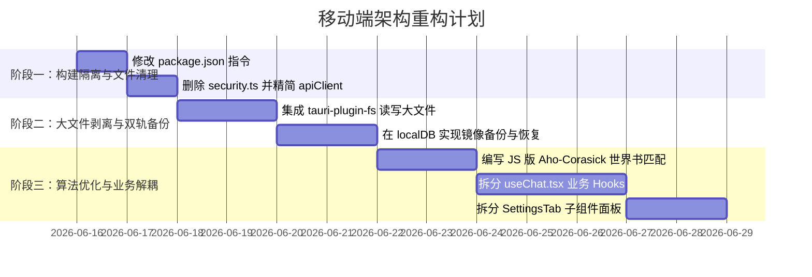

# 📱 Mobile Tavern 纯移动端架构重构与业务解耦实施计划 (Mobile-First Architecture & Decoupling Plan)

依据最新修订的 [AGENTS.md](file:///d:/projects/Mobile-Tavern/AGENTS.md) 核心行为准则，本项目已确立为**纯移动端（Android/iOS）混合 App**。为了防范移动端特有的存储清理风险、大文件 I/O 阻塞、以及超大业务文件的维护灾难，我们在深入评估了 Qwen 3.7 Max（主张强 Rust 化）与 GPT（主张轻量级容器/业务解耦）的交叉验证反馈后，制定了本套兼顾**高性能、高可移植性与 MVU 响应实时性**的重构实施方案。

---

## 🚨 架构抉择：为什么选择“轻量化 Tauri + 双轨持久化 + JS Trie 优化”？

在进行深度交叉验证后，我们拒绝盲目进行全盘 Rust 化（即不采用将数据库和扫描逻辑强行塞入 Rust 的方案），原因如下：
1.  **MVU 状态响应的实时性要求**：本项目包含一套基于 [mvu.js](file:///d:/projects/Mobile-Tavern/src/utils/mvu.js) 的多维 RPG 状态追踪系统。交互式角色卡运行在沙箱 iframe 内，通过消息总线高频更新父窗口 React 状态（`stat_data`）。如果将状态强行移入 Rust 的 SQLite，每次状态微调都会经历 `iframe ➔ JS ➔ Tauri IPC ➔ Rust SQLite ➔ JS ➔ UI` 的异步通信链路，**产生严重的 IPC 延迟与竞态条件**。保持 React 状态为 Single Source of Truth（单真源）能保证 MVU 响应在 1ms 内完成。
2.  **避免 Tauri IPC 的 JSON 序列化开销**：如果每次发信都把庞大的上下文历史发给 Rust 匹配，JSON 跨进程传输的开销将抵消 Rust 算法的物理红利。
3.  **SQLite 带来的 Schema 僵化**：酒馆生态的角色卡 extensions 极其多变。使用 IndexedDB (NoSQL) 可以免去高频 Schema 迁移的痛苦。

因此，我们制定了以下折中且更强悍的重构方案：

---

## 🏗️ 核心重构方案明细 (Core Refactoring Spec)

### 1. 数据持久化：轻量 IndexedDB + Native FS 镜像双轨备份
为了解决 WebView 存储可能被系统静默清理的风险，同时解决大对象 I/O 导致的 OOM 崩溃：
*   **媒体文件物理剥离**：使用 `@tauri-apps/plugin-fs`。在导入角色卡或保存背景时，前端通过 Tauri 插件将图片的二进制流直接写入手机沙盒的 App 目录下（如 `AppData/avatars/`），IndexedDB 数据库内只记录路径（如 `file://...`）。这样 IndexedDB 体积缩减 95%（单个文件不超过 50KB），彻底避免 I/O 卡顿。
*   **本地 JSON 镜像备份**：在 `localDB.ts` 中引入防抖同步机制。每当 IndexedDB 数据写入成功后，在后台静默向 `AppData/backup_db.json` 写入一份镜像文本。
*   **启动时自动重建**：应用冷启动时，如检测到 IndexedDB 数据库为空，则静默读取本地的 `backup_db.json` 并还原至 IndexedDB，用户完全无感知，达到与 SQLite 相同的物理安全性。

### 2. 世界书检索：JS 侧 Aho-Corasick（Trie 树）算法优化
*   针对用户导入 1000+ 条目的大型世界书，在 JS 侧实现前台 precompile：
    *   在加载角色卡时，将所有启用的世界书关键字预编译构建为一棵 **Trie 树**。
    *   匹配时使用 **Aho-Corasick 多模式匹配算法**，对对话文本进行单次扫描，时间复杂度为 $O(N)$（$N$ 为发言字数），与设定集的条目数完全无关。
    *   这既保证了极速匹配，又免除了 Rust 跨进程传输的数据冗余。

### 3. 业务文件解耦：拒绝超大文件与过度拆分
为了解决“改一处炸三处”的维护灾难，对大于 1000 行的文件进行物理拆分：
*   **`useChat.tsx`（1893 行）解耦**：
    *   提取**无状态纯工具函数**：将流反转义、特殊符号清洗算法提炼至 `src/utils/streamHelper.ts`。
    *   提取**独立子 Hooks**：
        *   [NEW] `useChatStreaming.ts`：处理 SSE 流连接与 Done 冲刷逻辑。
        *   [NEW] `useMessageActions.ts`：处理 Swipe 分支切换与单条消息修改。
    *   `useChat.tsx` 本身仅保留 React 并发更新状态的分发，文件体积削减至 200 行。
*   **`SettingsTab.tsx`（2174 行）解耦**：
    *   将大型 Tab 拆分为独立的子面板组件：
        *   `./settings/ApiProfileSettings.tsx`（大模型 API 路径）
        *   `./settings/SamplerSettings.tsx`（采样器与温度设置）
        *   `./settings/BackupSettings.tsx`（导入导出备份与加密）
        *   `./settings/RegexSettings.tsx`（正则脚本替换）

### 4. 物理构建隔离：剥离 Node/Express 冗余
*   修改 [package.json](file:///d:/projects/Mobile-Tavern/package.json)：
    *   将 `"build"` 指令修改为：`"vite build"`。
    *   新增 `"build:web"` 指令：`"vite build && esbuild server.ts ..."`。
*   打包 APK/iOS 时，Tauri 仅执行 `"build"`。这使得 `dist/` 目录下只有 React 的纯静态 HTML/JS/CSS，`server.ts` 编译产物被彻底剥离在外。

---

## 📅 实施路线图与任务单 (Action Items)

---

## 🛡️ 验证计划 (Verification Plan)

1.  **APK 打包体积校验**：打包 Android 版本，确保解包后的 assets 内无任何 `server.cjs` 及其 map 文件，验证包体积明显减小。
2.  **图片沙盒隔离校验**：导入带高清大图的角色卡，利用 Android 调试器观察 `/data/data/com.aitavern.app/` 私有文件目录下是否生成了本地图像文件，并确认 IndexedDB 数据库中仅记录相对路径。
3.  **IndexedDB 物理清除恢复校验**：在 Chrome DevTools/手机调试器中手动点击 "Clear site data" 清除 IndexedDB，然后重启 App，验证其是否能从本地 `backup_db.json` 自动、无损地还原所有会话和卡片。
4.  **Trie 树世界书检索测试**：加载一个包含 1500 条条目的巨型世界书，模拟发信，确保在 WebView 单线程下打字与列表滑动保持 60fps 的流畅。
