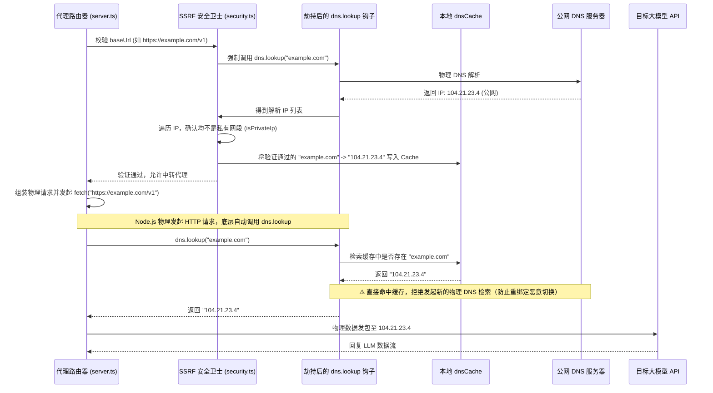

# 📱 Mobile Tavern 详细技术架构设计说明书 (Technical Architecture & Code Spec)

本文档是针对 **Mobile Tavern** 项目的详细技术架构设计说明书，专为架构交叉验证、多代理（Multi-Agent）开发对齐或第三方工程团队集成提供精准的设计契约与核心算法伪代码。

---

## 🏗️ 1. 系统分层架构与边界规约 (Architectural Layers)

Mobile Tavern 的底层架构由四层物理隔离与功能高内聚的组件构成：

```mermaid
graph TB
    subgraph Frontend_Layer [React 前端视图层 (React 19)]
        UI[页面 Tabs / Components] <--> Hooks[useChat / useCharacters / useSettings / Hooks]
        Hooks <--> Contexts[AppContext / CharacterContext / ChatContext]
    end

    subgraph Storage_Layer [数据持久化层 (IndexedDB)]
        Hooks <--> localDB[localDB.ts 适配层]
        localDB <--> Queue[Promise 串行写入序列化队列]
        Queue <--> IDB[(IndexedDB: MobileTavernLiteDB)]
    end

    subgraph Client_Container [原生客户端容器层 (Tauri v2 & Android)]
        UI --> apiClient[apiClient.ts 环境感知器]
        apiClient -->|window.AndroidThemeBridge| Native_Bridge[安卓原生桥接器]
        Native_Bridge -->|setStatusBarStyle / saveFile| Android_OS[Android OS 原生底层]
    end

    subgraph Network_Proxy [网络请求与代理服务层]
        apiClient -->|直连或代理路由| Network_Interface{运行环境检测}
        Network_Interface -->|Tauri 客户端| Tauri_Fetch[Tauri Native HTTP Plugin Direct Direct]
        Network_Interface -->|Web 浏览器| Express_Proxy[Express Server /server.ts]
        Express_Proxy -->|SSRF Guard & dns.lookup Hijack| Remote_API[第三方大模型 API 端点]
        Tauri_Fetch --> Remote_API
    end
    
    style Frontend_Layer fill:#f0f8ff,stroke:#007acc,stroke-width:2px
    style Storage_Layer fill:#fff8dc,stroke:#daa520,stroke-width:2px
    style Client_Container fill:#e6ffe6,stroke:#228b22,stroke-width:2px
    style Network_Proxy fill:#ffe6e6,stroke:#cd5c5c,stroke-width:2px
```

### 1.1 前端视图层 (Frontend UI/UX Layer)
*   **并发渲染优化**：采用 React 19 并发渲染模式（Concurrent Mode）。对于 SSE 流式接口返回的高频字元追加渲染，使用分片调度，防止在大段文本流刷新时阻塞用户滚动或返回交互。
*   **“大拇指操作”布局**：核心路由切换 Tab、输入栏、发送键、平行宇宙分支切换完全排布在屏幕底部 2.5 字符高内，使用 CSS 的 `env(safe-area-inset-bottom)` 实现 iPhone 刘海及 Android 底栏虚拟按键自适应。

### 1.2 原生容器适配层 (Tauri Container & Bridge)
*   **双环境检测机制**：通过判断 `window.location.protocol` 或挂载于 window 上的 `__TAURI_INTERNALS__` 标志检测是否处于原生 WebView 环境。
*   **原生桥接契约 (`AndroidThemeBridge`)**：
    *   **状态栏变色**：在前端切换 OKLCH 明度主题时，前端通过 `window.AndroidThemeBridge.setStatusBarStyle(isDark, colorHex)` 将计算得出的明暗标识及主题色传递给 Android 宿主，由宿主涂色状态栏并动态切换状态栏图标色（暗色背景显示白色图标，亮色背景显示黑色图标）。
    *   **文件保存桥接**：由于 WebView 物理隔离了标准 JS 的 `Blob` 下载链接模拟点击，所有导出角色卡或导出备份文件的逻辑，必须检测并投递至 `window.AndroidThemeBridge.saveFile(fileName, content)`，将文件写入 Android 的 `/Download` 公共分区。

### 1.3 数据持久化层 (Database & Write Serialization)
*   **独占并发事务规避**：移动端 WebView 的 I/O 通道极易因为高频发信时的数据库写操作发生事务锁死。
*   **串行序列化队列**：在 `localDB.ts` 中维护了一个全局串行化 Promise 写入管道 `writeQueue`。任何数据库 `readwrite` 操作必须以排队回调的形式压入此链中，从而避免了同一对象仓库在并发调用下发生死锁引发客户端白屏。

---

## 📋 2. 数据模型契约 (Data Models & TypeScript Schemas)

为了确保各端交叉验证时数据格式 100% 对齐，以下为核心数据结构定义：

### 2.1 角色卡与世界书 (Character & Lorebook)
```typescript
export interface LorebookEntry {
  id: string;
  keys: string[];                                               // 触发关键词列表
  secondary_keys?: string[];                                    // 二级触发关键词列表
  selectiveLogic?: "AND_ANY" | "AND_ALL" | "NOT_ANY" | "NONE";  // 二级键的逻辑评估方式
  caseSensitive?: boolean;                                      // 是否大小写敏感
  content: string;                                              // 世界书设定条目的正文内容
  constant: boolean;                                            // 是否无视关键词常驻上下文
  enabled: boolean;                                             // 条目启用状态
  useRegex?: boolean;                                           // 是否启用正则表达式触发
  addMemo?: boolean;                                            // 是否将备注作为前缀拼入设定
  probability?: number;                                         // 触发概率 (0-100)
  order?: number;                                               // 上下文注入时的物理排序权重 (升序)
  position?: "top" | "before_char_def" | "after_char_def" | "before_last_mes" | "in_chat"; // 注入上下文的物理区间
  depth?: number;                                               // 注入历史时的深度（0 表示最新位置，>0 往历史推移）
  scanDepth?: number;                                           // 扫描历史消息的范围轮数 (0-N)
  comment?: string;                                             // 备注说明
}

export interface CharacterVisualSettings {
  customCss?: string;                                           // 角色专属注入 CSS 样式
  bubbleColor?: string;                                         // 角色对话框背景色
  bubbleTextColor?: string;                                     // 角色对话框文本颜色
  userBubbleColor?: string;                                     // 用户对话框背景色
  userBubbleTextColor?: string;                                 // 用户对话框文本颜色
  primaryColor?: string;                                        // 页面强调高亮色
  secondaryColor?: string;                                      // 页面次要高亮色
  backgroundColor?: string;                                     // 聊天页面底色
  backgroundImageUrl?: string;                                  // 聊天区背景图 base64 或 URL
  backgroundOpacity?: number;                                   // 背景图透明度 (0-1)
  backgroundBlur?: number;                                      // 背景虚化像素 (px)
  enableAsteriskFormatting?: boolean;                           // 是否将 *包裹的字* 渲染为灰色斜体
}

export interface CharacterCard {
  id: string;
  name: string;
  avatar?: string;                                              // 头像的 Data URL (Base64)
  description: string;                                          // 人设详述 (Personality Description)
  personality: string;                                          // 性格特征与言谈口癖
  scenario: string;                                             // 发生背景场景设定
  first_mes: string;                                            // 首句招呼语
  mes_example: string;                                          // 对话范例 (格式以 <START> 划分)
  system_prompt?: string;                                       // 角色绑定的系统提示词
  post_history_instructions?: string;                           // 注入到对话最尾端的角色提示词
  alternate_greetings?: string[];                               // 备用首句招呼语列表
  lorebookEntries?: LorebookEntry[];                            // 角色专属局部设定集
  isWorldbookGlobal?: boolean;                                  // 本地世界书是否全局触发
  character_version?: string;                                   // 卡片版本号
  visualSettings?: CharacterVisualSettings;                     // 角色专用视觉配置
  extensions?: Record<string, any>;                             // SillyTavern 原生扩展数据插槽
}
```

### 2.2 聊天会话、分支与剧情时间轴 (Chat Session & Story Timeline)
```typescript
export interface Message {
  id: string;
  sender: "user" | "assistant" | "system";
  content: string;
  timestamp: number;
  generationTime?: number;                                      // 模型响应所消耗的物理时长 (秒)
  tokenCount?: number;                                          // 响应生成的 Token 数量
  promptTokenCount?: number;                                    // 请求所携带的 Prompt Token 总数
  swipes?: string[];                                            // 多 Swipe 分支内容暂存区
  swipe_id?: number;                                            // 当前激活的 Swipe 索引
}

export interface SummaryCard {
  id: string;
  timeTag: string;                                              // 时间标记 (例如：第一天、深夜)
  location: string;                                             // 场景地点 (例如：王都旅馆、暗森林)
  content: string;                                              // 压缩的前情剧情大纲正文
  condition?: string;                                           // 角色身体/心理当前状况记录
  inventory?: string;                                           // 角色重要道具包变动状况
  bonding?: string;                                             // 双边好感度或社会关系变化指标
  lastMessageId?: string;                                       // 提炼此大纲时指向的历史消息 ID 边界
}

export interface TableMemorySheet {
  id: string;
  name: string;
  columns: string[];
  rows: string[][];
  enable: boolean;
  description?: string;
}

export interface ChatSession {
  id: string;
  characterId: string;
  title: string;
  createdAt: number;
  messages: Message[];
  summaries: SummaryCard[];                                     // 剧情归档年表卡片集
  lastSummarizedMessageId?: string;                             // 已提炼消息的最后边界指针
  tableMemory?: TableMemorySheet[];                             // 表格化状态记忆追踪器
}
```

---

## ⚙️ 3. 核心机制算法设计契约 (Core Algorithms Specification)

### 3.1 Tavern 角色卡解码与 AES-GCM 备份加解密算法

#### A. PNG 中 tEXt / zTXt 块迭代解析算法
PNG 格式包含 8 字节固定的文件签名头 `89 50 4E 47 0D 0A 1A 0A`。随后，其数据被划分为独立的块（Chunks），格式为：`Length (4 bytes)` ➔ `Type (4 bytes)` ➔ `Data (Length bytes)` ➔ `CRC (4 bytes)`。
酒馆角色卡将 JSON 数据（通常经过 Base64 编码或 zlib 压缩）写入类型为 `tEXt` / `zTXt` / `iTXt` 且关键字为 `chara` 的数据块中。

```text
算法：parsePngMetadata(arrayBuffer)
输入：PNG 图像的 ArrayBuffer 字节流
输出：解析出来的 SillyTavern JSON 对象

1. 检查文件长度，若小于 33 字节，抛出 "Invalid PNG file: File is too small" 异常。
2. 读取文件前 8 字节，若不匹配 PNG 签名头，抛出 "Invalid PNG signature" 异常。
3. 初始化指针 offset = 8。
4. 循环迭代直到指针到达文件尾部：
   a. 若 offset + 8 > 长度，退出循环。
   b. 读取长度字段：length = 读入 32 位大端无符号整数(offset)。
   c. 若 offset + 12 + length > 文件总长度，抛出 "Corrupt PNG file" 异常。
   d. 读取 4 字节的类型字符 chunkType = 从指针 offset+4 处获取的 ASCII 字符。
   e. 若 chunkType 等于 "IEND"：退出循环。
   f. 若 chunkType 等于 "tEXt"、"zTXt" 或 "iTXt"：
      i. 提取数据区 chunkData = 字节数组切片[offset+8 至 offset+8+length]。
      ii. 在 chunkData 中寻找首个 null 字节 (00) 的索引位置 nullIdx。
      iii. 提取关键字 keyword = 解码 ASCII(chunkData.slice(0, nullIdx))。
      iv. 若 keyword 转化为小写等于 "chara"：
          - 若 chunkType 为 "tEXt"：
            textContent = 解码 UTF-8(chunkData.slice(nullIdx + 1))。
          - 若 chunkType 为 "zTXt"：
            compressionMethod = chunkData[nullIdx + 1]。
            textBytes = chunkData.slice(nullIdx + 2)。
            若 compressionMethod == 0：使用 fflate.unzlibSync(textBytes) 进行解压，若报错则降级使用 fflate.inflateSync(textBytes)，并用 UTF-8 解码为 textContent。
          - 若 chunkType 为 "iTXt"：
            跳过压缩标志、语言标志和翻译关键字等 null 字节，获取 textBytes。
            若 compressionFlag == 1：通过 fflate.unzlibSync / inflateSync 进行解压，并用 UTF-8 解码为 textContent。
          - 对 textContent 执行 base64 解析：
            通过 atob(textContent) 进行解码，若不是合法的 base64，直接按明文 JSON 处理。
            返回 JSON.parse(decodedText)。
   g. 累加指针：offset = offset + 12 + length。
5. 抛出 "Could not find Character metadata" 异常。
```

#### B. 备份数据 AES-GCM 加密算法
备份加密通过用户输入的明文密码，使用前端 Web Cryptography API 原生加解密：

$$\text{Password} \xrightarrow{\text{SHA-256}} \text{AES-GCM Key}$$

$$\text{Plaintext} \xrightarrow{\text{AES-GCM(IV, Key)}} \text{IV (12-byte)} \parallel \text{Ciphertext}$$

```text
算法：encryptBackupData(dataStr, password)
输入：待备份的 JSON 字符串 dataStr，用户明文密码 password
输出：IV与密文拼接后的十六进制字符串

1. 将密码 password 转化为 UTF-8 字节数组 passBuf。
2. 调用 crypto.subtle.digest("SHA-256", passBuf)，生成 32 字节的哈希摘要 hashBuffer。
3. 调用 crypto.subtle.importKey()，将 hashBuffer 导入为 AES-GCM 算法的对称加密密钥 cryptoKey。
4. 使用密码级伪随机数生成器产生 12 字节的 IV（初始化向量）：iv = crypto.getRandomValues(new Uint8Array(12))。
5. 将备份 JSON 串 dataStr 转化为 UTF-8 字节数组 dataBuf。
6. 调用 crypto.subtle.encrypt({ name: "AES-GCM", iv }, cryptoKey, dataBuf) 得到加密后的密文数组 encryptedBytes。
7. 将 iv 转化为 24 位十六进制字符串 ivHex，将密文 encryptedBytes 转化为十六进制字符串 dataHex。
8. 返回拼接串：ivHex + dataHex。
```

---

### 3.2 Prefix Cache 对齐重排与层叠递归世界书检索算法

#### A. 缓存哈希保护的前缀重排逻辑 (Prefix Cache Re-ordering)
传统大模型客户端在对话过程中会将系统指令和动态世界书拼接后在每一轮进行发送。若动态世界书随上一轮输入而发生改变，则整段 Prompt 的哈希将失效，导致无法命中服务端的 **Prefix Caching**，大幅增加了 TTFT（首字响应延迟）和 API 成本。
Mobile Tavern 在 Prompt 编译器中将结构设计为：

$$\text{System Instruction (人设主 Prompt + 静态系统提示词 + 静态表格记忆)}$$

$$\Downarrow$$

$$\text{Stable Dialogue History (100\% 静态不变的历史对话，除去最新一轮)}$$

$$\Downarrow$$

$$\text{Dynamic Instruction (随最新一轮对话内容动态检索出来的世界书条目 + 尾部注入指令)}$$

$$\Downarrow$$

$$\text{Last User Input (本轮最新的用户发言)}$$

在这种拓扑结构下，系统设定与历史会话随着对话推进保持绝对的字符级哈希不变，前缀哈希命中率达到 **90%** 以上。

```text
算法：assemblePromptContext(character, chat, userInput, settings)
1. 提取 substitution 参数（char_name = character.name, user_name = settings.userName 等）。
2. 构建 systemInstruction 静态指令集：
   a. 获取 settings.promptConfig.mainPrompt，用宏替换算法将 {{char}} 等占位符替换为具体实体。
   b. 拼接用户设定的角色专属 system_prompt。
   c. 拼接 User Persona (settings.userInfo)。
   d. 拼接激活状态的 Table Memory 静态 Markdown 表格正文。
3. 判定模型是否支持前缀缓存优化 (如 DeepSeek/Gemini)：
   - 若支持：
     把被触发的世界书条目 (Lorebook Entries) 中所有插入位置为 "in_chat" 或 "before_last_mes" 的条目的物理位置强制重映射为 "after_char_def"。
     如此，世界书内容将在物理上被合并入 dynamicInstruction（动态提示词）或静态段。
4. 按设定轮数（recentTurns）截取历史消息，并循环使用Instruct模板（如Alpaca、ChatML）将消息打包为 history 数组。
5. 计算前置哈希 Token 预算。若超出上下文限制，执行历史轮数的滑动窗口裁剪。
6. 返回 { systemInstruction, dynamicInstruction, history, userInput }。
```

#### B. 3阶递归世界书层叠扫描算法与 ReDoS 防护
由于玩家当前的发言或 AI 上一轮的回复可能会连续级联出新的设定（例如：发言提到“圣剑” ➔ 触发“圣剑设定” ➔ 圣剑设定内包含“精灵族” ➔ 触发“精灵族设定”），设定集检索引擎采用了 **3阶递归层叠扫描**：

```text
算法：getTriggeredLorebookEntries(messages, userInput, entries, maxDepth = 3)
输入：历史对话记录 messages，用户当前输入 userInput，世界书条目集合 entries
输出：被激活的世界书条目数组 budgetedEntries

1. 初始化 activeEntries = []（记录已触发的条目），activeIds = Set[]，recursionTextAppend = ""。
2. 循环 currentPass 从 1 到 maxDepth：
   a. 初始化 newTriggeredInLastPass = false。
   b. 获取待扫描文本 scanText：
      i. 截取最近 10 轮消息的文本正文，并拼入用户发言 userInput。
      ii. 拼入当前轮次累加产生的 recursionTextAppend（递归产生的新设定文本）。
   c. 遍历设定集中的每一个 entry：
      i. 若 entry 未启用、内容为空或 activeIds 已包含该条目，跳过。
      ii. 若 entry 设置为常驻 constant == true：
          将 entry 压入 activeEntries，记录 id 到 activeIds，将 entry.content 追加到 recursionTextAppend。
          设置 newTriggeredInLastPass = true，继续遍历下一个。
      iii. 执行 ReDoS 防御性过滤：
           若 entry.useRegex 为真，且 entry.keys 中的正则匹配项包含潜在的 ReDoS 危险字符（如 `(\([^\)]*[\+\*]\)[^\)]*[\+\*])` 即括号内有加号或星号的重复嵌套等危险量词）：
           控制台输出告警，且强制将该正则退避降级为普通字符串的 Case-insensitive substring 包含检查，避免 WebView 正则引擎卡死。
      iv. 执行主键（Primary Keys）扫描匹配：
          若 entry.keys 中的任何一个 Key 匹配（以 RegExp 匹配或子串匹配方式）当前 scanText：
          - 判定二级键限制（Secondary Keys Logic）：
            - 若选择 "AND_ANY"：secondary_keys 中必须有任意一个 Key 匹配 scanText。
            - 若选择 "AND_ALL"：secondary_keys 里的所有 Key 必须全部匹配 scanText。
            - 若选择 "NOT_ANY"：secondary_keys 里的所有 Key 必须全不匹配 scanText。
          - 若二级键判定通过，并且随机概率检验（probability 触发几率）成功：
            将 entry 压入 activeEntries，记录 id 到 activeIds，将 entry.content 追加到 recursionTextAppend。
            设置 newTriggeredInLastPass = true。
   d. 若 newTriggeredInLastPass 为假，提前跳出 Pass 循环。
3. 执行累加容量预算限制（BUDGET_LIMIT = 6000 字符）：
   遍历 activeEntries，若当前累加的字符总长度未超过 BUDGET_LIMIT，则保留该设定条目；否则舍弃该条目，防止上下文膨胀导致 LLM 内存溢出。
4. 返回筛选后的 budgetedEntries 数组。
```

---

### 3.3 SSRF 域名/IP 校验防重绑定与 DNS 劫持防护算法

在纯浏览器端模式下，所有的 OpenAI / 兼容端 API 的网络直连请求会受到浏览器 CORS 同源策略拦截，因而必须将 baseUrl 设置为同源路由 `/api/proxy/openai`，委托 Express 服务端进行中转代理。
为了防止攻击者将 baseUrl 填写为 `http://127.0.0.1:3000/admin` 或指向阿里云元数据网段 `http://169.254.169.254` 以实施 SSRF（服务端请求伪造）攻击窃取服务器凭证，Express 后端设置了底层的安全盾：

#### A. Obfuscated IP 混淆 IP 与多网段精确识别算法
攻击者常使用各种变形的 IP 避开普通的字符串检查，例如十进制整数 IP（`http://2130706433/` 代表 127.0.0.1），或 IPv4-Mapped IPv6 语法（`[::ffff:127.0.0.1]`）。本模块采用的解析算法如下：

```text
算法：parseIpAddress(ip)
输入：IP 字符串 ip
输出：由 8 个 16位 无符号整数组成的数组（表示为 IPv6 标准格式 [w0, w1, w2, w3, w4, w5, w6, w7]）

1. 清理 ip 字符串首尾空格并转换为小写。
2. 若匹配标准的 IPv4 正则 /^\d+\.\d+\.\d+\.\d+$/：
   a. 以点 "." 将 IP 拆分为 4 个部分 parts。
   b. 若任一部分非数字，或范围不在 0~255，返回 null。
   c. 将其映射为标准的 IPv4-mapped IPv6 地址格式并返回：
      [0, 0, 0, 0, 0, 0xffff, (parts[0] << 8) + parts[1], (parts[2] << 8) + parts[3]]。
3. 若是含有 IPv4 尾缀的 IPv6 地址（例如 ::ffff:127.0.0.1），提取末尾 IPv4 字节并替换前面的段为 0:0。
4. 使用冒号 ":" 将 IPv6 拆分为 parts 数组。
5. 若 parts 数组长度大于 8，返回 null。
6. 判断 "::" 双冒号位置索引 doubleColonIndex：
   a. 若存在双冒号，将其膨胀为对应的 0。例如把 [1, 2] 膨胀为中间补齐足够数量的 0 使数组长度为 8。
   b. 逐一将十六进制字符 parts[i] 解析为 16位 无符号整数。
7. 返回解析好的结果 result。
```

```text
算法：isPrivateIp(ip)
1. 调用 parseIpAddress(ip) 得到 8 位整数数组 w，若为空，返回 false。
2. 判定原生 IPv6 本地回环地址 (::1) 和未指定地址 (::)：
   若前 7 位全是 0 并且最后一位是 1 或 0，返回 true。
3. 判定原生 IPv6 链路本地地址 (fe80::/10)：
   若 (w[0] & 0xffc0) == 0xfe80，返回 true。
4. 判定原生 IPv6 唯一本地地址 (fc00::/7)：
   若 (w[0] & 0xfe00) == 0xfe00，返回 true。
5. 判定 IPv4 映射/兼容地址下对应的私有 IPv4 分区：
   若 w[0..5] 匹配 IPv4 兼容段：
   提取 w[6..7] 还原为 4 位 IPv4 部分：o0, o1, o2, o3。
   - 判定回环地址段：若 o0 == 127，返回 true。
   - 判定 A类私网：若 o0 == 10，返回 true。
   - 判定 B类私网：若 o0 == 172 且 o1 在 16~31 之间，返回 true。
   - 判定 C类私网：若 o0 == 192 且 o1 == 168，返回 true。
   - 判定本地链路段：若 o0 == 169 且 o1 == 254，返回 true。
   - 判定全零网络段：若 o0 == 0，返回 true。
6. 返回 false。
```

#### B. DNS 重绑定与 DNS Hijacking 拦截时序 (DNS Rebinding Defense)
在常规防御中，通常会先通过 DNS 解析检查 IP 是否为内网，确认安全后再调用 `fetch(url)` 发送请求。然而，攻击者可以在检查 IP 期间响应一个公网 IP（如 `1.1.1.1`），在随后的 `fetch` 阶段再次响应 DNS 并指向 `127.0.0.1`。
为了彻底杜绝此 **Time-of-Check to Time-of-Use (TOCTOU)** 漏洞，Mobile Tavern 直接劫持了 Node.js 的底座 `dns.lookup`：



---

## 📂 4. 项目物理目录结构 (Physical Directory Structure)

项目的源码物理目录组织如下，采用模块化高解耦结构设计：

```text
Mobile-Tavern/
├── server.ts                                 # Node/Express 本地代理服务与静态文件托管服务器
├── package.json                              # 前端及后端代理包管理器配置文件
├── vite.config.ts                            # Vite 构建与热模块替换（HMR）配置文件
├── tsconfig.json                             # TypeScript 静态类型编译选项文件
├── AGENTS.md                                 # 安卓真机适配、文件下载桥接与系统状态栏适配指南
├── TECHNICAL.md                              # 数据库升级迁移定义、交互仿真沙盒坐标映射指南
├── presets_prompts_guide.md                  # 角色卡与双轨兼容世界书标准编写与输出指南
│
├── src-tauri/                                # Tauri v2 原生编译与 Android 原生适配工程 (Rust)
│   ├── src/
│   │   ├── main.rs                           # Tauri 宿主客户端桌面应用冷启动初始化入口
│   │   └── lib.rs                            # Tauri 安卓真机适配、日志及 HTTP 插件挂载点
│   ├── tauri.conf.json                       # 宿主应用窗口尺寸、安全 CSP 以及打包权限清单
│   └── Cargo.toml                            # Rust 后端系统依赖与编译配置文件
│
├── src/                                      # React 前端 SPA 应用源码根目录
│   ├── App.tsx                               # 应用初始化引导、内置角色卡及异常处理器
│   ├── AppContext.tsx                        # 页面毛玻璃主题控制、全局 Promise 对话框网桥
│   ├── main.tsx                              # React 19 并发渲染应用挂载初始化入口
│   ├── types.ts                              # 核心数据模型（角色卡、消息、表格记忆等）类型契约
│   ├── index.css                             # OKLCH 色彩体系变量及移动端安全区边距定义
│   │
│   ├── components/                           # 共享 UI 交互组件库
│   │   ├── MainLayout.tsx                    # 大拇指持机交互底栏导航自适应骨架
│   │   ├── CustomConfirmDialog.tsx           # 毛玻璃视效的原生 alert/confirm 替代弹窗
│   │   ├── CharacterDetailDrawer.tsx         # 角色设定例句切割与挂载属性控制抽屉
│   │   ├── SessionManagerModal.tsx           # 会话平行分支宇宙物理克隆/删除管理器
│   │   ├── DbWritingOverlay.tsx              # IndexedDB 串行写入时的全局防并发锁屏交互层
│   │   ├── FormattedText.tsx                 # 文本分色渲染及 Markdown 斜体星号处理组件
│   │   ├── MemoryTableDrawer.tsx             # 记忆表格档案柜前台管理与编辑抽屉板
│   │   ├── SplashScreen.tsx                  # 冷启动开屏加载动画展示组件
│   │   └── TimelineModal.tsx                 # 剧情大纲时间线弹出窗
│   │
│   ├── hooks/                                # 核心业务逻辑 Hooks 封装
│   │   ├── useChat.tsx                       # SSE 流式缓冲切分与处理、剧情大纲定期提炼
│   │   ├── useCharacters.ts                  # 角色对象仓 CRUD 持久化原子调用 Hook
│   │   └── useSettings.ts                    # 全局设置防抖自动落库与多预设管理 Hook
│   │
│   ├── tabs/                                 # 全局主 Tabs 页面
│   │   ├── CharactersTab.tsx                 # 模糊搜索、角色分类过滤与卡片拖拽导入面板
│   │   ├── ChatHistoryTab.tsx                # 会话平行宇宙历史分支列表与快速切换抽屉
│   │   ├── ChatTab.tsx                       # 对话展示区、发信栏及分支 Swipe 手势切换底栏
│   │   ├── GlobalWorldbookTab.tsx            # 全局知识库条目创建、编辑与原子写库面板
│   │   ├── PlaygroundTab.tsx                 # SVG 全链路仿真交互沙盒与参数宏验证测试台
│   │   └── SettingsTab.tsx                   # 备份管理、采样参数调节及大模型接入设置页
│   │
│   └── utils/                                # 底层核心计算与服务工具包
│       ├── apiClient.ts                      # 跨运行环境 Fetch 直连/代理自适应感知包装器
│       ├── cardParser.ts                     # 二进制 PNG 酒馆卡解码、备份高安全 AES 加密
│       ├── promptBuilder.ts                  # 前缀缓存 Prompt 重排、世界书3阶级联检索器
│       ├── security.ts                       # SSRF 私网 IP 解析、DNS 劫持劫持防重绑定卫士
│       ├── localDB.ts                        # IndexedDB 对象仓声明与并发写 Promise 队列适配
│       ├── telemetry.ts                      # 批量崩溃及指标收集直传 SLS 模块
│       ├── streamReader.ts                   # 流式网络包读取与双换行符边界分包缓冲器
│       └── useUsageTracking.tsx              # 应用使用指标与冷启动性能监测收集器
```

---

## 📊 5. 源码文件代码行数明细 (Code Line Counts Breakdown)

为交叉验证和审计提供的各源码文件精确代码行数（LOC）明细表：

| 物理文件相对路径 | 代码行数 (LOC) | 职责描述与核心算法绑定 |
| :--- | :---: | :--- |
| [server.ts](file:///d:/projects/Mobile-Tavern/server.ts) | 236 | 后端 Express CORS 转发与打包静态文件服务 |
| [package.json](file:///d:/projects/Mobile-Tavern/package.json) | 66 | 构建脚本及依赖配置 |
| [vite.config.ts](file:///d:/projects/Mobile-Tavern/vite.config.ts) | 23 | 前端脚手架与 HMR 机制配置 |
| [tsconfig.json](file:///d:/projects/Mobile-Tavern/tsconfig.json) | 35 | TS 编译器目标参数配置 |
| [AGENTS.md](file:///d:/projects/Mobile-Tavern/AGENTS.md) | 148 | 核心行为准则一：APK 适配与桥接保存规范 |
| [TECHNICAL.md](file:///d:/projects/Mobile-Tavern/TECHNICAL.md) | 406 | 数据库迁移升级说明与交互沙盒设计规范 |
| [presets_prompts_guide.md](file:///d:/projects/Mobile-Tavern/presets_prompts_guide.md) | 224 | 酒馆角色卡及双轨世界书标准输出规范 |
| [src-tauri/src/main.rs](file:///d:/projects/Mobile-Tavern/src-tauri/src/main.rs) | 7 | 宿主桌面应用冷启动生命周期入口 |
| [src-tauri/src/lib.rs](file:///d:/projects/Mobile-Tavern/src-tauri/src/lib.rs) | 18 | 安卓原生入口绑定、Rust 插件挂载点 |
| [src-tauri/tauri.conf.json](file:///d:/projects/Mobile-Tavern/src-tauri/tauri.conf.json) | 41 | 包标识符、系统权限及安卓构建定义 |
| [src-tauri/Cargo.toml](file:///d:/projects/Mobile-Tavern/src-tauri/Cargo.toml) | 34 | Tauri 容器依赖依赖包定义 |
| [src/App.tsx](file:///d:/projects/Mobile-Tavern/src/App.tsx) | 18 | 内置默认卡片初始化与全局未捕获异常捕获 |
| [src/AppContext.tsx](file:///d:/projects/Mobile-Tavern/src/AppContext.tsx) | 178 | 毛玻璃 UI 主题及全局 Promise 异步对话框网桥 |
| [src/main.tsx](file:///d:/projects/Mobile-Tavern/src/main.tsx) | 11 | React 19 并发层级渲染初始化挂载 |
| [src/types.ts](file:///d:/projects/Mobile-Tavern/src/types.ts) | 235 | 前后端数据交换实体与配置结构契约定义 |
| [src/index.css](file:///d:/projects/Mobile-Tavern/src/index.css) | 386 | OKLCH 色彩体系变量及移动端安全区域适配 |
| [src/components/MainLayout.tsx](file:///d:/projects/Mobile-Tavern/src/components/MainLayout.tsx) | 133 | 大拇指级触控底栏导航及屏幕尺寸自适应 |
| [src/components/CustomConfirmDialog.tsx](file:///d:/projects/Mobile-Tavern/src/components/CustomConfirmDialog.tsx) | 76 | 原生 WebView Alert 对话框替代实现 |
| [src/components/CharacterDetailDrawer.tsx](file:///d:/projects/Mobile-Tavern/src/components/CharacterDetailDrawer.tsx) | 506 | 角色细节描述、例句 <START> 切割与渲染抽屉 |
| [src/components/SessionManagerModal.tsx](file:///d:/projects/Mobile-Tavern/src/components/SessionManagerModal.tsx) | 121 | 对话分支平行宇宙克隆、删除关联操作 |
| [src/components/DbWritingOverlay.tsx](file:///d:/projects/Mobile-Tavern/src/components/DbWritingOverlay.tsx) | 25 | 串行写事务执行时的全局锁屏交互层 |
| [src/components/FormattedText.tsx](file:///d:/projects/Mobile-Tavern/src/components/FormattedText.tsx) | 455 | 前台 Markdown 及星号斜体柔和排版分色模块 |
| [src/components/MemoryTableDrawer.tsx](file:///d:/projects/Mobile-Tavern/src/components/MemoryTableDrawer.tsx) | 389 | 表格化长期状态与记忆档案柜管理面板 |
| [src/components/SplashScreen.tsx](file:///d:/projects/Mobile-Tavern/src/components/SplashScreen.tsx) | 79 | 应用冷启动毛玻璃首屏动画显示组件 |
| [src/components/TimelineModal.tsx](file:///d:/projects/Mobile-Tavern/src/components/TimelineModal.tsx) | 170 | 剧情归档概要卡片垂直时间轴渲染器 |
| [src/hooks/useChat.tsx](file:///d:/projects/Mobile-Tavern/src/hooks/useChat.tsx) | 1893 | SSE 字节缓冲区切分逻辑、前情提要定期总结 |
| [src/hooks/useCharacters.ts](file:///d:/projects/Mobile-Tavern/src/hooks/useCharacters.ts) | 602 | 角色仓数据 CRUD 的 React Hooks 封装 |
| [src/hooks/useSettings.ts](file:///d:/projects/Mobile-Tavern/src/hooks/useSettings.ts) | 1198 | 用户配置参数防抖落库、多预设套件管理包 |
| [src/tabs/CharactersTab.tsx](file:///d:/projects/Mobile-Tavern/src/tabs/CharactersTab.tsx) | 201 | 模糊搜索、角色分类过滤器与图片拖拽监听器 |
| [src/tabs/ChatHistoryTab.tsx](file:///d:/projects/Mobile-Tavern/src/tabs/ChatHistoryTab.tsx) | 125 | 历史平行宇宙分支陈列与快速跳转抽屉 |
| [src/tabs/ChatTab.tsx](file:///d:/projects/Mobile-Tavern/src/tabs/ChatTab.tsx) | 1283 | 对话消息气泡列表、多分支 Swipe 手势切换底栏 |
| [src/tabs/GlobalWorldbookTab.tsx](file:///d:/projects/Mobile-Tavern/src/tabs/GlobalWorldbookTab.tsx) | 1331 | 全局世界书设定创建、编辑与原子写库面板 |
| [src/tabs/PlaygroundTab.tsx](file:///d:/projects/Mobile-Tavern/src/tabs/PlaygroundTab.tsx) | 1192 | SVG 全链路仿真交互沙盒与宏替换防缩水测试 |
| [src/tabs/SettingsTab.tsx](file:///d:/projects/Mobile-Tavern/src/tabs/SettingsTab.tsx) | 2174 | 主题切换、备份管理、温度重惩罚等参数配置 |
| [src/utils/apiClient.ts](file:///d:/projects/Mobile-Tavern/src/utils/apiClient.ts) | 332 | 环境自适应 API 中转包装、平滑容错校验 |
| [src/utils/cardParser.ts](file:///d:/projects/Mobile-Tavern/src/utils/cardParser.ts) | 669 | PNG 二进制 Chunk 解码、备份 AES-GCM 加解密 |
| [src/utils/promptBuilder.ts](file:///d:/projects/Mobile-Tavern/src/utils/promptBuilder.ts) | 785 | 前缀缓存 Prompt 重排、世界书3阶级联匹配算法 |
| [src/utils/security.ts](file:///d:/projects/Mobile-Tavern/src/utils/security.ts) | 234 | SSRF 网段过滤、dns.lookup 劫持防重绑定 |
| [src/utils/localDB.ts](file:///d:/projects/Mobile-Tavern/src/utils/localDB.ts) | 311 | IndexedDB 对象仓声明与并发写 Promise 管道 |
| [src/utils/telemetry.ts](file:///d:/projects/Mobile-Tavern/src/utils/telemetry.ts) | 332 | 内存缓冲队列 SLS 直传、STS 临时凭证校验 |
| [src/utils/streamReader.ts](file:///d:/projects/Mobile-Tavern/src/utils/streamReader.ts) | 175 | 流式接收包切分与双换行符边界分包缓冲器 |
| [src/utils/useUsageTracking.tsx](file:///d:/projects/Mobile-Tavern/src/utils/useUsageTracking.tsx) | 122 | 热更新检测与冷启动渲染指标性能追查 |
