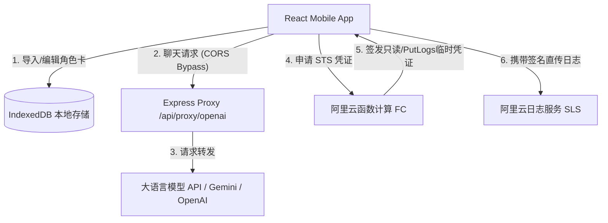
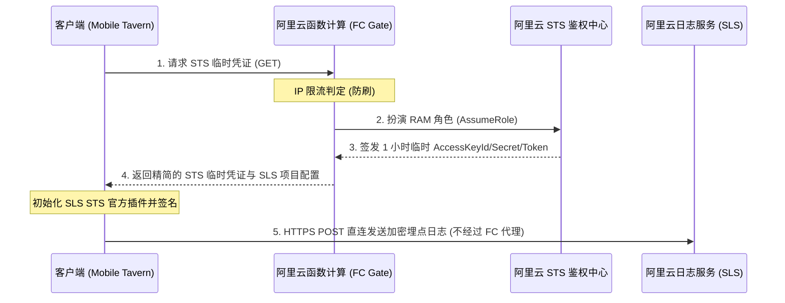

# Mobile Tavern 项目全局架构与技术白皮书

欢迎使用 **Mobile Tavern**！本白皮书是一份完整、详细的全局项目指南，旨在为您厘清系统的软件架构、核心技术栈、数据流逻辑以及遥测日志直传机制，帮助我们后续开发和协作。

---

## 📖 项目愿景与定位 (Vision & Goal)

### 为什么开发这个应用？ (Why Mobile Tavern?)
在桌面端，**Silly Tavern** 凭借丰富的功能和繁荣的社区生态，成为了 AI 角色扮演领域无可替代的王者。然而，其设计偏向桌面级，在移动端浏览器上运行不仅加载缓慢、触控体验差，而且非常臃肿。

**Mobile Tavern** 的诞生初衷不是为了取代 Silly Tavern，而是作为它在**移动设备上的轻量化、高性能互补方案**：
*   **极致的移动触控优化**：砍掉了复杂的桌面侧边栏与多级嵌套菜单，仅保留专为手机屏幕优化的标签页布局与顺滑的手势操作。
*   **出色的原生体验**：通过 **Tauri v2**，我们直接将 Web 应用打包为原生的 Android APK 安装包，支持脱离浏览器在后台运行，并深度维持更好的生命周期。
*   **绝对的隐私安全**：完全基于本地 IndexedDB 存储，没有任何中心化服务器存储用户的角色卡和聊天记录，一切隐私尽在用户掌中。

---

## 🛠 技术栈全景图 (Technology Stack)

Mobile Tavern 采用了行业前沿、轻量且高爆发的现代前端与底层框架组合：

| 维度 | 技术/库 | 作用与特点 |
| :--- | :--- | :--- |
| **前端核心** | React 18 + TypeScript | 声明式、组件化的强类型前端逻辑，保证代码高可维护性。 |
| **构建与开发** | Vite 6 | 极速的热更新 (HMR) 速度与超小体积的静态资源构建打包。 |
| **底层跨平台** | Tauri v2 (Android-oriented) | 用 Rust 替代 Electron，仅生成原生 WebView 容器，支持编译原生 Android APK (`arm64-v8a`, `armv7` 等架构)。 |
| **样式与美学** | Tailwind CSS v4 + shadcn/ui | 引入 HSL 与 OKLCH 调色体系，多主题动态滑块切换，提供极致的高级拟物与极简视觉体验。 |
| **本地数据库** | 原生 IndexedDB | 完全本地的超大文件持久化，确保几十MB的备份和几千条聊天记录秒级读写。 |
| **遥测与埋点** | 阿里云 SLS SDK + 阿里云 FC (STS) | 安全直传架构，在无 AKSK 泄露风险的前提下，零丢包收集客户端运行态健康指标。 |

---

## 📐 系统架构与目录解析 (System Architecture)

### 1. 物理目录结构
项目的骨架设计清晰、职责单一：

```
Mobile-Tavern/
├── app/                  # Tauri 核心原生应用定义文件
├── components/           # UI 共享组件库
│   └── ui/               # shadcn 原生 UI 组件（按钮、输入框、对话框等）
├── lib/                  # 工具类库定义
│   └── utils.ts          # clsx + tailwind-merge 样式适配器
├── serverless/           # 遥测 STS 授权云函数代码
│   └── aliyun-fc-sts/    # 部署在阿里云函数计算的 STS 临时凭证签发器
├── src-tauri/            # Tauri 原生 Rust 部分及编译配置文件
│   ├── src/              # Rust 核心逻辑入口
│   └── tauri.conf.json   # Tauri 主配置文件，定义 Android 容器特性
├── src/                  # 前端 React 核心代码
│   ├── components/       # 业务共享组件（如闪屏 SplashScreen）
│   ├── tabs/             # 核心导航标签页（业务主阵地）
│   │   ├── CharactersTab.tsx    # 角色卡管理（导入、解析、卡片展示）
│   │   ├── ChatHistoryTab.tsx   # 会话历史列表与切换
│   │   ├── ChatTab.tsx          # 聊天主页面（气泡、流式文本、预设插入）
│   │   ├── GlobalWorldbookTab.tsx # 世界书设定与关联触发词配置
│   │   └── SettingsTab.tsx      # API 密钥配置、模型选择、动态主题切换
│   ├── utils/            # 功能辅助模块
│   │   ├── cardParser.ts        # PNG 角色卡元数据 (EXIF/tEXt) 解码器
│   │   ├── localDB.ts           # IndexedDB CRUD 操作接口
│   │   ├── promptBuilder.ts     # 系统提示词与上下文组装引擎
│   │   ├── telemetry.ts         # 遥测发送底层逻辑（STS安全直传）
│   │   └── useUsageTracking.tsx # 事件捕获 Hook
│   ├── App.tsx           # 单页面控制中心，维护全局 Tab 状态与核心逻辑
│   ├── index.css         # 样式主文件，定义 @theme 与 OKLCH 动态主题
│   └── main.tsx          # React DOM 渲染入口
├── server.ts             # 本地 Express 开发代理服务器（解决 CORS 与 API 转发）
└── package.json          # 项目依赖与启动脚本定义
```

### 2. 核心模块通信流
客户端与服务端的交互流线如下：



---

## ⚡ 核心功能引擎设计 (Core Engines)

### 1. 角色卡解析器 (`cardParser.ts`)
*   **物理机制**：完美兼容标准的 Tavern 角色卡。它不仅支持导入标准的 JSON 文件，还可以直接提取并解析含有角色属性的 `PNG` 图片。
*   **底层实现**：采用 `pngjs` 解析 PNG 数据块中的 `tEXt` 辅助块（或 IHDR），解密被 Silly Tavern 或 Chara-Card 协议编码进去的 Base64/UTF-8 角色属性字段，将其转换为前端规范的 `CharacterCard` 对象。

### 2. 上下文构造引擎 (`promptBuilder.ts`)
*   **动态激活**：自动将系统提示词、角色人设 (Description)、开始语 (First Message)、以及动态的**世界书 (Worldbook/Lorebook)** 条目融合。
*   **世界书触发**：实时监控对话上下文，扫描用户输入的关键词，并自动激活并插入相关联的世界书片段到 Prompt 的合适深度。

### 3. 本地 IndexedDB 数据库 (`localDB.ts`)
*   **架构**：通过原生 `indexedDB` API 开启异步事务，在客户端建立名为 `MobileTavernLiteDB` 的本地数据库。
*   **隔离存储**：
    1.  `characters` 空间：存储用户的全部角色卡配置。
    2.  `sessions` 空间：存储历史聊天细节与完整的消息数组。
    3.  `settings` 空间：存储用户的 API 密钥（完全加密/本地持有）、预设参数及全局世界书。

### 4. CORS 规避与反向代理服务 (`server.ts`)
由于移动客户端/Web 浏览器会受到同源策略 (CORS) 的限制，且部分 API 节点不支持跨域：
*   **模型对话代理 (`/api/proxy/openai`)**：流式转发 (text/event-stream) 客户端的消息请求，彻底绕开浏览器的 CORS 限制。
*   **模型列表获取 (`/api/proxy/models`)**：动态请求远程服务商支持的模型列表并回传。
*   **网络连接测试 (`/api/test-connection`)**：为用户测试当前的 API 端点和 Key 是否可用。

---

## 🔒 遥测与数据隐私安全架构 (Telemetry Integration)

> [!IMPORTANT]
> **遥测机制非常安全，绝对不含敏感密钥！**  
> 请务必遵循 `AGENTS.md` 规范。任何人绝不能因本地测试遇到网络断开抛错（如 `status 0`）而将其误判为服务端缺少 CORS 或 WebTracking 配置。

### 客户端-云端风控直传链
1.  **敏感配置零暴露**：前端代码和 `.env.example` 中**不含任何敏感的阿里云主账户 AKSK 密钥**。仅配置只读的公共 SLS 端点信息。真实的、高权限的主账户凭据全部物理隔离在阿里云 FC（函数计算）专属控制台的环境变量中。
2.  **获取临时凭证**：客户端在准备投递埋点日志时，首先会从本地缓存提取凭证。若过期，则发起 `GET` 请求至 `VITE_ALIYUN_FC_STS_URL`（阿里云函数计算网关）。
3.  **内网 STS 扮演**：FC 接收请求，利用自己环境变量中的高权限 AK，向阿里云内网 STS 服务器请求一个**只拥有 PutLogs（单日志库写入）权限、有效期仅 1 小时**的临时凭证（STS Token），并结合 SLS 节点信息回传给客户端。
4.  **STS 安全直传**：客户端调用 `@aliyun-sls/web-track-browser` 和 `@aliyun-sls/web-sts-plugin` 官方 SDK 并进行初始化，通过“带签名的 HTTPS POST”直接发送到阿里云 SLS 的公网端点。



### 为什么不需要配置 CORS 和 WebTracking？
*   因为我们使用的是**官方 SDK 的 STS 安全直传模式**。这是一种基于签名算法的 HTTPS POST 请求，所有必要的跨域处理和签名头，都由 `@aliyun-sls/web-sts-plugin` 在内部自动处理。
*   因此，**绝对不需要在阿里云 SLS 控制台为该 Logstore 单独开启或配置 CORS 跨域放行**，也**绝对不需要开启 WebTracking 匿名写入功能**。

---

## 🎨 视觉与交互美学设计 (Aesthetics System)

本应用在视觉体验上追求极致，提供了令人惊叹的现代 UI 设计：
*   **动态调色机制 (OKLCH System)**：使用先进的色彩空间替代传统的 Hex/RGB，让过渡更自然。
*   **三大精心雕琢的主题**：
    1.  `极简纯白 (Snow)`：干净利落的极简性冷淡风，采用轻微的 OKLCH 浅灰。
    2.  `浅沙暮色 (Sand)`：经典的泛黄古旧羊皮纸底色与暖橙红配字，营造最舒适的角色扮演沉浸感。
    3.  `荧光深海 (Ocean)`：深邃的科技蓝黑调，搭配高对比度的荧光青色，打造极客气息。
*   **细腻的交互反馈**：所有的卡片、按钮和列表均配置了微弱的缩放、投影和渐变微动动画。

---

## 🚀 启动与构建指南 (Scripts & Builds)

### 1. 开发环境运行
在本地启动前端及 Express 开发代理服务：
```bash
npm run dev
```
启动后可在浏览器打开 `http://localhost:3000` 或在 Tauri 中测试。

### 2. 运行环境清理
```bash
npm run clean
```

### 3. 安卓打包 (Build Android APK)
Tauri v2 支持直接编译生成 APK。在配置好 Android SDK 环境后，可运行：
```bash
npm run build:android
```
或者利用 GitHub Actions 在线上自动打包。

---

现在，我们已经全面掌握了 **Mobile Tavern** 的技术内幕与工程脉络。我们准备好在此基础之上，开始下一步的编码和协作任务了！
