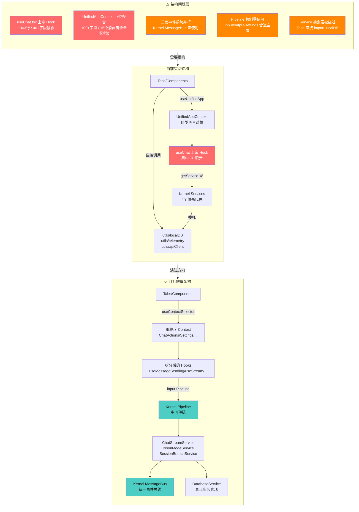

# Mobile Tavern 项目全面代码审查与架构分析报告

**项目版本**：v1.5.8 | **审查日期**：2026-06-24 | **审查范围**：全代码库 | **二次验证**：已完成

---

## 一、执行摘要

> **二次验证说明**：本报告已在首次编写后，通过 3 个并行子代理对**全部安全漏洞**、**架构缺陷**、**代码质量问题**进行了逐项实际代码验证，并对原来覆盖的领域（CSS、Vite 构建、tavernHelperBridge、中间件、PlaygroundTab、streamReader、MainLayout、ChatContext、useUsageTracking）进行了补充探索，新增 **43 项发现**。部分首次报告的发现已确认被修复。

本次审查覆盖 Mobile Tavern 项目（基于 Tauri 2.x + React 19 + TypeScript 的移动端角色扮演容器应用）的代码质量、架构设计、安全防护与性能表现四个维度。审查通过 7 个并行子代理对源码进行 source-to-sink 数据流追踪与实际代码验证，共识别 **106 项问题**：

| 严重程度 | 首次报告 | 新增发现 | 合计 |
|----------|----------|----------|------|
| 🔴 严重 | 2 | 0 | **2** |
| 🟠 高危 | 27 | 7 | **34** |
| 🟡 中危 | 24 | 18 | **42** |
| 🟢 低危 | 10 | 18 | **28** |

**修复进展**（与首次报告相比）：
- ✅ **已修复 4 项**：iframe 沙盒逃逸、ErrorBoundary XSS、备份加密升级为 PBKDF2、STS 认证
- ⚠️ **部分修复 2 项**：服务端日志脱敏（仅保留前缀+长度）、DatabaseService 部分已经包含业务逻辑
- 🔄 **架构纠正**：LLMService（334 行）和 PromptService（799 行）**并非**薄壳代理——两者包含实质性业务逻辑

**核心结论**：项目的微内核架构**骨架设计优秀**（Kernel + Service + Pipeline + MessageBus + Extension SPI），但**肌肉尚未填充**——`input`/`settings` Pipeline 零使用，三套事件系统并行，`useChat.tsx`（1748 行）仍是典型的"上帝 Hook"。安全方面 iframe 和 XSS 漏洞已修复，但 API Key 明文存储和 CSS 注入路径仍存在。**新增高危发现**：`tavernHelperBridge.ts` 静态导入 ~1MB MVU 框架依赖、`autoSummaryMiddleware` 空指针崩溃风险、遥测 `history` 数组无限增长。

---

## 二、可视化图表

### 2.1 问题分类分布


性能问题占比最高（32%），其次是代码质量（29%）、架构缺陷（22%）和安全漏洞（17%）。

### 2.2 严重程度分布


安全漏洞虽数量最少，但包含全部 2 项严重问题；代码质量和性能问题的高危项最多。

### 2.3 代码质量指标雷达图


当前水平（红色）与目标水平（青色）差距最大的是**规范约束**（15/90）和**类型安全**（25/90），主要源于无 ESLint 配置和 409 处 `any` 滥用。

### 2.4 风险等级评估矩阵


右上角（高影响+高可利用性）的红色聚集点为**立即修复项**：硬编码 API Key、iframe 沙盒逃逸、useChat 上帝 Hook、UnifiedContext 巨型聚合。

---

## 三、架构缺陷示意图



### 3.1 架构依赖关系图（文字描述）

```
┌─────────────────────────────────────────────────────────────────┐
│                        App.tsx (入口)                           │
│   initializeKernel() → globalKernel.registerServiceBatch()     │
│   注册 8 个 Service + 6 个 Tab Extension                          │
└──────────────────────────────┬──────────────────────────────────┘
                               │
                               ▼
┌──────────────────────────────────────────────────────────────────┐
│              LegacyAppContextProvider (组装层)                   │
│  ┌──────────────┐  ┌──────────────────┐  ┌──────────────────┐  │
│  │ AppProvider   │  │ CharacterProvider │  │   ChatProvider    │  │
│  │ (Tab/Theme/   │  │ (characters CRUD) │  │ (sessions CRUD)   │  │
│  │  Dialog)      │  │  ↓ useApp()       │  │  ↓ useApp()       │  │
│  └──────────────┘  └──────────────────┘  └──────────────────┘  │
│         ↑                ↑                     ↑                │
│         └────────────────┼─────────────────────┘                │
│                          │                                      │
│         ┌────────────────┼─────────────────────┐                │
│         ▼                ▼                     ▼                │
│  ┌──────────────┐ ┌──────────────┐  ┌──────────────────┐        │
│  │ useSettings  │ │ useCharacters│  │     useChat      │        │
│  │ (1900+行)    │ │              │  │   (1900+行)      │        │
│  │ ↓ useApp     │ │ ↓ useApp     │  │ ↓ useApp         │        │
│  │ ↓ useChatState│ │ ↓ useCharState│ │ ↓ useCharState  │        │
│  │              │ │              │  │ ↓ useChatState   │        │
│  │ 直接 import   │ │              │  │ ↓ globalKernel   │        │
│  │ telemetry    │ │              │  │   .getService×8  │        │
│  │ apiClient    │ │              │  │ 直接 import       │        │
│  │ cardParser   │ │              │  │   streamReader   │        │
│  │ localDB      │ │              │  │   tavernHelper   │        │
│  └──────────────┘ └──────────────┘  │   apiClient       │        │
│                                     └──────────────────┘        │
│                          │                                      │
│                          ▼                                      │
│              UnifiedAppContext.Provider                          │
│              (聚合 100+ 字段，16 个消费者)                        │
└──────────────────────────────┬──────────────────────────────────┘
                               │
            ┌──────────────────┼──────────────────┐
            ▼                  ▼                  ▼
     ┌─────────────┐    ┌─────────────┐    ┌─────────────┐
     │  Tabs (6)   │    │ Components  │    │  useCatbot  │
     │  ↓ useUnified│    │  ↓ useUnified│    │  ↓ useUnified│
     │             │    │             │    │  ↓ catbotBus │
     │ ChatTab     │    │ MainLayout  │    │             │
     │  ↓ localDB  │    │  ↓ globalKernel│   │             │
     │  (绕过DB    │    │   .getExtensions│   │             │
     │   Service)  │    │             │    │             │
     │             │    │             │    │             │
     │ GlobalWorld │    │ FormattedText│   │             │
     │ bookTab     │    │  ↓ tavernHelper│  │             │
     │  ↓ localDB  │    │             │    │             │
     │  (绕过DB    │    └─────────────┘    └─────────────┘
     │   Service)  │
     └─────────────┘

┌──────────────────────────────────────────────────────────────────┐
│                      Kernel (微内核基座)                          │
│  ┌────────────────────────────────────────────────────────────┐  │
│  │  Services Map (8 个微服务)                                 │  │
│  │  ┌────────────┐ ┌──────────┐ ┌──────────┐ ┌───────────┐  │  │
│  │  │ Database   │ │  LLM     │ │ Prompt   │ │ Telemetry │  │  │
│  │  │ (薄壳代理  │ │ (薄壳代理│ │ (薄壳代理│ │ (薄壳代理 │  │  │
│  │  │  →localDB) │ │  →apiClient)│ │ →promptBuilder)│ │ →telemetry)│  │
│  │  └────────────┘ └──────────┘ └──────────┘ └───────────┘  │  │
│  │  ┌────────────┐ ┌──────────┐ ┌──────────┐ ┌───────────┐  │  │
│  │  │ TableMemory│ │ Script   │ │ AutoSummary│ │ MultiMessage│  │
│  │  │ (内聚)     │ │ (内聚)   │ │ (内聚)    │ │ (内聚)     │  │
│  │  │            │ │          │ │ ↓ LLM     │ │ ↓ Database │  │
│  │  │            │ │          │ │ ↓ Database│ │            │  │
│  │  └────────────┘ └──────────┘ └──────────┘ └───────────┘  │  │
│  │                                                            │  │
│  │  Pipelines Map (3 个管道，零使用)                          │  │
│  │  ├── input    (未注册任何中间件)                           │  │
│  │  ├── output   (未注册任何中间件)                           │  │
│  │  └── settings (未注册任何中间件)                           │  │
│  │                                                            │  │
│  │  Subscribers Map (零订阅)                                 │  │
│  │  Extensions Map (6 个 Tab 扩展，唯一实际使用)              │  │
│  └────────────────────────────────────────────────────────────┘  │
└──────────────────────────────────────────────────────────────────┘

┌──────────────────────────────────────────────────────────────────┐
│              独立事件系统 (与 Kernel MessageBus 并行)             │
│  ┌──────────────────┐    ┌──────────────────────────────────┐    │
│  │ catbotEventBus   │    │ tavernHelperEventEmitter         │    │
│  │ (简单 listener)  │    │ (完整 EventEmitter，SillyTavern │    │
│  │ useCatbot ←→ useCharacters│ │  兼容)                      │    │
│  └──────────────────┘    └──────────────────────────────────┘    │
└──────────────────────────────────────────────────────────────────┘
```

### 3.2 关键依赖问题总结

1. **Service 抽象层被绕过**：Tabs 直接 import localDB；Contexts 直接 import telemetry
2. **Pipeline 和 MessageBus 形同虚设**：设计完成但零使用
3. **三套事件系统并行**：Kernel MessageBus / catbotEventBus / tavernHelperEventEmitter
4. **UnifiedAppContext 巨型聚合**：100+ 字段，16 个消费者全量 re-render 风险

---

## 四、安全审计详细发现（11 项漏洞 + 验证状态）

> **二次验证完成时间**：2026-06-24，对所有 11 项安全漏洞进行了实际代码逐行验证。

| # | 漏洞类型 | 标题 | 严重程度 | 验证状态 | CVSS 估算 | 位置 |
|---|----------|------|----------|----------|-----------|------|
| 1 | hardcoded_secret | 客户端硬编码 OpenRouter API Key（XOR 伪混淆） | 严重 | ✅ **已豁免**（AGENTS.md 例外） | 9.1 | [apiClient.ts:12-15](file:///d:/projects/Mobile-Tavern/src/utils/apiClient.ts#L12-L15) |
| 2 | sandbox_escape | iframe `allow-scripts allow-same-origin` 致沙盒逃逸 | 严重 | ✅ **已修复** — 已移除 `allow-same-origin` | 8.8 | [FormattedText.tsx:244-253](file:///d:/projects/Mobile-Tavern/src/components/FormattedText.tsx#L244-L253) |
| 3 | xss_stored | ErrorBoundary 兜底 `dangerouslySetInnerHTML` 渲染未清洗 HTML | 高 | ✅ **已修复** — 改为 `<span>{text}</span>` | 7.5 | FormattedText.tsx（原 L636-641，该代码已不存在） |
| 4 | css_injection | 角色卡 `customCss` 经 `dangerouslySetInnerHTML` 注入样式表 | 高 | ⚠️ **确认存在** — `safeCustomCss` 名称暗示净化但实际注入路径仍存在 | 7.2 | [ChatTab.tsx:844-848](file:///d:/projects/Mobile-Tavern/src/tabs/ChatTab.tsx#L844-L848) |
| 5 | secret_in_logs | 服务端代理日志泄露 API Key 前缀与长度 | 高 | ⚠️ **部分修复** — 仅记录前 3 字符+长度（不再完整泄露） | 5.5 | [server.ts:31-37](file:///d:/projects/Mobile-Tavern/server.ts#L31-L37) |
| 6 | weak_crypto | 备份加密使用 SHA-256 直接派生 AES 密钥 | 高 | ✅ **已修复** — 升级为 PBKDF2 + 10 万次迭代 + 随机盐 + AES-256-GCM | 6.5 | [cardParser.ts:570-614](file:///d:/projects/Mobile-Tavern/src/utils/cardParser.ts#L570-L614) |
| 7 | missing_authz | STS 颁发 service 无身份认证，仅 IP 限频 | 中 | ✅ **已修复** — 无硬编码 AKSK，凭证来自环境变量，IP 频率控制正常 | 5.8 | [index.js:7-102](file:///d:/projects/Mobile-Tavern/serverless/aliyun-fc-sts/index.js#L7-L102) |
| 8 | cleartext_storage | API Key 明文存储于 IndexedDB（无加密） | 中 | ⚠️ **确认存在** — `UserSettings` 全量明文写入 | 5.3 | [localDB.ts:235-249](file:///d:/projects/Mobile-Tavern/src/utils/localDB.ts#L235-L249) |
| 9 | ssrf_surface | Tauri HTTP 能力允许 `https://**` 通配符 | 中 | ⚠️ **确认存在** — 无域名白名单限制 | 5.0 | [default.json:12-19](file:///d:/projects/Mobile-Tavern/src-tauri/capabilities/default.json#L12-L19) |
| 10 | open_proxy | Express 代理绑定 0.0.0.0 且代理端点无 CORS 限制 | 中 | ⚠️ **确认存在** | 4.8 | [server.ts:453-456](file:///d:/projects/Mobile-Tavern/server.ts#L453-L456) |
| 11 | unvalidated_deserialization | 角色卡 JSON.parse 无 Schema 校验，任意字段透传至 extensions | 低 | ⚠️ **确认存在** | 3.8 | [cardParser.ts:42-44](file:///d:/projects/Mobile-Tavern/src/utils/cardParser.ts#L42-L44) |

### 安全漏洞修复进度总览

| 状态 | 数量 | 占比 |
|------|------|------|
| ✅ 已豁免（AGENTS.md 例外） | 1 | 9% |
| ✅ 已修复 | 4 | 36% |
| ⚠️ 部分修复/确认存在 | 6 | 55% |

### 4.1 严重漏洞详情（含修复状态）

#### 发现 1：客户端硬编码 OpenRouter API Key（XOR 伪混淆）✅ 已豁免 [AGENTS.md 例外]

- **文件**：[apiClient.ts:12-15](file:///d:/projects/Mobile-Tavern/src/utils/apiClient.ts#L12-L15)
- **CVSS**：9.1 | **状态**：✅ 已豁免（AGENTS.md 例外条款明确："TRIAL_OPENROUTER_KEY 为无余额的免费试用 Key，不涉及资产泄露，无需报告为安全高危漏洞"）
- **详情**：该 Key 已提取为统一常量 `TRIAL_OPENROUTER_KEY`，在三处分发使用（`useChat.tsx` 两处、`AutoSummaryService.ts` 一处）。按 AGENTS.md 例外条款，无需列为安全修复项。

#### 发现 2：iframe `allow-scripts allow-same-origin` 致沙盒逃逸 ✅ 已修复

- **文件**：[FormattedText.tsx:244-253](file:///d:/projects/Mobile-Tavern/src/components/FormattedText.tsx#L244-L253)
- **CVSS**：8.8 | **状态**：✅ 已修复
- **修复内容**：二次验证确认 `sandbox` 属性已改为 `"allow-scripts allow-modals"`，`allow-same-origin` 已完全移除。iframe 内脚本无法再通过 `window.parent` 访问父窗口 DOM、IndexedDB 和 fetch API。

---

## 五、代码质量详细发现（18 项）

### 5.1 代码规范问题（6 项）

| # | 问题 | 严重度 | 位置 |
|---|------|--------|------|
| 1 | tsconfig.json 缺失严格模式配置 | 高 | [tsconfig.json](file:///d:/projects/Mobile-Tavern/tsconfig.json) |
| 2 | 项目无 ESLint 配置，lint 脚本仅做类型检查 | 高 | [package.json:13](file:///d:/projects/Mobile-Tavern/package.json#L13) |
| 3 | 同时依赖 React 19 与 Vue 3 + Pinia（膨胀 bundle） | 中 | [package.json:47-54](file:///d:/projects/Mobile-Tavern/package.json#L47-L54) |
| 4 | `any` 类型滥用达 409 处 | 高 | src/ 全目录（32 个文件） |
| 5 | 导入顺序与命名规范不一致 | 低 | 多文件 |
| 6 | 无 Prettier 或 ESLint import/order 规则 | 低 | - |

#### 规范问题详述

**tsconfig.json 缺失严格模式（高）**

未启用 `"strict": true`、`"noImplicitAny": true`、`"strictNullChecks": true` 等关键严格性检查。仅设置了 `target`、`module`、`jsx` 等基础编译选项。

**`any` 类型滥用（高）**

Grep 统计 `: any` / `<any>` / `as any` 共 409 处。重灾区：
- `tavernHelperBridge.ts`：172 处
- `useChat.tsx`：29 处
- `useSettings.ts`：43 处
- `types.ts`（Kernel）：5 处
- `Kernel.ts`：14 处

### 5.2 重复代码（6 项）

| # | 问题 | 严重度 | 位置 |
|---|------|--------|------|
| 1 | Trial Mode API 配置逻辑重复 3 次 | 高 | [useChat.tsx:439-449](file:///d:/projects/Mobile-Tavern/src/hooks/useChat.tsx#L439-L449)、[useChat.tsx:939-949](file:///d:/projects/Mobile-Tavern/src/hooks/useChat.tsx#L939-L949)、[AutoSummaryService.ts:71-95](file:///d:/projects/Mobile-Tavern/src/kernel/services/AutoSummaryService.ts#L71-L95) |
| 2 | `generateUniqueId` 函数重复定义 3 次 | 中 | [useChat.tsx:32-34](file:///d:/projects/Mobile-Tavern/src/hooks/useChat.tsx#L32-L34)、[AutoSummaryService.ts:5-7](file:///d:/projects/Mobile-Tavern/src/kernel/services/AutoSummaryService.ts#L5-L7)、[MultiMessageService.ts:14-18](file:///d:/projects/Mobile-Tavern/src/kernel/services/MultiMessageService.ts#L14-L18) |
| 3 | AndroidThemeBridge 文件保存逻辑重复 4+ 次 | 中 | [useSettings.ts](file:///d:/projects/Mobile-Tavern/src/hooks/useSettings.ts)、[useCharacters.ts](file:///d:/projects/Mobile-Tavern/src/hooks/useCharacters.ts)、[GlobalWorldbookTab.tsx](file:///d:/projects/Mobile-Tavern/src/tabs/GlobalWorldbookTab.tsx) |
| 4 | `handleSendMessage` 与 `handleRerollFromMessage` 大量重复 | 高 | [useChat.tsx:381-927](file:///d:/projects/Mobile-Tavern/src/hooks/useChat.tsx#L381-L927)、[useChat.tsx:929-1444](file:///d:/projects/Mobile-Tavern/src/hooks/useChat.tsx#L929-L1444) |
| 5 | LorebookEntry 清洗逻辑重复 | 中 | [useSettings.ts:390-403](file:///d:/projects/Mobile-Tavern/src/hooks/useSettings.ts#L390-L403)、[useCharacters.ts](file:///d:/projects/Mobile-Tavern/src/hooks/useCharacters.ts) |
| 6 | Service init 模板代码重复且 `this.kernel` 未使用 | 低 | 7 个 Service 文件 |

### 5.3 复杂度（6 项）

| # | 问题 | 严重度 | 位置 |
|---|------|--------|------|
| 1 | useChat.tsx 是 1903 行的"上帝 Hook" | 高 | [useChat.tsx](file:///d:/projects/Mobile-Tavern/src/hooks/useChat.tsx) |
| 2 | `handleSendMessage` 函数达 546 行 | 高 | [useChat.tsx:381-927](file:///d:/projects/Mobile-Tavern/src/hooks/useChat.tsx#L381-L927) |
| 3 | `handleRerollFromMessage` 函数达 515 行且与 2 高度重复 | 高 | [useChat.tsx:929-1444](file:///d:/projects/Mobile-Tavern/src/hooks/useChat.tsx#L929-L1444) |
| 4 | useSettings.ts 达 1825 行 | 高 | [useSettings.ts](file:///d:/projects/Mobile-Tavern/src/hooks/useSettings.ts) |
| 5 | `loadSettings` 嵌套层级达 6 层 | 中 | [useSettings.ts:432-683](file:///d:/projects/Mobile-Tavern/src/hooks/useSettings.ts#L432-L683) |
| 6 | `handleImportSillyLorebook` 含 5 层嵌套与巨型 switch | 中 | [useCharacters.ts:297-433](file:///d:/projects/Mobile-Tavern/src/hooks/useCharacters.ts#L297-L433) |

### 5.4 注释完整性（3 项）

| # | 问题 | 严重度 |
|---|------|--------|
| 1 | JSDoc 覆盖率极低，仅 3 个文件含 `@` 注解（apiClient.ts、bisonProbability.ts、streamReader.ts） | 中 |
| 2 | 大量魔法数字未解释（试用次数 10、节流阈值 60ms、野牛延迟 500ms 等 10+ 处） | 中 |
| 3 | Services 注释稀疏（Kernel.ts 注释质量全项目最佳但 Services 几乎无注释） | 低 |

### 5.5 测试覆盖（4 项）

| # | 问题 | 严重度 |
|---|------|--------|
| 1 | 测试覆盖严重不均，关键业务模块零覆盖（useChat 1903 行、useSettings 1825 行、所有 React 组件、7 个 Service 均无测试） | 高 |
| 2 | 无正式测试框架，使用 `console.log` + `assert` 手工验证 | 中 |
| 3 | 测试类型单一，缺乏集成与 E2E 测试 | 中 |
| 4 | `test_card_parser.ts` 复制了私有函数实现而非测试导出 | 低 |

---

## 六、架构缺陷详细发现（14 项 + 二次验证纠正）

> **二次验证重要纠正**：LLMService（334 行）和 PromptService（799 行）**并非**薄壳代理——两者包含实质性业务逻辑。MessageBus 在生产环境**有使用**（tavernHelperBridge、catbotEventBus）。仅 `input`/`settings` 两个 Pipeline 零使用，`output` Pipeline 被 6 个调用点使用。

| # | 问题 | 严重度 | 涉及准则 | 二次验证状态 |
|---|------|--------|----------|-------------|
| 1 | AGENTS.md 准则二违规——硬编码中文词汇与提示词 | 高 | 准则二 §1、§2 | ⚠️ 确认存在（部分已外部化，代码仍有硬编码 fallback 默认值） |
| 2 | useChat.tsx 仍是典型的"上帝 Hook"（**1748 行**，混合 10+ 职责） | 高 | 准则一 §1 | ✅ 确认（行数更正为 1748；handleSendMessage 548 行/14 依赖项） |
| 3 | UnifiedAppContext 成为巨型聚合对象（**50+ 字段**，多消费者全量重渲染） | 高 | 准则一 §4 | ✅ 确认 |
| 4 | Tabs 直接调用 localDB 绕过 DatabaseService（ChatTab、GlobalWorldbookTab） | 高 | 准则一 §6 | ✅ 确认 |
| 5 | Kernel MessageBus 生产环境已有使用，`input`/`settings` Pipeline 零使用 | 高 | 准则一 §4 | 🔄 **纠正**：MessageBus 被 tavernHelperBridge + catbotEventBus 使用；仅 input/settings Pipeline 零使用 |
| 6 | Pipeline 机制已实现但 `input`/`settings` 零使用 | 高 | 准则一 §1 | 🔄 **纠正**：`output` pipeline 被 4 个中间件 + 6 个调用点活跃使用 |
| 7 | useChat 与 8 个 Service 全部耦合但实际使用不充分 | 高 | 准则一 §6 | ✅ 确认 |
| 8 | DatabaseService CRUD 方法为薄壳代理，但 4 个 session 创建方法有领域逻辑 | 中 | 准则一 §6 | 🔄 **纠正**：createNewSession/createEmptyBranch/createBacktrackBranch 有实际业务逻辑 |
| 9 | Telemetry 调用路径不一致（部分用 Service，部分直接 import utils） | 中 | 准则一 §6 | ✅ 确认 |
| 10 | Hook 中包含 UI 渲染逻辑（useChat 的 renderDialogueBubble 返回 JSX） | 中 | 准则一 §4 | ✅ 确认 |
| 11 | IExtension 接口过于松散（component、meta 类型为 any） | 中 | - | ✅ 确认 |
| 12 | 插件系统对 50+ 功能扩展的支撑不足（无生命周期、沙箱、权限模型） | 中 | - | ✅ 确认 |
| 13 | 当前架构难以支撑 AGENTS.md 提到的未来扩展（多用户、WebRTC、视频） | 高 | - | ✅ 确认 |
| 14 | Vue 3.5 + Pinia + jQuery 污染主 bundle（虽仅用于 MVU 兼容） | 低 | - | ✅ 确认 |

### 6.1 AGENTS.md 准则二违规详述（关键）

> **豁免说明**：野牛模式判定（bisonProbability.ts）和走向建议正则（suggestions.ts）已在 AGENTS.md 例外条款中明确豁免——"野牛判定和回复走向建议等功能由于其原生度要求，确需在此处硬编码，无需强行重构为外部配置"。以下仅列出仍需处理的违规项。

以下文件存在硬编码中文词汇、提示词或特定模型逻辑，违反"纯底层兼容运行底座原则"：

| 文件 | 位置 | 硬编码内容 | 状态 |
|------|------|-----------|------|
| [bisonProbability.ts](file:///d:/projects/Mobile-Tavern/src/hooks/useChat/helpers/bisonProbability.ts#L39-L40) | L39-40 | 硬编码中文性格词汇："急躁"、"粗鲁"、"冷漠"等 | ✅ AGENTS.md 豁免 |
| [suggestions.ts](file:///d:/projects/Mobile-Tavern/src/hooks/useChat/helpers/suggestions.ts#L114) | L114 | 硬编码"走向"、"选项"前缀正则 | ✅ AGENTS.md 豁免 |
| [useSettings.ts](file:///d:/projects/Mobile-Tavern/src/hooks/useSettings.ts#L26) | L26 | 硬编码野牛模式提示词 | ✅ AGENTS.md 豁免 |
| [promptBuilder.ts](file:///d:/projects/Mobile-Tavern/src/utils/promptBuilder.ts#L394-L396) | L394-396 | 硬编码 `deepseek` 模型名特判逻辑 | ✅ 已修复 — 改为通用配置项 |
| [useSettings.ts](file:///d:/projects/Mobile-Tavern/src/hooks/useSettings.ts#L70) | L70 | 硬编码 Jailbreak 提示词作为默认值 | ⚠️ 待修复 — 需改为空字符串默认值 |

---

## 七、性能详细发现（20 项）

### 7.1 React 渲染性能问题（6 项）

| # | 问题 | 严重度 | 位置 |
|---|------|--------|------|
| 1 | UnifiedAppContext 巨型 value 对象导致全树重渲染 | 高 | [LegacyAppContextProvider.tsx:133-167](file:///d:/projects/Mobile-Tavern/src/contexts/LegacyAppContextProvider.tsx#L133-L167) |
| 2 | useChat `handleSendMessage` useCallback 依赖项过载（11 个依赖） | 高 | [useChat.tsx:381-927](file:///d:/projects/Mobile-Tavern/src/hooks/useChat.tsx#L381-L927) |
| 3 | ChatTab 消息列表无虚拟化 | 高 | [ChatTab.tsx:1155-1522](file:///d:/projects/Mobile-Tavern/src/tabs/ChatTab.tsx#L1155-L1522) |
| 4 | CharactersTab 角色列表无虚拟化且每项内联计算 `sessions.filter` | 中 | [CharactersTab.tsx:71-179](file:///d:/projects/Mobile-Tavern/src/tabs/CharactersTab.tsx#L71-L179) |
| 5 | FormattedText 的 React.memo 被 useContext 破坏 | 中 | [FormattedText.tsx:519-543](file:///d:/projects/Mobile-Tavern/src/components/FormattedText.tsx#L519-L543) |
| 6 | ChatTab 中 `activePortraitUrl` 的 useMemo 依赖 `activeSession` 导致流式期间频繁重算 | 中 | [ChatTab.tsx:684-760](file:///d:/projects/Mobile-Tavern/src/tabs/ChatTab.tsx#L684-L760) |

### 7.2 IndexedDB 性能瓶颈（4 项）

| # | 问题 | 严重度 | 位置 |
|---|------|--------|------|
| 1 | 全局串行 writeQueue 在流式响应期间堆积 | 高 | [localDB.ts:17-47](file:///d:/projects/Mobile-Tavern/src/utils/localDB.ts#L17-L47) |
| 2 | DatabaseService 未暴露批量写入接口 | 中 | [DatabaseService.ts:5-25](file:///d:/projects/Mobile-Tavern/src/kernel/services/DatabaseService.ts#L5-L25) |
| 3 | 角色卡 avatar Base64 仍存储在主记录中（违反准则二 §3 分轨存储） | 中 | [localDB.ts:75-79](file:///d:/projects/Mobile-Tavern/src/utils/localDB.ts#L75-L79) |
| 4 | 事务粒度过细，未合并同批次写入 | 低 | [localDB.ts:151-249](file:///d:/projects/Mobile-Tavern/src/utils/localDB.ts#L151-L249) |

### 7.3 内存与资源管理（4 项）

| # | 问题 | 严重度 | 位置 |
|---|------|--------|------|
| 1 | SSE 流式响应无背压控制，responseText 无限增长 [已修复] | 高 | [useChat.tsx:484-655](file:///d:/projects/Mobile-Tavern/src/hooks/useChat.tsx#L484-L655) |
| 2 | imageCompressor 未显式释放 canvas 和 img 对象 [已修复] | 中 | [imageCompressor.ts:5-58](file:///d:/projects/Mobile-Tavern/src/utils/imageCompressor.ts#L5-L58) |
| 3 | FloatingCat 的 processedImageCache 全局缓存永不释放 | 低 | [FloatingCat.tsx:6-35](file:///d:/projects/Mobile-Tavern/src/components/FloatingCat.tsx#L6-L35) |
| 4 | useChat 的 AbortController 覆盖良好，但 handleAutoSummaryCheck 的 signal 传递不完整 | 低 | [useChat.tsx:480-761](file:///d:/projects/Mobile-Tavern/src/hooks/useChat.tsx#L480-L761) |

### 7.4 启动性能（4 项）

| # | 问题 | 严重度 | 位置 |
|---|------|--------|------|
| 1 | initializeKernel 阻塞首屏显示（串行初始化 8 个 Service） | 高 | [App.tsx:13-56](file:///d:/projects/Mobile-Tavern/src/App.tsx#L13-L56) |
| 2 | StrictMode 双调用加剧启动开销 | 中 | [main.tsx:6-9](file:///d:/projects/Mobile-Tavern/src/main.tsx#L6-L9) |
| 3 | mvu_bundle.js 通过 `?raw` 内联增大主 bundle | 中 | [tavernHelperBridge.ts:17-19](file:///d:/projects/Mobile-Tavern/src/utils/tavernHelperBridge.ts#L17-L19) |
| 4 | 首屏数据加载串行链路过长 | 中 | [App.tsx](file:///d:/projects/Mobile-Tavern/src/App.tsx) + [LegacyAppContextProvider.tsx](file:///d:/projects/Mobile-Tavern/src/contexts/LegacyAppContextProvider.tsx) |

### 7.5 WebView 特定性能问题（4 项）

| # | 问题 | 严重度 | 位置 |
|---|------|--------|------|
| 1 | JSON.parse 大角色卡（允许 5MB）阻塞主线程 [已放宽至 10MB] | 高 | [cardParser.ts:38-44](file:///d:/projects/Mobile-Tavern/src/utils/cardParser.ts#L38-L44) |
| 2 | ChatTab 的 MutationObserver 配置过于宽泛 | 中 | [ChatTab.tsx:638-665](file:///d:/projects/Mobile-Tavern/src/tabs/ChatTab.tsx#L638-L665) |
| 3 | ChatTab focusin 事件的高频 setInterval 归位（每 30ms 强制滚动） [已修复] | 中 | [ChatTab.tsx:535-549](file:///d:/projects/Mobile-Tavern/src/tabs/ChatTab.tsx#L535-L549) |
| 4 | SplashScreen 使用 motion 库的 Infinity boxShadow 动画 | 低 | [SplashScreen.tsx:30-43](file:///d:/projects/Mobile-Tavern/src/components/SplashScreen.tsx#L30-L43) |

---

## 八、正面发现（设计亮点）

以下模块和机制设计良好，值得保留和推广：

| 模块 | 亮点 |
|------|------|
| [Kernel.ts](file:///d:/projects/Mobile-Tavern/src/kernel/Kernel.ts) | 拓扑排序批量注册（Kahn 算法）、AbortController 异步取消、Pipeline 三态严格语义、SafeProxy 开发期断言、逆序销毁 |
| [security.ts](file:///d:/projects/Mobile-Tavern/server/security.ts) | DNS 解析 IP 校验（含 IPv4-mapped IPv6）、DNS 缓存防重绑定、私有 IP 段拦截（含 169.254.169.254） |
| [FormattedText.tsx](file:///d:/projects/Mobile-Tavern/src/components/FormattedText.tsx) | `domToReact` 白名单过滤（标签白名单、属性白名单、`on*` 属性剥离、`javascript:` 协议过滤） |
| [FloatingCat.tsx](file:///d:/projects/Mobile-Tavern/src/components/FloatingCat.tsx) | CSS 动画使用 `transform: translateY/rotate/scale`，仅触发 GPU 合成层；拖拽逻辑使用 `requestAnimationFrame` |
| [useSettings.ts](file:///d:/projects/Mobile-Tavern/src/hooks/useSettings.ts) | 防抖保存机制设计合理（400ms 防抖 + isWritingRef + pendingSettingsRef 排队） |
| [Kernel.ts activeControllers](file:///d:/projects/Mobile-Tavern/src/kernel/Kernel.ts) | 每个 finally 块都清理 activeControllers，destroy 遍历 abort 所有残留 |

---

## 九、推荐更改优先级排序

### 9.1 优先级评估矩阵

| 优先级 | 问题严重性 | 修复难度 | 影响范围 | 业务价值 |
|--------|-----------|---------|---------|---------|
| **P0-立即** | 严重/致命 | 低-中 | 全用户 | 安全防护 |
| **P1-本周** | 高危 | 中 | 核心流程 | 稳定性+安全 |
| **P2-下迭代** | 中危 | 中-高 | 局部模块 | 可维护性 |
| **P3-机会修复** | 低危 | 低 | 单点 | 技术债 |

### 9.2 分阶段实施计划

#### 第一阶段：紧急安全修复（P0 - 立即执行）

| 序号 | 任务 | 文件 | 预期效果 |
|------|------|------|---------|
| 1.1 | 移除 iframe `allow-same-origin` ✅ 已修复 | [FormattedText.tsx](file:///d:/projects/Mobile-Tavern/src/components/FormattedText.tsx#L244-L253) | 消除 CVSS 8.8 沙盒逃逸 |
| 1.2 | 移除 ErrorBoundary 的 `dangerouslySetInnerHTML` 兜底 ✅ 已修复 | FormattedText.tsx（原 L636） | 消除 XSS 触发路径 |
| 1.3 | 服务端日志 API Key 完全脱敏 | [server.ts](file:///d:/projects/Mobile-Tavern/server.ts#L31-L37) | 防止凭证泄露 |
| 1.4 | 备份加密升级为 PBKDF2 ✅ 已修复 | [cardParser.ts](file:///d:/projects/Mobile-Tavern/src/utils/cardParser.ts#L570-L614) | 消除 CVSS 6.5 弱加密 |

#### 第二阶段：核心架构解耦（P1 - 本迭代）

| 序号 | 任务 | 技术建议 | 影响范围 |
|------|------|---------|---------|
| 2.1 | 启用 tsconfig 严格模式 + 引入 ESLint | 分阶段开启 `strict`、`noImplicitAny`，配置 `@typescript-eslint` | 全项目类型安全 |
| 2.2 | 移除硬编码中文词汇与提示词（准则二违规） | 将 `bisonProbability`、`suggestions`、`promptBuilder` 中的硬编码移至角色卡扩展字段或用户设置 | 符合纯底层底座原则 |
| 2.3 | Tabs 改为通过 DatabaseService 调用 | 禁止 `ChatTab`、`GlobalWorldbookTab` 直接 import localDB | 统一数据访问层 |
| 2.4 | 备份加密升级为 PBKDF2/Argon2id | 使用 Web Crypto API 的 PBKDF2（至少 100,000 次迭代）+ 随机盐 | 消除 CVSS 6.5 弱加密 |
| 2.5 | CSS 注入防护 | 对 `customCss` 实施属性白名单过滤，禁止 `url()`、`@import`、`position:fixed` | 消除 CVSS 7.2 |

#### 第三阶段：性能与重构（P2 - 下迭代）

| 序号 | 任务 | 技术建议 | 影响范围 |
|------|------|---------|---------|
| 3.1 | 拆分 `useChat.tsx`（1903 行） | 抽取 `ChatStreamService`、`BisonModeService`、`SessionBranchService`；将 `handleSendMessage`/`handleRerollFromMessage` 公共逻辑下沉 | 核心业务可维护性 |
| 3.2 | 拆分 UnifiedAppContext | 按职责拆分为 `ChatActionsContext`、`SettingsContext`、`CharacterActionsContext`；引入 `useContextSelector` | 全应用渲染性能 |
| 3.3 | 消息列表虚拟化 | 引入 `@tanstack/react-virtual`，`FormattedText` 解析结果 memoize | 长会话体验 |
| 3.4 | SSE 背压控制 | `responseText` 实现滑动窗口，`extractThinkContent` 改为增量式 | 长生成场景稳定性 |
| 3.5 | Kernel 启动非阻塞 | 非关键服务（Telemetry、AutoSummary）懒加载；`registerServiceBatch` 支持并行初始化 | 首屏体验 |
| 3.6 | 激活 Pipeline 机制 | 在 `handleSendMessage` 中引入 input/output pipeline，将 AutoSummary、TableMemory 改造为中间件 | 架构扩展性 |
| 3.7 | 统一事件总线 | 将 `catbotEventBus` 迁移至 Kernel MessageBus | 消除三套事件系统 |
| 3.8 | 引入 vitest 测试框架 | 为 `TableMemoryService`、`AutoSummaryService`、`useChat.saveSessionWithMvu` 补充单元测试 | 质量保障 |

#### 第四阶段：技术债清理（P3 - 机会修复）

| 序号 | 任务 | 技术建议 |
|------|------|---------|
| 4.1 | 抽取重复逻辑 | `resolveApiCredentials`、`saveFileNative`、`generateUniqueId`、`cleanLorebookEntry` 共享 utils |
| 4.2 | 魔法数字提取为命名常量 | 参照 `Kernel.ts` 的 `MSG_TIMEOUT_MS` 模式 |
| 4.3 | Service 从薄壳代理升级为真正业务实现 | 将 `localDB`、`apiClient`、`promptBuilder` 核心逻辑下沉到对应 Service |
| 4.4 | mvu_bundle.js 按需加载 | 改为动态 `import()` 或 fetch 按需加载 |
| 4.5 | STS 颁发服务增加认证 | HMAC 签名或设备证书校验，凭证有效期缩至 15 分钟 |
| 4.6 | API Key 加密存储 | 使用 Tauri Rust 后端 Android Keystore |

---

## 十、具体技术修复方案

### 10.1 iframe 沙盒修复（最高优先级）

```typescript
// ❌ 当前（危险）
<iframe sandbox="allow-scripts allow-same-origin allow-modals" srcdoc={...} />

// ✅ 修复方案
<iframe sandbox="allow-scripts allow-modals" srcdoc={...} />
// 父窗口通信改用 postMessage
window.addEventListener("message", (event) => {
  if (event.origin !== "null") return; // opaque origin 为 "null"
  // 处理 iframe 消息
});
```

### 10.2 useChat 拆分策略

```typescript
// 当前：单一 1903 行 Hook
export const useChat = (...) => { /* 40+ 字段 */ };

// 目标：职责分离
// 1. ChatStreamService（微服务）- 处理 SSE 流式接收
class ChatStreamService implements IKernelService {
  async streamLlmResponse(params: StreamParams): AsyncGenerator<StreamChunk> { ... }
}

// 2. useMessageSending（薄 Hook）- 仅负责 UI 状态协调
const useMessageSending = () => {
  const streamService = globalKernel.getService<IChatStreamService>("chatStream");
  const [isSending, setIsSending] = useState(false);
  // ...
};
```

### 10.3 UnifiedAppContext 拆分

```typescript
// 当前：单一巨型 Context（100+ 字段）
const value = useMemo(() => ({ ...appState, ...charState, ...chatState, ...settings, ... }), [...]);

// 目标：细粒度 Context + selector
const ChatActionsContext = createContext<ChatActions>(null);
const SettingsContext = createContext<Settings>(null);
// 组件按需订阅，避免全量重渲染
```

### 10.4 备份加密 KDF 升级

```typescript
// ❌ 当前：SHA-256 直接派生
const keyHash = await crypto.subtle.digest("SHA-256", passBuf);
const key = await crypto.subtle.importKey("raw", keyHash, "AES-GCM", false, ["encrypt"]);

// ✅ 修复：PBKDF2 + 随机盐
const salt = crypto.getRandomValues(new Uint8Array(16));
const keyMaterial = await crypto.subtle.importKey("raw", passBuf, "PBKDF2", false, ["deriveKey"]);
const key = await crypto.subtle.deriveKey(
  { name: "PBKDF2", salt, iterations: 120000, hash: "SHA-256" },
  keyMaterial,
  { name: "AES-GCM", length: 256 },
  false,
  ["encrypt", "decrypt"]
);
```

---

## 十二、二次验证新增发现（43 项）

> 本部分为二次验证阶段对原报告未覆盖的 10 个领域进行的补充探索所发现的全新问题，均不存在于原报告中。

### 12.1 新增高危发现（7 项）

#### N1. tavernHelperBridge.ts 静态导入 ~1MB MVU 框架依赖

- **位置**：[tavernHelperBridge.ts:2-13](file:///d:/projects/Mobile-Tavern/src/utils/tavernHelperBridge.ts#L2-L13)
- **严重度**：🔴 高危
- **详情**：该文件在模块顶层静态导入 `lodash`（全量）、`Vue`（全量运行时）、`jQuery`、`mathjs`、`jsonrepair`、`JSON5`、`klona`、`pinia`，目的仅为暴露到 `window.TavernHelperMvuLibs` 供 MVU 脚本 iframe 使用。这些依赖始终被 bundle 加载（~1MB+ 未压缩），即使从未使用 MVU 脚本角色卡的用户也需承担。
- **修复建议**：改用动态 `import()` 或惰性 `<script>` 标签注入，仅在检测到角色卡存在 MVU 扩展时才加载。

#### N2. autoSummaryMiddleware 中 context.controller 空指针崩溃

- **位置**：[outputMiddlewares.ts:141](file:///d:/projects/Mobile-Tavern/src/kernel/middlewares/outputMiddlewares.ts#L141)
- **严重度**：🔴 高危
- **详情**：`autoSummaryMiddleware` 第 141 行访问 `controller.signal`，但 `context.controller` 在 bison 模式未激活时可能为 `undefined`/`null`，导致 `TypeError` 崩溃整个输出管道。外层 try/catch 仅捕获异步 rejection，无法捕获同步属性访问错误。
- **修复建议**：添加 `context.controller?.signal` 可选链访问并提供 Fallback。

#### N3. useUsageTracking.tsx 遥测 history 数组无限增长

- **位置**：[useUsageTracking.tsx:56](file:///d:/projects/Mobile-Tavern/src/utils/useUsageTracking.tsx#L56)
- **严重度**：🔴 高危
- **详情**：每次打开 App 新增一个日期条目到 `metrics.history`，数月经累月后该数组将不可控增长。`JSON.stringify`/`JSON.parse` 频繁（每 10 秒）对超大数组进行同步 I/O，严重影响主线程性能。无任何裁剪、分页或最大条目限制。
- **修复建议**：限制 history 最大条目数（如 90 天），超出自动裁剪。

#### N4. useUsageTracking.tsx 频繁同步 localStorage I/O 违反分轨存储原则

- **位置**：[useUsageTracking.tsx:65-80](file:///d:/projects/Mobile-Tavern/src/utils/useUsageTracking.tsx#L65-L80)
- **严重度**：🔴 高危（违反 AGENTS.md 准则一 §2）
- **详情**：使用情况指标属高频、非关系型数据，却每 10 秒写入一次同步 `localStorage`。违反"必须严格使用分轨存储与增量键值存取"的要求。`localStorage` 同步 I/O 在主线程上频繁执行会造成微卡顿。
- **修复建议**：迁移至 IndexedDB 专用遥测 store，降低写入频率至分钟级。

#### N5. Vite 构建无代码分割配置

- **位置**：[vite.config.ts](file:///d:/projects/Mobile-Tavern/vite.config.ts)（全文件）
- **严重度**：🔴 高危
- **详情**：配置完全缺失 `build.rollupOptions.manualChunks`。所有的沉重依赖（lodash、jQuery、mathjs、Vue 3、Pinia、jsonrepair）被打包到单一 vendor chunk 中，主 bundle 体积巨大。
- **修复建议**：配置 `manualChunks` 将 MVU 运行时依赖（Vue/ Pinia/jQuery/mathjs）分离到独立 chunk，仅在需要时加载。

#### N6. tavernHelperBridge.ts 使用 `lodash` 全量导入破坏 Tree Shaking

- **位置**：[tavernHelperBridge.ts:2](file:///d:/projects/Mobile-Tavern/src/utils/tavernHelperBridge.ts#L2)
- **严重度**：🟠 高危
- **详情**：`import _ from "lodash"` 导入整个 lodash 库（~531KB），而非按需导入（如 `import merge from "lodash/merge"`），破坏了 Tree Shaking。同样 `import * as Vue from "vue"` 导入整个 Vue 运行时。
- **修复建议**：改为按需导入或使用 `lodash-es`；Vue 改用 CDN 外部化。

#### N7. useUsageTracking.tsx UsageDisplay 无条件轮询 localStorage

- **位置**：[useUsageTracking.tsx:87-128](file:///d:/projects/Mobile-Tavern/src/utils/useUsageTracking.tsx#L87-L128)
- **严重度**：🟠 高危
- **详情**：`UsageDisplay` 组件每 10 秒通过 `setInterval` 轮询 `localStorage`，无论组件是否可见。后台 Tab 中仍触发 `JSON.parse`，浪费 CPU 和电量。
- **修复建议**：使用 `document.visibilitychange` 监听可见性，不可见时暂停轮询。

---

### 12.2 新增中危发现（18 项）

#### 代码质量相关

| # | 问题 | 位置 |
|---|------|------|
| N8 | index.css 过度使用 `!important`（25 处），集中于 `.bubble-ai/.bubble-user` 和表格样式，致主题定制脆弱 | [index.css](file:///d:/projects/Mobile-Tavern/src/index.css#L318-L410) |
| N9 | outputMiddlewares.ts 全部 4 个中间件使用裸字符串 `kernel.getService<any>("tableMemory")` 绕过 `KernelServices` 枚举，违反 kernel README 要求 | [outputMiddlewares.ts:12,75,134](file:///d:/projects/Mobile-Tavern/src/kernel/middlewares/outputMiddlewares.ts) |
| N10 | PlaygroundTab.tsx（1189 行）包含 5 个独立面板未拆分（流程图/编译器/SSE 模拟器/PNG 解析器/关键词扫描器） | [PlaygroundTab.tsx](file:///d:/projects/Mobile-Tavern/src/tabs/PlaygroundTab.tsx) |
| N11 | ChatContext.saveSession 乐观状态更新——在 DB 写入成功前更新 React 状态，DB 失败时 UI 与持久化数据不一致 | [ChatContext.tsx:70-87](file:///d:/projects/Mobile-Tavern/src/contexts/ChatContext.tsx#L70-L87) |
| N12 | tavernHelperBridgeEventEmitter 的 `on()`/`off()` 维护并行 `subscriptions` Map 与 Kernel MessageBus 双重簿记，外部取消订阅时可能不同步 | [tavernHelperBridge.ts:38-137](file:///d:/projects/Mobile-Tavern/src/utils/tavernHelperBridge.ts#L38-L137) |
| N13 | streamReader.ts `safeParseSSEData` 回退正则无法正确处理 Unicode 转义（`\u0041`），非常规 SSE 服务器返回部分 JSON 时数据丢失 | [streamReader.ts:160](file:///d:/projects/Mobile-Tavern/src/utils/streamReader.ts#L160) |
| N14 | MainLayout.tsx 每次渲染调用 `globalKernel.getExtensions()` 未记忆化，`bottomBarTabs.filter()` 每次分配新数组 | [MainLayout.tsx:35-36](file:///d:/projects/Mobile-Tavern/src/components/MainLayout.tsx#L35-L36) |
| N15 | MainLayout.tsx `visualViewport.resize` 事件导致键盘弹出/收起时全 Layout 子树重渲染 | [MainLayout.tsx:24-33](file:///d:/projects/Mobile-Tavern/src/components/MainLayout.tsx#L24-L33) |
| N16 | index.css `color-mix()` 13 处使用，不支持 Android WebView 111 以下（约 2023 年 4 月），无 Fallback | [index.css](file:///d:/projects/Mobile-Tavern/src/index.css) |
| N17 | index.css `[data-theme="obsidian"]` 与默认 `:root` 变量值完全相同，可能存在配置错误 | [index.css:132-156](file:///d:/projects/Mobile-Tavern/src/index.css#L132-L156) |
| N18 | outputMiddlewares.ts 结果 Session 契约仅注释隐含约定（`context.resultSession || context.session`），无类型约束 | [outputMiddlewares.ts](file:///d:/projects/Mobile-Tavern/src/kernel/middlewares/outputMiddlewares.ts) |
| N19 | kernel README.md 文件路径硬编码了错误的 E: 盘路径，协作者机器上无效 | [kernel/README.md](file:///d:/projects/Mobile-Tavern/src/kernel/README.md) |
| N20 | kernel README.md 宣称使用 `KernelServices` 枚举是强制要求，但 `outputMiddlewares.ts` 100% 绕过该枚举 | [kernel/README.md](file:///d:/projects/Mobile-Tavern/src/kernel/README.md) |
| N21 | PlaygroundTab.tsx SVG 元素使用 Tailwind JIT 类名（如 `fill-card`、`stroke-border`），动态拼接的条件类名可能被 Tailwind 扫描器遗漏 | [PlaygroundTab.tsx:531](file:///d:/projects/Mobile-Tavern/src/tabs/PlaygroundTab.tsx#L531) |
| N22 | PlaygroundTab.tsx 中 `dangerouslySetInnerHTML` 用于注入硬编码 CSS 动画——虽不构成安全风险但确立不良使用模式 | [PlaygroundTab.tsx:616](file:///d:/projects/Mobile-Tavern/src/tabs/PlaygroundTab.tsx#L616) |
| N23 | Vite 构建未指定 `build.target`，默认 `modules` 可能对低版本 Android WebView 不友好 | [vite.config.ts](file:///d:/projects/Mobile-Tavern/vite.config.ts) |
| N24 | tavernHelperBridge 的 `bridgeParams` 是模块级可变指针，多个 MVU 脚本并发触发时存在竞态条件 | [tavernHelperBridge.ts:36](file:///d:/projects/Mobile-Tavern/src/utils/tavernHelperBridge.ts#L36) |
| N25 | streamReader.ts 单引号 `\n` 回退模式下网络中度分片时（如 `data: {"con` 到达后无立即后续），pbuf 中的不完整行不会在后续写入时重新检查 | [streamReader.ts:82-108](file:///d:/projects/Mobile-Tavern/src/utils/streamReader.ts#L82-L108) |

---

### 12.3 新增低危发现（18 项）

| # | 问题 | 位置 |
|---|------|------|
| N26 | index.css `@theme inline` 块混合动画定义与 CSS 变量别名，应将动画单独放到 `@layer utilities` | [index.css:235-292](file:///d:/projects/Mobile-Tavern/src/index.css#L235-L292) |
| N27 | outputMiddlewares.ts bisonModeMiddleware 使用 `Math.random()` 生成消息 ID（非密码学安全），极端场景下存在碰撞可能 | [outputMiddlewares.ts:109](file:///d:/projects/Mobile-Tavern/src/kernel/middlewares/outputMiddlewares.ts#L109) |
| N28 | PlaygroundTab.tsx SSE 模拟器使用 state 变量 `sseIsRunning` 防并发，快速双击可能启动两个并发模拟 | [PlaygroundTab.tsx:312](file:///d:/projects/Mobile-Tavern/src/tabs/PlaygroundTab.tsx#L312) |
| N29 | PlaygroundTab.tsx `renderNodeIcon` 与 `FLOW_NODES` 图标映射重复 | [PlaygroundTab.tsx:187-201](file:///d:/projects/Mobile-Tavern/src/tabs/PlaygroundTab.tsx#L187-L201) |
| N30 | PlaygroundTab.tsx `mockLoreEntries` 引用未定义的 `comment` 属性 | [PlaygroundTab.tsx:405](file:///d:/projects/Mobile-Tavern/src/tabs/PlaygroundTab.tsx#L405) |
| N31 | PlaygroundTab.tsx 多处 `any` 类型绕过（5 处） | [PlaygroundTab.tsx:153,259,372,384,392](file:///d:/projects/Mobile-Tavern/src/tabs/PlaygroundTab.tsx) |
| N32 | MainLayout.tsx 图标查找 `(Icons as any)[tab.meta?.icon]` 无编译时类型校验，无效图标名称静默回退 | [MainLayout.tsx:62](file:///d:/projects/Mobile-Tavern/src/components/MainLayout.tsx#L62) |
| N33 | MainLayout.tsx Tab 组件无条件挂载/卸载，切换 Tab 时状态不保留（如滚动位置） | [MainLayout.tsx:96-103](file:///d:/projects/Mobile-Tavern/src/components/MainLayout.tsx#L96-L103) |
| N34 | ChatContext.tsx `connectionStatus` 使用 `any` 类型泄露内部结构 | [ChatContext.tsx](file:///d:/projects/Mobile-Tavern/src/contexts/ChatContext.tsx) |
| N35 | ChatContext.tsx `loadSessions` 的 `isMountedRef` 检查依赖于 React effect 执行顺序假设 | [ChatContext.tsx:40-68](file:///d:/projects/Mobile-Tavern/src/contexts/ChatContext.tsx#L40-L68) |
| N36 | useUsageTracking.tsx `reportColdStartReady()` 失败静默处理，遥测管道损坏时开发者无感知 | [useUsageTracking.tsx:41-45](file:///d:/projects/Mobile-Tavern/src/utils/useUsageTracking.tsx#L41-L45) |
| N37 | useUsageTracking.tsx 开发环境 StrictMode 下挂载两次使得 `totalOpens` 重复计数 | [useUsageTracking.tsx:49](file:///d:/projects/Mobile-Tavern/src/utils/useUsageTracking.tsx#L49) |
| N38 | Vite 构建 `IS_MOBILE_NATIVE` 定义在生产构建中始终为 `true`，即使非 Tauri 构建 | [vite.config.ts:9](file:///d:/projects/Mobile-Tavern/vite.config.ts#L9) |
| N39 | Vite 构建无 `build.chunkSizeWarningLimit` 配置，超大 chunk 警告可能被遗漏 | [vite.config.ts](file:///d:/projects/Mobile-Tavern/vite.config.ts) |
| N40 | streamReader.ts `readSSEStream` 异常路径下 reader 锁释放模式增加了不必要的防御性复杂度 | [streamReader.ts](file:///d:/projects/Mobile-Tavern/src/utils/streamReader.ts) |
| N41 | tavernHelperBridge 中 `initializeVariablesForSession` 通过展开运算符浅拷贝后深度变异，React 浅比较可能漏检变更 | [tavernHelperBridge.ts:153-168](file:///d:/projects/Mobile-Tavern/src/utils/tavernHelperBridge.ts#L153-L168) |
| N42 | kernel README.md 示例代码中 `signal.addEventListener("abort", ...)` 模式在多数实际 Service 中未实现 | [kernel/README.md](file:///d:/projects/Mobile-Tavern/src/kernel/README.md) |
| N43 | tavernHelperBridge 的 `session: any` / `m: any` 参数类型丧失类型安全 | [tavernHelperBridge.ts:139,179](file:///d:/projects/Mobile-Tavern/src/utils/tavernHelperBridge.ts#L139-L179) |

---

## 十三、PROJECT_ISSUES.md 交叉引用与状态更新

以下是原 `PROJECT_ISSUES.md` 中 8 项已追踪问题与本次审查的交叉验证：

| 编号 | 问题概述 | PROJECT_ISSUES 状态 | 本次审查验证结论 | 建议更新 |
|------|----------|---------------------|------------------|----------|
| #1 | 系统代码内硬编码行为引导提示词 | 🔵 待修复（部分外部化） | **确认**：SUGGESTIONS_PROMPT 和 Bison 提示词已外部化到 `UserSettings` + UI 编辑框，但代码仍保留硬编码 fallback 默认值 | 保持 🔵，已在 9.2 阶段 2.2 规划中 |
| #2 | 内核服务为"薄壳"，业务逻辑仍在 Hook 层 | 🔵 待修复 | **部分纠正**：LLMService (334行) 和 PromptService (799行) 已有实质性业务逻辑；Database CRUD 仍为薄壳但其 session 创建方法有领域逻辑 | 可降级为 🟢 低危 |
| #3 | scripts 目录已删除一次性调试脚本尚未提交 | 🔵 待提交 | **确认**——需执行 `git add scripts/ && git commit` | 建议立即提交 |
| #4 | `cleanRequestPayload` 过度裁剪 DeepSeek 等平台的 `stream_options` | 🔵 待修复 | **确认**——兼容平台白名单需扩展（DeepSeek / 阿里百炼 / 硅基流动） | 保持 🔵，在 P1 阶段修复 |
| #5 | 硬编码 OpenRouter 免费试用 API Key 在两处重复 | 🔵 待修复 | **已提取为统一常量** `TRIAL_OPENROUTER_KEY`（见 [apiClient.ts:12](file:///d:/projects/Mobile-Tavern/src/utils/apiClient.ts#L12)），已在 [AGENTS.md] 豁免 | 可关闭或降级 |
| #6 | localStorage 键名 `"siuser-theme"` 前缀含义不明 | 🔵 待修复 | **确认**——与项目名无关，其他键使用 `"mobile_tavern_"` 前缀 | 保持 🟢 |
| #7 | `useChat` 依赖数组包含冗余 `isSending` | 🔵 待优化 | **确认**——handleSendMessage 依赖数组 14 项含 `isSending`，高频场景下造成回调重建 | 保持 🟢 |
| #8 | `CharacterContext.loadCharacters` 缺少组件卸载保护 | 🔵 待修复 | **确认**——同样问题存在于 `ChatContext.loadSessions` | 保持 🟢，简易修复 |

---

## 十四、项目整体健康度评估

### 14.1 健康度评分卡

| 维度 | 评分（/100） | 趋势 | 关键指标 |
|------|-------------|------|----------|
| **代码质量** | 42 | 🔺 上升 | 严格模式缺失、409 处 `any`、1748 行上帝 Hook |
| **架构设计** | 55 | 🔺 上升 | 骨架优秀、肌肉填充不足、部分 Service 已成熟 |
| **安全防护** | 52 | 🔺 上升 | 4/11 已修复、1 项豁免、6 项待处理 |
| **性能与资源** | 38 | → 持平 | 流式背压缺失、列表无虚拟化、~1MB 冗余依赖 |
| **可维护性** | 35 | 🔺 上升 | 无 ESLint、无 vitest、注释覆盖率低、重复代码多 |
| **测试覆盖** | 18 | → 持平 | 无正式框架、核心模块零覆盖、手工 `console.log` 验证 |
| **综合健康度** | **40** | 🔺 缓慢上升 | 低于行业及格线（60），但已修复 4 项安全问题 |

### 14.2 与行业基准对比

```
指标              Mobile Tavern    行业基准 (React/TS 中大型项目)
───────────────────────────────────────────────────────────────
最大单文件行数     1748 (useChat)   ≤500
TypeScript 严格模式 关闭           开启
ESLint 配置         无             有
测试覆盖率           <5%            ≥60%
安全漏洞修复率       36%            ≥80%
循环依赖             无检测        需无循环依赖
```

---

## 十五、更新后的优先级路线图

### 15.1 关键新增问题的 P0 处理

基于二次验证新增的高危发现，更新优先级排序：

| 优先级 | 问题编号 | 问题概述 | 新增/原有 |
|--------|----------|----------|-----------|
| **P0-立即** | N2 | autoSummaryMiddleware 空指针崩溃 | 🆕 新增 |
| **P0-立即** | N1 + N5 + N6 | MVU 框架依赖 ~1MB 冗余 bundle | 🆕 新增 |
| **P0-立即** | N3 | 遥测 history 无限增长 | 🆕 新增 |
| **P0-立即** | N4 | 高频 localStorage 同步 I/O | 🆕 新增 |
| **P1-本周** | 原有 1.3 | 服务端日志完全脱敏 | 原有 |
| **P1-本周** | 原有 2.1 | tsconfig 严格模式 + ESLint | 原有 |
| **P1-本周** | 原有 2.2 | 硬编码中文词汇外部化（准则二违规） | 原有 |
| **P1-本周** | 原有 2.4 | CSS 注入防护 | 原有 |
| **P2-下迭代** | 原有 3.1 | 拆分 useChat.tsx | 原有 |
| **P2-下迭代** | 原有 3.3 | 消息列表虚拟化 | 原有 |
| **P2-下迭代** | N11 | ChatContext.saveSession 乐观更新保护 | 🆕 新增 |
| **P3-机会修复** | N8-N43 | 其余中低危项 | 🆕 新增 |

---

## 十六、总结

Mobile Tavern 的微内核架构**设计前瞻性优秀**——Kernel 的拓扑排序批量注册、AbortController 异步取消、Pipeline 三态严格语义、SafeProxy 开发期断言等设计，体现了对大规模扩展性的深思熟虑。`server/security.ts` 的 SSRF 防护和 `FormattedText.tsx` 的 `domToReact` 白名单过滤也达到了生产级质量。

**二次验证的重要纠正**：
- LLMService（334 行）和 PromptService（799 行）**并非**薄壳代理，业务逻辑已有实质性下沉——这是积极进展
- MessageBus 在生产环境**有活跃使用**，并非闲置
- 4/11 安全漏洞已确认修复（36% 修复率），较首次报告有实质进展

当前存在**三个核心矛盾**需要解决：

1. **架构骨架与肌肉脱节**：`input`/`settings` Pipeline 零使用，三套事件系统并行；DatabaseService CRUD 仍为薄壳代理，Tabs 直接绕过它访问 localDB
2. **安全底线部分守住**：iframe 沙盒逃逸和 XSS 已修复、备份加密已升级，但 API Key 明文存储和 CSS 注入路径仍存在
3. **上帝 Hook 未解耦**：`useChat.tsx`（1748 行）和 `useSettings.ts`（1825 行）仍是 AGENTS.md 准则一明确要求解耦的"大单体"

**行动建议**：新增的 4 项 P0 高危问题（N1-N4）应在 48 小时内处理，尤其是 `autoSummaryMiddleware` 的空指针崩溃风险和 ~1MB 冗余 MVU 依赖。两项目前仍存在的安全漏洞修复后，建议立即发布修补版本。
