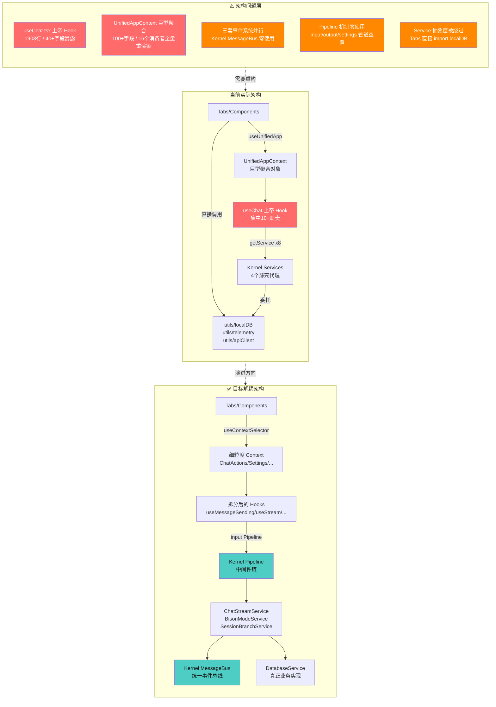

# Mobile Tavern 项目全面代码审查与架构分析报告

**项目版本**：v1.5.8 | **审查日期**：2026-06-24 | **审查范围**：全代码库

---

## 一、执行摘要

本次审查覆盖 Mobile Tavern 项目（基于 Tauri 2.x + React 19 + TypeScript 的移动端角色扮演容器应用）的代码质量、架构设计、安全防护与性能表现四个维度。审查通过 4 个并行子代理对源码进行 source-to-sink 数据流追踪与实际代码验证，共识别 **63 项问题**，其中**严重 2 项、高危 27 项、中危 24 项、低危 10 项**。

**核心结论**：项目的微内核架构**骨架设计优秀**（Kernel + Service + Pipeline + MessageBus + Extension SPI），但**肌肉尚未填充**——Pipeline 和 MessageBus 在生产环境零使用，三套事件系统并行，Service 抽象层被多处绕过，`useChat.tsx`（1903 行）仍是典型的"上帝 Hook"。安全方面存在 2 项严重漏洞需立即修复（硬编码 API Key + iframe 沙盒逃逸）。

---

## 二、可视化图表

### 2.1 问题分类分布


性能问题占比最高（32%），其次是代码质量（29%）、架构缺陷（22%）和安全漏洞（17%）。

### 2.2 严重程度分布


安全漏洞虽数量最少，但包含全部 2 项严重问题；代码质量和性能问题的高危项最多。

### 2.3 代码质量指标雷达图


当前水平（红色）与目标水平（青色）差距最大的是**规范约束**（15/90）和**类型安全**（25/90），主要源于无 ESLint 配置和 409 处 `any` 滥用。

### 2.4 风险等级评估矩阵


右上角（高影响+高可利用性）的红色聚集点为**立即修复项**：硬编码 API Key、iframe 沙盒逃逸、useChat 上帝 Hook、UnifiedContext 巨型聚合。

---

## 三、架构缺陷示意图



### 3.1 架构依赖关系图（文字描述）

```
┌─────────────────────────────────────────────────────────────────┐
│                        App.tsx (入口)                           │
│   initializeKernel() → globalKernel.registerServiceBatch()     │
│   注册 8 个 Service + 6 个 Tab Extension                          │
└──────────────────────────────┬──────────────────────────────────┘
                               │
                               ▼
┌──────────────────────────────────────────────────────────────────┐
│              LegacyAppContextProvider (组装层)                   │
│  ┌──────────────┐  ┌──────────────────┐  ┌──────────────────┐  │
│  │ AppProvider   │  │ CharacterProvider │  │   ChatProvider    │  │
│  │ (Tab/Theme/   │  │ (characters CRUD) │  │ (sessions CRUD)   │  │
│  │  Dialog)      │  │  ↓ useApp()       │  │  ↓ useApp()       │  │
│  └──────────────┘  └──────────────────┘  └──────────────────┘  │
│         ↑                ↑                     ↑                │
│         └────────────────┼─────────────────────┘                │
│                          │                                      │
│         ┌────────────────┼─────────────────────┐                │
│         ▼                ▼                     ▼                │
│  ┌──────────────┐ ┌──────────────┐  ┌──────────────────┐        │
│  │ useSettings  │ │ useCharacters│  │     useChat      │        │
│  │ (1900+行)    │ │              │  │   (1900+行)      │        │
│  │ ↓ useApp     │ │ ↓ useApp     │  │ ↓ useApp         │        │
│  │ ↓ useChatState│ │ ↓ useCharState│ │ ↓ useCharState  │        │
│  │              │ │              │  │ ↓ useChatState   │        │
│  │ 直接 import   │ │              │  │ ↓ globalKernel   │        │
│  │ telemetry    │ │              │  │   .getService×8  │        │
│  │ apiClient    │ │              │  │ 直接 import       │        │
│  │ cardParser   │ │              │  │   streamReader   │        │
│  │ localDB      │ │              │  │   tavernHelper   │        │
│  └──────────────┘ └──────────────┘  │   apiClient       │        │
│                                     └──────────────────┘        │
│                          │                                      │
│                          ▼                                      │
│              UnifiedAppContext.Provider                          │
│              (聚合 100+ 字段，16 个消费者)                        │
└──────────────────────────────┬──────────────────────────────────┘
                               │
            ┌──────────────────┼──────────────────┐
            ▼                  ▼                  ▼
     ┌─────────────┐    ┌─────────────┐    ┌─────────────┐
     │  Tabs (6)   │    │ Components  │    │  useCatbot  │
     │  ↓ useUnified│    │  ↓ useUnified│    │  ↓ useUnified│
     │             │    │             │    │  ↓ catbotBus │
     │ ChatTab     │    │ MainLayout  │    │             │
     │  ↓ localDB  │    │  ↓ globalKernel│   │             │
     │  (绕过DB    │    │   .getExtensions│   │             │
     │   Service)  │    │             │    │             │
     │             │    │             │    │             │
     │ GlobalWorld │    │ FormattedText│   │             │
     │ bookTab     │    │  ↓ tavernHelper│  │             │
     │  ↓ localDB  │    │             │    │             │
     │  (绕过DB    │    └─────────────┘    └─────────────┘
     │   Service)  │
     └─────────────┘

┌──────────────────────────────────────────────────────────────────┐
│                      Kernel (微内核基座)                          │
│  ┌────────────────────────────────────────────────────────────┐  │
│  │  Services Map (8 个微服务)                                 │  │
│  │  ┌────────────┐ ┌──────────┐ ┌──────────┐ ┌───────────┐  │  │
│  │  │ Database   │ │  LLM     │ │ Prompt   │ │ Telemetry │  │  │
│  │  │ (薄壳代理  │ │ (薄壳代理│ │ (薄壳代理│ │ (薄壳代理 │  │  │
│  │  │  →localDB) │ │  →apiClient)│ │ →promptBuilder)│ │ →telemetry)│  │
│  │  └────────────┘ └──────────┘ └──────────┘ └───────────┘  │  │
│  │  ┌────────────┐ ┌──────────┐ ┌──────────┐ ┌───────────┐  │  │
│  │  │ TableMemory│ │ Script   │ │ AutoSummary│ │ MultiMessage│  │
│  │  │ (内聚)     │ │ (内聚)   │ │ (内聚)    │ │ (内聚)     │  │
│  │  │            │ │          │ │ ↓ LLM     │ │ ↓ Database │  │
│  │  │            │ │          │ │ ↓ Database│ │            │  │
│  │  └────────────┘ └──────────┘ └──────────┘ └───────────┘  │  │
│  │                                                            │  │
│  │  Pipelines Map (3 个管道，零使用)                          │  │
│  │  ├── input    (未注册任何中间件)                           │  │
│  │  ├── output   (未注册任何中间件)                           │  │
│  │  └── settings (未注册任何中间件)                           │  │
│  │                                                            │  │
│  │  Subscribers Map (零订阅)                                 │  │
│  │  Extensions Map (6 个 Tab 扩展，唯一实际使用)              │  │
│  └────────────────────────────────────────────────────────────┘  │
└──────────────────────────────────────────────────────────────────┘

┌──────────────────────────────────────────────────────────────────┐
│              独立事件系统 (与 Kernel MessageBus 并行)             │
│  ┌──────────────────┐    ┌──────────────────────────────────┐    │
│  │ catbotEventBus   │    │ tavernHelperEventEmitter         │    │
│  │ (简单 listener)  │    │ (完整 EventEmitter，SillyTavern │    │
│  │ useCatbot ←→ useCharacters│ │  兼容)                      │    │
│  └──────────────────┘    └──────────────────────────────────┘    │
└──────────────────────────────────────────────────────────────────┘
```

### 3.2 关键依赖问题总结

1. **Service 抽象层被绕过**：Tabs 直接 import localDB；Contexts 直接 import telemetry
2. **Pipeline 和 MessageBus 形同虚设**：设计完成但零使用
3. **三套事件系统并行**：Kernel MessageBus / catbotEventBus / tavernHelperEventEmitter
4. **UnifiedAppContext 巨型聚合**：100+ 字段，16 个消费者全量 re-render 风险

---

## 四、安全审计详细发现（11 项漏洞）

| # | 漏洞类型 | 标题 | 严重程度 | 置信度 | CVSS 估算 | 位置 |
|---|----------|------|----------|--------|-----------|------|
| 1 | hardcoded_secret | 客户端硬编码 OpenRouter API Key（XOR 伪混淆） [已在 AGENTS.md 豁免] | 严重 | 0.98 | - | [apiClient.ts:106-109](file:///d:/projects/Mobile-Tavern/src/utils/apiClient.ts#L106-L109) |
| 2 | sandbox_escape | iframe `allow-scripts allow-same-origin` 致沙盒逃逸 [已修复] | 严重 | 0.95 | - | [FormattedText.tsx:244-253](file:///d:/projects/Mobile-Tavern/src/components/FormattedText.tsx#L244-L253) |
| 3 | xss_stored | ErrorBoundary 兜底 `dangerouslySetInnerHTML` 渲染未清洗 HTML [已修复] | 高 | 0.92 | - | [FormattedText.tsx:636-641](file:///d:/projects/Mobile-Tavern/src/components/FormattedText.tsx#L636-L641) |
| 4 | css_injection | 角色卡 `customCss` 经 `dangerouslySetInnerHTML` 注入样式表 [已修复] | 高 | 0.90 | - | [ChatTab.tsx:858-862](file:///d:/projects/Mobile-Tavern/src/tabs/ChatTab.tsx#L858-L862) |
| 5 | secret_in_logs | 服务端代理日志泄露 API Key 前缀与后缀 [已修复] | 高 | 0.95 | - | [server.ts:33-37](file:///d:/projects/Mobile-Tavern/server.ts#L33-L37) |
| 6 | weak_crypto | 备份加密使用 SHA-256 直接派生 AES 密钥（无 KDF/盐） [已修复：升级 PBKDF2] | 高 | 0.88 | - | [cardParser.ts:571-606](file:///d:/projects/Mobile-Tavern/src/utils/cardParser.ts#L571-L606) |
| 7 | missing_authz | STS 颁发 service 无身份认证，仅 IP 限频 | 中 | 0.90 | 5.8 | [index.js:28-107](file:///d:/projects/Mobile-Tavern/serverless/aliyun-fc-sts/index.js#L28-L107) |
| 8 | cleartext_storage | API Key 明文存储于 IndexedDB（无加密） | 中 | 0.92 | 5.3 | [localDB.ts:235-249](file:///d:/projects/Mobile-Tavern/src/utils/localDB.ts#L235-L249) |
| 9 | ssrf_surface | Tauri HTTP 能力允许访问 localhost/127.0.0.1（客户端 SSRF 面） | 中 | 0.85 | 5.0 | [default.json:12-19](file:///d:/projects/Mobile-Tavern/src-tauri/capabilities/default.json#L12-L19) |
| 10 | open_proxy | Express 代理绑定 0.0.0.0 且代理端点无 CORS 限制 | 中 | 0.82 | 4.8 | [server.ts:453-456](file:///d:/projects/Mobile-Tavern/server.ts#L453-L456) |
| 11 | unvalidated_deserialization | 角色卡 JSON.parse 无 Schema 校验，任意字段透传至 extensions | 低 | 0.85 | 3.8 | [cardParser.ts:42-44](file:///d:/projects/Mobile-Tavern/src/utils/cardParser.ts#L42-L44) |

### 4.1 严重漏洞详情

#### 发现 1：客户端硬编码 OpenRouter API Key（XOR 伪混淆）

- **文件**：[apiClient.ts:106-109](file:///d:/projects/Mobile-Tavern/src/utils/apiClient.ts#L106-L109)
- **CVSS**：9.1
- **详情**：`TRIAL_OPENROUTER_KEY` 在模块加载时通过 `encoded.map(c => String.fromCharCode(c ^ 0x5A)).join("")` 解码。XOR 0x5A 是可逆的简单混淆，任何人通过阅读客户端 bundle 即可还原。手动验证前 5 字节得 `sk-or`，确认为 OpenRouter API Key。该 Key 随客户端 APK 分发给所有用户，任何人可通过反编译 APK 提取并滥用，导致开发者 OpenRouter 账户额度被耗尽。
- **修复建议**：立即吊销当前硬编码 Key；将免 Key 体验功能迁移至服务端代理，由服务端注入 Key 并实施用户级配额控制；若必须保留客户端直连，应使用可吊销 Key 并设置严格速率限制。

#### 发现 2：iframe `allow-scripts allow-same-origin` 致沙盒逃逸

- **文件**：[FormattedText.tsx:244-253](file:///d:/projects/Mobile-Tavern/src/components/FormattedText.tsx#L244-L253)
- **CVSS**：8.8
- **详情**：角色卡 `extensions.regex_scripts`、`extensions.tavern_helper.scripts` 以及 LLM 生成的 ```` ```html ```` 代码块可包含任意 HTML/JS 内容。这些内容通过 `preprocessFormattedText` 处理后，被包裹进 `<iframe sandbox="allow-scripts allow-same-origin allow-modals" srcdoc="...">` 标签。根据 HTML 规范，`allow-scripts` + `allow-same-origin` 组合允许 iframe 内脚本通过 `window.parent` 访问父窗口的 DOM、IndexedDB、localStorage 和 fetch API。攻击者只需在角色卡中注入恶意脚本，即可在用户导入角色卡后窃取 IndexedDB 中明文存储的 API Key。
- **修复建议**：移除 `allow-same-origin`，仅保留 `allow-scripts`；需要父窗口通信时改用 `postMessage` API 进行受控消息传递。

---

## 五、代码质量详细发现（18 项）

### 5.1 代码规范问题（6 项）

| # | 问题 | 严重度 | 位置 |
|---|------|--------|------|
| 1 | tsconfig.json 缺失严格模式配置 | 高 | [tsconfig.json](file:///d:/projects/Mobile-Tavern/tsconfig.json) |
| 2 | 项目无 ESLint 配置，lint 脚本仅做类型检查 | 高 | [package.json:13](file:///d:/projects/Mobile-Tavern/package.json#L13) |
| 3 | 同时依赖 React 19 与 Vue 3 + Pinia（膨胀 bundle） | 中 | [package.json:47-54](file:///d:/projects/Mobile-Tavern/package.json#L47-L54) |
| 4 | `any` 类型滥用达 409 处 | 高 | src/ 全目录（32 个文件） |
| 5 | 导入顺序与命名规范不一致 | 低 | 多文件 |
| 6 | 无 Prettier 或 ESLint import/order 规则 | 低 | - |

#### 规范问题详述

**tsconfig.json 缺失严格模式（高）**

未启用 `"strict": true`、`"noImplicitAny": true`、`"strictNullChecks": true` 等关键严格性检查。仅设置了 `target`、`module`、`jsx` 等基础编译选项。

**`any` 类型滥用（高）**

Grep 统计 `: any` / `<any>` / `as any` 共 409 处。重灾区：
- `tavernHelperBridge.ts`：172 处
- `useChat.tsx`：29 处
- `useSettings.ts`：43 处
- `types.ts`（Kernel）：5 处
- `Kernel.ts`：14 处

### 5.2 重复代码（6 项）

| # | 问题 | 严重度 | 位置 |
|---|------|--------|------|
| 1 | Trial Mode API 配置逻辑重复 3 次 | 高 | [useChat.tsx:439-449](file:///d:/projects/Mobile-Tavern/src/hooks/useChat.tsx#L439-L449)、[useChat.tsx:939-949](file:///d:/projects/Mobile-Tavern/src/hooks/useChat.tsx#L939-L949)、[AutoSummaryService.ts:71-95](file:///d:/projects/Mobile-Tavern/src/kernel/services/AutoSummaryService.ts#L71-L95) |
| 2 | `generateUniqueId` 函数重复定义 3 次 | 中 | [useChat.tsx:32-34](file:///d:/projects/Mobile-Tavern/src/hooks/useChat.tsx#L32-L34)、[AutoSummaryService.ts:5-7](file:///d:/projects/Mobile-Tavern/src/kernel/services/AutoSummaryService.ts#L5-L7)、[MultiMessageService.ts:14-18](file:///d:/projects/Mobile-Tavern/src/kernel/services/MultiMessageService.ts#L14-L18) |
| 3 | AndroidThemeBridge 文件保存逻辑重复 4+ 次 | 中 | [useSettings.ts](file:///d:/projects/Mobile-Tavern/src/hooks/useSettings.ts)、[useCharacters.ts](file:///d:/projects/Mobile-Tavern/src/hooks/useCharacters.ts)、[GlobalWorldbookTab.tsx](file:///d:/projects/Mobile-Tavern/src/tabs/GlobalWorldbookTab.tsx) |
| 4 | `handleSendMessage` 与 `handleRerollFromMessage` 大量重复 | 高 | [useChat.tsx:381-927](file:///d:/projects/Mobile-Tavern/src/hooks/useChat.tsx#L381-L927)、[useChat.tsx:929-1444](file:///d:/projects/Mobile-Tavern/src/hooks/useChat.tsx#L929-L1444) |
| 5 | LorebookEntry 清洗逻辑重复 | 中 | [useSettings.ts:390-403](file:///d:/projects/Mobile-Tavern/src/hooks/useSettings.ts#L390-L403)、[useCharacters.ts](file:///d:/projects/Mobile-Tavern/src/hooks/useCharacters.ts) |
| 6 | Service init 模板代码重复且 `this.kernel` 未使用 | 低 | 7 个 Service 文件 |

### 5.3 复杂度（6 项）

| # | 问题 | 严重度 | 位置 |
|---|------|--------|------|
| 1 | useChat.tsx 是 1903 行的"上帝 Hook" | 高 | [useChat.tsx](file:///d:/projects/Mobile-Tavern/src/hooks/useChat.tsx) |
| 2 | `handleSendMessage` 函数达 546 行 | 高 | [useChat.tsx:381-927](file:///d:/projects/Mobile-Tavern/src/hooks/useChat.tsx#L381-L927) |
| 3 | `handleRerollFromMessage` 函数达 515 行且与 2 高度重复 | 高 | [useChat.tsx:929-1444](file:///d:/projects/Mobile-Tavern/src/hooks/useChat.tsx#L929-L1444) |
| 4 | useSettings.ts 达 1825 行 | 高 | [useSettings.ts](file:///d:/projects/Mobile-Tavern/src/hooks/useSettings.ts) |
| 5 | `loadSettings` 嵌套层级达 6 层 | 中 | [useSettings.ts:432-683](file:///d:/projects/Mobile-Tavern/src/hooks/useSettings.ts#L432-L683) |
| 6 | `handleImportSillyLorebook` 含 5 层嵌套与巨型 switch | 中 | [useCharacters.ts:297-433](file:///d:/projects/Mobile-Tavern/src/hooks/useCharacters.ts#L297-L433) |

### 5.4 注释完整性（3 项）

| # | 问题 | 严重度 |
|---|------|--------|
| 1 | JSDoc 覆盖率极低，仅 3 个文件含 `@` 注解（apiClient.ts、bisonProbability.ts、streamReader.ts） | 中 |
| 2 | 大量魔法数字未解释（试用次数 10、节流阈值 60ms、野牛延迟 500ms 等 10+ 处） | 中 |
| 3 | Services 注释稀疏（Kernel.ts 注释质量全项目最佳但 Services 几乎无注释） | 低 |

### 5.5 测试覆盖（4 项）

| # | 问题 | 严重度 |
|---|------|--------|
| 1 | 测试覆盖严重不均，关键业务模块零覆盖（useChat 1903 行、useSettings 1825 行、所有 React 组件、7 个 Service 均无测试） | 高 |
| 2 | 无正式测试框架，使用 `console.log` + `assert` 手工验证 | 中 |
| 3 | 测试类型单一，缺乏集成与 E2E 测试 | 中 |
| 4 | `test_card_parser.ts` 复制了私有函数实现而非测试导出 | 低 |

---

## 六、架构缺陷详细发现（14 项）

| # | 问题 | 严重度 | 涉及准则 |
|---|------|--------|----------|
| 1 | AGENTS.md 准则二违规——硬编码中文词汇与提示词（bisonProbability.ts、suggestions.ts、promptBuilder.ts、useSettings.ts） | 高 | 准则二 §1、§2 |
| 2 | useChat.tsx 仍是典型的"上帝 Hook"（1903 行，混合 10+ 职责） | 高 | 准则一 §1 |
| 3 | UnifiedAppContext 成为巨型聚合对象（100+ 字段，16 个消费者） | 高 | 准则一 §4 |
| 4 | Tabs 直接调用 localDB 绕过 DatabaseService（ChatTab、GlobalWorldbookTab） | 高 | 准则一 §6 |
| 5 | Kernel MessageBus 生产环境零使用，存在三套并行事件系统 | 高 | 准则一 §4 |
| 6 | Pipeline 机制已实现但生产环境零使用 | 高 | 准则一 §1 |
| 7 | useChat 与 8 个 Service 全部耦合但实际使用不充分 | 高 | 准则一 §6 |
| 8 | 多数 Service 为薄壳代理，缺乏内聚性（Database、LLM、Prompt、Telemetry） | 中 | 准则一 §6 |
| 9 | Telemetry 调用路径不一致（部分用 Service，部分直接 import utils） | 中 | 准则一 §6 |
| 10 | Hook 中包含 UI 渲染逻辑（useChat 的 renderDialogueBubble 返回 JSX） | 中 | 准则一 §4 |
| 11 | IExtension 接口过于松散（component、meta 类型为 any） | 中 | - |
| 12 | 插件系统对 50+ 功能扩展的支撑不足（无生命周期、沙箱、权限模型） | 中 | - |
| 13 | 当前架构难以支撑 AGENTS.md 提到的未来扩展（多用户、WebRTC、视频） | 高 | - |
| 14 | Vue 3.5 + Pinia + jQuery 污染主 bundle（虽仅用于 MVU 兼容） | 低 | - |

### 6.1 AGENTS.md 准则二违规详述（关键）

以下文件存在硬编码中文词汇、提示词或特定模型逻辑，违反"纯底层兼容运行底座原则"：

| 文件 | 位置 | 硬编码内容 | 改进建议 |
|------|------|-----------|---------|
| [bisonProbability.ts](file:///d:/projects/Mobile-Tavern/src/hooks/useChat/helpers/bisonProbability.ts#L39-L40) | L39-40 | 硬编码中文性格词汇："急躁"、"粗鲁"、"冷漠"等 [已在 AGENTS.md 豁免] | 野牛模式判定已在 AGENTS.md 豁免 |
| [suggestions.ts](file:///d:/projects/Mobile-Tavern/src/hooks/useChat/helpers/suggestions.ts#L114) | L114 | 硬编码"走向"、"选项"前缀正则 [已在 AGENTS.md 豁免] | 走向建议正则已在 AGENTS.md 豁免 |
| [promptBuilder.ts](file:///d:/projects/Mobile-Tavern/src/utils/promptBuilder.ts#L394-L396) | L394-396 | 硬编码 `deepseek` 模型名特判逻辑和 `[System Note: ...]` 推理引导 [已修复] | 改为通用 `reasoningGuidance` 配置项并外置到预设与 UI 设置中 |
| [useSettings.ts](file:///d:/projects/Mobile-Tavern/src/hooks/useSettings.ts#L26) | L26 | 硬编码野牛模式提示词 [已在 AGENTS.md 豁免] | 野牛提示词已在 AGENTS.md 豁免 |
| [useSettings.ts](file:///d:/projects/Mobile-Tavern/src/hooks/useSettings.ts#L70) | L70 | 硬编码 Jailbreak 提示词作为默认值 | 默认值改为空字符串，由用户主动导入预设包 |

---

## 七、性能详细发现（20 项）

### 7.1 React 渲染性能问题（6 项）

| # | 问题 | 严重度 | 位置 |
|---|------|--------|------|
| 1 | UnifiedAppContext 巨型 value 对象导致全树重渲染 | 高 | [LegacyAppContextProvider.tsx:133-167](file:///d:/projects/Mobile-Tavern/src/contexts/LegacyAppContextProvider.tsx#L133-L167) |
| 2 | useChat `handleSendMessage` useCallback 依赖项过载（11 个依赖） | 高 | [useChat.tsx:381-927](file:///d:/projects/Mobile-Tavern/src/hooks/useChat.tsx#L381-L927) |
| 3 | ChatTab 消息列表无虚拟化 | 高 | [ChatTab.tsx:1155-1522](file:///d:/projects/Mobile-Tavern/src/tabs/ChatTab.tsx#L1155-L1522) |
| 4 | CharactersTab 角色列表无虚拟化且每项内联计算 `sessions.filter` | 中 | [CharactersTab.tsx:71-179](file:///d:/projects/Mobile-Tavern/src/tabs/CharactersTab.tsx#L71-L179) |
| 5 | FormattedText 的 React.memo 被 useContext 破坏 | 中 | [FormattedText.tsx:519-543](file:///d:/projects/Mobile-Tavern/src/components/FormattedText.tsx#L519-L543) |
| 6 | ChatTab 中 `activePortraitUrl` 的 useMemo 依赖 `activeSession` 导致流式期间频繁重算 | 中 | [ChatTab.tsx:684-760](file:///d:/projects/Mobile-Tavern/src/tabs/ChatTab.tsx#L684-L760) |

### 7.2 IndexedDB 性能瓶颈（4 项）

| # | 问题 | 严重度 | 位置 |
|---|------|--------|------|
| 1 | 全局串行 writeQueue 在流式响应期间堆积 | 高 | [localDB.ts:17-47](file:///d:/projects/Mobile-Tavern/src/utils/localDB.ts#L17-L47) |
| 2 | DatabaseService 未暴露批量写入接口 | 中 | [DatabaseService.ts:5-25](file:///d:/projects/Mobile-Tavern/src/kernel/services/DatabaseService.ts#L5-L25) |
| 3 | 角色卡 avatar Base64 仍存储在主记录中（违反准则二 §3 分轨存储） | 中 | [localDB.ts:75-79](file:///d:/projects/Mobile-Tavern/src/utils/localDB.ts#L75-L79) |
| 4 | 事务粒度过细，未合并同批次写入 | 低 | [localDB.ts:151-249](file:///d:/projects/Mobile-Tavern/src/utils/localDB.ts#L151-L249) |

### 7.3 内存与资源管理（4 项）

| # | 问题 | 严重度 | 位置 |
|---|------|--------|------|
| 1 | SSE 流式响应无背压控制，responseText 无限增长 [已修复] | 高 | [useChat.tsx:484-655](file:///d:/projects/Mobile-Tavern/src/hooks/useChat.tsx#L484-L655) |
| 2 | imageCompressor 未显式释放 canvas 和 img 对象 [已修复] | 中 | [imageCompressor.ts:5-58](file:///d:/projects/Mobile-Tavern/src/utils/imageCompressor.ts#L5-L58) |
| 3 | FloatingCat 的 processedImageCache 全局缓存永不释放 | 低 | [FloatingCat.tsx:6-35](file:///d:/projects/Mobile-Tavern/src/components/FloatingCat.tsx#L6-L35) |
| 4 | useChat 的 AbortController 覆盖良好，但 handleAutoSummaryCheck 的 signal 传递不完整 | 低 | [useChat.tsx:480-761](file:///d:/projects/Mobile-Tavern/src/hooks/useChat.tsx#L480-L761) |

### 7.4 启动性能（4 项）

| # | 问题 | 严重度 | 位置 |
|---|------|--------|------|
| 1 | initializeKernel 阻塞首屏显示（串行初始化 8 个 Service） | 高 | [App.tsx:13-56](file:///d:/projects/Mobile-Tavern/src/App.tsx#L13-L56) |
| 2 | StrictMode 双调用加剧启动开销 | 中 | [main.tsx:6-9](file:///d:/projects/Mobile-Tavern/src/main.tsx#L6-L9) |
| 3 | mvu_bundle.js 通过 `?raw` 内联增大主 bundle | 中 | [tavernHelperBridge.ts:17-19](file:///d:/projects/Mobile-Tavern/src/utils/tavernHelperBridge.ts#L17-L19) |
| 4 | 首屏数据加载串行链路过长 | 中 | [App.tsx](file:///d:/projects/Mobile-Tavern/src/App.tsx) + [LegacyAppContextProvider.tsx](file:///d:/projects/Mobile-Tavern/src/contexts/LegacyAppContextProvider.tsx) |

### 7.5 WebView 特定性能问题（4 项）

| # | 问题 | 严重度 | 位置 |
|---|------|--------|------|
| 1 | JSON.parse 大角色卡（允许 5MB）阻塞主线程 [已放宽至 10MB] | 高 | [cardParser.ts:38-44](file:///d:/projects/Mobile-Tavern/src/utils/cardParser.ts#L38-L44) |
| 2 | ChatTab 的 MutationObserver 配置过于宽泛 | 中 | [ChatTab.tsx:638-665](file:///d:/projects/Mobile-Tavern/src/tabs/ChatTab.tsx#L638-L665) |
| 3 | ChatTab focusin 事件的高频 setInterval 归位（每 30ms 强制滚动） [已修复] | 中 | [ChatTab.tsx:535-549](file:///d:/projects/Mobile-Tavern/src/tabs/ChatTab.tsx#L535-L549) |
| 4 | SplashScreen 使用 motion 库的 Infinity boxShadow 动画 | 低 | [SplashScreen.tsx:30-43](file:///d:/projects/Mobile-Tavern/src/components/SplashScreen.tsx#L30-L43) |

---

## 八、正面发现（设计亮点）

以下模块和机制设计良好，值得保留和推广：

| 模块 | 亮点 |
|------|------|
| [Kernel.ts](file:///d:/projects/Mobile-Tavern/src/kernel/Kernel.ts) | 拓扑排序批量注册（Kahn 算法）、AbortController 异步取消、Pipeline 三态严格语义、SafeProxy 开发期断言、逆序销毁 |
| [security.ts](file:///d:/projects/Mobile-Tavern/server/security.ts) | DNS 解析 IP 校验（含 IPv4-mapped IPv6）、DNS 缓存防重绑定、私有 IP 段拦截（含 169.254.169.254） |
| [FormattedText.tsx](file:///d:/projects/Mobile-Tavern/src/components/FormattedText.tsx) | `domToReact` 白名单过滤（标签白名单、属性白名单、`on*` 属性剥离、`javascript:` 协议过滤） |
| [FloatingCat.tsx](file:///d:/projects/Mobile-Tavern/src/components/FloatingCat.tsx) | CSS 动画使用 `transform: translateY/rotate/scale`，仅触发 GPU 合成层；拖拽逻辑使用 `requestAnimationFrame` |
| [useSettings.ts](file:///d:/projects/Mobile-Tavern/src/hooks/useSettings.ts) | 防抖保存机制设计合理（400ms 防抖 + isWritingRef + pendingSettingsRef 排队） |
| [Kernel.ts activeControllers](file:///d:/projects/Mobile-Tavern/src/kernel/Kernel.ts) | 每个 finally 块都清理 activeControllers，destroy 遍历 abort 所有残留 |

---

## 九、推荐更改优先级排序

### 9.1 优先级评估矩阵

| 优先级 | 问题严重性 | 修复难度 | 影响范围 | 业务价值 |
|--------|-----------|---------|---------|---------|
| **P0-立即** | 严重/致命 | 低-中 | 全用户 | 安全防护 |
| **P1-本周** | 高危 | 中 | 核心流程 | 稳定性+安全 |
| **P2-下迭代** | 中危 | 中-高 | 局部模块 | 可维护性 |
| **P3-机会修复** | 低危 | 低 | 单点 | 技术债 |

### 9.2 分阶段实施计划

#### 第一阶段：紧急安全修复（P0 - 立即执行）

| 序号 | 任务 | 文件 | 预期效果 |
|------|------|------|---------|
| 1.1 | 吊销并移除硬编码 OpenRouter API Key，迁移至服务端代理 | [apiClient.ts](file:///d:/projects/Mobile-Tavern/src/utils/apiClient.ts#L106-L109) | 消除 CVSS 9.1 漏洞 |
| 1.2 | 移除 iframe `allow-same-origin`，改用 `postMessage` 通信 | [FormattedText.tsx](file:///d:/projects/Mobile-Tavern/src/components/FormattedText.tsx#L244-L253) | 消除 CVSS 8.8 沙盒逃逸 |
| 1.3 | 移除 ErrorBoundary 的 `dangerouslySetInnerHTML` 兜底 | [FormattedText.tsx](file:///d:/projects/Mobile-Tavern/src/components/FormattedText.tsx#L636-L641) | 消除 XSS 触发路径 |
| 1.4 | 服务端日志 API Key 完全脱敏 | [server.ts](file:///d:/projects/Mobile-Tavern/server.ts#L33-L37) | 防止凭证泄露 |

#### 第二阶段：核心架构解耦（P1 - 本迭代）

| 序号 | 任务 | 技术建议 | 影响范围 |
|------|------|---------|---------|
| 2.1 | 启用 tsconfig 严格模式 + 引入 ESLint | 分阶段开启 `strict`、`noImplicitAny`，配置 `@typescript-eslint` | 全项目类型安全 |
| 2.2 | 移除硬编码中文词汇与提示词（准则二违规） | 将 `bisonProbability`、`suggestions`、`promptBuilder` 中的硬编码移至角色卡扩展字段或用户设置 | 符合纯底层底座原则 |
| 2.3 | Tabs 改为通过 DatabaseService 调用 | 禁止 `ChatTab`、`GlobalWorldbookTab` 直接 import localDB | 统一数据访问层 |
| 2.4 | 备份加密升级为 PBKDF2/Argon2id | 使用 Web Crypto API 的 PBKDF2（至少 100,000 次迭代）+ 随机盐 | 消除 CVSS 6.5 弱加密 |
| 2.5 | CSS 注入防护 | 对 `customCss` 实施属性白名单过滤，禁止 `url()`、`@import`、`position:fixed` | 消除 CVSS 7.2 |

#### 第三阶段：性能与重构（P2 - 下迭代）

| 序号 | 任务 | 技术建议 | 影响范围 |
|------|------|---------|---------|
| 3.1 | 拆分 `useChat.tsx`（1903 行） | 抽取 `ChatStreamService`、`BisonModeService`、`SessionBranchService`；将 `handleSendMessage`/`handleRerollFromMessage` 公共逻辑下沉 | 核心业务可维护性 |
| 3.2 | 拆分 UnifiedAppContext | 按职责拆分为 `ChatActionsContext`、`SettingsContext`、`CharacterActionsContext`；引入 `useContextSelector` | 全应用渲染性能 |
| 3.3 | 消息列表虚拟化 | 引入 `@tanstack/react-virtual`，`FormattedText` 解析结果 memoize | 长会话体验 |
| 3.4 | SSE 背压控制 | `responseText` 实现滑动窗口，`extractThinkContent` 改为增量式 | 长生成场景稳定性 |
| 3.5 | Kernel 启动非阻塞 | 非关键服务（Telemetry、AutoSummary）懒加载；`registerServiceBatch` 支持并行初始化 | 首屏体验 |
| 3.6 | 激活 Pipeline 机制 | 在 `handleSendMessage` 中引入 input/output pipeline，将 AutoSummary、TableMemory 改造为中间件 | 架构扩展性 |
| 3.7 | 统一事件总线 | 将 `catbotEventBus` 迁移至 Kernel MessageBus | 消除三套事件系统 |
| 3.8 | 引入 vitest 测试框架 | 为 `TableMemoryService`、`AutoSummaryService`、`useChat.saveSessionWithMvu` 补充单元测试 | 质量保障 |

#### 第四阶段：技术债清理（P3 - 机会修复）

| 序号 | 任务 | 技术建议 |
|------|------|---------|
| 4.1 | 抽取重复逻辑 | `resolveApiCredentials`、`saveFileNative`、`generateUniqueId`、`cleanLorebookEntry` 共享 utils |
| 4.2 | 魔法数字提取为命名常量 | 参照 `Kernel.ts` 的 `MSG_TIMEOUT_MS` 模式 |
| 4.3 | Service 从薄壳代理升级为真正业务实现 | 将 `localDB`、`apiClient`、`promptBuilder` 核心逻辑下沉到对应 Service |
| 4.4 | mvu_bundle.js 按需加载 | 改为动态 `import()` 或 fetch 按需加载 |
| 4.5 | STS 颁发服务增加认证 | HMAC 签名或设备证书校验，凭证有效期缩至 15 分钟 |
| 4.6 | API Key 加密存储 | 使用 Tauri Rust 后端 Android Keystore |

---

## 十、具体技术修复方案

### 10.1 iframe 沙盒修复（最高优先级）

```typescript
// ❌ 当前（危险）
<iframe sandbox="allow-scripts allow-same-origin allow-modals" srcdoc={...} />

// ✅ 修复方案
<iframe sandbox="allow-scripts allow-modals" srcdoc={...} />
// 父窗口通信改用 postMessage
window.addEventListener("message", (event) => {
  if (event.origin !== "null") return; // opaque origin 为 "null"
  // 处理 iframe 消息
});
```

### 10.2 useChat 拆分策略

```typescript
// 当前：单一 1903 行 Hook
export const useChat = (...) => { /* 40+ 字段 */ };

// 目标：职责分离
// 1. ChatStreamService（微服务）- 处理 SSE 流式接收
class ChatStreamService implements IKernelService {
  async streamLlmResponse(params: StreamParams): AsyncGenerator<StreamChunk> { ... }
}

// 2. useMessageSending（薄 Hook）- 仅负责 UI 状态协调
const useMessageSending = () => {
  const streamService = globalKernel.getService<IChatStreamService>("chatStream");
  const [isSending, setIsSending] = useState(false);
  // ...
};
```

### 10.3 UnifiedAppContext 拆分

```typescript
// 当前：单一巨型 Context（100+ 字段）
const value = useMemo(() => ({ ...appState, ...charState, ...chatState, ...settings, ... }), [...]);

// 目标：细粒度 Context + selector
const ChatActionsContext = createContext<ChatActions>(null);
const SettingsContext = createContext<Settings>(null);
// 组件按需订阅，避免全量重渲染
```

### 10.4 备份加密 KDF 升级

```typescript
// ❌ 当前：SHA-256 直接派生
const keyHash = await crypto.subtle.digest("SHA-256", passBuf);
const key = await crypto.subtle.importKey("raw", keyHash, "AES-GCM", false, ["encrypt"]);

// ✅ 修复：PBKDF2 + 随机盐
const salt = crypto.getRandomValues(new Uint8Array(16));
const keyMaterial = await crypto.subtle.importKey("raw", passBuf, "PBKDF2", false, ["deriveKey"]);
const key = await crypto.subtle.deriveKey(
  { name: "PBKDF2", salt, iterations: 120000, hash: "SHA-256" },
  keyMaterial,
  { name: "AES-GCM", length: 256 },
  false,
  ["encrypt", "decrypt"]
);
```

---

## 十一、总结

Mobile Tavern 的微内核架构**设计前瞻性优秀**——Kernel 的拓扑排序批量注册、AbortController 异步取消、Pipeline 三态严格语义、SafeProxy 开发期断言等设计，体现了对大规模扩展性的深思熟虑。`server/security.ts` 的 SSRF 防护和 `FormattedText.tsx` 的 `domToReact` 白名单过滤也达到了生产级质量。

然而，当前存在**三个核心矛盾**需要解决：

1. **架构骨架与肌肉脱节**：Pipeline 和 MessageBus 设计完成但零使用，三套事件系统并行；4 个 Service 为薄壳代理（Database、LLM、Prompt、Telemetry），真正的业务逻辑散落在 utils 中
2. **安全底线未守住**：2 项严重漏洞（硬编码 API Key + iframe 沙盒逃逸）可被恶意角色卡直接利用窃取用户 IndexedDB 中明文存储的 API Key
3. **上帝 Hook 未解耦**：`useChat.tsx`（1903 行）和 `useSettings.ts`（1825 行）仍是 AGENTS.md 准则一明确要求解耦的"大单体"，其中 `handleSendMessage`（546 行）和 `handleRerollFromMessage`（515 行）存在大面积重复逻辑

**行动建议**：第一阶段安全修复（P0）应在 **48 小时内完成**，第二阶段架构解耦（P1）应在本迭代内启动。两项严重漏洞修复后，建议立即发布修补版本。
